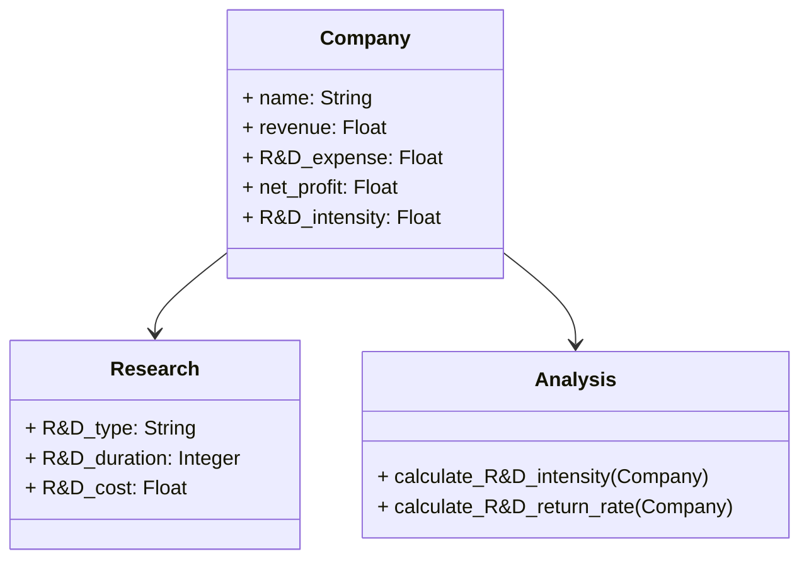
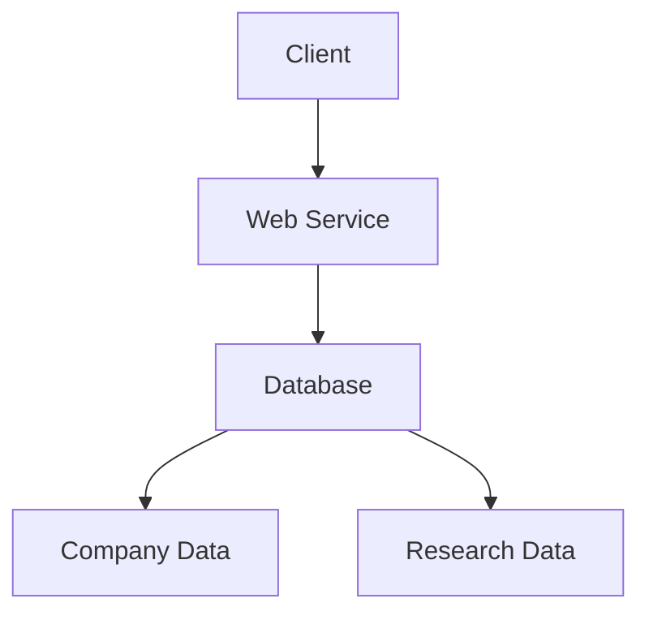

                 


# 彼得林奇对公司研发投入结构的长期跟踪分析

## 关键词：彼得林奇，研发投入，公司分析，投资策略，价值投资

## 摘要：  
彼得林奇作为全球知名的价值投资者，其投资哲学强调对公司的深入研究，尤其是对公司研发投入结构的长期跟踪分析。本文将从彼得林奇的投资理念出发，详细探讨公司研发投入的定义、分类、对财务绩效的影响，以及如何通过数学模型和算法进行分析。同时，结合实际案例，展示如何将这些分析方法应用于投资决策中。通过本文，读者将深入了解彼得林奇如何通过研发投入结构分析来评估公司价值，并掌握一套系统的分析方法。

---

## 第1章：彼得林奇的投资理念与研究方法

### 1.1 彼得林奇的投资哲学

彼得林奇是全球最具影响力的价值投资者之一，他的投资理念的核心在于“研究驱动的投资”。他强调，投资者必须对公司进行深入的研究，尤其是对公司的财务状况、市场地位和管理层进行详细分析。他的投资哲学可以总结为以下几点：

- **价值投资**：寻找那些被市场低估的优秀公司。
- **长期视角**：关注公司的长期增长潜力，而非短期市场波动。
- **研究驱动**：通过深入研究公司基本面，做出投资决策。

#### 1.1.1 价值投资的核心理念  
价值投资的核心是寻找市场低估的公司。彼得林奇认为，市场的短期波动为投资者提供了以合理价格买入优质资产的机会。他强调，投资者必须对公司进行深入研究，尤其是对公司财务状况和管理层的考察。

#### 1.1.2 彼得林奇的投资风格与特点  
彼得林奇的投资风格以稳健和谨慎著称。他偏好那些具有强大财务基础、良好管理团队和清晰商业模式的公司。他的投资组合通常包含30-40只股票，且每只股票都经过深入研究。

#### 1.1.3 研究驱动的投资策略  
彼得林奇的研究驱动策略强调对公司基本面的分析。他认为，只有通过深入研究，才能发现那些被市场低估的优质公司。他的研究方法包括对公司财务报表、管理层、行业地位和竞争优势的分析。

### 1.2 研究在投资决策中的作用

#### 1.2.1 研究的重要性  
研究是投资决策的核心。彼得林奇认为，投资者必须对公司进行深入研究，才能做出明智的投资决策。研究的主要目的是发现公司的潜在价值，评估其成长潜力，并识别潜在风险。

#### 1.2.2 研究驱动投资的核心要素  
- **财务报表分析**：通过分析公司的收入、利润、现金流等财务指标，评估公司的财务健康状况。
- **管理层分析**：评估公司管理层的素质和战略能力。
- **行业分析**：了解公司所处行业的竞争格局和发展趋势。

#### 1.2.3 彼得林奇的研究方法论  
彼得林奇的研究方法论包括以下几个步骤：
1. **行业分析**：了解公司所处行业的竞争格局和发展趋势。
2. **公司分析**：分析公司的财务状况、管理层和商业模式。
3. **估值分析**：通过比较公司的内在价值和市场价值，判断其是否被低估。

---

## 第2章：公司研发投入结构分析的背景与意义

### 2.1 研发投入对公司价值的影响

#### 2.1.1 研发投入的定义与分类  
研发投入是指公司在研究和开发活动中的支出。根据来源，研发投入可以分为内部研发和外部合作研发。根据时间维度，研发投入可以分为短期和长期投入。

#### 2.1.2 研发投入对公司长期价值的影响  
研发投入是公司技术创新和产品升级的核心驱动力。长期来看，高强度的研发投入能够提升公司的竞争力，增强其市场地位，并为公司创造更大的价值。

#### 2.1.3 研发投入与公司竞争力的关系  
高强度的研发投入通常意味着公司具有更强的技术创新能力。这种能力是公司在竞争激烈的市场中保持优势的关键。

### 2.2 彼得林奇对研发投入的关注

#### 2.2.1 彼得林奇对研发投入的重视  
彼得林奇认为，研发投入是公司长期增长的核心驱动力。他特别关注那些在研发投入上有持续投入的公司，因为这些公司通常具有更强的技术创新能力和市场竞争力。

#### 2.2.2 研发投入在公司分析中的权重  
在彼得林奇的分析框架中，研发投入是公司分析的重要组成部分。他认为，公司未来的发展潜力很大程度上取决于其研发投入的强度和结构。

#### 2.2.3 研发投入结构分析的必要性  
通过对研发投入结构的分析，投资者可以更好地评估公司的技术创新能力、管理层的战略规划能力以及公司的长期发展潜力。

---

## 第3章：公司研发投入结构的定义与分类

### 3.1 研发投入的核心要素

#### 3.1.1 研发投入的主体与客体  
研发投入的主体是公司，客体是研究和开发活动。主体和客体的关系决定了研发投入的类型和结构。

#### 3.1.2 研发投入的资金来源与分配  
公司可以通过自有资金、银行贷款、发行债券等多种渠道筹集研发资金。资金分配的合理性是评估公司财务健康状况的重要指标。

#### 3.1.3 研发投入的时间维度与周期性  
研发投入具有时间维度，通常分为短期和长期投入。短期投入注重快速见效，长期投入注重技术创新。

### 3.2 研发投入的类型与特征

#### 3.2.1 基础研究 vs 应用研究  
基础研究是为未来的技术创新奠定基础，应用研究则是针对具体产品的开发。两者在投入周期和回报周期上有所不同。

#### 3.2.2 内部研发 vs 外部合作研发  
内部研发由公司自行进行，外部合作研发则是与外部机构或企业合作进行。外部合作研发通常可以更快地获得技术成果。

#### 3.2.3 研发投入的短期 vs 长期效果  
短期投入可能见效较快，但长期投入更能为公司创造持续的竞争优势。

---

## 第4章：研发投入与公司绩效的关系

### 4.1 研发投入对财务绩效的影响

#### 4.1.1 研发投入与收入增长的关系  
高强度的研发投入通常能够带来更高的收入增长。通过技术创新和产品升级，公司可以更好地满足市场需求，提升销售额。

#### 4.1.2 研发投入与利润率的关联  
虽然高强度的研发投入可能会在短期内降低利润率，但长期来看，技术创新能够提升产品的附加值，从而提高利润率。

#### 4.1.3 研发投入与资产回报率的分析  
高强度的研发投入能够提升公司的资产回报率，尤其是在技术创新带来收入增长的情况下。

### 4.2 研发投入对市场表现的影响

#### 4.2.1 研发投入与股价波动的关系  
高强度的研发投入通常能够提升市场对公司的信心，从而推动股价上涨。但短期市场波动也可能对股价产生负面影响。

#### 4.2.2 研发投入与公司市值的关联  
研发投入与公司市值密切相关。高强度的研发投入能够提升公司的市场地位，从而提高市值。

#### 4.2.3 研发投入对投资者信心的影响  
高强度的研发投入能够增强投资者对公司的信心，尤其是在技术创新方面取得突破时。

---

## 第5章：研发投入结构分析的数学模型

### 5.1 研发投入强度的计算公式

$$ \text{研发投入强度} = \frac{\text{研发费用}}{\text{营业收入}} $$

### 5.2 研发投入周期性分析模型

$$ \text{周期性指数} = \frac{\text{研发投入波动率}}{\text{营业收入增长 rate}} $$

### 5.3 研发投入回报率的计算公式

$$ \text{研发投入回报率} = \frac{\text{净利润增长 rate}}{\text{研发费用 rate}} $$

---

## 第6章：系统分析与架构设计

### 6.1 系统功能设计

#### 6.1.1 领域模型设计  
通过 mermaid 类图展示公司研发投入结构的领域模型。



### 6.2 系统架构设计



---

## 第7章：项目实战与案例分析

### 7.1 环境安装

#### 7.1.1 安装Python环境  
安装 Python 3.x 及以上版本，并安装必要的库，如 pandas、numpy、scikit-learn。

### 7.2 核心代码实现

#### 7.2.1 研发投入强度计算

```python
import pandas as pd

def calculate_R&D_intensity(company_data):
    company_data['R&D_intensity'] = company_data['R&D_expense'] / company_data['revenue']
    return company_data

# 示例数据
data = {
    'company': ['A', 'B', 'C'],
    'revenue': [100, 200, 150],
    'R&D_expense': [10, 20, 15]
}
df = pd.DataFrame(data)
result = calculate_R&D_intensity(df)
print(result)
```

---

## 第8章：总结与展望

### 8.1 最佳实践

- **持续跟踪**：定期跟踪公司的研发投入结构，评估其变化趋势。
- **多元化分析**：结合财务指标和市场表现，全面评估公司的研发投入效果。
- **风险管理**：关注研发投入的回报率，避免过度投入导致的财务风险。

### 8.2 小结

通过本文的分析，我们深入了解了彼得林奇如何通过研发投入结构分析来评估公司价值，并掌握了一套系统的分析方法。未来，随着技术的不断进步，研发投入结构分析将更加精细化和数据化。

---

通过以上内容，您可以看到，文章从彼得林奇的投资理念出发，详细分析了公司研发投入的结构和对财务绩效的影响，并结合实际案例，展示了如何将这些分析方法应用于投资决策中。希望这篇文章对您有所帮助！

