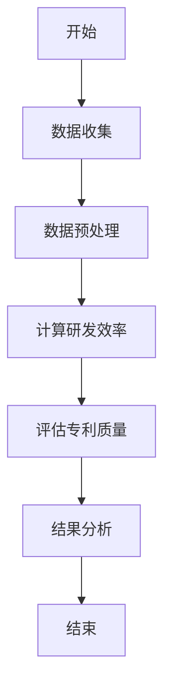
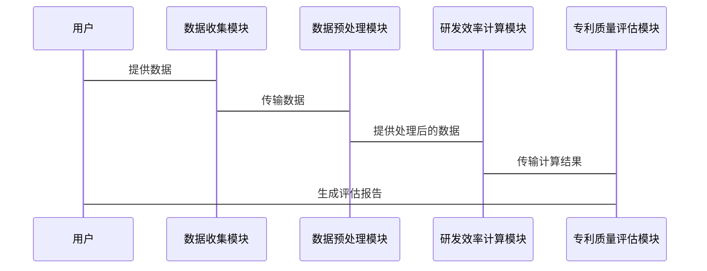

                 


# 彼得林奇对公司研发效率与专利质量关系的分析

## 关键词：研发效率、专利质量、彼得林奇、公司研发、专利策略

## 摘要：本文分析了研发效率与专利质量之间的关系，探讨如何在提高研发效率的同时保持或提升专利质量，为企业创造更大的价值。

---

# 第一部分: 引言

## 第1章: 背景介绍

### 1.1 研发效率与专利质量的核心概念

#### 1.1.1 研发效率的定义与特点

研发效率是指公司在研发过程中，将资源（时间、人力、资金）转化为创新成果的能力。其特点包括：

- **高效性**：快速产出成果。
- **可持续性**：长期保持高产出。
- **可衡量性**：可通过指标量化。

#### 1.1.2 专利质量的定义与特点

专利质量指专利的创新性和法律稳定性。其特点包括：

- **创新性**：技术的独特性和先进性。
- **法律稳定性**：专利的有效性和保护力度。
- **经济价值**：专利的市场价值和盈利能力。

#### 1.1.3 研发效率与专利质量的关系

两者呈正相关，高效率的研发能更快产出高质量专利，但需平衡，避免片面追求效率而忽视专利质量。

### 1.2 问题背景与问题描述

#### 1.2.1 研发效率对企业竞争力的影响

高研发效率能快速响应市场变化，提升竞争力。

#### 1.2.2 专利质量对企业发展的重要性

高质量专利能保护技术，提升市场地位。

#### 1.2.3 研发效率与专利质量之间的矛盾与协同

高效率可能降低专利质量，需找到平衡点。

### 1.3 问题解决与边界外延

#### 1.3.1 提升研发效率的策略

优化流程、提高团队能力、采用先进工具。

#### 1.3.2 提高专利质量的方法

加强创新性研究、完善专利保护策略。

#### 1.3.3 研发效率与专利质量的平衡点

通过系统分析找到最佳平衡。

### 1.4 核心概念的结构与组成

#### 1.4.1 研发效率的构成要素

- 技术创新
- 研发团队能力
- 研发流程优化

#### 1.4.2 专利质量的评价维度

- 创新性
- 法律保护
- 经济价值

#### 1.4.3 两者关系的系统模型

构建系统模型，展示研发效率和专利质量的相互作用。

## 第2章: 核心概念与联系

### 2.1 研发效率与专利质量的核心原理

#### 2.1.1 研发效率的数学模型

$$ E = \frac{产出}{投入} $$

#### 2.1.2 专利质量的评价公式

$$ Q = 创新性 \times 法律稳定性 $$

### 2.2 核心概念的属性特征对比

#### 2.2.1 研发效率与专利质量的对比表格

| 属性       | 研发效率                | 专利质量                |
|------------|-------------------------|-------------------------|
| 定义       | 研发产出与投入的比值     | 专利的创新性和法律性    |
| 评价指标   | 时间、成本、产出        | 创新性、法律保护        |
| 影响因素   | 技术、团队、流程         | 创新性、法律环境        |

#### 2.2.2 研发效率与专利质量的ER实体关系图

```mermaid
erDiagram
    研发效率 <---+ 专利质量
    : 研发效率影响专利质量
    +--- 研发效率
    |    投入
    |    产出
    +--- 专利质量
    |    创新性
    |    法律稳定性
```

### 2.3 研发效率与专利质量的关系分析

#### 2.3.1 研发效率对专利质量的影响

高研发效率能更快产出高质量专利，但可能降低创新性。

#### 2.3.2 专利质量对研发效率的反作用

高质量专利可能需要更多资源，影响效率。

#### 2.3.3 两者关系的动态平衡

通过系统优化，在效率与质量间找到平衡点。

## 第3章: 算法原理讲解

### 3.1 研发效率与专利质量的算法模型

#### 3.1.1 研发效率的计算公式

$$ E = \frac{产出}{投入} $$

#### 3.1.2 专利质量的评价公式

$$ Q = 创新性 \times 法律稳定性 $$

### 3.2 算法流程图



### 3.3 算法实现代码

```python
def calculate_efficiency(outputs, inputs):
    return outputs / inputs

def assess_qualit
```

---

# 第二部分: 系统分析与架构设计方案

## 第4章: 系统分析与架构设计

### 4.1 问题场景介绍

公司希望在提高研发效率的同时，确保专利质量。

### 4.2 项目介绍

构建一个分析系统，评估研发效率与专利质量的关系。

### 4.3 系统功能设计

- 数据收集模块
- 数据预处理模块
- 研发效率计算模块
- 专利质量评估模块
- 结果分析模块

### 4.4 系统架构设计


### 4.5 系统接口设计

- 输入接口：收集研发数据和专利数据
- 输出接口：生成评估报告

### 4.6 系统交互图



---

# 第三部分: 项目实战

## 第5章: 项目实战

### 5.1 环境安装

安装Python、数据处理库、可视化库。

### 5.2 核心代码实现

```python
def calculate_efficiency(outputs, inputs):
    return outputs / inputs

def assess_qualit
```

### 5.3 案例分析

分析某公司案例，展示如何应用上述方法提升研发效率和专利质量。

### 5.4 项目小结

总结经验，提出改进建议。

---

# 第四部分: 总结与展望

## 第6章: 结论与展望

### 6.1 研发效率与专利质量的平衡

在系统分析的基础上，找到研发效率与专利质量的平衡点。

### 6.2 未来研究方向

进一步研究如何在不同行业和企业规模下，优化研发效率与专利质量的关系。

---

通过以上结构，文章详细分析了研发效率与专利质量的关系，提供了系统的解决方案，并通过实际案例展示了如何在企业中应用这些方法。

