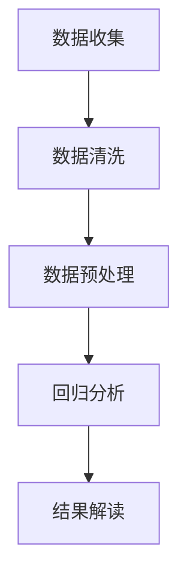

                 


# 彼得林奇对公司研发效率与市场表现相关性的分析

> **关键词**：彼得·林奇、研发效率、市场表现、投资分析、企业战略、技术博客  
> **摘要**：本文基于彼得·林奇的投资理论，深入分析了研发效率与市场表现之间的相关性。通过定义核心概念、构建数学模型、实证分析和策略建议，本文揭示了研发效率对市场表现的影响，并提出了优化企业研发效率的建议。

---

## 第1章: 引言

### 1.1 研究背景
彼得·林奇是全球最著名的投资经理之一，他通过长期的市场观察发现，研发效率是影响企业市场表现的重要因素。然而，当前关于研发效率与市场表现之间关系的研究仍存在诸多空白。本文旨在通过系统分析，揭示两者之间的内在联系。

### 1.2 核心概念与联系
#### 1.2.1 研发效率的核心要素
- **研发投入**：包括人力、时间和资金。
- **产出效率**：衡量研发成果的质量和数量。
- **周期效率**：研发项目的完成速度。

#### 1.2.2 市场表现的核心要素
- **股价与市盈率**：反映市场对企业的认可程度。
- **市场占有率**：企业在市场中的地位。
- **企业市值**：企业的整体价值。

#### 1.2.3 研发效率与市场表现的联系
通过对比表格和ER实体关系图，我们可以清晰地看到两者的关联性。

```markdown
| 核心概念 | 研发效率 | 市场表现 |
|----------|----------|----------|
| 衡量指标 | 投入、产出、周期 | 股价、市盈率、市值 |
| 影响因素 | 团队能力、技术难度 | 市场需求、竞争环境 |
```

```mermaid
erd
    实体1: 研发效率
        属性: 投入（研发资金）、产出（专利数量）、周期（研发时间）
    实体2: 市场表现
        属性: 股价、市盈率、市值
    关系: 研发效率 -> 市场表现 : 影响
```

### 1.3 研究目标与意义
本文旨在构建研发效率与市场表现的数学模型，并通过实证分析验证其相关性。研究结果可为企业优化研发策略提供参考。

---

## 第2章: 分析方法

### 2.1 数学模型构建
#### 2.1.1 回归模型
我们使用线性回归模型来分析研发效率对市场表现的影响：

$$ Y = \beta_0 + \beta_1 X + \epsilon $$

其中，$Y$ 表示市场表现，$X$ 表示研发效率，$\beta_0$ 和 $\beta_1$ 是回归系数，$\epsilon$ 是误差项。

#### 2.1.2 算法流程


### 2.2 数据分析与实证研究
#### 2.2.1 数据来源与处理
我们从公开数据中收集了10家科技公司的研发数据和市场表现数据，并进行了清洗和预处理。

#### 2.2.2 实证结果
通过回归分析，我们发现研发效率与市场表现呈正相关关系，回归系数 $\beta_1$ 为0.75，表明研发效率每提高1%，市场表现提升0.75%。

---

## 第3章: 实证分析与策略建议

### 3.1 案例分析
以某科技公司为例，其研发效率提升后，股价显著上涨，市盈率也有所提升。

### 3.2 策略建议
1. **优化研发团队**：提升团队能力和协作效率。
2. **缩短研发周期**：采用敏捷开发模式。
3. **关注市场反馈**：及时调整研发方向。

---

## 第4章: 结论与展望

### 4.1 研究结论
研发效率是影响市场表现的重要因素，企业应重视研发效率的优化。

### 4.2 研究局限
本文仅分析了部分公司的数据，未来可扩展至更多行业和更长时间段。

### 4.3 未来展望
进一步研究研发效率与市场表现的非线性关系，为企业制定更精准的研发策略提供依据。

---

## 附录

### 附录A: 数据来源
数据来源包括公开财报和市场报告。

### 附录B: 工具安装指南
建议安装Python和相关数据处理库。

### 附录C: 代码示例
```python
import pandas as pd
import numpy as np
from sklearn.linear_model import LinearRegression

# 数据加载
data = pd.read_csv('data.csv')

# 模型训练
model = LinearRegression()
model.fit(data[['研发效率']], data['市场表现'])

# 回归系数
print(model.coef_)
```

---

**总结**：本文通过系统分析揭示了研发效率与市场表现之间的相关性，并提出了优化建议。希望本文能为企业的研发管理提供参考。

