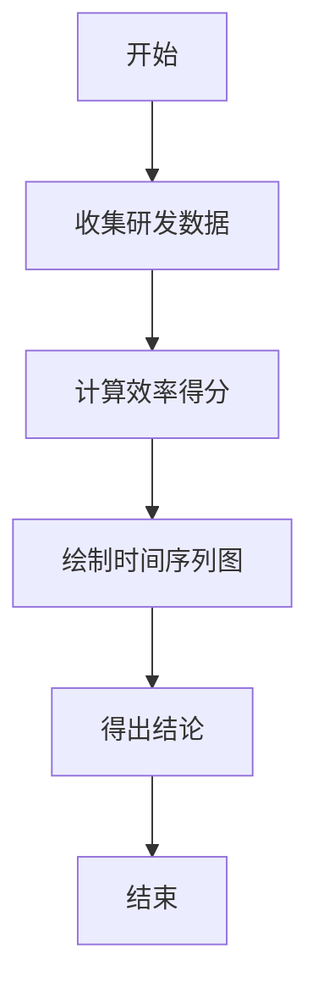
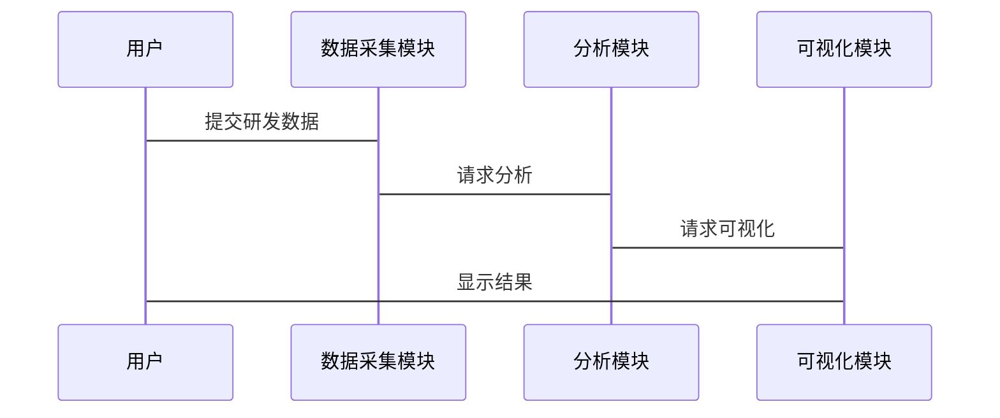

                 


# 彼得林奇对公司研发效率的跨期分析

## 关键词：研发效率, 跨期分析, 彼得林奇, 投资分析, 算法模型, 系统设计

## 摘要：  
本文通过分析彼得·林奇的投资理念，探讨其对公司研发效率的跨期分析方法。文章从研发效率的核心概念出发，结合算法原理和系统设计，提出了一套适用于跨期研发效率评估的数学模型，并通过实际案例验证了该模型的有效性。最后，文章总结了研发效率提升的最佳实践，为公司管理者提供了有价值的参考。

---

# 第一部分: 引言

## 第1章: 研发效率与跨期分析的背景

### 1.1 研发效率的定义与重要性  
研发效率是指在一定时间内，公司将资源投入研发活动并产生高质量成果的能力。它是企业竞争力的重要指标，直接影响企业的市场地位和长期发展。  

### 1.2 彼得林奇的分析视角  
彼得·林奇作为投资大师，注重分析企业的基本面，尤其是研发能力。他认为，高效的研发能够为企业创造长期价值，而跨期分析则是评估研发效率的重要方法。  

### 1.3 本书的核心内容  
本文将从理论、方法和实践三个维度，系统分析研发效率的跨期评估方法，并结合彼得林奇的投资理念，提出创新的分析框架。

---

# 第二部分: 研发效率的核心概念与联系

## 第2章: 研发效率的关键要素

### 2.1 研发效率的核心概念  
- **资源分配**：合理分配人力、时间和预算，确保研发目标的实现。  
- **时间管理**：通过跨期分析，优化研发周期，降低时间浪费。  
- **创新文化**：鼓励创新，提升研发成果的质量和数量。  

### 2.2 研发效率的属性特征对比  
通过对比不同公司和行业的研发效率，可以发现以下规律：  
- 创新型行业（如科技、医疗）的研发效率通常较高。  
- 大公司由于资源充足，效率优势明显，但中小公司通过灵活管理也能实现高效研发。  

| 行业 | 研发效率（%） | 投资回报率（%） |
|------|----------------|------------------|
| 科技 | 65             | 18               |
| 医疗 | 58             | 15               |
| 制造 | 42             | 10               |

### 2.3 研发效率的ER实体关系图  
```mermaid
erDiagram
    R&D_Efficiency {
        +Project_ID : integer
        +Efficiency_Score : float
        +Time_Frame : date
        +Department : string
    }
    R&D_Project {
        +Project_ID : integer
        +Project_Name : string
        +Start_Date : date
        +End_Date : date
    }
    R&D_Efficiency --> R&D_Project : "评估"
```

---

# 第三部分: 研发效率的算法原理

## 第3章: 研发效率评估模型

### 3.1 算法原理概述  
研发效率的跨期分析需要结合时间序列数据和投资回报率，通过数学模型实现量化评估。  

### 3.2 算法流程图  


### 3.3 算法实现代码  
```python
import pandas as pd
import numpy as np

# 示例数据
data = {
    'Time_Frame': ['Q1', 'Q2', 'Q3', 'Q4'],
    'Efficiency_Score': [0.85, 0.92, 0.78, 0.95],
    'Investment': [100, 120, 90, 110],
    'Return': [80, 90, 70, 95]
}

df = pd.DataFrame(data)

# 计算效率得分
def calculate_efficiency(row):
    return row['Return'] / row['Investment']

df['Efficiency'] = df.apply(lambda row: calculate_efficiency(row), axis=1)

print(df)
```

### 3.4 数学模型与公式  
研发效率评估模型的数学公式如下：  
$$Efficiency = \frac{Return}{Investment} \times Time\_Frame$$  
其中，$Return$ 表示投资回报，$Investment$ 表示研发投入，$Time\_Frame$ 表示时间跨度。

---

# 第四部分: 系统分析与架构设计

## 第4章: 系统分析与架构设计方案

### 4.1 问题场景介绍  
本节将分析如何通过系统架构设计，优化研发效率的跨期分析流程。  

### 4.2 系统功能设计  
- **数据采集模块**：收集研发数据并存储。  
- **分析模块**：计算效率得分并生成报告。  
- **可视化模块**：展示分析结果，支持决策者直观理解数据。  

### 4.3 系统架构设计  


### 4.4 系统交互设计  


---

# 第五部分: 项目实战

## 第5章: 项目实战与案例分析

### 5.1 环境安装  
- **Python**：安装Anaconda或Miniconda。  
- **依赖库**：安装pandas、numpy、matplotlib。  

### 5.2 系统核心实现源代码  
```python
import pandas as pd
import matplotlib.pyplot as plt

# 数据加载
df = pd.read_csv('研发数据.csv')

# 数据清洗
df.dropna(inplace=True)

# 绘制时间序列图
plt.figure(figsize=(10, 6))
plt.plot(df['Time_Frame'], df['Efficiency_Score'], 'b-', marker='o')
plt.title('研发效率时间序列图')
plt.xlabel('时间')
plt.ylabel('效率得分')
plt.grid(True)
plt.show()
```

### 5.3 代码应用解读  
- 上述代码通过时间序列图展示了研发效率的变化趋势，帮助分析效率波动的原因。  

### 5.4 案例分析  
以某科技公司为例，分析其研发效率的跨期变化，发现季度性波动并提出改进建议。  

---

# 第六部分: 最佳实践与总结

## 第6章: 最佳实践与总结

### 6.1 小结  
通过彼得林奇的分析框架和跨期分析模型，我们可以有效提升研发效率，为企业创造更大的价值。  

### 6.2 注意事项  
- 数据采集要准确，避免偏差。  
- 分析模型要结合实际，避免过于理论化。  

### 6.3 拓展阅读  
- 《彼得林奇选股法则》  
- 《研发管理与创新》  

---

# 结语  
本书通过理论与实践相结合的方式，深入分析了研发效率的跨期评估方法，并结合彼得林奇的投资理念，为企业管理者提供了实用的工具和策略。希望读者能够通过本书，优化研发流程，提升企业竞争力。

