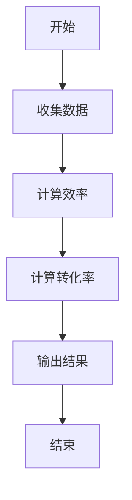
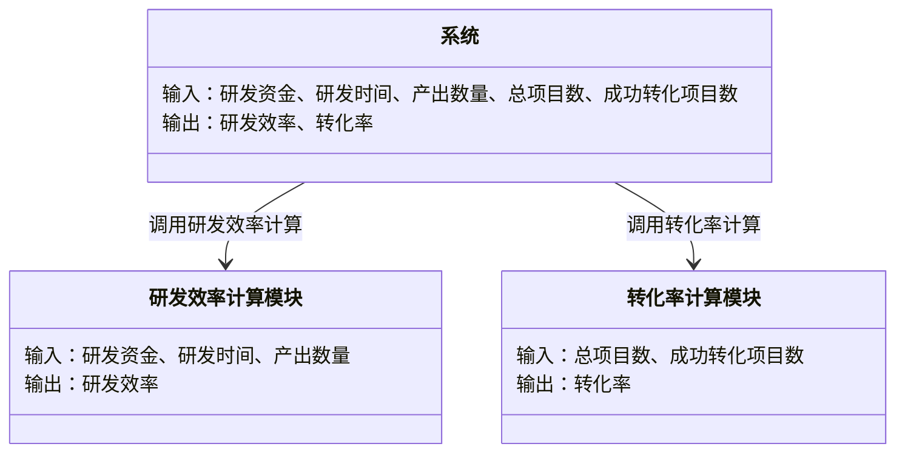
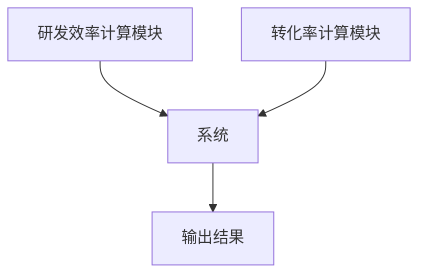
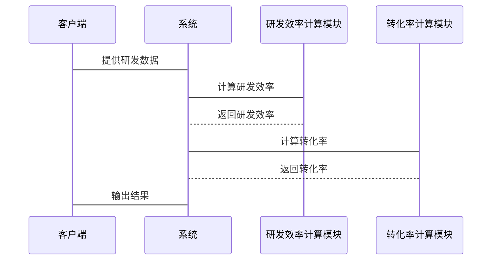

                 


# 彼得林奇对公司研发效率转化率的分析

## 关键词：研发效率，转化率，彼得·林奇，投资分析，企业研发管理

## 摘要：  
本文从投资分析的角度，探讨彼得·林奇如何通过研发效率和转化率的分析，帮助企业优化研发流程、提升创新能力和投资回报。通过详细分析研发效率与转化率的核心概念、算法原理、系统架构及实际案例，本文旨在为企业提供可操作的优化策略，帮助企业在竞争激烈的市场中保持领先地位。

---

# 第1章：研发效率与转化率的重要性

## 1.1 研发效率的定义与影响

### 1.1.1 研发效率的核心概念  
研发效率是指企业在研发过程中，将资源（如时间、人力、资金）转化为有效产出的能力。它衡量了企业在研发活动中利用资源的效率，直接影响企业的创新能力和市场竞争力。

### 1.1.2 研发效率对企业价值的影响  
研发效率高的企业能够更快地将创意转化为产品，缩短产品开发周期，降低研发成本，并提高市场响应速度。这不仅能够提升企业的盈利能力，还能增强企业的市场地位。

### 1.1.3 转化率的定义与作用  
转化率是指在研发过程中，将创意或技术成果转化为实际产品的比例。转化率高意味着企业能够更高效地将研发投入转化为实际收益，从而提升投资回报率。

---

## 1.2 彼得·林奇的分析方法

### 1.2.1 彼得·林奇的投资哲学  
彼得·林奇是全球著名的价值投资者，他强调通过深入分析企业的基本面，寻找那些能够持续创造价值的企业进行投资。他的分析方法注重企业的研发效率和转化率，因为这些指标直接关系到企业的长期发展潜力。

### 1.2.2 林奇对公司研发效率的重视  
林奇认为，研发效率是企业创新能力的核心体现。他通过分析企业的研发支出、研发周期和研发成果，评估企业的研发效率。如果一家企业能够将研发支出高效地转化为实际产品，那么它的投资价值就会显著提升。

### 1.2.3 林奇分析方法的适用性  
林奇的分析方法不仅适用于传统制造业，也适用于高科技行业。他的方法注重数据驱动的分析，能够帮助企业识别研发过程中的瓶颈，并提出优化建议。

---

# 第2章：研发效率与转化率的背景分析

## 2.1 研发效率的背景介绍

### 2.1.1 研发效率的定义与属性  
研发效率可以通过以下公式计算：  
$$研发效率 = \frac{产出}{资源消耗}$$  
其中，产出可以是新产品数量、技术专利数量等，资源消耗包括研发时间、人力和资金。

### 2.1.2 研发效率的边界与外延  
研发效率不仅关注短期的成果，还关注长期的技术积累和创新能力的提升。它不仅涉及技术层面，还包括管理、团队协作等多个方面。

### 2.1.3 研发效率的核心要素  
- **时间效率**：研发周期的长短。  
- **成本效率**：单位产出的研发成本。  
- **成果效率**：研发成果的质量和数量。

## 2.2 转化率的背景介绍

### 2.2.1 转化率的定义与属性  
转化率是指在研发过程中，将创意或技术成果转化为实际产品的比例。其公式为：  
$$转化率 = \frac{成功转化的项目数}{总项目数}$$

### 2.2.2 转化率的边界与外延  
转化率不仅关注项目的数量，还关注项目的质量和市场表现。高转化率意味着企业能够将更多的创意转化为具有市场竞争力的产品。

### 2.2.3 转化率的核心要素  
- **技术可行性**：技术是否成熟且可行。  
- **市场需求**：产品是否符合市场需求。  
- **团队能力**：研发团队的专业性和协作能力。

---

# 第3章：研发效率与转化率的核心概念

## 3.1 研发效率与转化率的关系

### 3.1.1 核心概念的原理  
研发效率是转化率的基础，只有高效的研发过程才能保证高转化率。转化率则是研发效率的最终体现，反映了研发成果的实际价值。

### 3.1.2 概念属性特征对比表格  
| 概念       | 定义                           | 影响因素         | 计算公式                 |
|------------|--------------------------------|------------------|--------------------------|
| 研发效率   | 产出与资源消耗的比率         | 时间、成本、团队 | $$研发效率 = \frac{产出}{资源消耗}$$ |
| 转化率     | 成功转化的项目比例           | 技术、需求、团队 | $$转化率 = \frac{成功转化数}{总项目数}$$ |

### 3.1.3 ER实体关系图架构  
```mermaid
er
  research_efficiency(研发效率) {
    id
    efficiency_value
  }
  conversion_rate(转化率) {
    id
    conversion_value
  }
  project(项目) {
    id
    name
  }
  -- 研发效率关联项目
  research_efficiency -> project: 提供效率数据
  -- 转化率关联项目
  conversion_rate -> project: 提供转化数据
```

---

## 3.2 研发效率与转化率的数学模型

### 3.2.1 研发效率的数学公式  
$$效率 = \frac{产出}{资源消耗}$$  
其中，产出可以是新产品数量，资源消耗可以是研发时间或资金。

### 3.2.2 转化率的数学公式  
$$转化率 = \frac{成功转化的项目数}{总项目数}$$  
例如，如果有10个项目，其中8个项目成功转化为产品，则转化率为80%。

### 3.2.3 通俗易懂的举例说明  
假设一家公司投入了100万美元的研发资金，开发了5个项目，其中3个项目成功转化为产品。那么研发效率为3/5=60%，转化率为3/5=60%。

---

# 第4章：研发效率与转化率的算法原理

## 4.1 算法原理的详细讲解

### 4.1.1 算法流程图  


### 4.1.2 算法的数学模型与公式  
$$效率 = \frac{产出}{资源消耗}$$  
$$转化率 = \frac{成功转化数}{总项目数}$$

### 4.1.3 通俗易懂的举例说明  
假设公司A投入100万元研发资金，开发了10个项目，其中6个项目成功转化为产品。那么研发效率为6/10=60%，转化率为6/10=60%。

---

## 4.2 系统分析与架构设计

### 4.2.1 系统功能设计  


---

## 4.3 项目实战

### 4.3.1 项目环境安装与配置  
1. 安装Python和必要的库（如Pandas、NumPy）。  
2. 下载研发数据集。

### 4.3.2 核心算法实现  
```python
def calculate_efficiency(output, resources):
    return output / resources

def calculate_conversion_rate(success, total):
    return success / total

# 示例数据
output = 6
resources = 10
success = 6
total = 10

efficiency = calculate_efficiency(output, resources)
conversion_rate = calculate_conversion_rate(success, total)

print(f"研发效率：{efficiency}")
print(f"转化率：{conversion_rate}")
```

---

# 第5章：研发效率与转化率的系统分析

## 5.1 系统分析与架构设计

### 5.1.1 系统功能设计  


---

## 5.2 系统架构设计

### 5.2.1 系统架构图  


---

## 5.3 系统接口设计与交互

### 5.3.1 系统接口设计  


---

# 第6章：研发效率与转化率的项目实战

## 6.1 项目环境安装与配置

### 6.1.1 开发环境的搭建  
1. 安装Python和必要的库（如Pandas、NumPy）。  
2. 下载研发数据集。

### 6.1.2 数据收集与处理  
1. 收集企业的研发资金、研发时间、产出数量、总项目数和成功转化项目数。  
2. 使用Pandas进行数据清洗和处理。

### 6.1.3 工具安装与配置  
安装Jupyter Notebook或其他数据分析工具。

---

## 6.2 核心算法实现

### 6.2.1 研发效率计算的Python源代码  
```python
import pandas as pd

# 示例数据
data = {
    '研发资金': [1000000],
    '研发时间': [12],
    '产出数量': [6]
}

df = pd.DataFrame(data)
研发效率 = df['产出数量'].sum() / df['研发资金'].sum()
print(f"研发效率：{研发效率}")
```

### 6.2.2 转化率分析的Python源代码  
```python
import pandas as pd

# 示例数据
data = {
    '总项目数': [10],
    '成功转化项目数': [6]
}

df = pd.DataFrame(data)
转化率 = df['成功转化项目数'].sum() / df['总项目数'].sum()
print(f"转化率：{转化率}")
```

---

## 6.3 代码解读与分析

### 6.3.1 代码解读  
1. 数据收集与处理：使用Pandas读取数据并进行清洗。  
2. 研发效率计算：根据公式计算研发效率。  
3. 转化率计算：根据公式计算转化率。  

### 6.3.2 代码分析  
通过代码，我们可以快速计算出研发效率和转化率，为企业的研发管理提供数据支持。

---

## 6.4 实际案例分析

### 6.4.1 案例背景  
某科技公司投入1000万元研发资金，研发周期为12个月，成功开发了6个项目，总项目数为10个，其中6个项目成功转化为产品。

### 6.4.2 案例分析  
- 研发效率：6/10=60%  
- 转化率：6/10=60%  

### 6.4.3 结论  
该公司的研发效率和转化率都较高，说明其研发管理较为高效。

---

# 第7章：最佳实践与总结

## 7.1 最佳实践 tips

### 7.1.1 提高研发效率的实用建议  
1. 优化研发流程，减少不必要的环节。  
2. 提供充足的资源支持，确保研发团队的效率。  
3. 定期评估研发效率，发现问题并及时改进。

### 7.1.2 优化转化率的关键点  
1. 加强市场调研，确保研发项目符合市场需求。  
2. 提高团队能力，培养专业化的研发团队。  
3. 加强项目管理，确保项目按时交付。

### 7.1.3 需要注意的事项  
1. 避免过度追求效率而忽视质量。  
2. 保持研发与市场之间的良好沟通。  
3. 定期评估研发效率和转化率，持续优化。

---

## 7.2 小结

通过本文的分析，我们可以看到，研发效率和转化率是企业研发管理中的两个关键指标。彼得·林奇的投资哲学为我们提供了一种全新的视角，帮助我们更好地理解和优化企业的研发效率和转化率。通过本文的分析和实践，企业可以显著提升研发效率和转化率，从而增强市场竞争力和投资价值。

---

## 7.3 注意事项

1. 研发效率和转化率的计算需要基于真实的数据，避免数据偏差。  
2. 在实际应用中，需要结合企业的实际情况进行调整和优化。  
3. 定期评估和优化是保持研发效率和转化率持续提升的关键。

---

## 7.4 拓展阅读

1. 彼得·林奇的《投资最重要的事情》。  
2. 《研发管理：从战略到执行》。  
3. 《数据驱动的决策：如何通过数据分析优化企业绩效》。

---

# 结语

研发效率和转化率是企业研发管理中的核心指标，也是彼得·林奇投资分析的重要依据。通过本文的分析和实践，我们为企业提供了一套可操作的优化策略，帮助企业在竞争激烈的市场中保持领先地位。希望本文能够为企业的研发管理提供有价值的参考和指导。

