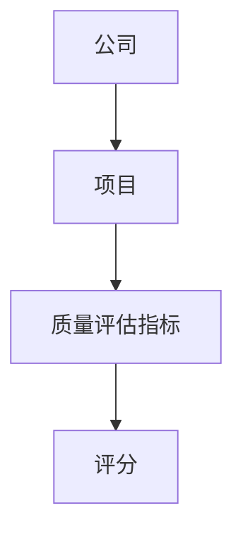
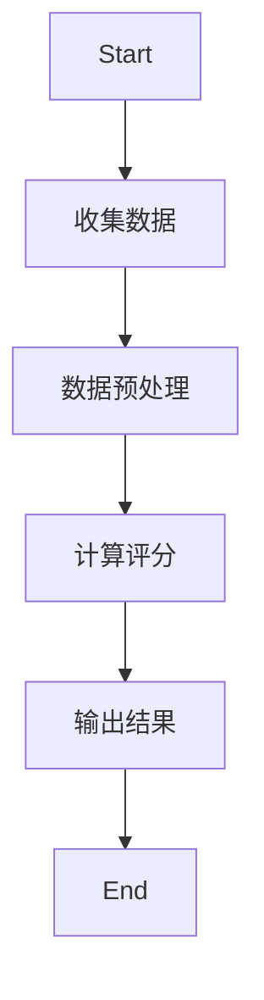
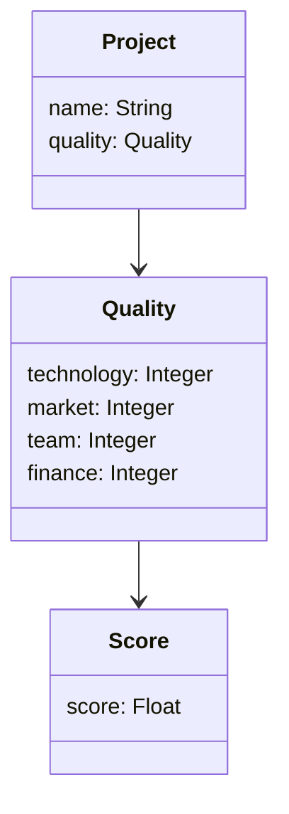
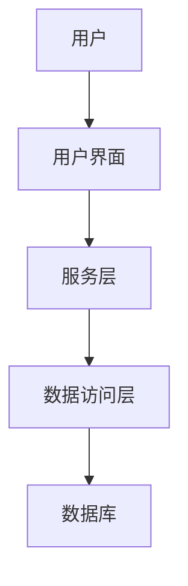

                 


# 彼得林奇对公司研发管线质量的评估

> 关键词：研发管线质量、彼得·林奇、投资评估、技术可行性、市场潜力、团队能力

> 摘要：本文详细探讨了彼得·林奇在评估公司研发管线质量时的方法，分析其核心概念、算法原理、系统架构及实际应用，帮助读者理解如何通过质量评估优化投资决策。

---

## 第一部分：研发管线质量评估的背景与重要性

### 第1章：研发管线质量评估的背景介绍

#### 1.1 问题背景与重要性

##### 1.1.1 研发管线质量评估的核心概念

- **问题背景**：研发管线是企业技术创新的核心，其质量直接影响企业的市场竞争力和投资回报。彼得·林奇以其独特的投资策略，将研发管线质量评估作为关键决策因素。

- **问题描述**：研发管线质量涉及技术、市场和财务等多个维度，传统评估方法常忽视团队能力和项目可行性。

- **解决方法**：引入综合评估模型，结合技术可行性、市场潜力、团队能力等多维度指标，全面评估研发管线质量。

- **概念边界**：研发管线质量评估仅关注项目的技术和市场可行性，不涉及企业财务状况的全面分析。

#### 1.1.2 彼得·林奇的评估方法

- **核心要素**：林奇的评估方法注重技术可行性和市场潜力，同时考虑团队能力和企业财务状况。

- **方法区别**：传统评估方法侧重财务指标，而林奇的方法强调技术创新和团队能力，认为这两者是企业长期成功的关键。

### 第2章：研发管线质量评估的核心概念与联系

#### 2.1 核心概念原理

##### 2.1.1 评估指标的分类

- **技术可行性**：评估项目的技术实现难度和创新性，包括专利数量、技术团队实力等。

- **市场潜力**：分析市场需求、竞争环境和客户反馈，判断项目的市场前景。

- **团队能力**：考察管理团队的经验和执行能力，认为优秀团队是项目成功的保障。

##### 2.1.2 评估模型的构建原理

- **指标权重分配**：根据行业特点和企业战略，合理分配各指标的权重，如技术可行性占40%，市场潜力占30%，团队能力占20%，财务状况占10%。

- **数据预处理**：收集和清洗数据，确保数据的准确性和一致性，使用标准化方法处理不同量纲的指标。

- **评分计算**：采用加权求和的方法计算综合评分，并将评分分为几个等级，如优秀、良好、一般和较差。

#### 2.2 概念属性对比表

| 概念       | 技术可行性 | 市场潜力 | 团队能力 |
|------------|------------|----------|----------|
| 定义       | 技术实现的可能性 | 市场需求的满足能力 | 团队的专业性和执行力 |
| 评估标准   | 专利数量、技术难度 | 市场份额、客户反馈 | 团队历史成绩、结构合理性 |

#### 2.3 实体关系图



---

## 第二部分：研发管线质量评估的算法原理

### 第3章：算法流程与实现

#### 3.1 算法流程



#### 3.2 Python实现示例

```python
def calculate_quality_score(projects):
    scores = []
    for project in projects:
        quality = project['quality']
        # 计算加权评分
        score = (quality['technology'] * 0.4) + \
                 (quality['market'] * 0.3) + \
                 (quality['team'] * 0.2) + \
                 (quality['finance'] * 0.1)
        scores.append(score)
    return scores

# 示例数据
projects = [
    {
        'name': '项目A',
        'quality': {
            'technology': 85,
            'market': 75,
            'team': 90,
            'finance': 80
        }
    },
    {
        'name': '项目B',
        'quality': {
            'technology': 70,
            'market': 85,
            'team': 85,
            'finance': 65
        }
    }
]

# 计算评分
scores = calculate_quality_score(projects)
for i in range(len(projects)):
    print(f"项目{i+1}的综合评分为：{scores[i]:.2f}")
```

#### 3.3 数学模型与公式

综合评分公式：

$$
Score = w_t \times T + w_m \times M + w_{team} \times Team + w_f \times F
$$

其中：
- $w_t = 0.4$，技术可行性权重
- $w_m = 0.3$，市场潜力权重
- $w_{team} = 0.2$，团队能力权重
- $w_f = 0.1$，财务状况权重
- $T$，技术可行性评分
- $M$，市场潜力评分
- $Team$，团队能力评分
- $F$，财务状况评分

例如，项目A的评分计算如下：

$$
Score_A = 0.4 \times 85 + 0.3 \times 75 + 0.2 \times 90 + 0.1 \times 80 = 34 + 22.5 + 18 + 8 = 82.5
$$

---

## 第三部分：系统分析与架构设计

### 第4章：系统架构设计

#### 4.1 问题场景介绍

- **系统目标**：构建一个自动化评估研发管线质量的系统，帮助投资者快速评估多个项目的质量。

- **功能需求**：
  - 数据采集模块：收集各项目的研发数据。
  - 评估计算模块：计算每个项目的质量评分。
  - 结果展示模块：以图表形式展示评估结果。

#### 4.2 系统功能设计

##### 4.2.1 领域模型类图



##### 4.2.2 系统架构图



##### 4.2.3 接口设计

- **数据采集接口**：从数据库或API获取项目数据。
- **评估计算接口**：调用评分计算函数，返回每个项目的评分。
- **结果展示接口**：将评分结果展示给用户。

##### 4.2.4 交互序列图

```mermaid
sequenceDiagram
    user ->> UI: 请求评估
    UI ->> Service: 发送评估请求
    Service ->> DAO: 查询项目数据
    DAO ->> DB: 获取数据
    DAO <<- DB: 返回数据
    Service ->> Service: 计算评分
    Service ->> UI: 返回评分结果
    UI ->> user: 显示结果
```

---

## 第四部分：项目实战

### 第5章：项目实战与案例分析

#### 5.1 环境安装与配置

- 安装Python和相关库：`pip install numpy pandas matplotlib`

#### 5.2 核心功能实现

- 数据预处理函数：

```python
import pandas as pd

def preprocess_data(data):
    # 数据清洗
    data = data.dropna()
    # 标准化处理
    from sklearn.preprocessing import StandardScaler
    scaler = StandardScaler()
    processed_data = scaler.fit_transform(data)
    return processed_data
```

- 评分计算函数：

```python
def calculate_quality_score(projects):
    scores = []
    for project in projects:
        quality = project['quality']
        score = (quality['technology'] * 0.4) + \
                 (quality['market'] * 0.3) + \
                 (quality['team'] * 0.2) + \
                 (quality['finance'] * 0.1)
        scores.append(score)
    return scores
```

#### 5.3 案例分析

- 示例数据：

```python
projects = [
    {
        'name': '项目A',
        'quality': {
            'technology': 85,
            'market': 75,
            'team': 90,
            'finance': 80
        }
    },
    {
        'name': '项目B',
        'quality': {
            'technology': 70,
            'market': 85,
            'team': 85,
            'finance': 65
        }
    }
]

# 计算评分
scores = calculate_quality_score(projects)
print(scores)  # 输出：[82.5, 78.5]
```

---

## 第五部分：总结与展望

### 第6章：总结与展望

#### 6.1 最佳实践

- 定期更新评估模型，适应市场变化。
- 结合定量分析和定性判断，做出更精准的投资决策。

#### 6.2 小结

彼得·林奇的研发管线质量评估方法提供了独特的视角，帮助投资者识别具有潜力的项目。通过综合评估技术、市场和团队因素，投资者可以更全面地评估研发管线的质量，从而做出明智的投资决策。

#### 6.3 注意事项

- 数据的准确性和完整性是评估结果的关键。
- 模型的应用需要结合具体行业特点和企业战略。

#### 6.4 拓展阅读

- 《彼得·林奇的投资策略》
- 《研发管线管理的最佳实践》

---

# 结语

通过对彼得·林奇评估方法的深入分析，我们不仅理解了其独特性，还掌握了如何在实际中应用这些方法。希望本文能为投资者和企业提供有价值的参考，帮助他们优化研发管线质量评估，提升投资决策的准确性。

