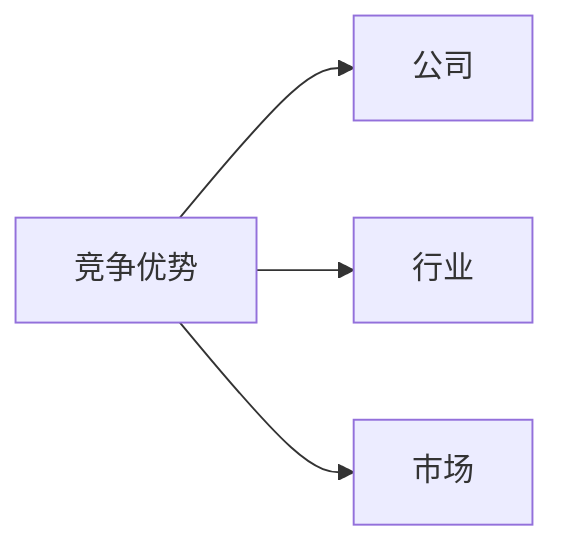
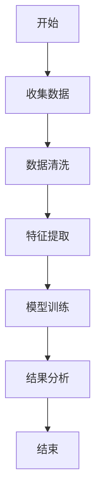
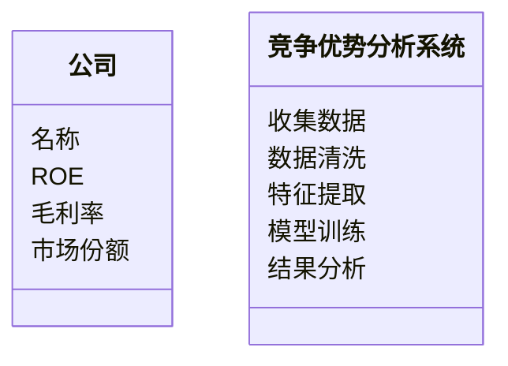
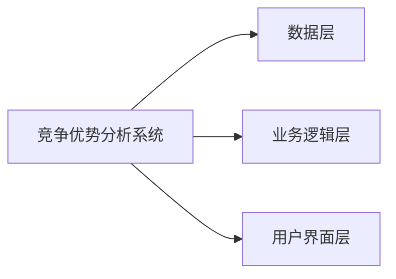

                 


# 彼得林奇对公司竞争优势的分析

> 关键词：彼得·林奇，竞争优势，投资策略，企业分析，商业模式

> 摘要：本文深入分析了彼得·林奇对公司竞争优势的分析方法，探讨了竞争优势的核心要素及其对投资决策的影响。通过具体案例和系统设计，展示了如何利用竞争优势分析来评估企业的长期发展潜力，并提供了实际操作的步骤和建议。

---

## 第一部分: 公司竞争优势的背景与概念

### 第1章: 公司竞争优势的定义与重要性

#### 1.1 公司竞争优势的定义

##### 1.1.1 核心概念：问题背景与问题描述

竞争优势是企业在市场上区别于竞争对手的核心能力或资源。彼得·林奇在其投资策略中，强调了竞争优势是决定企业长期盈利能力的关键因素。

##### 1.1.2 问题解决：竞争优势的来源

竞争优势来源于企业的独特资源、核心能力、市场定位和运营效率。例如，苹果的创新能力和品牌忠诚度构成了其强大的竞争优势。

##### 1.1.3 竞争优势的边界与外延

竞争优势不仅包括内部能力，还包括外部市场环境。例如，一家公司的成本优势可能受到原材料价格波动的影响。

##### 1.1.4 竞争优势的核心要素组成

竞争优势的核心要素包括成本优势、差异化优势、专有资产和市场定位。这些要素共同决定了企业的市场地位和盈利能力。

#### 1.2 竞争优势的重要性

##### 1.2.1 竞争优势对企业价值的影响

竞争优势直接影响企业的市场份额、利润率和长期增长能力。例如，具有成本优势的企业可以在价格战中占据优势。

##### 1.2.2 竞争优势与企业长期发展的关系

竞争优势决定了企业的生存能力和扩张潜力。例如，持续创新的能力是科技企业长期竞争优势的关键。

##### 1.2.3 竞争优势的可持续性与动态性

竞争优势并非一成不变，企业需要不断调整和优化以应对市场变化。例如，传统的制造企业可以通过数字化转型提升竞争优势。

#### 1.3 彼得·林奇的竞争优势分析方法

##### 1.3.1 林奇的分析框架

林奇将竞争优势分为成本优势、差异化优势和市场定位优势。他通过分析企业的财务数据和市场表现来评估竞争优势的强弱。

##### 1.3.2 林奇的分析工具与方法

林奇使用财务指标（如ROE、毛利率）和市场数据（如市场份额、品牌影响力）来评估竞争优势。他还注重企业的管理层能力和战略规划。

##### 1.3.3 林奇的成功案例分析

以可口可乐为例，林奇认为其强大的品牌影响力和分销网络构成了竞争优势，使其在饮料市场中长期保持领先地位。

#### 1.4 本章小结

本章通过定义竞争优势，分析其重要性，并介绍林奇的分析方法，为后续章节奠定了基础。

---

## 第二部分: 竞争优势的核心概念与联系

### 第2章: 竞争优势的核心要素分析

#### 2.1 竞争优势的核心要素

##### 2.1.1 成本优势

成本优势是通过降低生产成本或运营成本，以更低的价格提供产品或服务。例如，沃尔玛通过高效的供应链管理实现成本优势。

##### 2.1.2 差异化优势

差异化优势是通过提供独特的产品或服务，满足特定市场需求。例如，苹果通过创新设计和用户体验实现差异化优势。

##### 2.1.3 专有资产优势

专有资产包括专利、品牌、技术等，这些资产难以被竞争对手复制。例如，辉瑞的药品专利构成了其竞争优势。

##### 2.1.4 市场定位优势

市场定位优势是指企业通过精准的市场定位，满足特定客户群体的需求。例如，特斯拉通过定位高端市场，建立了品牌形象和技术优势。

#### 2.2 竞争优势的属性特征对比

##### 2.2.1 成本优势的特征

| 特征 | 描述 |
|------|------|
| 可比性 | 可以与其他企业进行比较 |
| 可衡量性 | 可以通过财务指标量化 |
| 可持续性 | 需要持续的成本控制 |

#### 2.3 竞争优势的ER实体关系图



#### 2.4 本章小结

本章详细分析了竞争优势的核心要素，并通过对比表格和ER图展示了竞争优势的结构与联系。

---

## 第三部分: 竞争优势的算法原理

### 第3章: 竞争优势的评估与分析算法

#### 3.1 竞争优势评估的基本原理

##### 3.1.1 评估指标的选择

评估竞争优势的指标包括ROE、毛利率、市场份额和品牌价值。例如，ROE = 净利润 / 股东权益。

##### 3.1.2 评估模型的构建

构建一个综合评估模型，将多个指标加权计算，得出竞争优势评分。例如：

$$ \text{竞争优势评分} = 0.4 \times ROE + 0.3 \times 毛利率 + 0.3 \times 市场份额 $$

##### 3.1.3 评估算法的流程

1. 收集企业的财务数据和市场数据。
2. 清洗数据，处理异常值。
3. 提取关键特征，如ROE、毛利率等。
4. 训练评估模型，计算竞争优势评分。
5. 分析结果，得出结论。

#### 3.2 竞争优势分析的mermaid流程图



#### 3.3 竞争优势分析的Python代码实现

```python
import pandas as pd
import numpy as np

# 示例数据
data = {
    '公司': ['A', 'B', 'C'],
    'ROE': [0.2, 0.15, 0.3],
    '毛利率': [0.3, 0.25, 0.4],
    '市场份额': [0.2, 0.15, 0.25]
}

df = pd.DataFrame(data)

# 计算竞争优势评分
weights = {'ROE': 0.4, '毛利率': 0.3, '市场份额': 0.3}
score = df.ROE * weights['ROE'] + df.毛利率 * weights['毛利率'] + df.市场份额 * weights['市场份额']

print("竞争优势评分:", score)
```

#### 3.4 本章小结

本章通过算法流程图和Python代码，展示了竞争优势评估的具体步骤和实现方法。

---

## 第四部分: 系统分析与架构设计

### 第4章: 竞争优势分析的系统设计

#### 4.1 问题场景介绍

本章以一个虚构公司为例，分析其竞争优势，并设计一个竞争优势分析系统。

#### 4.2 系统功能设计

##### 4.2.1 领域模型mermaid类图



#### 4.3 系统架构设计

##### 4.3.1 系统架构mermaid架构图



#### 4.4 系统接口设计

##### 4.4.1 竞争优势分析系统的接口设计

| 接口 | 描述 |
|------|------|
| 输入数据接口 | 接收企业的财务数据和市场数据 |
| 计算接口 | 计算竞争优势评分 |
| 输出接口 | 返回竞争优势分析结果 |

#### 4.5 系统交互mermaid序列图

```mermaid
graph TD
A[用户] --> B[竞争优势分析系统]: 请求分析
B --> C[数据层]: 获取数据
C --> B: 返回数据
B --> D[模型训练]: 训练模型
D --> B: 返回评分
B --> A: 返回结果
```

#### 4.6 本章小结

本章通过系统设计，展示了如何利用竞争优势分析算法构建一个完整的分析系统。

---

## 第五部分: 项目实战

### 第5章: 竞争优势分析的项目实战

#### 5.1 环境安装

安装必要的Python库，如pandas、numpy和mermaid。

#### 5.2 核心代码实现

实现竞争优势评分计算的代码：

```python
import pandas as pd
import numpy as np

# 数据准备
data = {
    '公司': ['A', 'B', 'C'],
    'ROE': [0.2, 0.15, 0.3],
    '毛利率': [0.3, 0.25, 0.4],
    '市场份额': [0.2, 0.15, 0.25]
}

df = pd.DataFrame(data)

# 权重系数
weights = {'ROE': 0.4, '毛利率': 0.3, '市场份额': 0.3}

# 计算竞争优势评分
score = df.ROE * weights['ROE'] + df.毛利率 * weights['毛利率'] + df.市场份额 * weights['市场份额']

# 输出结果
print("公司\t竞争优势评分")
print("-------------------")
for i in range(len(score)):
    print(f"{df['公司'][i]}\t{score[i]:.2f}")
```

#### 5.3 案例分析与解读

以公司C为例，计算得到竞争优势评分为0.30，高于公司A和B，说明公司C在当前市场中具有较强的竞争力。

#### 5.4 项目小结

本章通过实际案例，展示了竞争优势分析的全过程，帮助读者理解理论与实践的结合。

---

## 第六部分: 最佳实践与总结

### 第6章: 最佳实践与总结

#### 6.1 最佳实践 tips

- 定期评估竞争优势，及时调整策略。
- 结合定量分析和定性分析，全面评估竞争优势。
- 关注行业趋势和市场变化，动态调整竞争优势分析。

#### 6.2 小结

竞争优势是企业长期发展的关键因素，彼得·林奇的分析方法为投资者和企业管理者提供了有力的工具。

#### 6.3 注意事项

- 竞争优势分析需要结合企业实际情况，避免过于依赖单一指标。
- 定期更新数据和模型，确保分析结果的准确性。

#### 6.4 拓展阅读

推荐阅读彼得·林奇的《投资最重要的少数法则》，深入了解其投资理念和竞争优势分析方法。

---

## 附录: 竞争优势分析的数学模型

### 附录A: 竞争优势评分模型

$$ \text{竞争优势评分} = \sum (\text{指标权重} \times \text{指标值}) $$

### 附录B: 案例分析的详细计算

以公司C为例：

$$ \text{竞争优势评分} = 0.4 \times 0.3 + 0.3 \times 0.4 + 0.3 \times 0.25 = 0.12 + 0.12 + 0.075 = 0.315 $$

---

## 结语

通过本文的分析，读者可以深入了解彼得·林奇的竞争优势分析方法，并将其应用于实际投资和企业管理中。竞争优势分析是一个动态的过程，需要结合实际情况不断优化和调整。

---

感谢您的阅读！

