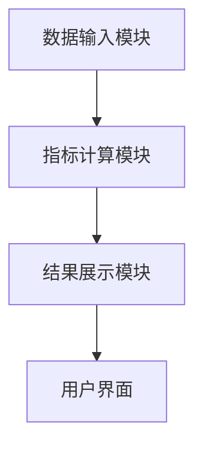

                 


# 彼得林奇对公司管理团队稳定性的评估

## 关键词：彼得·林奇，管理团队，稳定性评估，领导力，团队结构

## 摘要：本文详细探讨了彼得·林奇对公司管理团队稳定性的评估方法，分析了其核心概念、评估模型和算法原理，结合实际案例，提供了系统的分析与架构设计，以及项目实战和最佳实践建议，帮助读者全面理解如何评估和优化管理团队的稳定性。

---

## 第一部分: 彼得·林奇的投资者背景与投资理念

### 第1章: 彼得·林奇的投资者背景

#### 1.1 彼得·林奇的生平简介
彼得·林奇（Peter Lynch）是美国著名的投资专家，曾担任富达投资集团麦哲伦基金的经理，创造了该基金年均29%的回报率。他的投资理念以深入分析公司基本面、关注管理层稳定性著称。

#### 1.2 林奇的投资风格与特点
- **长期投资**：林奇主张长期持有优质股票，避免频繁交易。
- **基本面分析**：他注重研究公司的财务状况、行业地位和管理团队。
- **管理层关注**：他认为管理层的稳定性、决策能力和战略眼光是决定公司长期发展的关键因素。

#### 1.3 林奇对管理团队稳定性关注的原因
- 管理层的稳定性直接影响公司的战略连续性和执行力。
- 稳定的管理层更有可能做出符合公司长期利益的决策。
- 管理层变动可能导致公司战略摇摆，影响股价表现。

---

### 第2章: 管理团队稳定性评估的背景与意义

#### 2.1 管理团队稳定性评估的背景
- **公司治理的重要性**：管理层的决策对公司价值影响深远。
- **投资者的需要**：投资者需要评估管理层的稳定性以做出投资决策。
- **企业绩效的保障**：稳定的管理层有助于企业持续发展和绩效提升。

#### 2.2 管理团队稳定性评估的意义
- **帮助投资者识别风险**：管理层不稳定可能导致公司业绩下滑。
- **优化公司治理结构**：通过评估发现潜在问题，优化管理结构。
- **提升企业竞争力**：稳定的管理层有助于制定和执行长期战略。

---

## 第二部分: 管理团队稳定性评估的核心概念与框架

### 第3章: 管理团队稳定性评估的核心概念

#### 3.1 管理团队稳定性的定义
管理团队稳定性指管理层在一段时间内保持稳定、高效运作的能力，通常包括成员的稳定性、决策的连贯性和团队的协作能力。

#### 3.2 管理团队稳定性的影响因素
- **成员稳定性**：团队成员是否频繁变动。
- **决策连贯性**：管理层在决策上的连续性和一致性。
- **团队协作能力**：团队内部的沟通与协作效率。
- **领导力**：领导层的决策能力和影响力。
- **公司文化**：公司文化对团队稳定性的影响。

#### 3.3 管理团队稳定性评估的维度
- **人员变动率**：团队成员的离职率和新成员加入率。
- **决策一致性**：管理层决策是否一致，是否有频繁调整。
- **团队绩效**：团队在一定时期内的业绩表现。
- **领导层稳定性**：核心领导者是否稳定。
- **团队结构**：团队的分工和协作机制是否合理。

---

### 第4章: 彼得·林奇管理团队稳定性评估模型的数学模型与公式

#### 4.1 稳定性指数的计算公式
稳定性指数（Stability Index, SI）是衡量管理团队稳定性的指标，公式如下：

$$ SI = \frac{\text{稳定因素加权和}}{\text{总权重}} \times 100 $$

其中，稳定因素包括：
- 团队成员稳定性（权重30%）
- 决策连贯性（权重30%）
- 团队协作能力（权重20%）
- 领导力（权重15%）
- 公司文化（权重5%）

#### 4.2 稳定性指数的权重分配
| 因素              | 权重 |
|--------------------|------|
| 团队成员稳定性    | 30%  |
| 决策连贯性        | 30%  |
| 团队协作能力      | 20%  |
| 领导力            | 15%  |
| 公司文化          | 5%   |

#### 4.3 算法实现
以下是一个Python代码示例，用于计算稳定性指数：

```python
def calculate_stability_index(stability_factors):
    weights = [0.3, 0.3, 0.2, 0.15, 0.05]
    weighted_sum = sum(stability_factors[i] * weights[i] for i in range(len(stability_factors)))
    si = weighted_sum * 100
    return si

# 示例
stability_factors = [0.8, 0.7, 0.6, 0.8, 0.7]
si = calculate_stability_index(stability_factors)
print(f"稳定性指数: {si}%")
```

---

### 第5章: 系统分析与架构设计方案

#### 5.1 问题场景介绍
我们希望通过构建一个系统，能够实时评估公司管理团队的稳定性，帮助投资者做出决策。

#### 5.2 系统功能设计
- **数据输入模块**：收集公司管理团队的相关数据。
- **指标计算模块**：根据稳定性指数公式计算稳定性指数。
- **结果展示模块**：以图表形式展示评估结果。

#### 5.3 系统架构设计


---

### 第6章: 项目实战与案例分析

#### 6.1 环境安装
- 安装Python和必要的库（如Pandas、Matplotlib）。

#### 6.2 核心代码实现
```python
import pandas as pd
import matplotlib.pyplot as plt

def calculate_stability_index(stability_factors):
    weights = [0.3, 0.3, 0.2, 0.15, 0.05]
    weighted_sum = sum(stability_factors[i] * weights[i] for i in range(len(stability_factors)))
    si = weighted_sum * 100
    return si

# 示例数据
data = {
    '公司': ['A', 'B', 'C'],
    '团队成员稳定性': [0.8, 0.6, 0.7],
    '决策连贯性': [0.7, 0.8, 0.6],
    '团队协作能力': [0.6, 0.5, 0.7],
    '领导力': [0.8, 0.7, 0.6],
    '公司文化': [0.7, 0.6, 0.8]
}

df = pd.DataFrame(data)

# 计算稳定性指数
df['稳定性指数'] = df[['团队成员稳定性', '决策连贯性', '团队协作能力', '领导力', '公司文化']].apply(lambda x: calculate_stability_index(x), axis=1)

# 绘制柱状图
plt.figure(figsize=(10, 6))
plt.bar(df['公司'], df['稳定性指数'])
plt.title('管理团队稳定性指数')
plt.ylabel('稳定性指数（%）')
plt.show()
```

---

### 第7章: 最佳实践与小结

#### 7.1 最佳实践
- **定期评估**：定期对公司管理团队进行稳定性评估，及时发现潜在问题。
- **优化团队结构**：根据评估结果优化团队结构和协作机制。
- **关注领导力**：领导层的稳定性和决策能力是团队稳定的核心。

#### 7.2 小结
通过彼得·林奇的管理团队稳定性评估方法，我们可以有效识别和优化公司管理团队的稳定性，从而提升公司绩效和投资者信心。

#### 7.3 注意事项
- 稳定性评估应结合公司实际情况灵活调整。
- 数据来源和准确性是评估结果可靠性的关键。

#### 7.4 拓展阅读
建议阅读彼得·林奇的《投资之道》和相关公司治理研究，以深入理解管理团队稳定性评估的实践应用。

---

通过以上分析，我们系统地探讨了彼得·林奇的管理团队稳定性评估方法，并通过实际案例和系统设计展示了其在投资决策中的应用。希望本文能为投资者和企业管理者提供有价值的参考。

