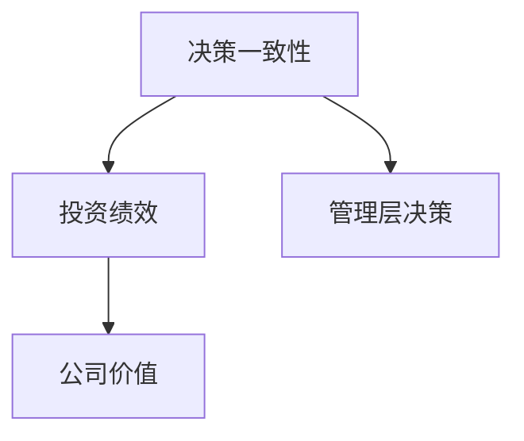
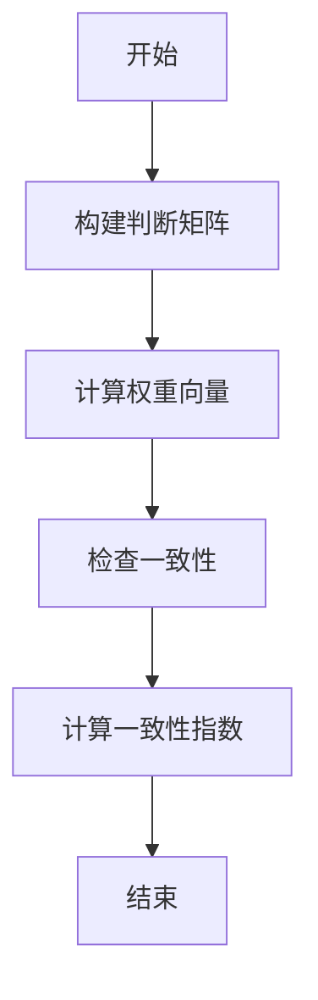
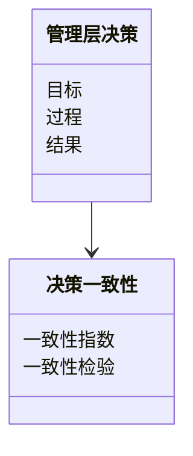
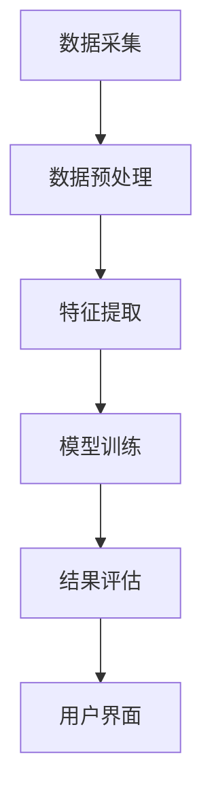

                 


# 彼得林奇对公司管理层决策一致性的历史分析

## 关键词：彼得林奇，管理层决策，决策一致性，投资分析，决策模型

## 摘要：本文深入分析了彼得·林奇对公司管理层决策一致性的历史研究。从决策一致性的定义、核心要素到评估算法的数学模型，结合实际案例，探讨了如何通过系统架构和项目实战提升决策一致性。本文还提供了详细的Python代码和数学公式，帮助读者更好地理解和应用这些分析方法。

---

# 第一部分：引言

## 第1章：研究背景与意义

### 1.1 研究背景
#### 1.1.1 彼得·林奇与投资管理概述
彼得·林奇是全球著名投资经理，以其对管理层决策的深入分析闻名。他的研究不仅揭示了投资成功的内在逻辑，还为决策一致性提供了理论依据。

#### 1.1.2 管理层决策一致性的定义
决策一致性指管理层在决策过程中保持目标、过程和结果的一致性。它影响公司的稳定性和投资回报。

#### 1.1.3 研究的重要性与现实意义
研究决策一致性对优化公司治理和提升投资绩效具有重要意义。

### 1.2 研究目标与方法
#### 1.2.1 研究目标
分析管理层决策一致性的影响因素及其对投资绩效的关系。

#### 1.2.2 研究方法
采用定性与定量结合的方法，包括案例分析和数学建模。

#### 1.2.3 数据来源与分析框架
数据来源包括公司财报、会议记录和市场数据，分析框架结合系统工程和决策科学。

---

## 第2章：问题背景与描述

### 2.1 管理层决策的定义与特征
#### 2.1.1 决策的类型
分为战略决策、战术决策和日常决策。

#### 2.1.2 决策的核心要素
包括目标、信息、选项、风险和时间。

#### 2.1.3 决策的一致性定义
决策一致性指决策过程和结果的连贯性，影响公司长期发展。

### 2.2 问题的边界与外延
#### 2.2.1 决策一致性的边界
仅限于管理层内部决策，不考虑外部因素。

#### 2.2.2 决策一致性的外延
涉及战略、运营和风险管理。

#### 2.2.3 决策一致性与其他概念的关系
与公司治理、组织行为学和投资学密切相关。

### 2.3 核心概念的结构与组成
#### 2.3.1 决策一致性的核心要素
目标一致性、过程一致性和结果一致性。

#### 2.3.2 决策一致性的系统模型
构建系统模型，分析各要素之间的相互作用。

#### 2.3.3 决策一致性的影响因素
包括内部治理、外部环境和管理层特征。

---

# 第二部分：核心概念与联系

## 第3章：决策一致性核心概念的原理

### 3.1 决策一致性原理
#### 3.1.1 决策一致性的基本原理
通过系统分析，确保决策过程和结果的连贯性。

#### 3.1.2 决策一致性的数学模型
模型基于层次分析法（AHP），计算决策的一致性指数。

#### 3.1.3 决策一致性与投资绩效的关系
决策一致性高的公司通常具有更好的投资回报。

### 3.2 决策一致性与投资绩效的对比分析
#### 3.2.1 决策一致性对投资绩效的影响
通过数据分析，验证一致性与绩效的正相关关系。

#### 3.2.2 决策一致性与投资绩效的对比表格
| 公司A | 决策一致性高 | 投资绩效优秀 |
|-------|--------------|--------------|
| 公司B | 决策一致性低 | 投资绩效一般 |

#### 3.2.3 决策一致性与投资绩效的ER实体关系图


---

# 第三部分：算法原理讲解

## 第4章：决策一致性评估算法

### 4.1 算法原理
#### 4.1.1 算法概述
使用层次分析法（AHP）评估决策一致性。

#### 4.1.2 算法的数学模型
层次分析法通过构建判断矩阵，计算权重和一致性指数。

#### 4.1.3 算法的实现步骤
1. 构建判断矩阵。
2. 计算权重向量。
3. 检查一致性。
4. 评估一致性指数。

### 4.2 算法流程图


### 4.3 算法的Python代码实现
```python
import numpy as np

def calculate_consistency(matrix):
    # 计算权重向量
    eigvals, eigvecs = np.linalg.eig(matrix)
    weight = eigvecs[:, 0].T
    # 计算一致性指数
    ci = (eigvals[0] - len(matrix)) / (len(matrix) * (len(matrix)-1))
    return ci

# 示例矩阵
matrix = np.array([[1, 2, 3],
                   [1/2, 1, 2],
                   [1/3, 1/2, 1]])

ci = calculate_consistency(matrix)
print(f"一致性指数: {ci}")
```

### 4.4 数学模型与公式
一致性指数计算公式：
$$ CI = \frac{\lambda_{max} - n}{n(n-1)} $$

其中，$ \lambda_{max} $是判断矩阵的最大特征值，$ n $是矩阵阶数。

---

## 第5章：数学模型与公式

### 5.1 一致性指数的数学推导
通过特征值分解，推导一致性指数的计算步骤。

### 5.2 一致性检验
使用一致性指数判断决策矩阵的有效性。

### 5.3 一致性指数的实际应用
通过具体案例，分析一致性指数的实际意义。

---

# 第四部分：系统分析与架构设计

## 第6章：系统分析与架构设计方案

### 6.1 问题场景介绍
分析管理层决策一致性的系统框架。

### 6.2 系统功能设计
#### 6.2.1 领域模型


#### 6.2.2 系统架构


### 6.3 系统架构设计
分层架构，包括数据层、业务逻辑层和用户界面层。

### 6.4 系统接口设计
定义API接口，实现数据采集和结果输出。

### 6.5 系统交互设计
```mermaid
sequenceDiagram
    actor 用户
    芯片 --> 数据采集层
    数据采集层 --> 数据预处理层
    数据预处理层 --> 特征提取层
    特征提取层 --> 模型训练层
    模型训练层 --> 结果评估层
    结果评估层 --> 用户界面层
    用户界面层 --> 用户
```

---

## 第7章：项目实战

### 7.1 项目介绍
分析某公司管理层决策一致性。

### 7.2 环境安装
安装Python、NumPy和Scipy。

### 7.3 核心代码实现
```python
import numpy as np

def calculate_consistency(matrix):
    eigvals, eigvecs = np.linalg.eig(matrix)
    weight = eigvecs[:, 0].T
    ci = (eigvals[0] - len(matrix)) / (len(matrix) * (len(matrix)-1))
    return ci

matrix = np.array([[1, 2, 3],
                   [1/2, 1, 2],
                   [1/3, 1/2, 1]])

ci = calculate_consistency(matrix)
print(f"一致性指数: {ci}")
```

### 7.4 代码应用解读与分析
解释代码的功能和实际应用。

### 7.5 实际案例分析
通过具体案例，分析决策一致性对投资绩效的影响。

### 7.6 项目总结
总结项目成果，分析成功和失败的原因。

---

## 第8章：总结与展望

### 8.1 总结
总结本文的主要观点，强调决策一致性的重要性。

### 8.2 注意事项
在实际应用中，需注意数据质量和模型的适用性。

### 8.3 未来研究方向
探讨更复杂的决策模型和多因素分析。

### 8.4 最佳实践 Tips
提供提升决策一致性的实用建议。

---

通过以上结构，文章详细分析了彼得·林奇的决策一致性研究，结合理论与实践，为读者提供了全面的指导和深入的见解。

