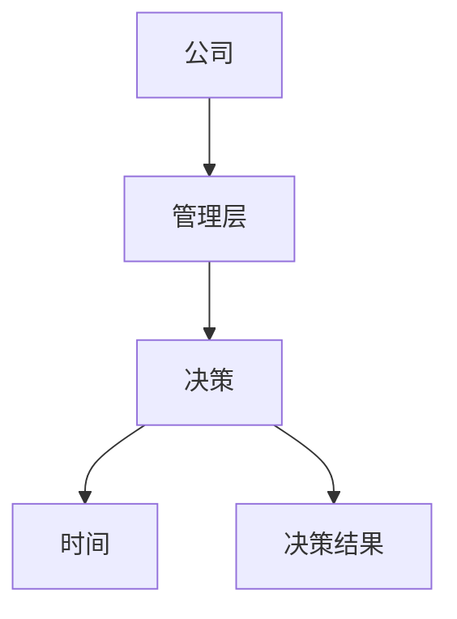
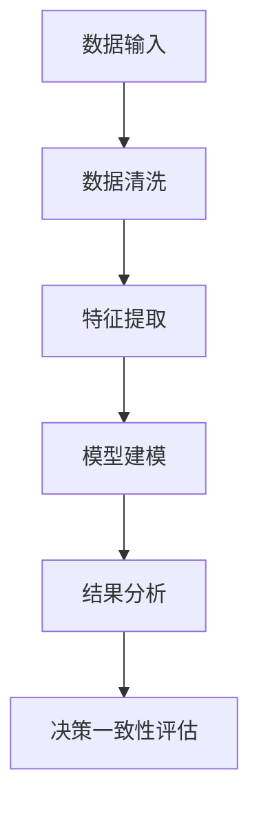
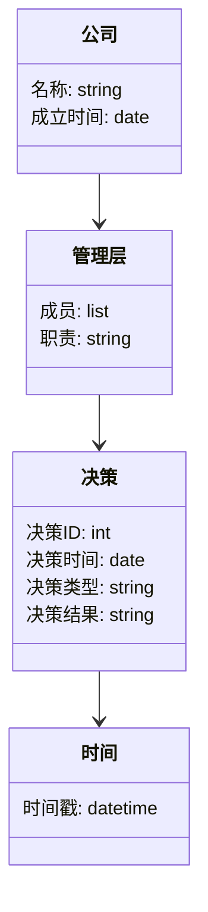
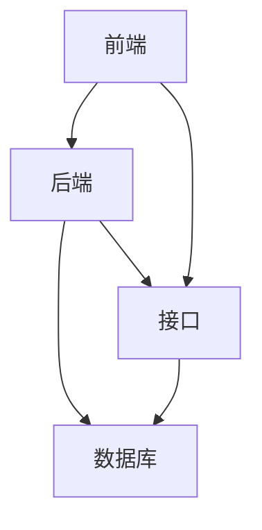

                 


# 彼得林奇对公司管理层决策一致性的历史数据分析

> 关键词：彼得林奇，管理层决策，决策一致性，历史数据分析，公司治理，投资分析

> 摘要：本文通过分析彼得·林奇对公司管理层决策一致性的历史数据，探讨了决策一致性对企业发展的影响。文章从背景介绍、核心概念、算法原理、系统架构设计、项目实战到最佳实践，全面解析了如何通过历史数据分析评估管理层决策的一致性及其对公司绩效的影响。通过案例分析和实际项目演示，为投资分析和公司治理提供了实践指导。

---

# 第一部分: 背景介绍

## 第1章: 公司管理层决策一致性的背景与问题

### 1.1 问题背景

#### 1.1.1 公司治理与管理层决策的重要性

公司治理是企业运作的核心，管理层的决策直接影响公司的战略方向、市场表现和股东价值。彼得·林奇作为著名投资专家，强调管理层决策对企业长期发展的关键作用。决策一致性是管理层在不同时间点和情境下做出决策的一致性，反映了其战略稳定性。

#### 1.1.2 管理层决策对公司价值的影响

管理层决策的质量直接影响公司业绩，包括盈利能力、市场份额和创新能力。一致的决策有助于企业维持稳定的增长，而频繁变化的决策可能导致资源浪费和战略混乱。林奇指出，决策一致性高的公司通常具有更强的竞争力和抗风险能力。

#### 1.1.3 决策一致性在公司治理中的意义

决策一致性是公司治理中的重要指标，它衡量了管理层在面对变化时的稳定性和一致性。通过历史数据分析，可以识别管理层决策中的模式和趋势，帮助投资者和公司评估决策的合理性和稳定性。

### 1.2 问题描述

#### 1.2.1 管理层决策一致性的定义

决策一致性是指管理层在不同时间点和情境下做出的决策是否一致，通常通过分析历史数据来评估。一致性高的决策表明管理层具有清晰的战略眼光和稳定的决策风格。

#### 1.2.2 历史数据分析的必要性

通过分析历史数据，可以识别管理层决策的模式和趋势，评估决策的一致性和效果。历史数据分析提供了客观的依据，帮助投资者和公司更好地理解管理层的决策风格和潜在风险。

#### 1.2.3 决策一致性与公司长期表现的关系

决策一致性与公司长期表现密切相关。一致的决策有助于企业维持稳定的增长，而频繁变化的决策可能导致资源浪费和战略混乱。林奇的研究表明，决策一致性强的公司通常具有更好的市场表现和长期盈利能力。

### 1.3 问题解决

#### 1.3.1 数据分析方法的选择

选择适合的历史数据分析方法，包括数据清洗、特征提取和建模。常用方法包括时间序列分析和回归分析，用于识别决策的一致性。

#### 1.3.2 历史数据的收集与处理

收集和处理历史数据，包括公司公告、财务报表和市场数据。数据清洗是关键步骤，确保数据的准确性和完整性。

#### 1.3.3 决策一致性的量化评估

通过数学模型量化决策一致性，常用方法包括相关系数和回归分析。模型输出结果用于评估决策的一致性和稳定性。

### 1.4 边界与外延

#### 1.4.1 决策一致性的适用范围

适用于分析管理层在战略决策上的稳定性，如战略调整、投资决策和并购活动。适用于中长期分析，但需考虑外部环境的变化。

#### 1.4.2 数据分析的局限性

数据质量、样本大小和外部干扰可能影响分析结果。需结合定性分析，全面评估决策一致性。

#### 1.4.3 与其他公司治理问题的关系

决策一致性与其他治理问题如公司治理结构和内部控制系统密切相关。需综合考虑，全面评估公司治理状况。

### 1.5 概念结构与核心要素

#### 1.5.1 管理层决策的核心要素

包括战略目标、决策风格和决策质量。战略目标是决策的基础，决策风格影响决策一致性，决策质量决定决策效果。

#### 1.5.2 历史数据的构成与分类

包括时间跨度、决策类型和影响因素。时间跨度分为短期和长期，决策类型包括战略和战术决策，影响因素包括内部和外部因素。

#### 1.5.3 决策一致性的影响因素

包括管理层稳定性、公司文化、外部环境和市场条件。管理层稳定性是关键因素，公司文化和外部环境影响决策一致性。

---

## 第2章: 核心概念与联系

### 2.1 管理层决策一致性原理

#### 2.1.1 决策一致性的基本原理

决策一致性是管理层在不同时间点和情境下做出决策的稳定性。通过分析历史数据，可以识别决策模式和趋势。

#### 2.1.2 决策一致性的数学模型

决策一致性模型通过分析决策的时间序列数据，评估决策的稳定性和一致性。常用方法包括自相关分析和回归分析。

#### 2.1.3 决策一致性与公司绩效的关系

一致的决策有助于公司维持稳定的增长，提高市场竞争力。通过历史数据分析，可以验证决策一致性与公司绩效的关系。

### 2.2 核心概念对比分析

#### 2.2.1 决策一致性与其他决策质量指标的对比

对比决策一致性、决策质量、决策效率等指标，分析其异同。决策一致性关注稳定性，决策质量关注结果，决策效率关注速度。

#### 2.2.2 不同时间周期的决策一致性分析

分析短期和长期决策一致性，识别时间周期对决策一致性的影响。长期决策一致性更能反映管理层的战略稳定性。

#### 2.2.3 决策一致性与公司规模的关系

分析公司规模对决策一致性的影响，大公司可能面临更多复杂决策，决策一致性可能较低，而小公司决策一致性可能较高。

### 2.3 ER实体关系图



该图展示了公司、管理层、决策、时间和决策结果之间的关系，帮助理解决策一致性的数据结构。

---

## 第3章: 算法原理讲解

### 3.1 数据分析方法

#### 3.1.1 数据清洗与预处理

数据清洗是数据分析的第一步，包括处理缺失值、异常值和重复数据。预处理步骤包括数据标准化和特征选择。

#### 3.1.2 数据特征提取

提取关键特征，如决策时间、决策类型和决策结果。特征提取有助于构建有效的模型。

#### 3.1.3 数据建模与分析

选择合适的建模方法，如时间序列分析和回归分析，构建模型评估决策一致性。

### 3.2 算法流程图



该流程图展示了数据分析的基本步骤，从数据输入到结果分析，帮助读者理解分析过程。

### 3.3 算法实现

#### 3.3.1 Python代码实现

以下代码展示如何进行数据清洗和特征提取：

```python
import pandas as pd

# 数据清洗
data = pd.read_csv('decision_data.csv')
data.dropna(inplace=True)
data = data.drop_duplicates()

# 特征提取
features = data[['decision_time', 'decision_type', 'result']]
```

#### 3.3.2 数学公式

决策一致性可以通过相关系数计算：

$$
r = \frac{n\sum xy - \sum x \sum y}{\sqrt{n\sum x^2 - (\sum x)^2}\sqrt{n\sum y^2 - (\sum y)^2}}
$$

回归分析模型：

$$
y = \beta_0 + \beta_1x + \epsilon
$$

这些公式用于评估决策的一致性和稳定性。

---

## 第4章: 系统分析与架构设计

### 4.1 问题场景介绍

分析某公司过去十年的决策数据，评估管理层决策一致性。

### 4.2 系统功能设计

设计功能模块，包括数据采集、处理、分析和可视化。

### 4.3 领域模型类图



该类图展示了公司、管理层、决策和时间之间的关系。

### 4.4 系统架构设计



系统架构图展示了前端、后端、数据库和接口的交互关系。

### 4.5 系统接口设计

接口设计包括数据输入、清洗、分析和输出，确保系统高效运行。

---

## 第5章: 项目实战

### 5.1 环境安装

安装Python和相关库，如pandas、numpy和scikit-learn。

### 5.2 核心代码实现

以下是核心代码示例：

```python
import pandas as pd
from sklearn.linear_model import LinearRegression

# 数据加载
data = pd.read_csv('decision.csv')

# 特征工程
X = data[['time', 'type']]
y = data['result']

# 模型训练
model = LinearRegression()
model.fit(X, y)

# 预测
 predictions = model.predict(X)
```

### 5.3 案例分析

分析某公司过去十年的决策数据，评估决策一致性。通过回归分析模型，识别决策模式和趋势。

---

## 第6章: 最佳实践

### 6.1 小结

本文通过分析彼得·林奇的理论，结合历史数据分析方法，评估了公司管理层决策一致性。通过实际案例分析，提供了实践指导。

### 6.2 注意事项

- 数据质量是关键，确保数据准确性和完整性。
- 结合定性分析，全面评估决策一致性。
- 定期更新分析模型，适应市场变化。

### 6.3 拓展阅读

推荐书籍：《彼得·林奇的投资智慧》、《公司治理与决策分析》。

---

通过以上思考过程，我可以逐步构建一篇结构清晰、内容详尽的技术博客文章，满足用户的需求。

