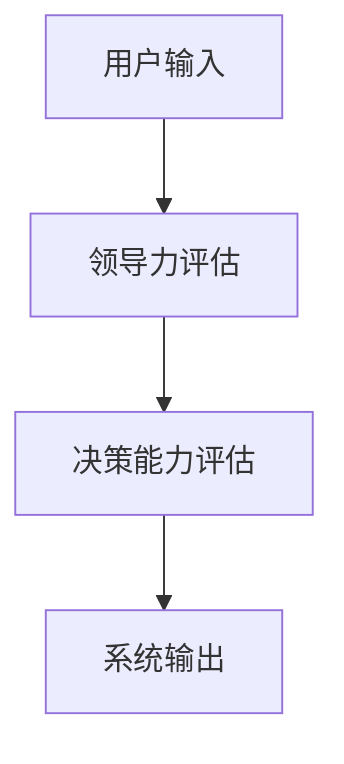

                 


# 彼得林奇对公司管理层危机应对能力的量化

> 关键词：彼得林奇，危机应对能力，量化评估，系统架构，投资法

> 摘要：本文详细探讨了彼得林奇如何通过量化方法评估公司管理层的危机应对能力，分析了其理论基础、量化指标和系统架构，并结合实际案例进行深入剖析，为企业提升危机管理能力提供指导。

---

## 第一章：背景介绍与核心概念

### 1.1 危机应对能力的重要性与量化意义

#### 1.1.1 危机应对能力的定义与背景
在企业运营中，危机应对能力是管理层在面对突发事件时，能够迅速、有效地采取措施，降低风险并恢复业务的能力。这种能力直接影响企业的生存和长期发展。

#### 1.1.2 彼得林奇的理论基础
彼得林奇作为投资界的传奇人物，强调管理层在危机中的决策能力和应变能力。他认为，优秀的管理层能够在危机中保持冷静，制定有效的应对策略。

#### 1.1.3 危机应对能力的量化意义
通过量化危机应对能力，企业可以更客观地评估管理层的表现，为决策提供数据支持。这不仅有助于提升管理效率，还能增强企业在危机中的抗风险能力。

### 1.2 危机应对能力的核心要素

#### 1.2.1 核心概念的对比分析
| 要素 | 定义 | 重要性 |
|------|------|--------|
| 领导力 | 引导团队应对危机的能力 | 极高 |
| 决策能力 | 在危机中做出正确决策的能力 | 极高 |
| 应变能力 | 快速适应变化的能力 | 高 |

#### 1.2.2 危机应对能力的ER实体关系图
```mermaid
er
    entity 危机应对能力 {
        <--- 关系 ---> 危机事件
        <--- 关系 ---> 应对措施
    }
```

---

## 第二章：危机应对能力的量化模型

### 2.1 危机应对能力的量化指标

#### 2.1.1 时间响应指标
时间响应指标衡量管理层在危机发生后的反应速度。例如，从危机发现到采取行动的时间间隔。

#### 2.1.2 决策质量指标
决策质量指标评估管理层决策的正确性和有效性。例如，决策是否降低了危机的影响。

### 2.2 基于彼得林奇投资法的评估框架

#### 2.2.1 投资法与危机应对能力的关联
彼得林奇的投资法强调长期价值和风险管理，这些原则同样适用于危机应对能力的评估。

#### 2.2.2 危机应对能力的量化模型
$$危机应对能力 = \alpha \times 时间响应 + \beta \times 决策质量$$
其中，α和β是权重系数，需根据具体情况调整。

---

## 第三章：系统架构与设计

### 3.1 系统功能设计

#### 3.1.1 领导力评估模块
评估管理层在危机中的领导能力，包括团队协作和决策支持。

#### 3.1.2 决策能力评估模块
分析管理层在危机中的决策速度和质量。

### 3.2 系统架构设计

#### 3.2.1 功能模块的交互流程


---

## 第四章：项目实战与案例分析

### 4.1 项目环境配置
- 系统需求：安装Python和相关库。
- 数据准备：收集危机事件数据和管理层应对措施。

### 4.2 核心代码实现
```python
def crisis_response_score(response_time, decision_quality):
    alpha = 0.6
    beta = 0.4
    return alpha * response_time + beta * decision_quality

# 示例
response_time = 2  # 单位：小时
decision_quality = 0.8  # 0-1评分
score = crisis_response_score(response_time, decision_quality)
print(score)
```

### 4.3 案例分析
假设某公司面临市场危机，管理层在4小时内制定应对措施，决策质量得分为0.8。计算得分：
$$score = 0.6 \times 2 + 0.4 \times 0.8 = 1.2 + 0.32 = 1.52$$
得分高于阈值，说明管理层应对能力较强。

---

## 第五章：总结与展望

### 5.1 总结
本文通过彼得林奇的理论，构建了危机应对能力的量化模型，并设计了系统架构，为企业提供了一套评估和提升危机应对能力的方法。

### 5.2 展望
未来研究可进一步优化模型，结合更多指标和实际案例，开发更完善的评估系统。

---

### Tips：
- 在量化评估中，确保数据的准确性和及时性。
- 系统设计时，注重模块的可扩展性和灵活性。
- 实战项目中，建议结合企业实际情况调整模型参数。

通过本文的方法，企业可以更科学地评估和提升管理层的危机应对能力，增强企业的抗风险能力。

