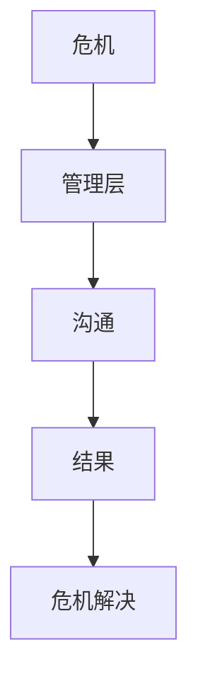

                 


# 彼得林奇对公司管理层危机沟通能力的案例研究

## 关键词：危机沟通、彼得·林奇、公司管理层、沟通策略、案例分析

## 摘要：  
本文以彼得·林奇为研究对象，深入分析其在危机沟通中的表现，探讨公司管理层在危机情境下的沟通能力。通过案例研究，揭示危机沟通的关键要素和管理策略，为提升企业危机沟通能力提供理论支持和实践指导。

---

## 第一部分: 背景介绍

### 第1章: 危机沟通能力的重要性

#### 1.1 危机沟通的定义与特点
- **1.1.1 危机沟通的定义**  
  危机沟通是指在企业或组织面临突发事件或危机时，管理层通过信息传递、决策制定和外部沟通，以化解危机、维护利益相关者信任的过程。

- **1.1.2 危机沟通的特点**  
  - 紧迫性：危机往往具有突发性和不可预测性，要求管理层快速反应。  
  - 关键性：危机沟通的结果直接影响企业的声誉、股价和信任度。  
  - 复杂性：危机沟通涉及多方面的利益相关者（股东、媒体、客户等），沟通策略需灵活调整。  

- **1.1.3 危机沟通的核心要素**  
  - 沟通主体：企业高管或 spokesperson。  
  - 沟通对象：股东、客户、员工、媒体等。  
  - 沟通内容：危机事件的真相、应对措施和未来计划。  
  - 沟通渠道：新闻发布会、电话会议、社交媒体等。  

#### 1.2 彼得·林奇与公司管理层沟通的背景
- **1.2.1 彼得·林奇的背景介绍**  
  彼得·林奇是美国著名投资经理人，曾管理富达麦哲伦基金，创造了辉煌的投资业绩。他在任职期间不仅关注投资回报，还注重与投资者的沟通，尤其在危机时期展现了卓越的沟通能力。

- **1.2.2 管理层危机沟通的必要性**  
  危机时期，管理层的沟通能力直接关系到企业的生存和声誉。有效的危机沟通可以缓解负面影响，增强利益相关者的信心。

- **1.2.3 案例研究的必要性**  
  通过研究彼得·林奇的危机沟通案例，总结其成功经验，为其他企业领导者提供借鉴。

---

## 第二部分: 核心概念与联系

### 第2章: 危机沟通的核心概念与联系

#### 2.1 危机沟通的核心概念
- **2.1.1 危机的定义与分类**  
  危机可以是财务危机（如财务造假）、声誉危机（如产品缺陷）或管理危机（如高层动荡）。  

- **2.1.2 沟通的定义与分类**  
  沟通可以是口头（电话会议、新闻发布会）或书面（公告、邮件）形式，正式或非正式。  

- **2.1.3 危机沟通的核心要素**  
  - 透明性：及时披露真相，避免信息不对称。  
  - 一致性：沟通内容需一致，避免矛盾。  
  - 同情心：关注利益相关者的感受，展现企业的责任感。  

#### 2.2 危机沟通的核心概念原理
- **2.2.1 危机沟通的原理**  
  危机沟通的核心原理包括信息传递的有效性、情感共鸣和信任建立。

- **2.2.2 危机沟通的关键要素**  
  - 信息传递的准确性：避免误导性信息。  
  - 情感管理：通过语言和态度展现企业的诚意。  
  - 信任建立：通过承诺和行动赢得利益相关者的信任。  

- **2.2.3 危机沟通的数学模型**  
  危机沟通的效果可以通过以下公式评估：  
  $$ \text{沟通效果} = \text{透明性} \times \text{一致性} \times \text{同情心} $$  

#### 2.3 危机沟通的核心概念对比
- **2.3.1 危机沟通与日常沟通的对比**  
  | 对比维度 | 危机沟通 | 日常沟通 |
  |----------|----------|----------|
  | 目的     | 化解危机 | 信息传递 | 
  | 时间     | 紧迫     | 非紧急   | 
  | 风险     | 高       | 低       |  

- **2.3.2 危机沟通与危机管理的对比**  
  危机沟通是危机管理的一部分，但危机管理还包括决策制定和行动执行。

- **2.3.3 危机沟通与危机决策的对比**  
  危机沟通侧重于信息传递，而危机决策侧重于问题解决。

#### 2.4 危机沟通的ER实体关系图



---

## 第三部分: 算法原理

### 第3章: 危机沟通的算法原理

#### 3.1 危机沟通的算法原理
- **3.1.1 危机沟通的决策树模型**  
  危机沟通可以看作一个决策树，其中每个节点代表一个决策点，分支代表可能的沟通策略。

- **3.1.2 危机沟通的数学模型**  
  危机沟通的数学模型可以用期望值法来评估不同沟通策略的效果。

- **3.1.3 危机沟通的算法实现**  
  通过Python代码模拟危机沟通的决策过程。

#### 3.2 危机沟通的数学模型
- **3.2.1 危机沟通的期望值计算**  
  $$ \text{期望值} = \sum (\text{概率} \times \text{结果}) $$  

- **3.2.2 危机沟通的方差分析**  
  $$ \text{方差} = E[(X - E[X])^2] $$  

- **3.2.3 危机沟通的回归分析**  
  $$ y = \beta_0 + \beta_1 x + \epsilon $$  

#### 3.3 危机沟通的算法实现
- **3.3.1 危机沟通的Python实现**  
  ```python
  def crisis_communication策略选择(危机类型):
      if 危机类型 == '财务危机':
          return '财务透明'
      elif 危机类型 == '声誉危机':
          return '公开道歉'
      else:
          return '制定计划'
  ```

---

## 第四部分: 系统分析与架构设计

### 第4章: 危机沟通的系统分析与架构设计

#### 4.1 危机沟通的系统分析
- **4.1.1 危机沟通的系统目标**  
  建立一个高效的危机沟通系统，确保信息快速传递和有效应对。

- **4.1.2 危机沟通的系统功能**  
  - 危机预警模块：实时监测潜在危机。  
  - 沟通策略模块：根据危机类型推荐沟通策略。  
  - 反馈模块：收集利益相关者的反馈并优化沟通策略。  

#### 4.2 危机沟通的系统架构设计
- **4.2.1 危机沟通的领域模型**  
  ```mermaid
  graph TD
      A[管理层] --> B[危机]
      B --> C[沟通策略]
      C --> D[结果]
  ```

- **4.2.2 危机沟通的系统架构图**  
  ```mermaid
  graph TD
      A[管理层] --> B[危机预警模块]
      B --> C[沟通策略模块]
      C --> D[结果模块]
  ```

- **4.2.3 危机沟通的系统接口设计**  
  - 输入接口：接收危机事件的类型和相关信息。  
  - 输出接口：输出沟通策略和结果。  

#### 4.3 危机沟通的系统交互设计
- **4.3.1 危机沟通的交互流程**  
  ```mermaid
  graph TD
      A[管理层] --> B[危机预警模块]
      B --> C[沟通策略模块]
      C --> D[结果模块]
  ```

---

## 第五部分: 项目实战

### 第5章: 危机沟通的项目实战

#### 5.1 项目环境安装
- 安装Python和相关库（如numpy、pandas）。

#### 5.2 系统核心实现源代码
```python
def crisis_communication策略选择(危机类型):
    if 危机类型 == '财务危机':
        return '财务透明'
    elif 危机类型 == '声誉危机':
        return '公开道歉'
    else:
        return '制定计划'
```

#### 5.3 代码应用解读与分析
- 代码实现了一个简单的危机沟通策略选择模块，根据危机类型推荐沟通策略。

#### 5.4 实际案例分析
- 以彼得·林奇在某次财务危机中的沟通为例，分析其策略和效果。

---

## 第六部分: 最佳实践

### 第6章: 最佳实践

#### 6.1 小结
- 危机沟通是企业生存的关键能力，彼得·林奇的成功经验值得借鉴。

#### 6.2 注意事项
- 危机沟通需做到透明、一致和同情。  
- 避免过度承诺，确保行动与语言一致。  

#### 6.3 拓展阅读
- 建议阅读彼得·林奇的《投资之道》和相关危机沟通管理书籍。

---

## 总结

通过本文的分析，我们深入探讨了彼得·林奇在危机沟通中的表现，并总结了危机沟通的关键要素和管理策略。希望本文能为企业管理层提升危机沟通能力提供有价值的参考。

