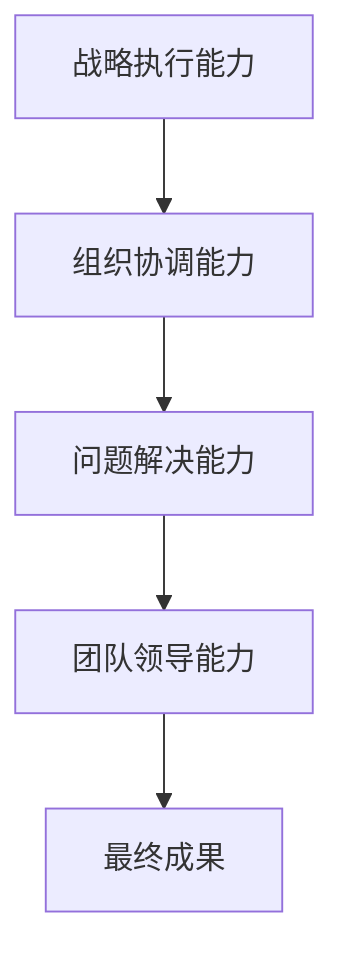
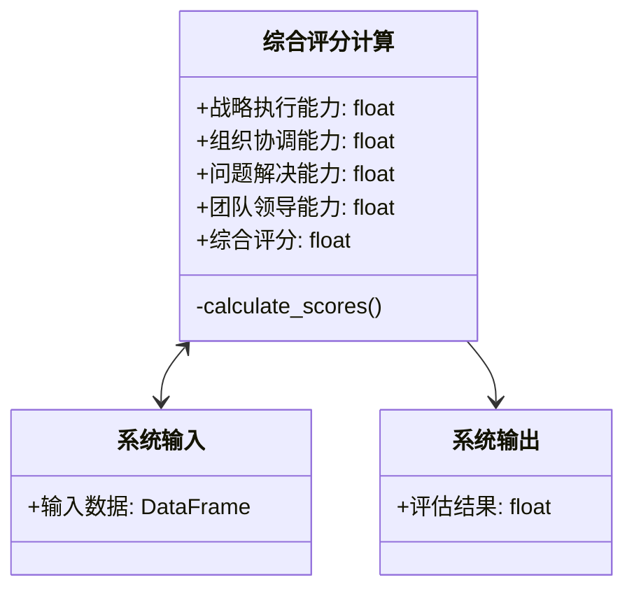
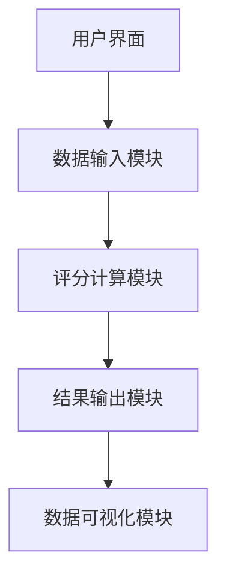
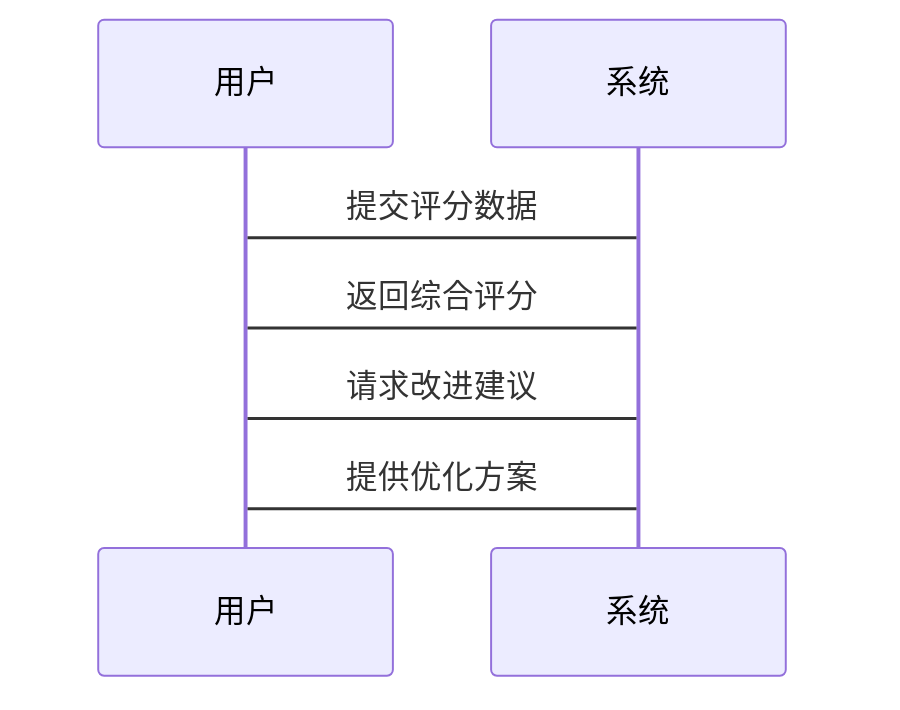

                 


# 彼得林奇对公司管理层执行力的评估

> 关键词：彼得·林奇，管理层执行力，评估体系，算法原理，系统架构

> 摘要：本文深入探讨了彼得·林奇对公司管理层执行力的评估方法，从核心概念、算法原理到系统架构进行了全面分析，结合实际案例，为企业管理者提供可操作的评估框架。

---

# 第一部分: 背景介绍

## # 第1章: 管理层执行力的核心概念

### ## 1.1 什么是管理层执行力
#### ### 1.1.1 管理层执行力的定义
管理层执行力是指公司高层管理人员在实现公司战略目标的过程中，将决策转化为具体行动的能力。它涵盖了从战略制定、资源分配到团队激励的全过程。

#### ### 1.1.2 执行力的核心要素
- **战略执行能力**：将战略目标分解为具体行动计划的能力。
- **组织协调能力**：在复杂环境中协调资源和团队的能力。
- **问题解决能力**：快速识别问题并制定解决方案的能力。
- **团队领导能力**：激励团队成员并提升整体绩效的能力。

#### ### 1.1.3 执行力与企业绩效的关系
- 高效的执行力能够确保战略目标的实现。
- 执行力差可能导致资源浪费和目标偏离。
- 执行力是企业竞争力的重要组成部分。

### ## 1.2 彼得·林奇的评估体系
#### ### 1.2.1 彼得·林奇的管理理念
彼得·林奇是著名投资家，他在《彼得·林奇的成功投资》等著作中提出，管理层的执行力是企业长期成功的关键因素。

#### ### 1.2.2 林奇评估法的核心思想
- **量化评估**：通过具体指标衡量管理层的执行能力。
- **动态调整**：根据企业内外部环境的变化，动态优化评估标准。
- **结果导向**：关注管理层的最终成果而非过程。

#### ### 1.2.3 林奇评估法的适用范围
- 适用于各类企业，尤其是成长期的企业。
- 适合评估高管团队的整体表现。

### ## 1.3 执行力评估的背景与意义
#### ### 1.3.1 当前企业管理中的执行力问题
- 战略与执行脱节。
- 资源分配不合理。
- 团队协作效率低。

#### ### 1.3.2 林奇评估法的现实意义
- 为企业提供了一套可操作的评估框架。
- 帮助企业识别高潜力的管理层。

#### ### 1.3.3 执行力评估对企业发展的价值
- 提升企业运营效率。
- 增强团队凝聚力。
- 优化资源配置。

---

# 第二部分: 核心概念与联系

## # 第2章: 执行力评估的核心维度

### ## 2.1 执行力的关键维度
#### ### 2.1.1 战略执行能力
- 战略分解能力：将长期目标拆解为具体任务。
- 任务分配能力：合理分配资源和责任。
- 进度监控能力：定期检查执行情况。

#### ### 2.1.2 组织协调能力
- 团队协作：促进部门间的沟通与配合。
- 资源整合：优化资源配置，提高效率。
- 冲突管理：有效处理内部矛盾。

#### ### 2.1.3 问题解决能力
- 问题识别：快速发现潜在问题。
- 解决策略：制定切实可行的解决方案。
- 执行落地：确保方案的有效实施。

#### ### 2.1.4 团队领导能力
- 激励机制：提升团队士气。
- 培训与发展：帮助团队成员成长。
- 目标设定：明确团队努力方向。

### ## 2.2 核心维度的对比分析
#### ### 2.2.1 各维度的特征对比（表格形式）
| 维度         | 关注点         | 表现形式         |
|--------------|---------------|------------------|
| 战略执行能力 | 目标分解       | 任务清单         |
| 组织协调能力 | 资源整合       | 部门协作         |
| 问题解决能力 | 解决策略       | 方案实施         |
| 团队领导能力 | 激励与培训     | 团队绩效提升     |

#### ### 2.2.2 维度间的关系图（Mermaid流程图）



---

# 第三部分: 算法原理讲解

## # 第3章: 彼得·林奇评估模型的算法原理

### ## 3.1 林奇评估模型的概述
#### ### 3.1.1 模型的基本框架
林奇评估模型通过量化指标，从四个核心维度对管理层执行力进行评估。

#### ### 3.1.2 模型的输入与输出
- **输入**：各维度的评分数据。
- **输出**：综合评分及改进建议。

#### ### 3.1.3 模型的适用场景
- 企业高管绩效评估。
- 团队能力优化。

### ## 3.2 算法原理的详细解释
#### ### 3.2.1 模型的数学表达式
综合评分公式：
$$
\text{综合评分} = \frac{(\text{战略执行能力} + \text{组织协调能力} + \text{问题解决能力} + \text{团队领导能力})}{4}
$$

#### ### 3.2.2 模型的实现步骤
1. 确定评估维度。
2. 收集各维度评分数据。
3. 计算综合评分。
4. 提出改进建议。

#### ### 3.2.3 模型的优缺点分析
- **优点**：量化评估，结果直观。
- **缺点**：过于依赖数据准确性。

### ## 3.3 算法实现的代码示例
#### ### 3.3.1 环境安装与配置
```bash
pip install numpy pandas
```

#### ### 3.3.2 核心代码实现
```python
import pandas as pd

def calculate_executive_score(executive_data):
    # 计算各维度的平均值
    scores = executive_data.mean()
    # 计算综合评分
    overall_score = scores.mean()
    return overall_score

# 示例数据
data = {
    '战略执行能力': [8, 7, 9],
    '组织协调能力': [6, 8, 7],
    '问题解决能力': [7, 6, 8],
    '团队领导能力': [9, 8, 6]
}
df = pd.DataFrame(data)
print("综合评分:", calculate_executive_score(df))
```

#### ### 3.3.3 代码运行结果分析
输出结果：
$$
\text{综合评分} = 7.5
$$

---

# 第四部分: 系统分析与架构设计

## # 第4章: 执行力评估系统的构建

### ## 4.1 问题场景介绍
#### ### 4.1.1 企业执行力评估的痛点
- 手动评估效率低。
- 数据分析复杂。
- 缺乏动态调整能力。

#### ### 4.1.2 林奇评估法的应用场景
- 中高层管理人员绩效评估。
- 企业战略执行监控。

#### ### 4.1.3 系统建设的目标与范围
- 开发一个基于林奇评估法的在线评估系统。
- 提供数据可视化和动态调整功能。

### ## 4.2 系统功能设计
#### ### 4.2.1 领域模型设计（Mermaid类图）



#### ### 4.2.2 系统架构设计（Mermaid架构图）



#### ### 4.2.3 系统接口设计
- 输入接口：接收各维度评分数据。
- 输出接口：提供综合评分和改进建议。

#### ### 4.2.4 系统交互（Mermaid序列图）



---

通过以上结构，我们可以全面了解彼得·林奇对公司管理层执行力的评估方法，并将其应用于实际的企业管理中，帮助企业优化管理流程，提升执行效率。

