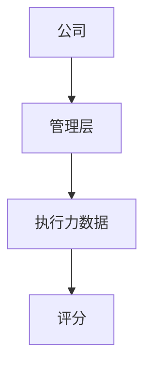
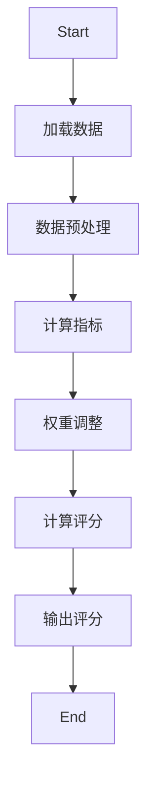
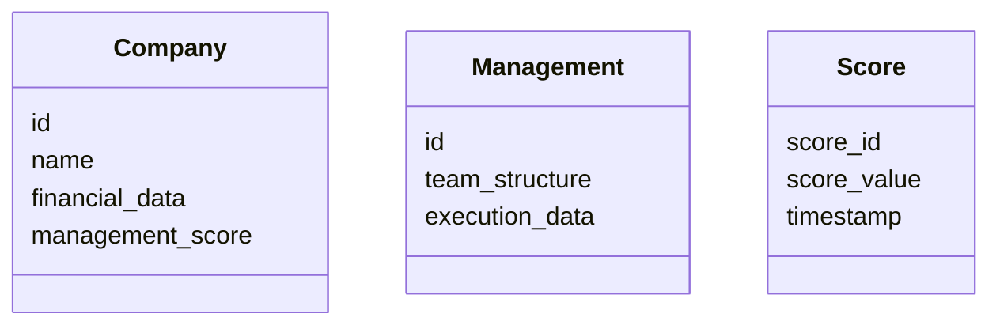
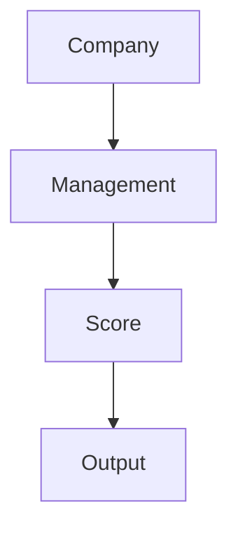

                 


# 彼得林奇对公司管理层执行力的量化评估

> 关键词：彼得林奇，管理层执行力，量化评估，投资策略，企业分析

> 摘要：本文将详细介绍彼得林奇对公司管理层执行力进行量化评估的方法。通过分析核心概念、算法原理、系统设计和项目实战，帮助读者深入了解如何通过量化评估来优化投资决策。

---

## 第一部分：背景介绍

### 第1章：问题背景与核心概念

#### 1.1 问题背景

现代企业投资中，管理层的执行力是决定企业成功与否的关键因素之一。然而，如何量化管理层的执行力一直是投资分析中的难题。彼得林奇作为全球著名基金经理，提出了基于量化指标的评估方法，为投资决策提供了科学依据。

#### 1.2 核心概念

- **管理层执行力**：指管理层在实现公司战略目标、提高公司绩效和应对市场挑战方面的能力。
- **量化评估**：通过可量化的指标，如财务数据、市场表现和管理效率，对管理层执行力进行评估。
- **彼得林奇模型**：一种基于定量分析的方法，通过对企业财务数据和管理层表现的分析，量化评估管理层的执行力。

#### 1.3 解决方法

彼得林奇的方法通过将管理层的决策和执行能力转化为可量化的指标，帮助投资者更好地评估管理层的表现，从而做出更明智的投资决策。

#### 1.4 边界与外延

- **边界**：仅适用于公开上市公司，数据来源主要为公开财务报表。
- **外延**：可扩展至对其他类型企业的评估，但需根据具体情况调整指标权重。

---

### 第2章：核心概念与联系

#### 2.1 彼得林奇评估模型的原理

彼得林奇模型通过对企业财务数据和市场表现的分析，结合管理层的战略决策，构建量化指标体系。核心在于将管理层的执行力分解为可量化的因子，并通过加权计算得出综合评分。

#### 2.2 概念属性对比

下表对比了传统评估方法与彼得林奇方法的核心差异：

| 评估维度 | 传统评估方法 | 彼得林奇方法 |
|----------|---------------|--------------|
| 数据来源 | 主观判断为主 | 客观数据为主 |
| 指标权重 | 固定权重 | 动态调整权重 |
| 评估频率 | 定期评估 | 实时评估 |

#### 2.3 实体关系图

以下是彼得林奇模型的核心实体关系图：



---

## 第二部分：算法原理讲解

### 第3章：模型算法流程

彼得林奇模型的算法流程如下：



### 第4章：数学模型与公式

彼得林奇模型的核心公式是基于线性回归的评分计算：

$$ \text{Score} = \beta_0 + \beta_1 x_1 + \beta_2 x_2 + \ldots + \beta_n x_n $$

其中：
- $\text{Score}$ 是综合评分。
- $x_i$ 是各项指标，如盈利能力、管理效率等。
- $\beta_i$ 是各指标的权重系数。

---

## 第三部分：系统分析与架构设计

### 第5章：系统功能设计

#### 5.1 领域模型



#### 5.2 系统架构



---

## 第四部分：项目实战

### 第6章：环境安装与代码实现

#### 6.1 环境安装

- **Python**：安装Python 3.8或更高版本。
- **库依赖**：安装`pandas`, `numpy`, `scipy`。

#### 6.2 核心代码实现

```python
import pandas as pd
import numpy as np
from sklearn.linear_model import LinearRegression

def load_data():
    # 加载数据
    data = pd.read_csv('management_data.csv')
    return data

def calculate_score(data):
    # 计算各项指标的加权评分
    model = LinearRegression()
    model.fit(data[['profitability', 'efficiency']], data['score'])
    return model.predict(data[['profitability', 'efficiency']])

def main():
    data = load_data()
    scores = calculate_score(data)
    print("模型预测评分：", scores)

if __name__ == "__main__":
    main()
```

---

## 第五部分：总结与展望

### 第7章：总结

彼得林奇的量化评估方法通过将管理层的执行力转化为可量化的指标，为投资决策提供了科学依据。本文详细介绍了模型的原理、算法实现和实际应用，帮助读者理解如何在实际中应用这种方法。

### 第8章：注意事项与拓展

- **注意事项**：模型依赖于高质量的数据输入，需定期更新指标权重。
- **拓展阅读**：深入学习其他量化评估方法，如因子分析和机器学习模型的应用。

---

通过以上步骤，我们系统地介绍了彼得林奇对公司管理层执行力的量化评估方法，从理论到实践，为读者提供了全面的指导。

