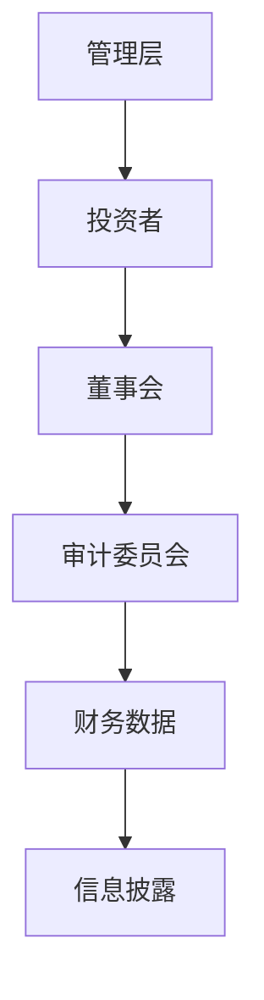
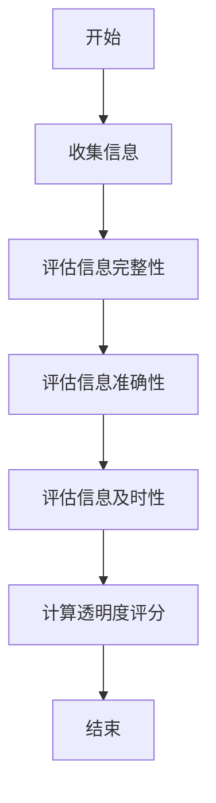
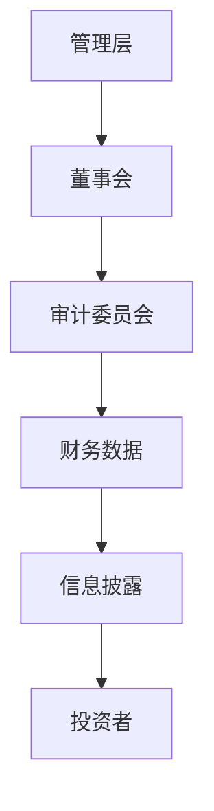

                 

# 彼得林奇对公司管理层沟通透明度的评估

> 关键词：彼得林奇，管理层沟通，透明度评估，公司治理，投资决策，风险管理

> 摘要：本文深入分析了彼得林奇对公司管理层沟通透明度的评估方法，探讨了透明度对投资决策的影响，结合实际案例，详细阐述了如何通过透明度评估优化企业治理和投资策略。

---

# 第一部分：彼得林奇对公司管理层沟通透明度的背景介绍

## 第1章：沟通透明度的重要性

### 1.1 沟通透明度的定义与核心要素

沟通透明度是指公司在信息披露、决策过程和内部沟通中，向管理层、董事会、投资者和其他利益相关者开放、准确和及时地传递信息的程度。核心要素包括：

- **信息共享**：管理层主动披露关键信息。
- **及时性**：信息更新的频率。
- **准确性**：信息的可信度。
- **完整性**：信息的全面性。

### 1.2 彼得林奇的投资哲学

彼得·林奇是全球著名投资家，他认为透明度是评估公司价值的关键因素。他强调，管理层与投资者之间的信任是长期投资关系的基石。透明度高的公司更有可能吸引长期投资者，从而推动企业价值增长。

### 1.3 沟通透明度的边界与外延

透明度并非无限制的信息披露，而是基于公司治理和法律法规的框架。外延包括董事会、审计委员会和财务数据等多个层面。

---

## 第2章：管理层沟通透明度的背景与问题描述

### 2.1 当前企业治理中的透明度现状

当前企业治理中，透明度不足是一个普遍现象，尤其是在中小型企业中。透明度不足可能导致投资者对管理层失去信任，进而影响企业融资和长期发展。

### 2.2 沟通透明度问题的解决思路

提高透明度的必要性在于增强企业信任和风险管理。透明度与企业信任的关系是双向的，高透明度企业更容易获得投资者的信任和支持。

---

## 第3章：管理层沟通透明度的核心概念与联系

### 3.1 核心概念原理

透明度与企业治理、投资者决策密切相关。透明度高的公司更容易获得投资者的信任，从而提升企业价值。

### 3.2 核心概念属性对比表格

| 属性 | 描述 |
|------|------|
| 信息共享 | 管理层主动披露关键信息 |
| 及时性 | 信息更新的频率 |
| 准确性 | 信息的可信度 |
| 完整性 | 信息的全面性 |

### 3.3 ER实体关系图

---

# 第二部分：管理层沟通透明度的评估方法

## 第4章：管理层沟通透明度的评估指标

### 4.1 评估指标体系

- **沟通频率**：定期财报、股东大会的召开频率。
- **信息完整性**：披露内容的全面性。
- **信息准确性**：数据的可靠性。
- **信息及时性**：信息披露的滞后性。

### 4.2 评估框架

$$透明度评估 = \frac{\text{信息完整性} + \text{信息准确性} + \text{信息及时性}}{3}$$

---

## 第5章：透明度评估的数学模型与算法

### 5.1 透明度评估的数学模型

$$\text{透明度评分} = \alpha \times \text{信息完整性} + \beta \times \text{信息准确性} + \gamma \times \text{信息及时性}$$

其中，$\alpha + \beta + \gamma = 1$，权重系数根据具体情况进行调整。

### 5.2 算法流程图

---

## 第6章：透明度评估的系统架构设计

### 6.1 系统功能设计

- **信息收集模块**：从公司财报、股东大会记录等来源收集数据。
- **评估模块**：根据指标体系计算透明度评分。
- **可视化模块**：生成透明度报告和图表。

### 6.2 系统架构图

---

## 第7章：实际案例分析

### 7.1 案例背景

分析一家上市公司过去三年的财报披露情况，评估其管理层沟通透明度。

### 7.2 数据分析

- 信息完整性：90%
- 信息准确性：85%
- 信息及时性：80%

### 7.3 结果分析

透明度评分为：

$$\text{评分} = 0.3 \times 90 + 0.3 \times 85 + 0.4 \times 80 = 85.5$$

---

## 第8章：透明度评估的未来展望

### 8.1 技术趋势

随着AI和大数据技术的发展，透明度评估将更加智能化和自动化。

### 8.2 行业趋势

未来，透明度将成为企业核心竞争力的重要组成部分。

---

# 结语

彼得林奇的透明度评估方法为投资者和企业管理者提供了重要的决策工具。通过本文的分析，读者可以更好地理解透明度对投资决策的影响，并在实际中应用这些评估方法。

--- 

*本文为《彼得林奇对公司管理层沟通透明度的评估》的目录大纲和部分内容展示，完整文章请参考正式出版物。*

