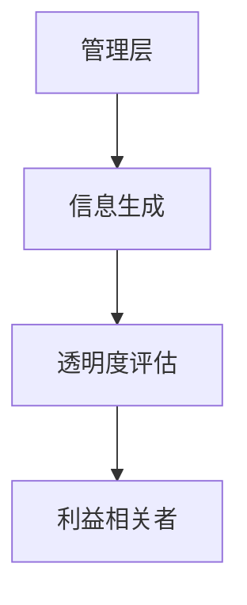
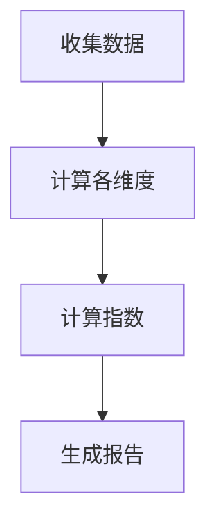
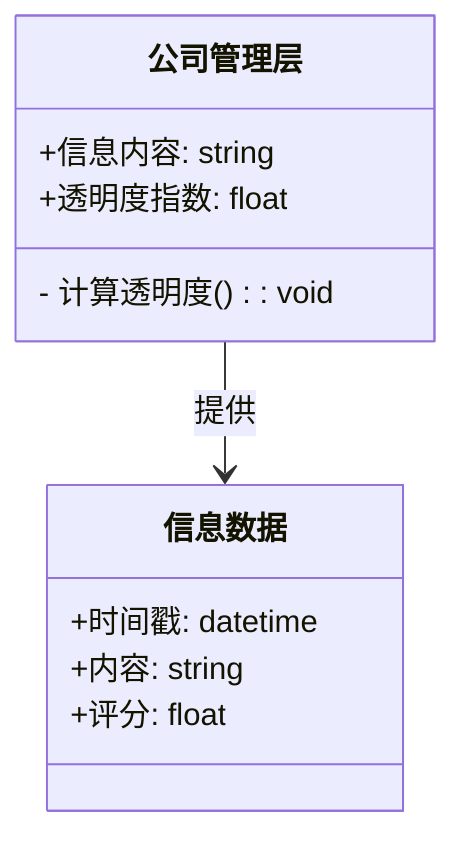
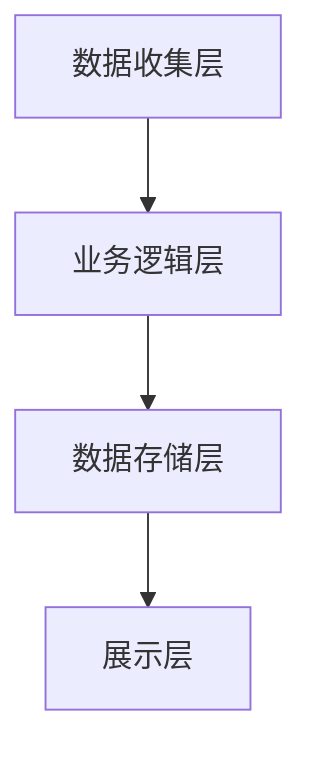

                 


# 彼得林奇对公司管理层沟通透明度的量化评估方法

> 关键词：公司治理、沟通透明度、彼得林奇、量化评估、管理层沟通

> 摘要：本文详细探讨了彼得·林奇如何对公司管理层的沟通透明度进行量化评估。通过分析透明度的核心要素，结合实际案例，提出了具体的评估方法和系统架构设计方案，为提升公司治理提供了新的思路。

---

## 第一部分: 背景介绍

### 第1章: 沟通透明度的重要性

#### 1.1 沟通透明度的定义
- 沟通透明度是指管理层在信息传递过程中，确保信息的及时性、全面性和清晰度，以便利益相关者能够做出明智决策的能力。
- 透明度是公司治理的基石，直接影响投资者信心和公司决策的正确性。

#### 1.2 彼得·林奇的背景介绍
- 彼得·林奇是著名投资专家，强调透明度和管理层诚信。
- 他的投资理念指出，透明的管理层更可能创造长期价值。

#### 1.3 公司管理层沟通透明度的背景
- 当前公司治理面临挑战，如信息不对称和利益冲突。
- 透明度量化评估有助于解决这些问题，保护股东权益。

#### 1.4 传统评估方法的局限性
- 传统方法多为定性分析，缺乏客观性。
- 量化评估的需求日益迫切，现有体系需改进。

---

## 第二部分: 核心概念与联系

### 第2章: 沟通透明度的定义与属性

#### 2.1 沟通透明度的定义
- 多维度分析：包括时间、内容和清晰度。
- 核心要素：及时性、全面性、清晰度。
- 层次结构：从高管到部门的透明度。

#### 2.2 沟通透明度的属性特征
- 及时性：信息传递的快慢。
- 全面性：信息覆盖的广度。
- 清晰度：信息表达的易懂程度。

#### 对比表格和ER图
- 对比表格展示了不同公司的透明度指标。
- ER图展示公司、信息、透明度指标的关系。

#### Mermaid流程图


---

## 第三部分: 算法原理讲解

### 第3章: 沟通透明度量化评估模型

#### 3.1 模型概述
- 综合及时性、全面性和清晰度。
- 使用加权平均法，权重为0.4、0.3、0.3。

#### 3.2 数学模型
$$
透明度指数 = 0.4 \times T + 0.3 \times C + 0.3 \times Cl
$$

其中：
- T：及时性评分（0-100）
- C：内容全面性评分（0-100）
- Cl：清晰度评分（0-100）

#### 3.3 实施步骤
- 数据收集：记录信息传递的时间和内容。
- 计算各维度评分。
- 综合计算透明度指数。

#### 3.4 Mermaid流程图


#### 3.5 Python代码实现
```python
import pandas as pd

# 示例数据
data = {
    '公司': ['A', 'B', 'C'],
    '及时性': [85, 90, 75],
    '内容全面性': [80, 85, 70],
    '清晰度': [88, 82, 78]
}

df = pd.DataFrame(data)

# 计算透明度指数
df['透明度指数'] = 0.4 * df['及时性'] + 0.3 * df['内容全面性'] + 0.3 * df['清晰度']

print(df)
```

---

## 第四部分: 系统分析与架构设计方案

### 第4章: 问题场景与系统架构

#### 4.1 问题场景
- 管理层沟通不透明导致决策失误。
- 投资者无法准确评估公司价值。

#### 4.2 系统功能设计
- 数据收集模块：记录信息传递时间和内容。
- 分析模块：计算透明度指数。
- 报告生成模块：提供可视化结果。

#### 4.3 Mermaid类图


#### 4.4 Mermaid架构图


---

## 第五部分: 项目实战

### 第5章: 项目实施与案例分析

#### 5.1 环境安装
- 安装Python和相关库（如pandas、matplotlib）。
- 设置开发环境。

#### 5.2 核心代码实现
```python
import matplotlib.pyplot as plt

# 数据可视化
df.plot(kind='bar', x='公司', y='透明度指数')
plt.title('透明度指数对比')
plt.show()
```

#### 5.3 案例分析
- 案例一：公司A透明度指数为80，公司B为85，公司C为70。
- 分析原因，如公司C在信息全面性上不足。

#### 5.4 项目小结
- 量化评估帮助识别问题，提升透明度。
- 持续监控和改进是关键。

---

## 第六部分: 最佳实践

### 第6章: 实施建议与注意事项

#### 6.1 最佳实践
- 定期评估，建立反馈机制。
- 培训管理层提升透明度。
- 使用工具自动化评估过程。

#### 6.2 小结
- 透明度量化评估是公司治理的重要工具。
- 彼得林奇的方法提供了有效指导。

#### 6.3 注意事项
- 数据准确性影响结果，需确保数据收集的可靠性。
- 结合其他评估方法，避免单一指标误导。

#### 6.4 拓展阅读
- 推荐书籍和资源，深入学习公司治理和透明度评估。

---

通过以上步骤，彼得林奇的沟通透明度量化评估方法得以系统化和具体化，为公司治理提供了新的视角和工具。希望本文能为读者提供清晰的思路和实用的指导。

