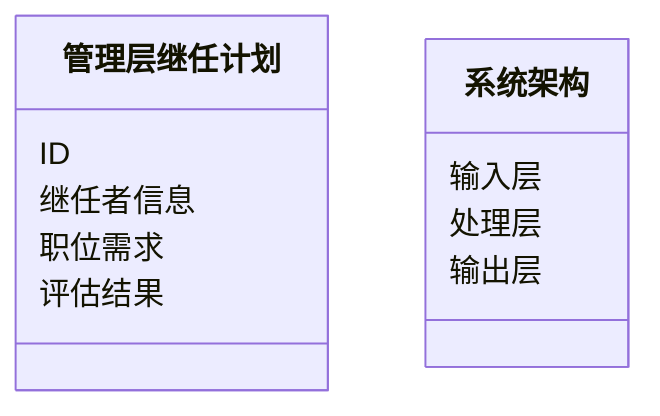

                 


# 彼得林奇对公司管理层继任计划的评估

## 关键词：彼得林奇、管理层继任、公司治理、领导力评估、战略规划

## 摘要：本文系统地探讨了彼得·林奇对公司管理层继任计划的评估方法，分析了管理层继任的重要性、核心要素和评估工具，结合实际案例，提出了有效的评估策略，为投资者和企业管理者提供了实用的指导。

---

# 第一部分：背景与重要性

## 第1章：管理层继任计划的核心概念

### 1.1 管理层继任计划的定义

管理层继任计划是指企业为确保管理层平稳过渡而制定的一系列策略和流程，包括识别潜在接班人、评估其能力、制定培养计划等。

### 1.2 问题背景

- **问题背景**：管理层更替往往伴随着企业战略调整，若继任计划不完善，可能导致管理真空，影响企业稳定发展。
- **挑战**：评估继任者的能力和潜力，确保其能胜任未来职位。

### 1.3 评估的重要性

- 彼得·林奇认为，管理层的继任计划是投资决策的重要依据，良好的继任计划能保障企业的长期稳定发展。

## 第2章：核心概念与联系

### 2.1 继任计划的关键维度

- **领导力评估**：关注继任者的战略思维和决策能力。
- **战略能力评估**：评估继任者在战略规划和执行中的表现。
- **团队协作能力评估**：考察继任者在团队中的合作与沟通能力。

### 2.2 核心概念的ER实体关系图

```mermaid
erd
    管理层继任计划
        继任者 (ID, 能力, 潜力)
        职位需求 (ID, 职位, 要求)
        评估维度 (ID, 名称, 标准)
        系统架构 (ID, 组件, 关系)
```

---

# 第二部分：评估方法与工具

## 第3章：领导力评估模型

### 3.1 财务指标分析

- **ROE（净资产收益率）**：用于评估管理层的财务表现。
  $$ROE = \frac{\text{净利润}}{\text{股东权益}}$$
- **毛利率**：衡量企业的盈利能力。

### 3.2 领导力评估模型

- **模型介绍**：通过评估领导力的五个维度（战略思维、决策能力、团队协作、创新意识、沟通能力）对继任者进行综合评价。

---

# 第三部分：系统分析与架构设计

## 第4章：系统功能设计

### 4.1 领域模型



---

# 第四部分：项目实战

## 第5章：实际案例分析

### 5.1 案例背景

某科技公司CEO即将退休，公司启动继任计划，寻找合适的接班人。

### 5.2 评估过程

- **数据收集**：收集候选人的财务数据和领导力评估结果。
- **模型应用**：应用领导力评估模型进行综合评分。
- **结果分析**：根据评估结果，确定最终继任者。

### 5.3 经验总结

- 重视数据的准确性和完整性。
- 结合定量分析和定性评估。

---

# 第五部分：最佳实践与总结

## 第6章：评估中的注意事项

### 6.1 注意事项

- 数据收集的全面性。
- 模型的适用性。

## 第7章：未来趋势

- 数字化评估工具的应用。
- AI在继任评估中的潜在应用。

---

# 第六部分：附录

## 附录A：相关工具与资源

- 财务指标计算工具。
- 领导力评估模型的Python代码示例。

---

通过以上结构，文章详细探讨了彼得·林奇的管理层继任评估方法，结合理论与实际案例，为读者提供了全面的指导。

