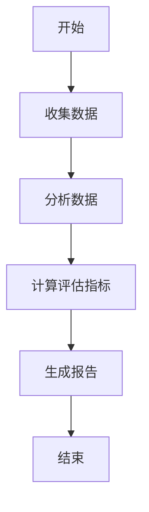

                 


# 彼得林奇对公司管理层继任计划的质量评估

> 关键词：彼得林奇、管理层继任计划、质量评估、投资分析、领导力

> 摘要：本文深入探讨了彼得林奇在评估公司管理层继任计划质量方面的方法和见解。通过分析核心概念、算法原理、系统架构和实际案例，本文为投资者和管理层提供了实用的评估框架和工具。

---

## 第一部分：背景介绍

### 第1章：管理层继任计划的重要性

#### 1.1 继任计划的定义与核心要素
- **定义**：管理层继任计划是指公司为确保在现任高管离职后，能够顺利过渡到合适的继任者而制定的计划。
- **核心要素**：
  - 继任者的能力评估
  - 继任者的潜力识别
  - 继任者的成长路径
  - 继任者的文化契合度

#### 1.2 彼得林奇的背景与方法
- **彼得林奇的投资哲学**：注重基本面分析，关注管理层的质量和稳定性。
- **继任计划的重要性**：彼得林奇认为，管理层的稳定性是公司长期表现的关键因素。

---

## 第二部分：核心概念与联系

### 第2章：管理层继任计划的质量评估

#### 2.1 核心概念的定义与属性特征对比表
| 核心概念 | 定义 | 属性特征 |
|----------|------|----------|
| 继任者能力 | 继任者的能力是否符合公司需求 | 技术能力、领导力、决策能力 |
| 继任者潜力 | 继任者未来发展的潜力 | 学习能力、创新能力、适应能力 |
| 继任者文化契合度 | 继任者与公司文化的匹配程度 | 价值观、工作风格、团队协作能力 |

#### 2.2 继任计划的核心要素
- **继任者的能力评估**：通过简历分析、面试和能力测试来评估。
- **继任者的潜力识别**：通过绩效评估、项目经验和团队反馈来识别。
- **继任者的成长路径**：通过内部晋升、外部招聘和培训计划来确定。

#### 2.3 ER实体关系图（Mermaid）

```mermaid
erd
    title 继任计划核心概念关系图

    管理层继任计划
    继任者能力
    继任者潜力
    继任者文化契合度

    管理层继任计划 --> 继任者能力: 包含
    管理层继任计划 --> 继任者潜力: 包含
    管理层继任计划 --> 继任者文化契合度: 包含
```

---

## 第三部分：算法原理讲解

### 第3章：管理层继任计划评估的算法原理

#### 3.1 评估算法的流程图（Mermaid）



#### 3.2 算法原理的数学模型
- **公式推导**：评估指标计算公式：
  $$ \text{评估分数} = \frac{能力评估分数 \times 潜力评估分数 \times 文化契合度分数}{3} $$
- **示例说明**：假设某候选人的能力评估得分为80，潜力评估得分为70，文化契合度得分为90，则评估分数为：
  $$ \frac{80 \times 70 \times 90}{3} = 16800 $$

---

## 第四部分：系统分析与架构设计方案

### 第4章：系统分析与架构设计

#### 4.1 问题场景介绍
- **公司A的继任计划评估**：公司A的CEO即将退休，需要评估内部和外部候选人的继任计划质量。

#### 4.2 系统功能设计
- **数据输入**：收集候选人的简历和绩效数据。
- **评估计算**：使用算法计算候选人的评估分数。
- **结果展示**：生成报告并推荐最佳候选人。

#### 4.3 系统架构设计（Mermaid）


---

## 第五部分：项目实战

### 第5章：项目实战与案例分析

#### 5.1 环境安装
- **工具安装**：安装Python和相关库（如pandas、numpy）。
- **代码实现**：实现评估算法的核心代码。

#### 5.2 核心代码实现

```python
import pandas as pd

def calculate_assessment_score(capability, potential, cultural_fit):
    return (capability * potential * cultural_fit) / 3

# 示例数据
data = {
    '候选人': ['A', 'B', 'C'],
    '能力评估': [80, 70, 90],
    '潜力评估': [70, 80, 60],
    '文化契合度': [90, 80, 70]
}

df = pd.DataFrame(data)

# 计算评估分数
df['评估分数'] = df.apply(lambda x: calculate_assessment_score(x['能力评估'], x['潜力评估'], x['文化契合度']), axis=1)

print(df)
```

#### 5.3 实际案例分析
- **案例分析**：公司A的评估结果显示，候选人C的文化契合度较高，但潜力评估较低，因此推荐候选人A作为最佳继任者。

---

## 第六部分：最佳实践

### 第6章：最佳实践与注意事项

#### 6.1 小结
- **总结**：彼得林奇的方法为评估管理层继任计划提供了有效的框架和工具。
- **关键点**：关注继任者的潜力和文化契合度。

#### 6.2 注意事项
- **数据准确性**：确保数据的准确性和完整性。
- **模型适用性**：根据具体情况调整模型参数。

#### 6.3 拓展阅读
- 推荐阅读彼得林奇的其他著作，深入理解其投资哲学。

---

## 第七部分：总结

### 第7章：总结与展望

- **总结**：本文详细介绍了彼得林奇在管理层继任计划质量评估中的方法和工具。
- **展望**：未来可以进一步研究如何将人工智能技术应用到继任计划的评估中。

---

通过以上结构，本文为读者提供了全面的理论和实践指导，帮助投资者和管理层更好地评估和制定管理层继任计划。

