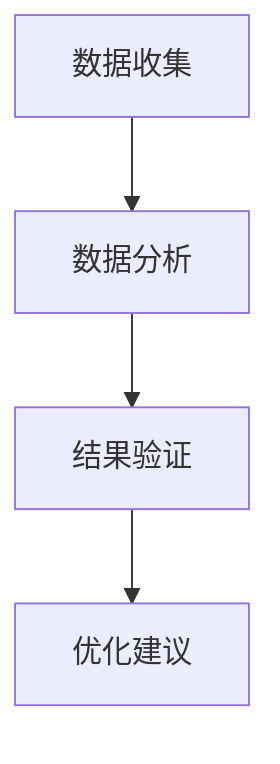
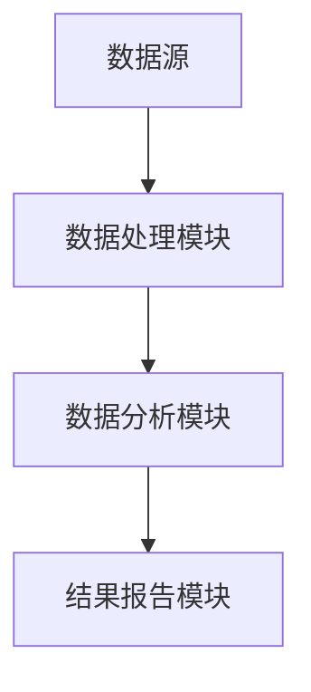
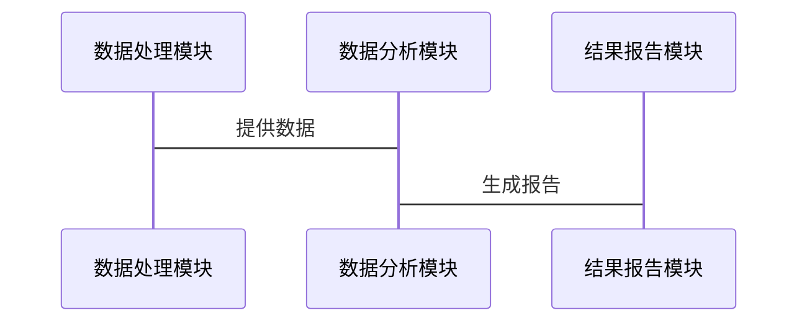

                 


# 彼得林奇对公司管理层薪酬结构的分析

## 关键词：彼得·林奇，管理层薪酬结构，股权激励，绩效奖金，投资分析

## 摘要：本文从投资者的角度，深入分析了彼得·林奇对公司管理层薪酬结构的见解。通过探讨薪酬结构的核心概念、分析框架、系统设计和实际案例，揭示了薪酬结构对企业发展和股东价值的影响。文章结合理论与实践，提出了优化薪酬结构的建议，并给出了具体的实施步骤和代码示例。

---

# 第一部分：引言

## 1.1 研究背景

随着企业规模的不断扩大，管理层的薪酬结构逐渐成为影响公司绩效和股东价值的重要因素。彼得·林奇作为全球著名投资专家，其独特的分析方法为投资者提供了全新的视角。本文将从彼得·林奇的投资理念出发，探讨管理层薪酬结构的优化策略。

## 1.2 研究目标

本文旨在通过分析彼得·林奇的薪酬结构分析方法，揭示其对企业发展的影响，并为企业提供优化建议。

---

# 第二部分：理论基础

## 2.1 管理层薪酬结构的核心概念

### 2.1.1 股权激励

股权激励是管理层薪酬的重要组成部分，通过持有公司股份，管理层的利益与公司股东的利益紧密绑定。其特点包括：

- **长期性**：激励效果持续时间长，减少短期行为。
- **风险共担**：管理层与股东共同承担市场风险。

### 2.1.2 绩效奖金

绩效奖金是基于管理层绩效表现的奖励机制。其特点包括：

- **激励性**：与绩效挂钩，激发管理层积极性。
- **灵活性**：可以根据公司绩效调整奖金池。

### 2.1.3 固定薪资

固定薪资是管理层的基本收入来源。其特点包括：

- **稳定性**：收入来源较为稳定。
- **基础性**：是薪酬结构的基础部分。

## 2.2 薪酬结构的构成要素

下表展示了管理层薪酬结构的构成要素及其特点对比：

| 构成要素 | 特点 |
|----------|------|
| 股权激励 | 长期性、风险共担 |
| 绩效奖金 | 激励性、灵活性 |
| 固定薪资 | 稳定性、基础性 |

## 2.3 薪酬结构的数学模型

为了量化分析，我们引入以下数学模型：

$$
\text{总薪酬} = a \times \text{股权激励} + b \times \text{绩效奖金} + c \times \text{固定薪资}
$$

其中，$$a$$、$$b$$、$$c$$为各构成要素的权重，且满足$$a + b + c = 1$$。

---

# 第三部分：分析框架

## 3.1 分析步骤

### 3.1.1 数据收集

收集公司管理层的薪酬结构数据，包括股权激励、绩效奖金和固定薪资。

### 3.1.2 数据分析

利用数学模型和数据分析工具，评估薪酬结构的合理性。

### 3.1.3 结果验证

通过实际案例验证分析结果的有效性。

## 3.2 分析框架的流程图



---

# 第四部分：系统分析与设计

## 4.1 系统功能设计

设计一个用于分析管理层薪酬结构的系统，包括数据收集、分析和报告生成功能。

## 4.2 系统架构图



## 4.3 系统接口设计

定义系统接口，确保各模块之间的数据交互顺畅。

## 4.4 系统交互流程



---

# 第五部分：项目实战

## 5.1 环境配置

安装必要的工具和库，如Python、Pandas、Matplotlib。

## 5.2 数据收集与处理

收集并整理管理层薪酬数据，进行清洗和预处理。

## 5.3 代码实现

以下是Python代码示例：

```python
import pandas as pd

# 数据加载
df = pd.read_csv('compensation.csv')

# 数据清洗
df.dropna(inplace=True)

# 绩效评估
performance = df['绩效指标'].apply(lambda x: x * 0.5 + 5)
df['绩效奖金'] = performance

# 结果输出
print(df.head())
```

## 5.4 结果分析

通过分析代码结果，评估薪酬结构的合理性，并提出优化建议。

---

# 第六部分：总结与最佳实践

## 6.1 关键点回顾

- 股权激励是薪酬结构的核心要素。
- 绩效奖金是激发管理层积极性的重要手段。
- 固定薪资是薪酬结构的基础部分。

## 6.2 最佳实践

- 定期评估薪酬结构的合理性。
- 根据公司绩效调整薪酬结构。
- 结合彼得·林奇的分析方法优化薪酬结构。

## 6.3 注意事项

- 薪酬结构的设计需兼顾短期与长期目标。
- 避免过度依赖单一构成要素。
- 定期更新和优化薪酬结构。

## 6.4 拓展阅读

- 彼得·林奇的《投资最重要的事情》
- 其他相关投资分析书籍

---

# 结语

通过本文的分析，我们深入了解了彼得·林奇对管理层薪酬结构的见解，并结合实际案例和系统设计，提出了优化建议。希望本文能为投资者和企业管理者提供有价值的参考。

