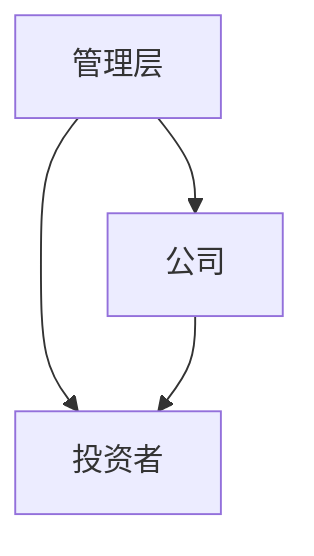
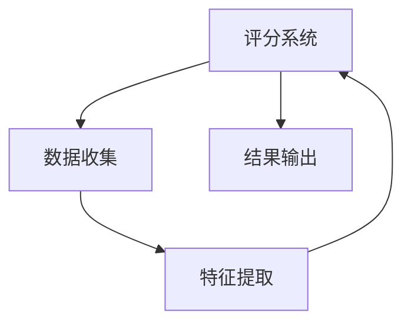
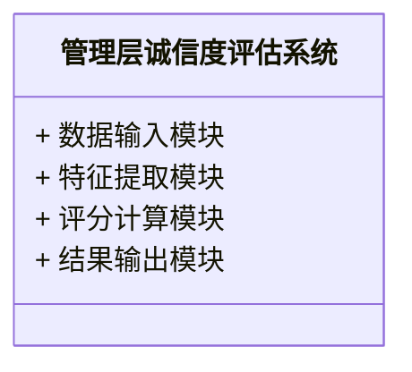
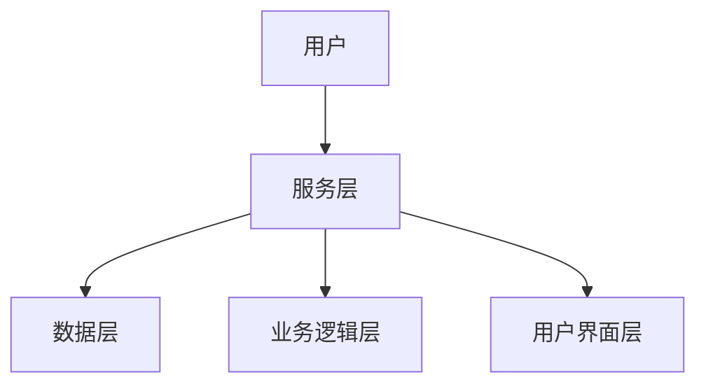
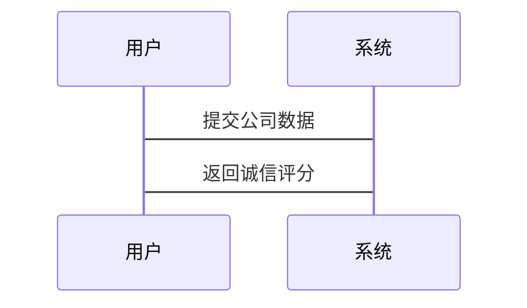

                 


# 彼得林奇对公司管理层诚信度的判断

> 关键词：彼得林奇，管理层诚信度，投资决策，财务数据分析，公司治理

> 摘要：本文详细探讨了彼得·林奇如何通过财务数据分析和公司治理评估来判断管理层的诚信度，分析了诚信度对投资决策的影响，并结合实际案例和系统架构，提出了具体的评估方法和实践建议。

---

## 第1章: 背景介绍

### 1.1 问题背景
#### 1.1.1 投资者与管理层之间的信息不对称
在金融市场中，投资者与公司管理层之间存在显著的信息不对称。管理层掌握着公司的内部信息，而投资者则依赖公开披露的数据进行决策。这种不对称可能导致投资者无法准确评估管理层的诚信度，进而影响投资决策的准确性。

#### 1.1.2 管理层诚信度对投资决策的影响
管理层的诚信度直接关系到公司的长期发展和股东价值。诚信的管理层更有可能遵循透明和负责任的决策，而诚信度低的管理层可能通过财务造假或其他不当行为损害投资者利益。

#### 1.1.3 企业治理中的信任问题
信任是企业治理的核心要素之一。管理层的诚信度不仅影响公司的运营效率，还会影响投资者对公司价值的评估。缺乏信任的管理层可能导致公司治理失效，进而影响企业的长期发展。

### 1.2 问题描述
#### 1.2.1 管理层诚信度的定义与内涵
管理层诚信度是指管理层在决策和行为中表现出的诚实、透明和负责任的程度。它不仅包括管理层的道德品质，还包括其在经营活动中遵循诚信原则的能力。

#### 1.2.2 彼得林奇的投资者视角
彼得·林奇作为著名基金经理，强调通过深入分析公司基本面和管理层行为来评估投资价值。他认为，管理层的诚信度是影响公司长期表现的重要因素，因此在投资决策中需要特别关注。

#### 1.2.3 管理层诚信度的核心要素
管理层诚信度的核心要素包括：财务透明度、信息披露的及时性、管理层行为的合规性以及管理层与股东的利益一致性。

### 1.3 问题解决
#### 1.3.1 通过财务数据判断诚信度的方法
通过分析财务报表中的关键指标，如收入确认、成本控制、关联交易等，可以初步判断管理层的诚信度。例如，异常的财务数据可能表明管理层存在财务造假行为。

#### 1.3.2 管理层行为与企业价值的关系
管理层的决策和行为直接影响企业的财务表现和市场价值。诚信的管理层通常会采取稳健的经营策略，而诚信度低的管理层可能通过短期行为追求市场炒作，损害企业长期价值。

#### 1.3.3 诚信度评估的边界与外延
诚信度评估的边界在于管理层的个人行为与公司整体表现之间的关系。外延则包括公司治理结构、内部控制机制以及外部监管环境等因素。

### 1.4 概念结构与核心要素组成
#### 1.4.1 诚信度的多维度分析
诚信度可以从多个维度进行分析，包括财务透明度、信息披露的及时性、管理层行为的合规性以及与股东利益的一致性。

#### 1.4.2 核心要素的权重分配
在评估管理层诚信度时，需要根据具体情况对各个核心要素赋予不同的权重。例如，财务透明度可能占据较大权重，而管理层行为的合规性则次之。

#### 1.4.3 概念结构的可视化展示
通过图表可以更直观地展示管理层诚信度的概念结构。例如，可以用层次结构图展示诚信度的各个维度及其权重分配。

---

## 第2章: 核心概念与联系

### 2.1 管理层诚信度的核心属性
#### 2.1.1 透明性
透明性是管理层诚信度的核心属性之一。诚信的管理层会主动披露公司的财务状况和经营信息，增强投资者的信任。

#### 2.1.2 责任感
责任感是管理层诚信度的另一个重要属性。诚信的管理层会以负责任的态度管理公司资源，确保股东利益最大化。

#### 2.1.3 行为一致性
行为一致性是指管理层在决策和行动中表现出的一致性。诚信的管理层会始终坚持道德和法律规范，避免短期行为。

### 2.2 核心概念对比表格
以下是诚信与不诚信管理层的特征对比：

| 特征                | 诚信管理层                  | 不诚信管理层                 |
|---------------------|-----------------------------|-----------------------------|
| 财务透明度          | 高                          | 低                          |
| 信息披露及时性      | 高                          | 低                          |
| 管理层行为合规性    | 合规                        | 不合规                      |
| 与股东利益一致性    | 高                          | 低                          |

### 2.3 ER实体关系图
以下是管理层诚信度评估的实体关系图：



---

## 第3章: 算法原理

### 3.1 管理层诚信度评估算法
以下是管理层诚信度评估算法的流程图：



### 3.2 数学模型与公式
#### 3.2.1 诚信评分公式
$$ \text{诚信评分} = \sum_{i=1}^{n} w_i \cdot f_i $$
其中，$w_i$ 是第 $i$ 个特征的权重，$f_i$ 是第 $i$ 个特征的评分。

#### 3.2.2 示例
假设我们有三个特征：财务透明度（权重0.4）、信息披露及时性（权重0.3）、管理层行为合规性（权重0.3）。假设财务透明度评分为0.8，信息披露及时性评分为0.7，管理层行为合规性评分为0.6。则诚信评分为：
$$ 0.4 \times 0.8 + 0.3 \times 0.7 + 0.3 \times 0.6 = 0.32 + 0.21 + 0.18 = 0.71 $$

---

## 第4章: 系统分析与架构设计

### 4.1 系统功能设计
以下是管理层诚信度评估系统的功能模块：



### 4.2 系统架构设计
以下是管理层诚信度评估系统的架构图：



### 4.3 系统接口设计
以下是系统接口设计的示例：



---

## 第5章: 项目实战

### 5.1 环境安装
需要安装以下工具：
- Python
- Pandas
- NumPy
- Matplotlib

### 5.2 核心实现源代码
以下是管理层诚信度评估系统的Python代码示例：

```python
import pandas as pd
import numpy as np

# 数据输入
data = pd.DataFrame({
    '财务透明度': [0.8, 0.6, 0.7],
    '信息披露及时性': [0.7, 0.5, 0.6],
    '管理层行为合规性': [0.6, 0.4, 0.5]
})

# 权重分配
weights = pd.Series({'财务透明度': 0.4, '信息披露及时性': 0.3, '管理层行为合规性': 0.3})

# 评分计算
scores = data.dot(weights)

# 结果输出
print(scores)
```

### 5.3 案例分析
以某公司为例，分析其管理层诚信度。假设公司财务数据如下：
- 营业收入：100万元
- 净利润：20万元
- 关联交易金额：50万元

通过分析关联交易金额占总收入的比例（50%），可以初步判断管理层可能存在财务造假行为。

---

## 第6章: 最佳实践

### 6.1 小结
管理层诚信度是影响公司价值和投资决策的重要因素。通过财务数据分析和系统评估，可以有效判断管理层的诚信度。

### 6.2 注意事项
- 数据收集的准确性和完整性
- 权重分配的合理性
- 算法的可解释性和适用性

### 6.3 拓展阅读
- 彼得·林奇的《投资圣经》
- 公司治理相关书籍

---

## 结论

通过本文的详细分析，我们可以看出，彼得·林奇的管理层诚信度评估方法为我们提供了一个系统化的投资决策框架。通过结合财务数据分析和系统架构设计，我们可以更准确地评估管理层的诚信度，从而做出更明智的投资决策。

