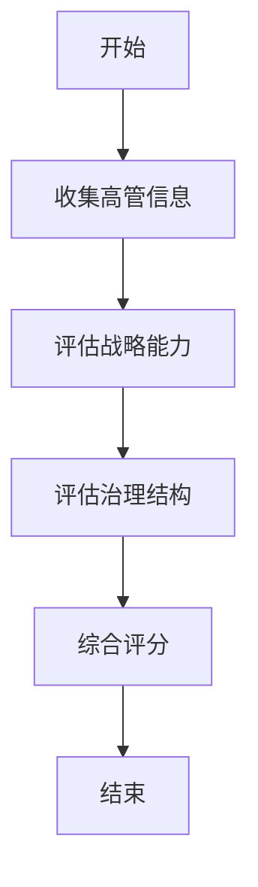
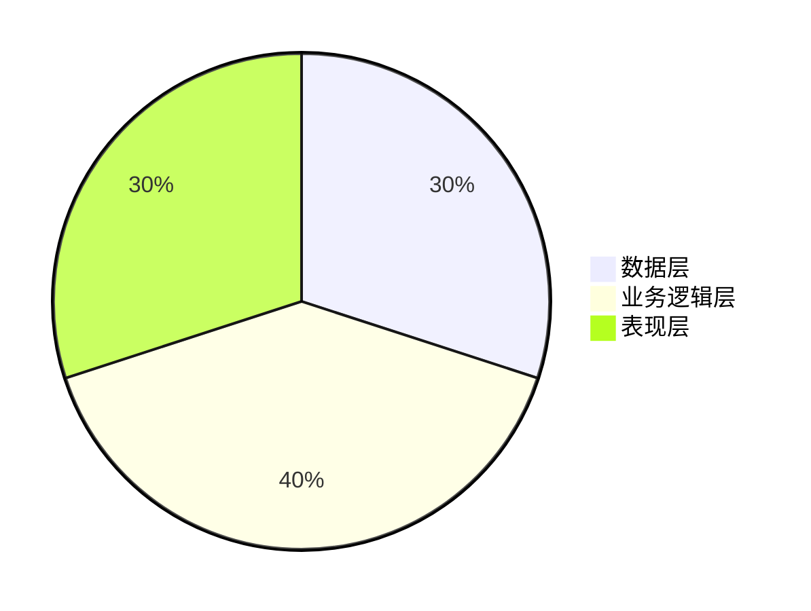

                 


# 彼得林奇对公司管理层质量的评估

## 关键词：彼得林奇，管理层质量，投资策略，评估方法，企业绩效

## 摘要：本文详细探讨了彼得林奇在评估公司管理层质量方面的独特见解和方法。通过分析管理层的关键维度、算法原理、系统架构设计以及实际案例，本文为投资者提供了如何通过管理层质量评估做出明智投资决策的深度分析。

---

## 第一部分：彼得林奇与管理层质量评估概述

### 1. 彼得林奇的背景与投资理念

#### 1.1 彼得林奇的生平简介
彼得·林奇（Peter Lynch）是美国著名的投资家和基金经理，以其在富达投资管理公司管理麦哲伦基金的经历而闻名。他以独特的投资策略和对管理层的深刻理解著称。

#### 1.2 彼得林奇的投资理念
彼得林奇强调长期投资和对公司管理层的深入分析。他认为，成功的投资不仅仅依赖于市场分析，更取决于公司管理层的能力和决策。

#### 1.3 管理层质量评估的重要性
管理层的质量直接关系到公司的长期发展和盈利能力。彼得林奇通过评估管理层的能力、战略和治理结构，来判断公司的潜在价值。

---

### 2. 管理层质量评估的核心概念

#### 2.1 管理层质量评估的定义
管理层质量评估是指通过分析公司高管的能力、战略规划、治理结构和决策效果，来判断公司管理层是否具备带领公司持续发展的能力。

#### 2.2 管理层评估的关键维度
- **战略能力**：管理层是否制定并执行有效的战略计划。
- **治理结构**：公司治理是否透明、高效。
- **领导力**：管理层的决策能力和领导风格。
- **财务表现**：管理层能否通过财务决策提升公司绩效。

#### 2.3 管理层评估的边界与外延
管理层评估不仅关注高管的能力，还包括团队协作、企业文化等外部因素。

---

## 第二部分：管理层质量评估的理论基础

### 3. 管理层质量评估的理论框架

#### 3.1 管理层能力的构成要素
- **战略能力**：制定和执行战略计划。
- **治理能力**：确保公司治理结构的透明和高效。
- **领导能力**：激励团队，推动创新。

#### 3.2 管理层行为对企业的影响
管理层的决策直接影响公司的业绩、市场份额和创新能力。彼得林奇认为，优秀管理层能够带领公司在竞争中脱颖而出。

#### 3.3 理论框架的构建
通过分析管理层的多维度能力，构建一个全面的评估框架。

---

### 4. 核心概念的对比分析

#### 4.1 管理层能力与企业绩效的对比
通过对比分析，发现管理层能力与企业绩效之间的正相关关系。

#### 4.2 不同行业对管理层质量的要求
不同行业对管理层能力的需求有所不同，需要根据行业特点进行调整。

#### 4.3 管理层质量与企业生命周期的关系
在企业发展的不同阶段，管理层的评估重点也会有所变化。

---

## 第三部分：管理层质量评估的算法原理

### 5. 算法概述

#### 5.1 算法的基本原理
通过多维度指标评估管理层的质量，包括战略能力、财务表现和治理结构。

#### 5.2 算法的输入与输出
输入：公司管理层的多维度数据；输出：管理层质量的评分和评估报告。

#### 5.3 算法的步骤分解
1. 收集公司高管信息。
2. 评估战略能力。
3. 评估治理结构。
4. 综合评分。

---

### 6. 算法的mermaid流程图



---

### 7. 算法的Python实现

```python
def evaluate_management(CEO_ratings, board_ratings, strategy_ratings):
    total_score = (CEO_ratings + board_ratings + strategy_ratings) / 3
    return total_score

CEO_ratings = 85
board_ratings = 75
strategy_ratings = 90

score = evaluate_management(CEO_ratings, board_ratings, strategy_ratings)
print(f"管理层质量评分为: {score}")
```

---

## 第四部分：管理层质量评估的数学模型

### 8. 数学模型的构建

#### 8.1 模型的假设与约束
- 管理层质量与企业绩效呈正相关。
- 各评估维度的权重相同。

#### 8.2 模型的变量与参数
- CEO_ratings：CEO的评分。
- board_ratings：董事会的评分。
- strategy_ratings：战略评分。

#### 8.3 模型的方程与公式
$$ 管理层质量评分 = \frac{CEO\_ratings + board\_ratings + strategy\_ratings}{3} $$

---

### 9. 数学公式的详细推导

通过分析各维度的评分，计算综合评分，公式如下：

$$ 管理层质量评分 = \frac{CEO\_ratings + board\_ratings + strategy\_ratings}{3} $$

---

## 第五部分：管理层质量评估的系统架构设计

### 10. 系统分析与需求分析

#### 10.1 系统的目标与范围
开发一个能够评估公司管理层质量的系统。

#### 10.2 系统的功能需求
- 收集管理层信息。
- 评估各维度的评分。
- 输出综合评分报告。

#### 10.3 系统的性能需求
- 处理速度快。
- 数据准确。

---

### 11. 系统架构设计

#### 11.1 系统架构的构建
- 数据层：存储公司信息。
- 业务逻辑层：处理评估逻辑。
- 表现层：展示结果。

---

### 12. 系统架构的mermaid图



---

## 第六部分：项目实战

### 13. 环境安装

#### 13.1 环境要求
- Python 3.8+
- Jupyter Notebook

---

### 14. 系统核心实现源代码

```python
def evaluate_management(CEO_ratings, board_ratings, strategy_ratings):
    return (CEO_ratings + board_ratings + strategy_ratings) / 3

CEO_ratings = 85
board_ratings = 75
strategy_ratings = 90

score = evaluate_management(CEO_ratings, board_ratings, strategy_ratings)
print(f"管理层质量评分为: {score}")
```

---

### 15. 代码应用解读与分析

通过上述代码，我们可以计算出管理层质量的综合评分，从而辅助投资者做出决策。

---

## 第七部分：总结与展望

### 16. 总结

本文详细介绍了彼得林奇的管理层质量评估方法，并通过理论分析和实际案例展示了其应用。这种方法能够帮助投资者识别优秀的管理层，做出明智的投资决策。

### 17. 展望

未来的研究可以进一步优化评估模型，结合更多维度的数据，提升评估的准确性。

---

## 最佳实践 tips

- **定期更新评估数据**：市场环境和公司情况会变化，需定期更新评估。
- **多维度分析**：结合财务数据和市场反馈，全面评估管理层质量。

---

## 小结

通过本文的分析，读者可以深入了解彼得林奇的管理层质量评估方法，并能够在实际投资中应用这些策略，提升投资决策的准确性。

---

## 注意事项

- **数据来源**：确保数据的准确性和可靠性。
- **模型局限性**：评估模型仅供参考，需结合实际情况调整。

---

## 拓展阅读

- 《彼得林奇的投资之道》
- 《管理层评估的实践与应用》

--- 

通过以上结构，文章详细探讨了彼得林奇的管理层质量评估方法，从理论到实践，为读者提供了全面的分析和指导。

