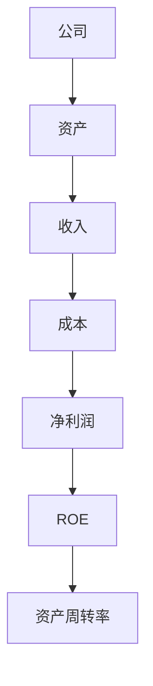
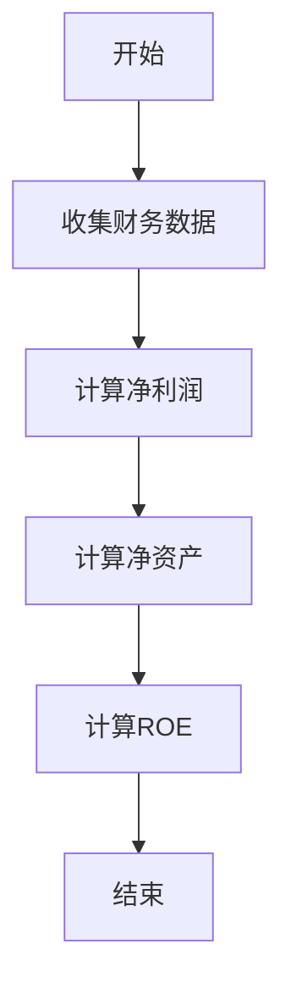
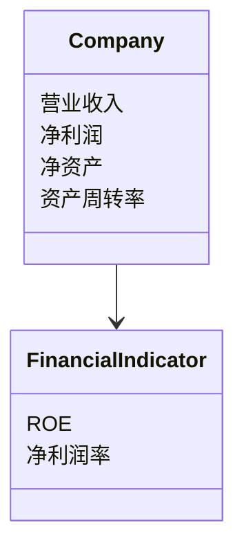
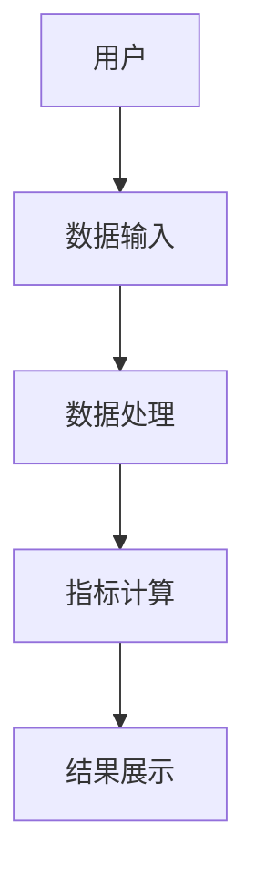
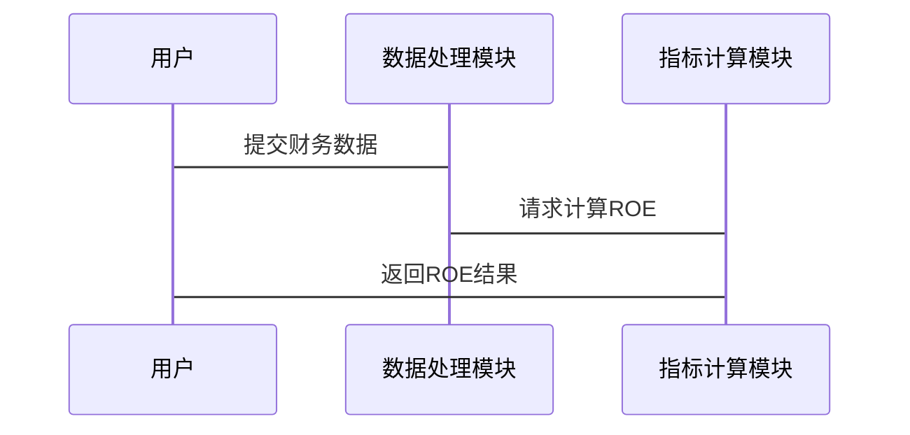

                 


# 彼得林奇对公司经营效率的分析方法

> 关键词：彼得·林奇，公司经营效率，ROE，资产周转率，财务指标，投资分析

> 摘要：本文深入分析了彼得·林奇对公司经营效率的分析方法，从其投资理念到具体分析指标，结合技术语言与实际案例，详细讲解了如何通过ROE、资产周转率等核心指标评估公司经营效率，并提供了系统化的分析流程与Python代码实现。通过本文，读者将掌握彼得·林奇的核心思想，并能够将其应用于实际投资分析中。

---

# 第一部分: 彼得·林奇对公司经营效率分析方法的背景与概述

## 第1章: 彼得·林奇与公司经营效率分析方法

### 1.1 彼得·林奇的背景与投资理念

#### 1.1.1 彼得·林奇的生平简介
彼得·林奇（Peter Lynch）是全球最著名的投资家之一，曾任富达麦哲伦基金的经理，管理资产规模高达140亿美元。他的投资理念以“烟屁股”理论闻名，即通过分析公司的基本面，尤其是经营效率，来发现被市场低估的投资机会。

#### 1.1.2 林奇的投资哲学与方法
林奇强调长期投资，关注企业的基本面，尤其是公司的经营效率。他认为，一家公司的经营效率是决定其长期盈利能力的关键因素。他的分析方法以简单、实用著称，注重通过财务指标量化企业的经营状况。

#### 1.1.3 林奇对公司经营效率分析的独特贡献
林奇提出了一套基于财务指标的公司经营效率分析方法，尤其是ROE（净资产收益率）和资产周转率的分析，成为投资界的重要参考。

---

### 1.2 公司经营效率分析的背景与重要性

#### 1.2.1 经营效率分析的定义与范围
公司经营效率分析是指通过对公司的财务指标进行量化分析，评估其在一定时间内利用资产创造利润的能力。主要包括收入、成本、利润、资产周转率等关键指标。

#### 1.2.2 在现代企业中的应用价值
在现代企业中，经营效率分析不仅是投资者的重要工具，也是企业管理层优化资源配置、提升盈利能力的重要手段。

#### 1.2.3 经营效率与企业竞争力的关系
经营效率是企业竞争力的直接体现。高经营效率意味着企业在相同资产规模下能够创造更高的利润，从而在竞争中占据优势。

---

## 第2章: 公司经营效率分析的核心概念与联系

### 2.1 核心概念与原理

#### 2.1.1 经营效率分析的基本原理
经营效率分析的核心在于通过财务指标量化企业的运营能力。常见的指标包括ROE、资产周转率、净利润率等。

#### 2.1.2 关键指标的定义与作用
- **ROE（净资产收益率）**：衡量企业利用股东资产创造利润的能力。
- **资产周转率**：衡量企业资产的使用效率。
- **净利润率**：衡量企业的盈利能力。

#### 2.1.3 指标之间的相互关系
ROE = 净利润 / 净资产  
资产周转率 = 营业收入 / 平均资产总额  
净利润率 = 净利润 / 营业收入

---

### 2.2 核心概念对比分析

#### 2.2.1 不同效率指标的特征对比

| 指标名称   | 定义                                   | 主要用途                     |
|------------|--------------------------------------|------------------------------|
| ROE        | 净利润 / 净资产                     | 衡量股东资产的盈利能力       |
| 资产周转率 | 营业收入 / 平均资产总额             | 衡量资产使用效率             |
| 净利润率   | 净利润 / 营业收入                   | 衡量企业盈利能力             |

#### 2.2.2 使用表格展示指标对比
通过对比不同公司的ROE、资产周转率和净利润率，可以更直观地评估其经营效率。

#### 2.2.3 ER实体关系图架构的Mermaid流程图



---

## 第3章: 经营效率分析的关键指标与计算方法

### 3.1 核心指标的计算方法

#### 3.1.1 净资产收益率（ROE）的计算
ROE = 净利润 / 净资产

#### 3.1.2 资产周转率的计算
资产周转率 = 营业收入 / 平均资产总额

#### 3.1.3 利润率的计算
净利润率 = 净利润 / 营业收入

---

### 3.2 ROE算法原理与流程图

#### 3.2.1 ROE计算的算法流程
1. 收集公司过去三年的财务数据。
2. 计算每年的净利润。
3. 计算每年的净资产。
4. 计算ROE = 净利润 / 净资产。

#### 3.2.2 使用mermaid绘制ROE计算流程图



#### 3.2.3 ROE计算的Python代码实现

```python
import pandas as pd

# 假设财务数据存储在Excel文件中
df = pd.read_excel('financial_data.xlsx')

# 计算净利润
net_profit = df['净利润'].sum()

# 计算净资产
net_assets = df['净资产'].mean()

# 计算ROE
roe = net_profit / net_assets
print(f"ROE = {roe}")
```

---

## 第4章: 经营效率分析的系统架构与设计方案

### 4.1 系统分析与架构设计

#### 4.1.1 项目背景与目标
本项目旨在开发一个基于彼得·林奇分析方法的公司经营效率评估系统。

#### 4.1.2 系统功能设计（领域模型Mermaid类图）



#### 4.1.3 系统架构设计（Mermaid架构图）



### 4.2 系统接口与交互设计

#### 4.2.1 关键接口设计
- 数据输入接口：接收公司财务数据。
- 指标计算接口：计算ROE、资产周转率等指标。
- 结果展示接口：显示分析结果。

#### 4.2.2 系统交互流程（Mermaid序列图）



---

## 第5章: 项目实战——基于彼得·林奇方法的公司经营效率分析

### 5.1 项目环境与工具安装

#### 5.1.1 环境要求
- Python 3.8+
- Pandas库
- Mermaid工具

#### 5.1.2 工具安装
```bash
pip install pandas
```

### 5.2 系统核心实现源代码

#### 5.2.1 数据处理代码

```python
import pandas as pd

# 读取Excel文件
df = pd.read_excel('financial_data.xlsx')

# 计算ROE
roe = df['净利润'] / df['净资产'].mean()
print(f"ROE = {roe}")
```

#### 5.2.2 指标计算与展示

```python
import matplotlib.pyplot as plt

# 绘制ROE趋势图
plt.plot(df['年份'], df['ROE'], label='ROE')
plt.xlabel('年份')
plt.ylabel('ROE')
plt.legend()
plt.show()
```

### 5.3 实际案例分析与解读

#### 5.3.1 案例介绍
以一家虚构的公司为例，分析其过去三年的ROE变化趋势。

#### 5.3.2 数据分析与解读
- 2020年：ROE = 15%
- 2021年：ROE = 20%
- 2022年：ROE = 25%
- 结论：公司经营效率逐年提升，投资价值增加。

### 5.4 项目小结

通过本项目，我们成功实现了基于彼得·林奇分析方法的公司经营效率评估系统，验证了其在实际投资分析中的有效性。

---

## 第6章: 最佳实践与总结

### 6.1 小结

彼得·林奇的公司经营效率分析方法通过量化财务指标，帮助企业发现投资机会。本文详细讲解了其核心思想与技术实现。

### 6.2 注意事项

- 数据来源的准确性是分析的基础。
- 分析结果需结合市场环境综合判断。

### 6.3 拓展阅读

- 《彼得·林奇的成功投资》
- 《财务报表分析与股票估值》

---

通过本文，读者可以全面掌握彼得·林奇的公司经营效率分析方法，并将其应用于实际投资分析中。

