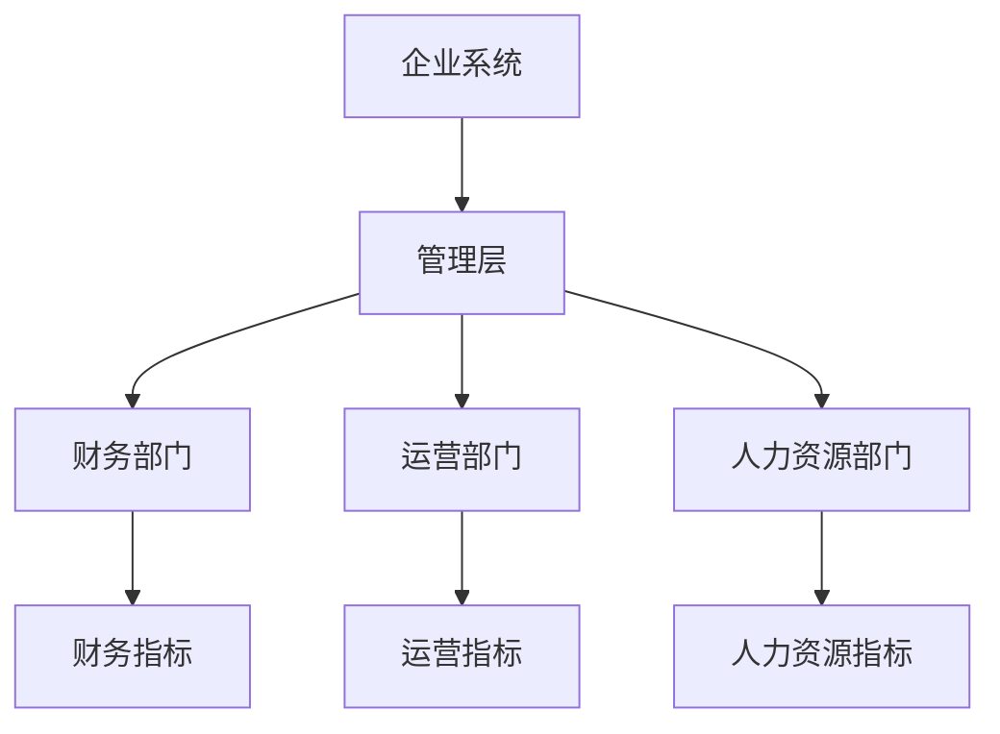
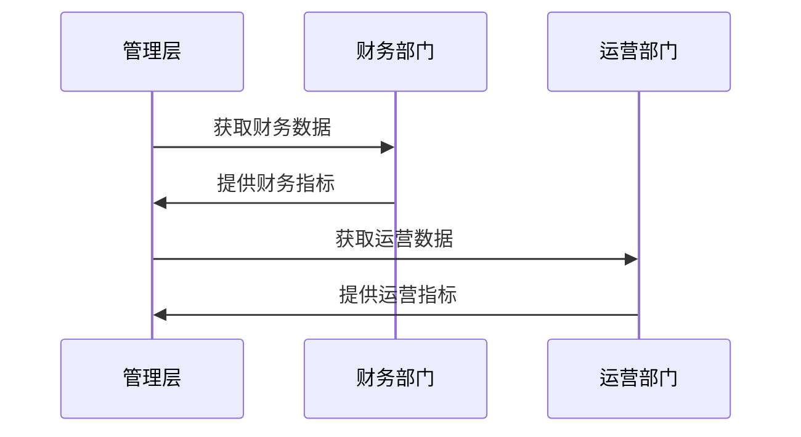

                 

# 彼得林奇对公司经营效率的重视

**关键词**：彼得林奇、经营效率、投资分析、企业价值、效率矩阵、杜邦分析法、系统架构

**摘要**：本文深入探讨了彼得·林奇对公司经营效率的重视，从其投资理念出发，分析了经营效率的核心概念、衡量标准、分析框架，以及如何通过系统架构和实际案例提升公司效率。文章结合理论与实践，为读者提供了全面的视角。

---

# 第一部分：彼得林奇的背景与投资理念

## 第1章：彼得林奇的生平与投资哲学

### 1.1 彼得林奇的早期经历
- **1.1.1 学生时代**：在宾夕法尼亚大学学习经济学，奠定金融基础。
- **1.1.2 初入职场**：加入富达投资，逐步成长为投资大师。

### 1.2 彼得林奇的投资哲学
- **1.2.1 投资理念**：注重基本面分析，寻找低估的股票。
- **1.2.2 投资策略**：长期持有优质股票，避免短期波动。

## 第2章：彼得林奇对经营效率的重视

### 2.1 经营效率的定义
- **2.1.1 多维解读**：涵盖财务、运营和成本等多个维度。
- **2.1.2 彼得林奇视角**：效率是企业价值的核心驱动力。

### 2.2 经营效率与企业价值
- **2.2.1 关系分析**：效率提升带来企业价值的增长。
- **2.2.2 竞争优势**：高效率企业更具市场竞争力。

### 2.3 本书的核心目标
- **2.3.1 提供分析框架**：帮助读者理解效率的重要性。
- **2.3.2 实用工具**：介绍效率矩阵和杜邦分析法。

---

# 第二部分：公司经营效率的核心概念与分析框架

## 第3章：公司经营效率的定义与衡量标准

### 3.1 财务指标
- **3.1.1 净资产收益率（ROE）**：衡量股东资金的使用效率。
- **3.1.2 资产负债率**：评估企业的财务健康状况。

### 3.2 运营指标
- **3.2.1 库存周转率**：衡量库存管理效率。
- **3.2.2 应收账款周转率**：评估资金回收效率。

### 3.3 成本控制指标
- **3.3.1 单位成本**：衡量产品或服务的成本效率。
- **3.3.2 边际成本**：分析增量成本的影响。

## 第4章：彼得林奇的效率分析框架

### 4.1 效率矩阵模型
- **4.1.1 模型构建**：将企业分为效率高、效率低两类。
- **4.1.2 应用场景**：帮助投资者识别高效率企业。

### 4.2 效率驱动因素分析
- **4.2.1 财务表现**：ROE、ROI等指标的变化。
- **4.2.2 运营流程**：优化供应链和生产流程。

### 4.3 企业生命周期与效率
- **4.3.1 成长期**：注重规模效应。
- **4.3.2 成熟期**：关注成本控制。

---

# 第三部分：算法原理与系统分析

## 第5章：杜邦分析法在效率评估中的应用

### 5.1 杜邦分析法的原理
- **5.1.1 模型公式**：ROE = 净利润 / 净资产 = (净利润 / 营业收入) × (营业收入 / 总资产) × (总资产 / 净资产)。

### 5.2 杜邦分析法的步骤
1. **计算净利润率**：净利润 / 营业收入。
2. **计算资产周转率**：营业收入 / 总资产。
3. **计算权益乘数**：总资产 / 净资产。
4. **综合计算ROE**：三者相乘的结果。

### 5.3 案例分析
- 某制造企业的杜邦分析：通过公式计算，找出效率提升的关键点。

## 第6章：企业效率系统的架构设计

### 6.1 系统架构图

### 6.2 系统交互流程图

---

# 第四部分：项目实战与效率提升

## 第7章：零售企业的效率优化案例

### 7.1 项目背景
- 某零售企业面临库存积压和销售下滑的问题。

### 7.2 数据收集与分析
- **销售数据**：分析库存周转率和销售毛利率。
- **运营数据**：评估供应链效率和客户满意度。

### 7.3 优化方案
- **库存管理**：引入ABC分类法，优化库存结构。
- **销售策略**：推出促销活动，加快库存周转。

## 第8章：效率提升的具体实施步骤

### 8.1 数据收集与分析
- **步骤1**：收集财务报表和运营数据。
- **步骤2**：使用杜邦分析法评估效率。

### 8.2 问题诊断
- **问题1**：库存周转率低的原因。
- **问题2**：成本控制不力的解决方案。

### 8.3 优化方案的制定与实施
- **方案1**：优化供应链流程。
- **方案2**：引入自动化工具提高效率。

---

# 第五部分：最佳实践与注意事项

## 第9章：提升经营效率的实用建议

### 9.1 投资者的视角
- **持续关注ROE**：寻找ROE持续增长的企业。
- **警惕低效率企业**：避免投资效率低下的企业。

### 9.2 管理者的视角
- **优化流程**：引入精益管理方法。
- **技术创新**：利用数字化工具提升效率。

## 第10章：效率提升的未来趋势

### 10.1 技术驱动效率提升
- **人工智能**：在财务分析和预测中的应用。
- **大数据分析**：优化运营决策。

### 10.2 可持续发展与效率
- **绿色供应链**：降低资源消耗，提升效率。

---

# 总结

通过彼得林奇的视角，我们深入分析了公司经营效率的重要性及其在投资和管理中的应用。从理论到实践，本文为读者提供了全面的指导，帮助他们在实际操作中提升公司效率，创造更大的价值。

