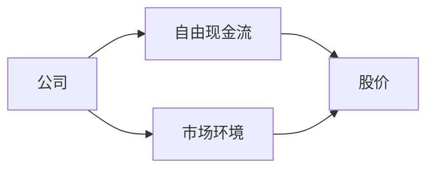

                 


# 彼得林奇对公司自由现金流与股价相关性的动态分析

## 关键词：彼得林奇，自由现金流，股价，相关性，动态分析

## 摘要：  
本文深入分析了彼得·林奇在投资学中对公司自由现金流与股价相关性的动态分析方法。通过数学建模、算法原理和系统设计，详细阐述了如何基于自由现金流预测股价的变化趋势，并结合实际案例进行了实战分析。文章内容包括背景介绍、核心概念、算法原理、系统架构、项目实战和最佳实践等部分，帮助读者全面理解彼得林奇的分析框架和投资策略。

---

## 第一部分: 背景介绍

### 第1章: 自由现金流与股价相关性概述

#### 1.1 自由现金流的定义与计算
自由现金流（Free Cash Flow，简称FCF）是指公司在支付了运营成本、税费和资本支出之后剩余的现金流量。它是衡量企业财务健康状况的重要指标，也是投资者评估公司价值的关键依据。

- **自由现金流的公式**：  
  $$\text{FCF} = \text{EBIT} + \text{折旧与摊销} - \text{资本支出}$$  
  其中，EBIT是息税前利润，折旧与摊销是非现金支出，资本支出是用于维持或扩展生产能力的支出。

- **自由现金流的影响因素**：  
  1. 公司的盈利水平  
  2. 资本支出需求  
  3. 财务杠杆与税务政策  
  4. 行业特性与经济周期  

#### 1.2 股价与自由现金流的关系
股价反映了市场对公司的整体估值，而自由现金流是决定公司价值的核心因素之一。两者之间的相关性可以通过回归分析等方法量化。

- **股价的定义**：  
  股价是公司在股票市场上的交易价格，受市场情绪、公司基本面和宏观经济环境等多种因素影响。

- **自由现金流对股价的影响**：  
  公司产生更多的自由现金流，通常意味着更高的盈利能力和更强的偿债能力，从而可能推高股价。

---

### 第2章: 彼得·林奇的投资理念

#### 2.1 彼得·林奇的自由现金流分析框架
彼得·林奇是全球著名投资专家，他强调通过基本面分析来评估公司的内在价值。他认为，自由现金流是衡量公司财务健康状况的核心指标。

- **自由现金流在投资决策中的重要性**：  
  1. 自由现金流可以用于股息分配或再投资，直接关系到股东的收益。  
  2. 自由现金流越多，公司的抗风险能力越强。  
  3. 自由现金流的增长趋势反映了公司的长期发展潜力。

- **彼得·林奇的自由现金流评估方法**：  
  彼得·林奇通过分析公司的历史自由现金流和未来现金流预测，评估其内在价值。他通常采用自下而上的分析方法，即从具体公司入手，分析其财务状况和行业地位。

#### 2.2 彼得·林奇的股价分析方法
彼得·林奇认为，股价是市场对公司价值的反映，但短期内可能受到市场情绪的影响。通过动态分析自由现金流与股价的相关性，可以更好地捕捉投资机会。

- **动态分析的核心思想**：  
  自由现金流的变化会逐步反映到股价上，但这个过程可能会受到市场参与者情绪的影响，存在一定的滞后性。

- **动态分析的步骤**：  
  1. 收集公司历史财务数据，计算自由现金流。  
  2. 建立股价与自由现金流的回归模型，量化相关性。  
  3. 通过时间序列分析，研究两者之间的动态关系。  
  4. 结合行业趋势和宏观经济环境，调整分析结果。

---

## 第二部分: 核心概念与联系

### 第3章: 自由现金流与股价相关性的数学模型

#### 3.1 自由现金流与股价相关性的回归分析
回归分析是研究自由现金流与股价相关性的重要工具。通过线性回归模型，可以量化自由现金流对股价的影响程度。

- **线性回归模型**：  
  $$y = \beta_0 + \beta_1x + \epsilon$$  
  其中，$y$代表股价，$x$代表自由现金流，$\beta_0$是截距，$\beta_1$是回归系数，$\epsilon$是误差项。

- **回归系数的经济意义**：  
  回归系数$\beta_1$表示自由现金流每增加1单位，股价的预期变化量。如果$\beta_1$为正，说明自由现金流与股价正相关。

#### 3.2 自由现金流与股价相关性的动态模型
时间序列分析可以帮助我们研究自由现金流与股价之间的动态关系，特别是它们的变化趋势。

- **时间序列分析模型**：  
  使用ARIMA（自回归积分滑动平均模型）等方法，可以捕捉自由现金流与股价之间的动态依赖关系。

- **协整分析**：  
  协整分析用于研究自由现金流与股价之间的长期均衡关系。如果两个变量协整，说明它们之间存在一种稳定的长期关系。

---

### 第4章: 自由现金流与股价相关性的实体关系图

#### 4.1 实体关系图
以下是一个简单的实体关系图，展示了公司、自由现金流和股价之间的关系：



#### 4.2 动态分析流程图
以下是一个动态分析的流程图：


---

## 第三部分: 算法原理讲解

### 第5章: 自由现金流与股价相关性的算法原理

#### 5.1 线性回归模型的实现
以下是使用Python实现线性回归模型的代码示例：

```python
import numpy as np
from sklearn.linear_model import LinearRegression

# 假设我们有历史数据，包括自由现金流（x）和股价（y）
x = np.array([100, 120, 150, 180, 200]).reshape(-1, 1)
y = np.array([50, 60, 70, 80, 90])

# 创建线性回归模型
model = LinearRegression()
model.fit(x, y)

# 回归系数
beta_0 = model.intercept_
beta_1 = model.coef_[0]

print(f"截距：{beta_0}")
print(f"回归系数：{beta_1}")
```

#### 5.2 时间序列分析模型的实现
以下是使用Python实现ARIMA模型的代码示例：

```python
from statsmodels.tsa.arima.model import ARIMA

# 假设我们有自由现金流（x）和股价（y）的历史数据
# 这里以股价为例，假设我们想预测未来股价
y = np.array([50, 60, 70, 80, 90, 100])

# 创建ARIMA模型
model = ARIMA(y, order=(1, 1, 1))
model_fit = model.fit()

# 预测未来一步的股价
forecast = model_fit.forecast(steps=1)
print(f"预测股价：{forecast[0]}")
```

---

## 第四部分: 项目实战

### 第6章: 自由现金流与股价相关性的项目实战

#### 6.1 环境安装
为了实现本文的算法，需要安装以下Python库：

```bash
pip install numpy scikit-learn statsmodels mermaid4jupyter
```

#### 6.2 核心代码实现
以下是实现自由现金流与股价相关性动态分析的核心代码：

```python
import numpy as np
import pandas as pd
from sklearn.linear_model import LinearRegression
from statsmodels.tsa.arima.model import ARIMA
import matplotlib.pyplot as plt

# 示例数据：假设我们有一个包含自由现金流和股价的数据集
data = {
    'year': [2018, 2019, 2020, 2021, 2022],
    'free_cash_flow': [100, 120, 150, 180, 200],
    'stock_price': [50, 60, 70, 80, 90]
}

df = pd.DataFrame(data)

# 线性回归分析
x = df[['free_cash_flow']]
y = df['stock_price']
model = LinearRegression()
model.fit(x, y)
print("回归系数：", model.coef_[0])
print("截距：", model.intercept_)

# 时间序列分析
y_stock = df['stock_price'].values
model_arima = ARIMA(y_stock, order=(1, 1, 1))
model_arima_fit = model_arima.fit()
forecast = model_arima_fit.forecast(steps=1)
print("预测股价：", forecast[0])

# 可视化
plt.plot(df['year'], df['free_cash_flow'], label='Free Cash Flow')
plt.plot(df['year'], df['stock_price'], label='Stock Price')
plt.xlabel('Year')
plt.ylabel('Value')
plt.legend()
plt.show()
```

#### 6.3 案例分析
假设我们有一个公司的历史数据，包括自由现金流和股价。通过上述代码，我们可以：

1. 使用线性回归模型分析自由现金流与股价的相关性。  
2. 使用ARIMA模型预测未来股价的变化趋势。  
3. 将自由现金流和股价的变化趋势可视化，观察它们之间的动态关系。

---

## 第五部分: 总结与最佳实践

### 第7章: 总结与最佳实践

#### 7.1 小结
本文通过数学建模和算法实现，深入分析了彼得·林奇对公司自由现金流与股价相关性的动态分析方法。通过线性回归和时间序列分析，我们可以量化两者之间的相关性，并预测股价的变化趋势。

#### 7.2 最佳实践
1. 在实际投资中，建议结合行业趋势和宏观经济环境，对自由现金流与股价的相关性进行动态调整。  
2. 使用多种模型进行交叉验证，避免单一模型的偏差。  
3. 定期更新数据和模型，保持分析的实时性。

#### 7.3 注意事项
- 自由现金流与股价的相关性可能受到市场情绪和宏观经济环境的影响，分析时需结合具体情况。  
- 动态分析需要大量的历史数据和实时数据支持，确保模型的准确性和可靠性。

#### 7.4 拓展阅读
1. 《彼得·林奇的投资哲学》  
2. 《时间序列分析与应用》  
3. 《回归分析实战教程》  

---

通过本文的学习，读者可以掌握彼得·林奇的自由现金流与股价相关性分析方法，并将其应用到实际投资分析中。

