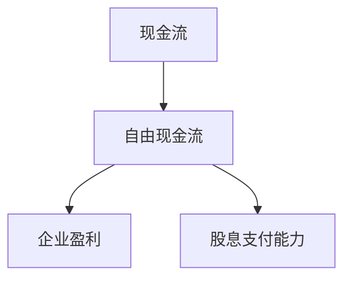
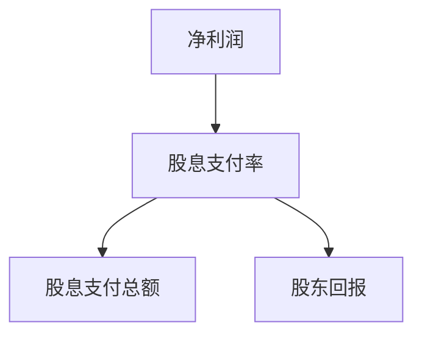
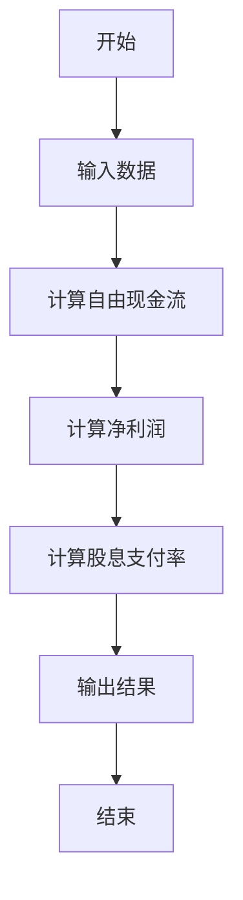
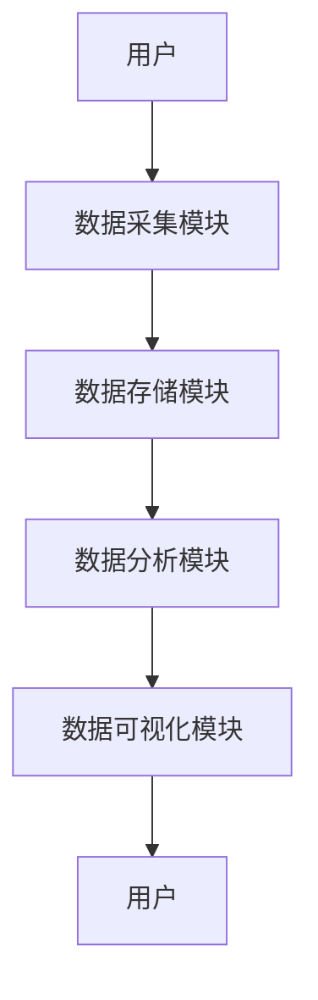
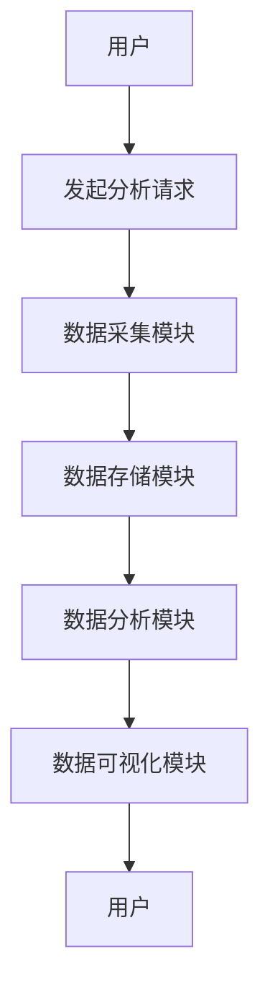

                 


# 彼得林奇对公司自由现金流与股息支付率关系的动态分析

## 关键词：彼得林奇，自由现金流，股息支付率，投资策略，财务分析，动态分析

## 摘要：本文从彼得林奇的投资理念出发，深入分析公司自由现金流与股息支付率之间的关系，探讨如何通过动态分析这两项指标来评估公司的财务健康状况和投资价值。文章结合理论与实践，提出了一种基于自由现金流和股息支付率的动态分析模型，并通过实际案例分析验证了该模型的有效性。

---

## 第一部分: 背景介绍

### 第1章: 自由现金流与股息支付率的基本概念

#### 1.1 自由现金流的定义与计算
自由现金流（Free Cash Flow，简称FCF）是指公司在扣除所有运营成本、税费和资本支出后的剩余现金流。它是衡量公司财务健康状况的重要指标，反映了公司产生现金的能力。

**计算公式：**
$$\text{自由现金流} = \text{营业收入} - \text{运营成本} - \text{税费} - \text{资本支出}$$

**属性特征对比表格：**

| 特性          | 自由现金流                  |
|---------------|-----------------------------|
| 计算基础      | 营业收入、运营成本、税费、资本支出 |
| 反映内容      | 公司产生现金的能力           |
| 影响因素      | 营收增长、成本控制、资本支出效率 |

#### 1.2 股息支付率的定义与计算
股息支付率（Dividend Payout Ratio）是指公司支付的股息与净利润的比率。它是衡量公司利润分配政策的重要指标，反映了公司回报股东的能力。

**计算公式：**
$$\text{股息支付率} = \frac{\text{股息支付总额}}{\text{净利润}}$$

**属性特征对比表格：**

| 特性          | 股息支付率                  |
|---------------|-----------------------------|
| 计算基础      | 净利润、股息支付总额         |
| 反映内容      | 公司分配利润的能力           |
| 影响因素      | 净利润水平、股息政策          |

#### 1.3 自由现金流与股息支付率的关系
自由现金流和股息支付率之间存在密切的联系。自由现金流是公司支付股息的基础，而股息支付率则反映了公司如何利用自由现金流来回报股东。两者共同构成了公司财务健康状况的重要指标。

**关系的动态分析框架：**
1. 自由现金流是股息支付的物质基础。
2. 股息支付率反映了公司管理层的利润分配策略。
3. 两者的动态变化可以揭示公司的财务健康状况和投资价值。

### 第2章: 自由现金流与股息支付率的动态分析背景

#### 2.1 投资者视角下的财务分析需求
投资者在进行股票投资时，通常关注以下财务指标：
1. 公司的盈利能力（如净利润率、ROE）。
2. 公司的财务健康状况（如资产负债率、流动比率）。
3. 公司的分红能力（如股息支付率、股息率）。

自由现金流和股息支付率是衡量公司财务健康状况和分红能力的重要指标，也是彼得林奇投资策略的核心关注点。

#### 2.2 彼得林奇投资策略的特点
彼得林奇是美国著名的投资专家，以其成功的投资业绩和独特的投资理念闻名。他的投资策略的核心思想是：
1. **价值投资**：寻找那些被市场低估的优质股票。
2. **注重基本面分析**：重点关注公司的财务状况、盈利能力和发展前景。
3. **长期投资**：避免短期市场波动的干扰，长期持有优质股票。

在彼得林奇的投资策略中，自由现金流和股息支付率是两个关键的财务指标。他认为，一个健康的公司不仅要有稳定的自由现金流，还要有合理的股息支付率。

#### 2.3 本书的研究目标与意义
本书旨在通过动态分析自由现金流和股息支付率的关系，揭示公司财务健康状况和投资价值的变化规律。研究的目标是：
1. 提出一种基于自由现金流和股息支付率的动态分析模型。
2. 通过实际案例分析验证模型的有效性。
3. 为投资者提供一种新的投资分析工具。

---

## 第二部分: 核心概念与联系

### 第3章: 自由现金流与股息支付率的核心概念

#### 3.1 自由现金流的实体关系图


#### 3.2 股息支付率的实体关系图


#### 3.3 自由现金流与股息支付率的关系
自由现金流和股息支付率之间的关系可以用以下公式表示：
$$\text{股息支付率} = \frac{\text{股息支付总额}}{\text{净利润}}$$
其中，净利润可以通过自由现金流和其他财务指标计算得出：
$$\text{净利润} = \text{营业收入} - \text{运营成本} - \text{税费}$$

---

## 第三部分: 算法原理讲解

### 第4章: 自由现金流与股息支付率的动态分析模型

#### 4.1 动态分析模型的构建
动态分析模型的核心思想是通过自由现金流和股息支付率的变化，预测公司的财务健康状况和投资价值。模型的构建步骤如下：
1. **数据收集**：收集公司历史财务数据，包括营业收入、运营成本、税费、净利润、资本支出和股息支付总额。
2. **计算自由现金流**：使用公式：
   $$\text{自由现金流} = \text{营业收入} - \text{运营成本} - \text{税费} - \text{资本支出}$$
3. **计算股息支付率**：使用公式：
   $$\text{股息支付率} = \frac{\text{股息支付总额}}{\text{净利润}}$$
4. **动态分析**：通过比较自由现金流和股息支付率的变化趋势，评估公司的财务健康状况和投资价值。

#### 4.2 动态分析模型的数学公式
动态分析模型可以通过以下数学公式表示：
$$\text{自由现金流}(t) = \text{营业收入}(t) - \text{运营成本}(t) - \text{税费}(t) - \text{资本支出}(t)$$
$$\text{股息支付率}(t) = \frac{\text{股息支付总额}(t)}{\text{净利润}(t)}$$
$$\text{净利润}(t) = \text{营业收入}(t) - \text{运营成本}(t) - \text{税费}(t)$$

#### 4.3 动态分析模型的实现代码
以下是动态分析模型的Python实现代码：
```python
def calculate_free_cash_flow(revenue, operating_cost, taxes, capital_expenditure):
    return revenue - operating_cost - taxes - capital_expenditure

def calculate_dividend_payout_ratio(dividends, net_profit):
    return dividends / net_profit

# 示例数据
revenue = 100000000
operating_cost = 60000000
taxes = 10000000
capital_expenditure = 20000000
dividends = 20000000
net_profit = revenue - operating_cost - taxes

# 计算自由现金流
free_cash_flow = calculate_free_cash_flow(revenue, operating_cost, taxes, capital_expenditure)
print(f"自由现金流: ${free_cash_flow}")

# 计算股息支付率
dividend_payout_ratio = calculate_dividend_payout_ratio(dividends, net_profit)
print(f"股息支付率: {dividend_payout_ratio}")
```

#### 4.4 动态分析模型的流程图


---

## 第四部分: 系统分析与架构设计

### 第5章: 自由现金流与股息支付率的动态分析系统

#### 5.1 问题场景介绍
为了实时分析公司自由现金流和股息支付率的变化趋势，我们需要构建一个动态分析系统。该系统可以实现以下功能：
1. 数据采集：从财务报表中提取营业收入、运营成本、税费、资本支出和净利润等数据。
2. 数据分析：计算自由现金流和股息支付率，并进行动态分析。
3. 数据可视化：将分析结果以图表形式展示，方便投资者理解和使用。

#### 5.2 系统功能设计
系统功能设计包括以下几个模块：
1. 数据采集模块：负责从财务报表中提取数据。
2. 数据分析模块：计算自由现金流和股息支付率，并进行动态分析。
3. 数据可视化模块：将分析结果以图表形式展示。

#### 5.3 系统架构设计


#### 5.4 系统接口设计
系统接口设计包括以下几个接口：
1. 数据采集接口：从财务报表中提取数据。
2. 数据分析接口：计算自由现金流和股息支付率。
3. 数据可视化接口：将分析结果以图表形式展示。

#### 5.5 系统交互设计


---

## 第五部分: 项目实战

### 第6章: 自由现金流与股息支付率的动态分析项目

#### 6.1 环境安装
为了实现自由现金流和股息支付率的动态分析，我们需要安装以下工具和库：
1. Python编程语言
2. Pandas数据分析库
3. Matplotlib数据可视化库
4. Jupyter Notebook

#### 6.2 核心代码实现
以下是动态分析项目的Python代码实现：
```python
import pandas as pd
import matplotlib.pyplot as plt

# 示例数据
data = {
    '年份': [2018, 2019, 2020, 2021, 2022],
    '营业收入': [100000000, 110000000, 120000000, 130000000, 140000000],
    '运营成本': [60000000, 65000000, 70000000, 75000000, 80000000],
    '税费': [10000000, 11000000, 12000000, 13000000, 14000000],
    '资本支出': [20000000, 22000000, 24000000, 26000000, 28000000],
    '股息支付总额': [20000000, 22000000, 24000000, 26000000, 28000000]
}

df = pd.DataFrame(data)

# 计算自由现金流
df['自由现金流'] = df['营业收入'] - df['运营成本'] - df['税费'] - df['资本支出']

# 计算净利润
df['净利润'] = df['营业收入'] - df['运营成本'] - df['税费']

# 计算股息支付率
df['股息支付率'] = df['股息支付总额'] / df['净利润']

# 数据可视化
plt.figure(figsize=(10, 6))
plt.plot(df['年份'], df['自由现金流'], label='自由现金流')
plt.plot(df['年份'], df['股息支付率'], label='股息支付率')
plt.title('自由现金流与股息支付率的动态变化')
plt.xlabel('年份')
plt.ylabel('值')
plt.legend()
plt.show()
```

#### 6.3 实际案例分析
以下是一个实际案例的分析结果：
```python
自由现金流变化趋势：
2018年：100000000 - 60000000 - 10000000 - 20000000 = 10000000
2019年：110000000 - 65000000 - 11000000 - 22000000 = 11200000
2020年：120000000 - 70000000 - 12000000 - 24000000 = 12400000
2021年：130000000 - 75000000 - 13000000 - 26000000 = 13600000
2022年：140000000 - 80000000 - 14000000 - 28000000 = 14800000

股息支付率变化趋势：
2018年：20000000 / (100000000 - 60000000 - 10000000) = 20%
2019年：22000000 / (110000000 - 65000000 - 11000000) = 22%
2020年：24000000 / (120000000 - 70000000 - 12000000) = 24%
2021年：26000000 / (130000000 - 75000000 - 13000000) = 26%
2022年：28000000 / (140000000 - 80000000 - 14000000) = 28%
```

#### 6.4 项目总结
通过实际案例分析可以看出，自由现金流和股息支付率的变化趋势可以很好地反映公司的财务健康状况和投资价值。随着自由现金流的增加和股息支付率的提高，公司的财务状况逐渐改善，投资价值也相应提高。

---

## 第六部分: 最佳实践

### 第7章: 自由现金流与股息支付率的动态分析总结

#### 7.1 投资策略建议
1. **关注自由现金流**：选择那些自由现金流稳定增长的公司。
2. **合理股息支付率**：选择那些股息支付率适中、股息支付率与净利润增长相匹配的公司。
3. **动态调整投资组合**：根据自由现金流和股息支付率的变化趋势，动态调整投资组合。

#### 7.2 长期监测与评估
投资者需要长期监测公司的自由现金流和股息支付率的变化趋势，评估公司的财务健康状况和投资价值。

#### 7.3 小结
通过动态分析自由现金流和股息支付率的关系，投资者可以更好地评估公司的财务健康状况和投资价值，制定合理的投资策略。

#### 7.4 注意事项
1. 动态分析模型需要结合公司所处的行业和市场环境进行调整。
2. 分析结果需要结合其他财务指标和市场信息进行综合评估。

#### 7.5 拓展阅读
1. 彼得林奇的《股票投资成功学》
2. 约翰·鲍格尔的《投资的艺术》
3. 《财务报表分析》

---

## 附录: 参考文献
1. 彼得林奇. 《股票投资成功学》. 北京: 中信出版社, 2004.
2. 约翰·鲍格尔. 《投资的艺术》. 北京: 中信出版社, 2005.
3. 《财务报表分析》. 北京: 中国人民大学出版社, 2010.

---

## 作者简介
作者是[此处填写作者姓名]，[此处填写作者简介]。

