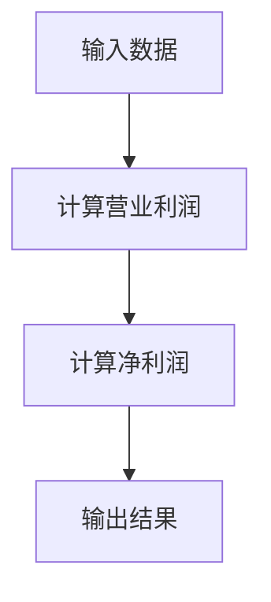
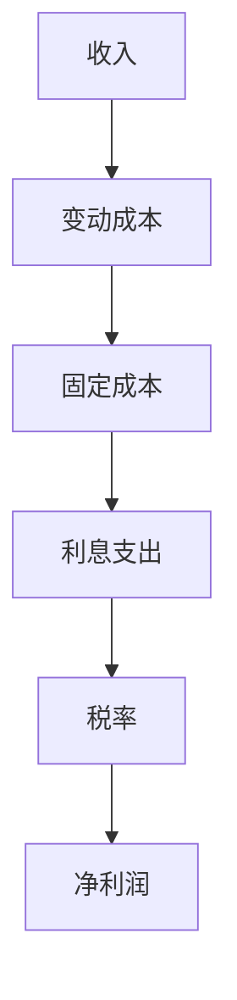
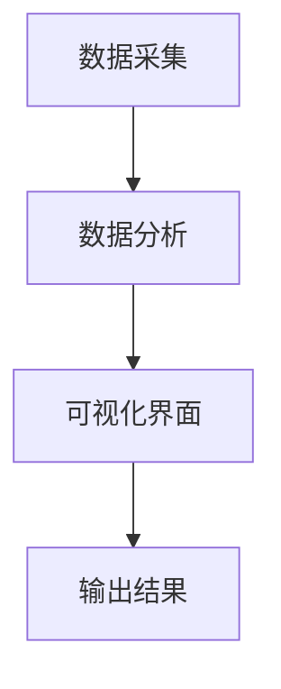
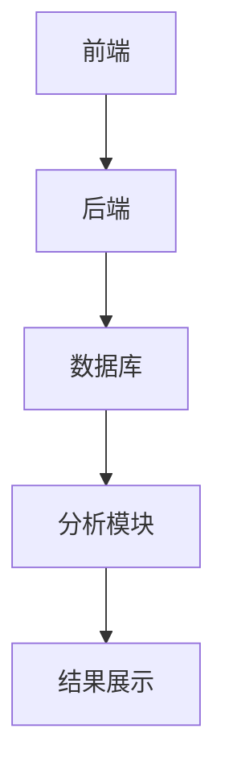

                 

# 彼得林奇对公司营运杠杆与财务杠杆组合效应的分析

> 关键词：彼得·林奇，营运杠杆，财务杠杆，组合效应，投资分析，系统架构

> 摘要：本文深入分析了彼得·林奇对公司营运杠杆与财务杠杆组合效应的分析方法。通过介绍核心概念、数学模型、系统架构和实战案例，详细探讨了如何优化杠杆组合以提升企业绩效和股东价值。文章内容涵盖理论分析、系统设计、案例解读和投资策略，适合投资专业人士和企业管理人员阅读。

---

## 第1章: 背景介绍与核心概念

### 1.1 营运杠杆的基本概念

#### 1.1.1 营运杠杆的定义
营运杠杆是指公司通过固定成本和变动成本的合理搭配，利用销售收入的增长来提高营业利润的能力。简单来说，营运杠杆反映了公司业务模式对收入增长的放大效应。

#### 1.1.2 营运杠杆的核心要素
- **固定成本**：如租金、工资等，不随销售收入变化而变化。
- **变动成本**：如原材料、销售费用等，随销售收入变化而变化。
- **边际贡献**：销售收入减去变动成本后的部分，是营运杠杆的关键驱动因素。

#### 1.1.3 营运杠杆的分类与特征
- **高营运杠杆**：固定成本高，收入增长带来的利润增长快，但风险也更大。
- **低营运杠杆**：变动成本占比较高，收入增长带来的利润增长较为平稳。

---

### 1.2 财务杠杆的基本概念

#### 1.2.1 财务杠杆的定义
财务杠杆是指公司通过债务融资放大净利润的能力。财务杠杆的核心在于利用债务利息的税盾效应，以较少的股东权益实现更高的净利润。

#### 1.2.2 财务杠杆的核心要素
- **债务规模**：债务规模越大，财务杠杆效应越显著。
- **利率水平**：利率越高，债务融资的成本越高，财务杠杆的放大效应减弱。
- **税盾效应**：债务利息可以在税前扣除，降低企业的整体税负。

#### 1.2.3 财务杠杆的分类与特征
- **高财务杠杆**：债务比例高，净利润受销售收入波动影响大，但潜在收益也高。
- **低财务杠杆**：债务比例低，净利润波动较小，风险相对较低。

---

### 1.3 营运杠杆与财务杠杆的组合效应

#### 1.3.1 组合效应的定义
营运杠杆与财务杠杆的组合效应是指两者共同作用，通过固定成本和财务成本的协同作用，放大公司利润的能力。

#### 1.3.2 组合效应的形成机制
- 营运杠杆放大销售收入对营业利润的影响。
- 财务杠杆放大营业利润对净利润的影响。
- 两者的结合可以显著放大销售收入的波动对净利润的影响。

#### 1.3.3 组合效应的边界与外延
- 营运杠杆和财务杠杆的组合效应并非无限制，过高杠杆可能导致公司财务风险加大。
- 组合效应的外延包括对股东权益的影响、对债权人利益的影响等。

---

## 第2章: 营运杠杆与财务杠杆的核心概念与联系

### 2.1 核心概念原理

#### 2.1.1 营运杠杆的数学模型
营运杠杆的数学模型可以表示为：
$$ 利润 = (收入 - 变动成本) \times (1 - 税率) $$

#### 2.1.2 财务杠杆的数学模型
财务杠杆的数学模型可以表示为：
$$ 净利润 = (营业利润 - 利息支出) \times (1 - 税率) $$

#### 2.1.3 组合效应的数学模型
组合效应的数学模型可以表示为：
$$ 净利润 = (收入 - 变动成本 - 利息支出) \times (1 - 税率) $$

---

### 2.2 概念属性特征对比

#### 2.2.1 营运杠杆与财务杠杆的对比分析

| **属性**       | **营运杠杆**                     | **财务杠杆**                     |
|----------------|----------------------------------|----------------------------------|
| 核心要素       | 固定成本、变动成本             | 债务规模、利率                   |
| 目标           | 放大营业利润                   | 放大净利润                     |
| 风险           | 收入波动风险                   | 债务违约风险                   |

#### 2.2.2 组合效应的特征分析
- 组合效应的放大作用是营运杠杆和财务杠杆的乘积效应。
- 组合效应的稳定性取决于两者的匹配程度。

#### 2.2.3 案例分析：某公司营运杠杆与财务杠杆的对比
假设某公司销售收入为100万元，固定成本为40万元，变动成本为40万元，债务利息为10万元，税率为25%。

- 营运杠杆效应：
  $$ 营业利润 = (100 - 40) - 40 = 20万元 $$
  $$ 营运杠杆系数 = 营业利润 / 变动成本 = 20 / 40 = 0.5 $$

- 财务杠杆效应：
  $$ 净利润 = (20 - 10) \times (1 - 0.25) = 5万元 $$
  $$ 财务杠杆系数 = 净利润 / 营业利润 = 5 / 20 = 0.25 $$

---

## 第3章: 营运杠杆与财务杠杆的组合效应分析

### 3.1 组合效应的数学模型与公式

$$ 净利润 = (收入 - 变动成本 - 利息支出) \times (1 - 税率) $$

---

### 3.2 组合效应的系统分析

#### 3.2.1 系统功能设计
- 数据输入：收入、变动成本、固定成本、利息支出、税率。
- 数据处理：计算营业利润、净利润。
- 数据输出：净利润和杠杆效应分析结果。

#### 3.2.2 系统架构设计

---

### 3.3 组合效应的系统架构图

---

## 第4章: 彼得·林奇的分析框架

### 4.1 彼得·林奇的投资理念

#### 4.1.1 林奇的投资哲学
- 重视基本面分析。
- 偏好具有强大竞争优势的企业。
- 关注企业的杠杆结构和财务健康。

#### 4.1.2 林奇的杠杆分析方法
- 通过分析企业的杠杆结构，判断企业的财务风险和投资价值。
- 结合营运杠杆和财务杠杆的组合效应，评估企业的盈利潜力。

#### 4.1.3 林奇的选股策略
- 选择具有高营运杠杆和适度财务杠杆的公司。
- 关注企业的边际贡献和债务结构。

---

### 4.2 林奇的杠杆分析框架

#### 4.2.1 营运杠杆的分析维度
- 企业的固定成本占比。
- 企业的边际贡献率。

#### 4.2.2 财务杠杆的分析维度
- 企业的债务规模。
- 企业的债务成本。
- 企业的财务风险。

#### 4.2.3 组合效应的综合评估
- 综合评估企业的营运杠杆和财务杠杆的匹配程度。
- 结合企业的行业特点和市场环境进行分析。

---

## 第5章: 投资分析与实战应用

### 5.1 实战案例分析

#### 5.1.1 案例背景
某制造企业销售收入为200万元，固定成本为80万元，变动成本为60万元，债务利息为20万元，税率为25%。

#### 5.1.2 营运杠杆分析
$$ 营业利润 = (200 - 60) - 80 = 60万元 $$
$$ 营运杠杆系数 = 60 / 60 = 1 $$

#### 5.1.3 财务杠杆分析
$$ 净利润 = (60 - 20) \times (1 - 0.25) = 30万元 $$
$$ 财务杠杆系数 = 30 / 60 = 0.5 $$

#### 5.1.4 组合效应分析
$$ 净利润 = (200 - 60 - 20) \times (1 - 0.25) = 120 \times 0.75 = 90万元 $$

---

### 5.2 投资策略与风险管理

#### 5.2.1 投资策略
- 选择具有高营运杠杆和适度财务杠杆的公司。
- 关注企业的行业地位和竞争优势。

#### 5.2.2 风险管理
- 评估企业的财务风险和流动性风险。
- 关注企业的债务结构和偿债能力。

---

## 第6章: 系统架构与技术实现

### 6.1 系统功能设计

#### 6.1.1 功能模块
- 数据采集模块：采集企业的财务数据。
- 数据分析模块：计算营运杠杆和财务杠杆的系数。
- 可视化界面：展示分析结果。

#### 6.1.2 功能流程

---

### 6.2 系统架构设计

---

## 第7章: 总结与展望

### 7.1 总结
本文系统地分析了彼得·林奇对公司营运杠杆与财务杠杆组合效应的分析方法，结合数学模型和系统架构，详细探讨了如何优化杠杆组合以提升企业绩效和股东价值。

### 7.2 展望
未来的研究可以进一步结合人工智能和大数据技术，优化杠杆组合的分析方法，提升投资决策的科学性和精准性。

---

## 参考文献
1. 彼得·林奇. 《彼得·林奇的成功投资》
2. 罗伯特·希勒. 《财务报表分析》
3. 约翰·雷迪. 《公司财务学》

