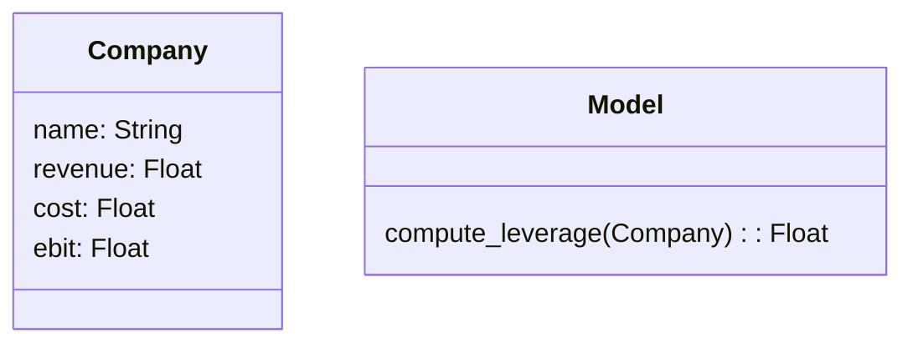
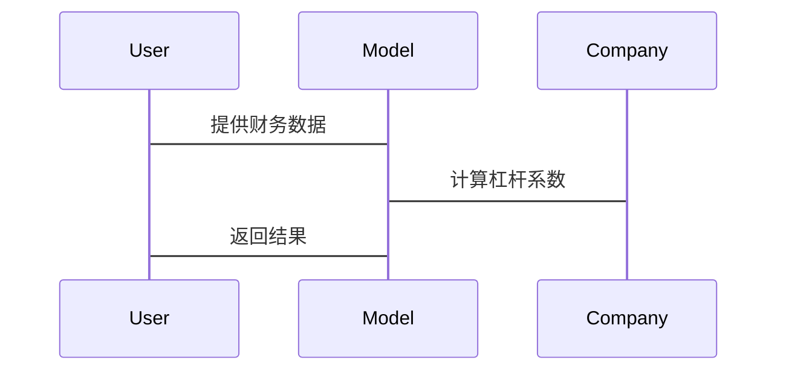

                 


# 彼得林奇对公司营运杠杆效应的动态分析

## 关键词：彼得林奇，营运杠杆效应，动态分析，投资策略，企业价值

## 摘要：  
彼得林奇作为世界著名投资专家，以其独特的投资理念和对营运杠杆效应的深入研究闻名。本文将从彼得林奇的背景出发，详细分析营运杠杆效应的定义、分类及其对投资决策的影响。通过动态分析的方法，结合行业和公司案例，探讨如何利用营运杠杆效应评估企业价值，制定投资策略。本文还提供系统分析与架构设计，结合项目实战，帮助读者更好地理解和应用营运杠杆效应的动态分析方法。

---

# 第1章：彼得林奇与投资分析概述

## 1.1 彼得林奇及其投资理念  
### 1.1.1 彼得林奇的生平简介  
彼得·林奇（Peter Lynch）是美国著名投资专家，被誉为“共同基金之父”。他从1971年到2000年担任富达麦哲伦基金的经理，期间基金年平均收益率高达29%，远超市场平均水平。林奇的投资理念强调长期投资、深入研究和对公司基本面的分析。  

### 1.1.2 彼得林奇的投资哲学  
林奇认为，投资的核心是研究公司基本面，关注企业的营运能力和财务健康。他主张通过分析企业的营运杠杆效应来评估其盈利能力和抗风险能力。  

### 1.1.3 彼得林奇对价值投资的贡献  
林奇的价值投资方法强调对公司基本面的深入研究，尤其是对营运杠杆效应的动态分析。他的研究成果为后来的投资分析提供了重要参考。  

---

## 1.2 公司营运杠杆效应的背景  
### 1.2.1 营运杠杆效应的定义  
营运杠杆效应（Operating Leverage）是指公司通过固定成本和变动成本的结合，利用销售额的增长来提高利润的能力。  

### 1.2.2 营运杠杆效应的分类  
营运杠杆效应可以分为正向和负向两类：  
- **正向营运杠杆效应**：销售额的增长超过成本增长，利润增加。  
- **负向营运杠杆效应**：销售额的增长低于成本增长，利润下降。  

### 1.2.3 营运杠杆效应与财务杠杆的区别  
营运杠杆效应关注的是销售额对利润的影响，而财务杠杆效应关注的是债务对股东权益的影响。  

---

## 1.3 营运杠杆效应的重要性  
### 1.3.1 营运杠杆效应对企业价值的影响  
营运杠杆效应直接影响企业的盈利能力，进而影响企业价值。  

### 1.3.2 营运杠杆效应在投资决策中的作用  
投资者通过分析营运杠杆效应，可以评估企业的盈利能力和风险，从而做出更明智的投资决策。  

### 1.3.3 彼得林奇对营运杠杆效应的重视  
林奇在其投资分析中，将营运杠杆效应作为评估企业的重要指标，认为这是决定企业能否长期增长的关键因素。  

---

# 第2章：营运杠杆效应的核心概念  

## 2.1 营运杠杆效应的定义与属性  
### 2.1.1 营运杠杆效应的数学模型  
营运杠杆效应可以通过以下公式表示：  
$$ \text{杠杆系数} = \frac{\text{EBIT变化的百分比}}{\text{销售额变化的百分比}} $$  
其中，EBIT（息税前利润）的变化反映了营运杠杆效应的强弱。  

### 2.1.2 营运杠杆效应的特征对比  
| 特征 | 正向杠杆效应 | 负向杠杆效应 |  
|------|--------------|--------------|  
| 利润变化 | 利润增加     | 利润减少     |  
| 风险   | 较低         | 较高         |  

### 2.1.3 营运杠杆效应的ER实体关系图  
```mermaid
erDiagram
    company --|{has} product : owns
    product --|{belongs to} category : belongs to
    company --> order : makes
```

---

## 2.2 营运杠杆效应的数学模型  
### 2.2.1 营运杠杆效应的公式推导  
假设某公司销售额增长10%，EBIT增长20%，则杠杆系数为2，说明该公司具有正向营运杠杆效应。  

### 2.2.2 营运杠杆效应的图表展示  


### 2.2.3 营运杠杆效应的案例分析  
某制造公司销售额增长10%，EBIT增长20%，说明其营运杠杆效应为正向。  

---

## 2.3 营运杠杆效应与企业绩效的关系  
### 2.3.1 营运杠杆效应对企业利润的影响  
正向杠杆效应会增加利润，而负向杠杆效应会减少利润。  

### 2.3.2 营运杠杆效应与企业规模的关系  
大规模企业通常具有较高的正向杠杆效应，因为它们可以通过规模经济降低成本。  

### 2.3.3 营运杠杆效应与企业风险的关联  
负向杠杆效应会增加企业的财务风险，因为利润下降可能导致债务负担加重。  

---

# 第3章：营运杠杆效应的动态分析方法  

## 3.1 动态分析的基本原理  
### 3.1.1 动态分析的定义  
动态分析是指在时间变化中，分析变量之间的关系及其变化趋势。  

### 3.1.2 动态分析的步骤  
1. 确定分析目标  
2. 收集历史数据  
3. 建立数学模型  
4. 进行模拟分析  

### 3.1.3 动态分析的指标选择  
- 销售增长率  
- EBIT增长率  
- 杠杆系数  

---

## 3.2 营运杠杆效应的动态分析模型  
### 3.2.1 模型的构建过程  
通过时间序列分析，建立营运杠杆效应的动态模型。  

### 3.2.2 模型的输入变量  
- 销售额  
- 成本  
- 利润  

### 3.2.3 模型的输出结果  
- 杠杆系数变化趋势  

---

## 3.3 营运杠杆效应的动态分析案例  
### 3.3.1 案例背景介绍  
某公司过去5年的销售额和利润数据。  

### 3.3.2 分析过程展示  
通过时间序列分析，计算每年的杠杆系数。  

### 3.3.3 分析结果解读  
公司杠杆系数逐年上升，说明其营运杠杆效应增强。  

---

# 第4章：行业与公司层面的营运杠杆效应分析  

## 4.1 行业层面的分析  
### 4.1.1 不同行业的营运杠杆效应比较  
制造业通常具有较高的正向杠杆效应，而服务业的杠杆效应较低。  

### 4.1.2 行业周期对营运杠杆效应的影响  
行业周期上升时，杠杆效应增强；周期下降时，杠杆效应减弱。  

### 4.1.3 行业政策对营运杠杆效应的作用  
政府政策如税收优惠可以增强企业的杠杆效应。  

---

## 4.2 公司层面的分析  
### 4.2.1 公司规模与营运杠杆效应的关系  
大规模公司通常具有较高的正向杠杆效应。  

### 4.2.2 公司内部管理对杠杆效应的影响  
高效的内部管理可以降低成本，增强杠杆效应。  

### 4.2.3 公司外部环境对杠杆效应的影响  
市场需求、竞争状况等外部因素也会影响杠杆效应。  

---

# 第5章：系统分析与架构设计  

## 5.1 系统功能设计  
### 5.1.1 领域模型Mermaid类图  


### 5.1.2 系统架构Mermaid架构图  


### 5.1.3 系统接口设计  
- 输入：公司财务数据  
- 输出：杠杆系数  

---

## 5.2 系统交互Mermaid序列图  


---

# 第6章：项目实战  

## 6.1 环境安装  
安装Python和相关库（如NumPy、Pandas）。  

## 6.2 系统核心实现源代码  
```python
import numpy as np
import pandas as pd

def compute_leverage(company_data):
    company_data['leverage'] = company_data['ebit'] / company_data['revenue']
    return company_data

# 示例数据
data = {
    'revenue': [100, 200, 300],
    'cost': [50, 100, 150],
    'ebit': [40, 80, 120]
}
df = pd.DataFrame(data)
compute_leverage(df)
```

## 6.3 代码应用解读与分析  
代码计算公司的杠杆系数，并展示结果。  

## 6.4 实际案例分析  
以某公司为例，分析其营运杠杆效应的变化趋势。  

## 6.5 项目小结  
通过代码实现，可以快速评估公司的营运杠杆效应。  

---

# 第7章：总结与展望  

## 7.1 总结  
本文详细分析了彼得林奇对公司营运杠杆效应的动态分析方法，结合理论和实践，提出了系统的分析框架。  

## 7.2 未来研究方向  
未来可以进一步研究营运杠杆效应在不同行业和市场环境下的表现。  

## 7.3 最佳实践Tips  
- 定期评估公司的杠杆效应  
- 结合行业趋势制定投资策略  
- 使用系统工具辅助分析  

## 7.4 小结  
营运杠杆效应是评估企业价值的重要指标，投资者应重视其动态分析。  

---

通过本文的分析，读者可以全面理解彼得林奇的营运杠杆效应理论，并能够将其应用于实际投资分析中。

