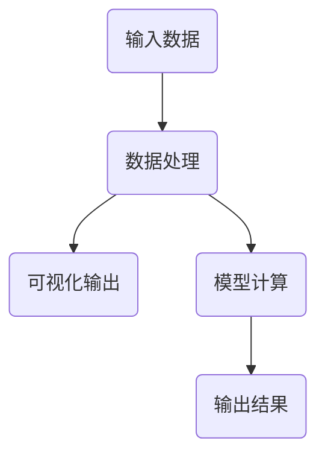
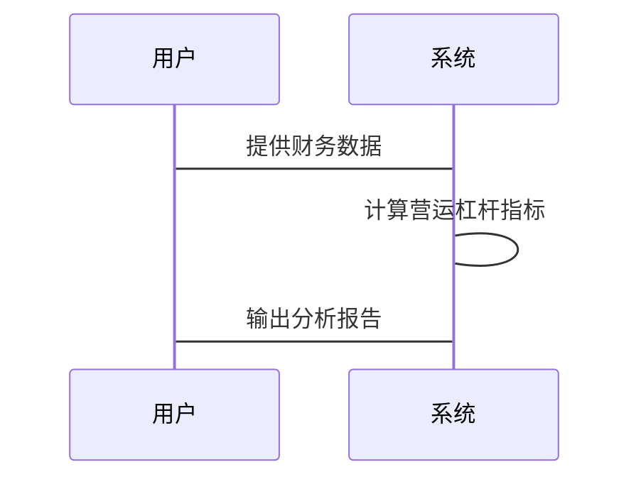

                 


# 彼得林奇对公司营运杠杆的分析

## 关键词：
- 彼得·林奇
- 营运杠杆
- 投资分析
- 财务健康
- 企业价值

## 摘要：
本文深入探讨了彼得·林奇对公司营运杠杆的分析方法，结合实际案例，系统地讲解了营运杠杆的核心概念、数学模型、系统架构设计以及项目实战。通过详细的分析框架和具体的Python代码实现，帮助读者全面理解并掌握如何利用营运杠杆进行企业价值评估。

---

## 第1章: 营运杠杆的基本概念与背景

### 1.1 营运杠杆的定义与作用
#### 1.1.1 营运杠杆的定义
营运杠杆是指企业在经营活动中，通过合理利用固定成本和变动成本的比例，放大或缩小企业利润的能力。它反映了企业经营效率和成本控制能力。

#### 1.1.2 营运杠杆在企业中的作用
营运杠杆能够放大企业的利润增长，但也可能放大亏损。企业通过优化成本结构和收入结构，可以提高营运杠杆效率，从而提升整体盈利能力。

#### 1.1.3 营运杠杆与财务杠杆的区别
- **营运杠杆**：与企业经营效率相关，通过固定成本和变动成本的合理搭配实现利润放大。
- **财务杠杆**：与企业资本结构相关，通过债务融资放大企业净资产收益率。

### 1.2 彼得·林奇投资理念的背景
#### 1.2.1 彼得·林奇的投资者简介
彼得·林奇是美国著名的投资专家，曾任富达投资集团麦哲伦基金的经理，创造了卓越的投资业绩。他以深入分析公司基本面和财务数据著称。

#### 1.2.2 林奇投资理念的核心思想
林奇强调长期投资、价值投资和深入研究企业的财务状况。他认为，企业的营运杠杆是衡量其经营效率和财务健康的重要指标。

#### 1.2.3 营运杠杆在林奇分析中的重要性
林奇认为，通过分析企业的营运杠杆，可以评估其经营效率和成本控制能力，从而判断企业的长期盈利能力。

---

## 第2章: 营运杠杆的核心概念与分析框架

### 2.1 营运杠杆的核心要素
#### 2.1.1 营业收入与成本结构
- 营业收入：企业的核心收入来源。
- 成本结构：固定成本和变动成本的比例。

#### 2.1.2 营业利润的计算公式
$$ 营业利润 = 营业收入 - 营业成本 - 其他费用 $$

#### 2.1.3 营运杠杆的度量指标
- 营业利润率：$$ 营业利润率 = \frac{营业利润}{营业收入} \times 100\% $$
- 成本费用率：$$ 成本费用率 = \frac{营业成本 + 其他费用}{营业收入} \times 100\% $$

### 2.2 营运杠杆与企业财务健康的关系
#### 2.2.1 营运杠杆对财务健康的影响
- 高营运杠杆：利润增长快，但风险也高。
- 低营运杠杆：利润增长稳定，风险较低。

#### 2.2.2 营运杠杆与企业风险的关系
营运杠杆高意味着企业对销售量的敏感性更高，销售下滑可能导致利润大幅下降。

#### 2.2.3 营运杠杆与企业价值的关联
企业价值与营运杠杆密切相关，高营运杠杆的企业可能在市场繁荣时表现优异，但在市场低迷时面临更大的压力。

---

## 第3章: 营运杠杆的数学模型与公式

### 3.1 营运杠杆的基本公式
#### 3.1.1 营业收入的计算公式
$$ 营业收入 = 单价 \times 销量 $$

#### 3.1.2 营业成本的计算公式
$$ 营业成本 = 单位成本 \times 销量 $$

#### 3.1.3 营业利润的计算公式
$$ 营业利润 = 营业收入 - 营业成本 $$

### 3.2 营运杠杆比率的计算
#### 3.2.1 营业利润率的计算公式
$$ 营业利润率 = \frac{营业利润}{营业收入} \times 100\% $$

#### 3.2.2 成本费用率的计算公式
$$ 成本费用率 = \frac{营业成本 + 其他费用}{营业收入} \times 100\% $$

#### 3.2.3 营运杠杆系数的计算公式
$$ 营运杠杆系数 = \frac{营业收入变化百分比}{营业利润变化百分比} $$

---

## 第4章: 营运杠杆的系统分析与架构设计

### 4.1 系统分析框架
#### 4.1.1 问题场景介绍
- 需要分析企业的营运杠杆，评估其经营效率和财务健康。

#### 4.1.2 系统功能设计
- 数据输入：企业财务数据。
- 数据处理：计算营运杠杆相关指标。
- 结果输出：可视化分析报告。

#### 4.1.3 领域模型Mermaid类图


### 4.2 系统架构设计
#### 4.2.1 系统架构Mermaid架构图


#### 4.2.2 系统接口设计
- 输入接口：接收企业财务数据。
- 输出接口：生成分析报告。

#### 4.2.3 系统交互Mermaid序列图


---

## 第5章: 项目实战——彼得林奇分析法的实现

### 5.1 环境安装
- 安装Python和相关库（如pandas、numpy）。

### 5.2 系统核心实现源代码
```python
import pandas as pd

def calculate_operating_leverage(financial_data):
    revenue = financial_data['营业收入']
    operating_cost = financial_data['营业成本'] + financial_data['其他费用']
    operating_profit = revenue - operating_cost
    operating_margin = (operating_profit / revenue) * 100
    cost_ratio = (operating_cost / revenue) * 100
    return {
        '营业收入': revenue,
        '营业成本': operating_cost,
        '营业利润': operating_profit,
        '营业利润率': operating_margin,
        '成本费用率': cost_ratio
    }

# 示例数据
data = {
    '营业收入': 1000,
    '营业成本': 600,
    '其他费用': 100
}

result = calculate_operating_leverage(data)
print("营业利润率:", result['营业利润率'],"%")
print("成本费用率:", result['成本费用率'],"%")
```

### 5.3 代码应用解读与分析
通过上述代码，我们可以计算企业的营业利润率和成本费用率，从而评估其营运杠杆的效率。例如，上述示例中，营业利润率为40%，成本费用率为70%，说明企业的成本控制能力较强。

### 5.4 实际案例分析
以某制造企业为例，分析其营运杠杆情况，计算其营业利润率和成本费用率，并评估其财务健康状况。

### 5.5 项目小结
通过项目实战，我们掌握了如何利用Python代码实现彼得·林奇的营运杠杆分析方法，并能够实际应用于企业财务分析中。

---

## 第6章: 最佳实践与小结

### 6.1 小结
- 营运杠杆是评估企业经营效率的重要指标。
- 彼得·林奇的分析方法为我们提供了系统的分析框架。

### 6.2 注意事项
- 数据的准确性和完整性是分析的基础。
- 分析结果需结合行业背景和企业实际情况进行解读。

### 6.3 未来的发展方向
- 结合大数据和人工智能技术，进一步优化营运杠杆分析模型。
- 开发自动化分析工具，提高分析效率。

### 6.4 拓展阅读
- 《彼得·林奇的成功投资》
- 《财务报表分析》

---

通过本文的详细分析，我们不仅掌握了彼得·林奇的营运杠杆分析方法，还能够实际操作并应用这些知识。希望本文对读者在投资分析和企业价值评估方面有所帮助。

