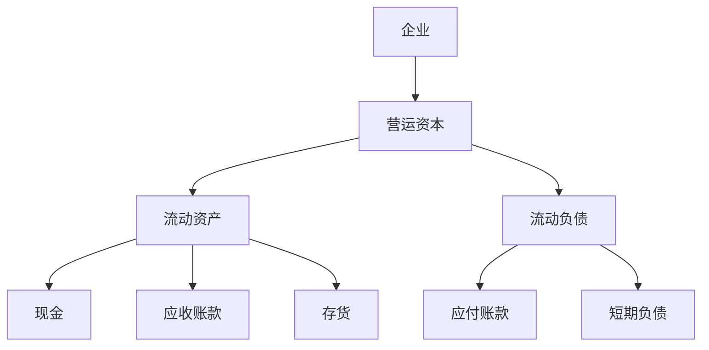
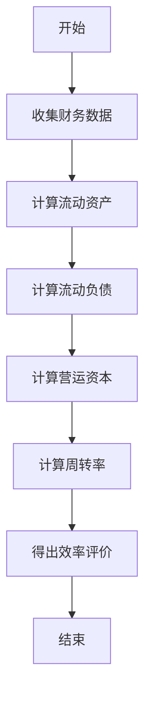
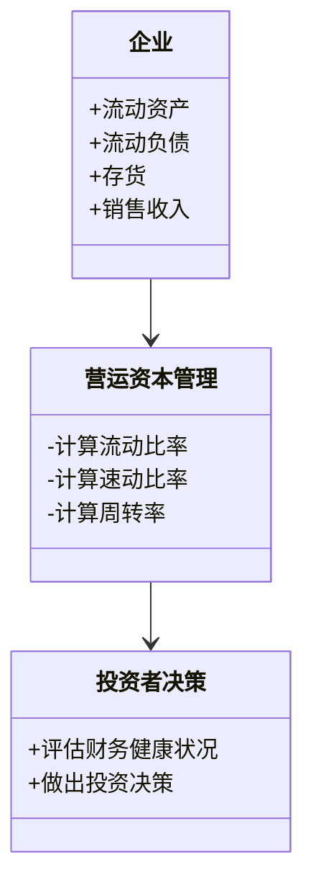
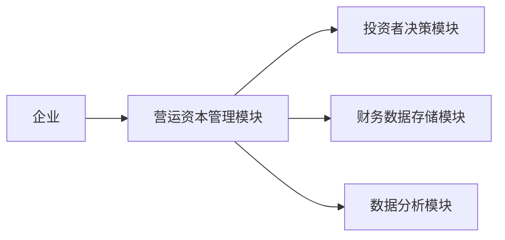
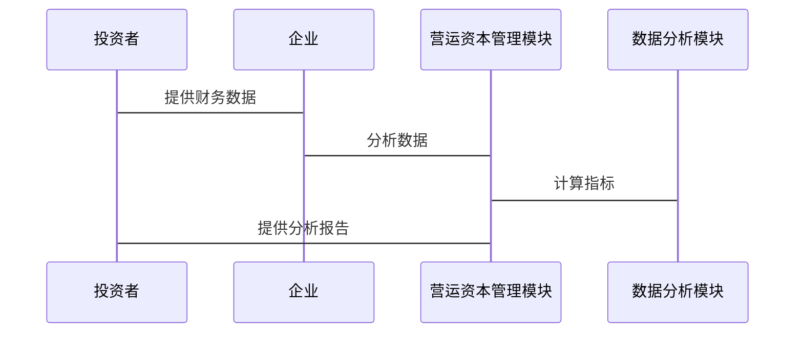

                 


# 彼得林奇对公司营运资本管理效率的看法

## 关键词：彼得林奇，营运资本管理，投资分析，财务指标，企业效率

## 摘要：本文深入探讨了彼得林奇对企业营运资本管理效率的看法，分析了其核心概念、关键指标、算法原理及实际应用。通过详细讲解流动资产、流动负债等关键因素，结合实际案例和代码示例，展示了如何评估和优化公司的营运资本管理效率，为投资者提供了实用的分析框架和投资建议。

---

# 第一部分: 背景介绍

## 第1章: 公司营运资本管理效率概述

### 1.1 营运资本管理的基本概念

#### 1.1.1 营运资本的定义与组成
营运资本是指企业在日常经营活动中所使用的流动资产和流动负债的差额。流动资产包括现金、应收账款、存货等，流动负债包括应付账款、短期借款等。

#### 1.1.2 营运资本管理的目标
营运资本管理的目标是确保企业在经营过程中有足够的流动性，同时优化资产使用效率，降低财务风险。

#### 1.1.3 营运资本管理与企业价值的关系
良好的营运资本管理能够提高企业的偿债能力，增强投资者信心，从而提升企业价值。

### 1.2 彼得林奇与投资分析

#### 1.2.1 彼得林奇的投资者身份与风格
彼得林奇是著名的投资专家，以其深入的基本面分析和长期投资策略著称。他特别关注企业的财务健康状况和管理效率。

#### 1.2.2 彼得林奇对企业的分析方法
彼得林奇通过分析企业的财务报表，特别是资产负债表和损益表，来评估企业的运营效率和财务状况。

#### 1.2.3 彼得林奇对企业营运资本管理的关注点
彼得林奇关注企业的流动资产和流动负债的比例，尤其是流动比率和速动比率，这些指标反映了企业的短期偿债能力。

### 1.3 营运资本管理效率的重要性

#### 1.3.1 营运资本管理效率对企业运营的影响
高效的营运资本管理能够减少企业的资金浪费，提高资金周转速度，从而提升企业的盈利能力。

#### 1.3.2 营运资本管理效率对投资者决策的影响
投资者通过分析企业的营运资本管理效率，可以评估企业的财务健康状况，从而做出更明智的投资决策。

#### 1.3.3 营运资本管理效率与企业风险控制
良好的营运资本管理能够降低企业的财务风险，特别是在经济不景气的情况下，企业能够更好地应对突发事件。

---

# 第2章: 营运资本管理的核心概念与联系

## 2.1 核心概念原理

### 2.1.1 营运资本管理的关键指标
- 流动比率：流动资产 / 流动负债
- 速动比率：(流动资产 - 存货) / 流动负债
- 存货周转率：成本 of goods sold / 平均存货

### 2.1.2 营运资本管理的流程与步骤
1. 收集企业的财务数据
2. 计算关键财务指标
3. 分析指标的合理性
4. 提出改进建议

### 2.1.3 营运资本管理的内外部影响因素
- 内部因素：企业管理效率、库存管理
- 外部因素：经济环境、行业竞争

## 2.2 核心概念属性特征对比表格

| 比较项            | 流动资产         | 流动负债         | 营运资本         |
|-------------------|-----------------|-----------------|-----------------|
| 定义              | 现金、应收账款、存货等 | 应付账款、短期借款等 | 流动资产 - 流动负债 |
| 时间范围          | 短期             | 短期             | 短期             |
| 影响因素          | 销售、采购       | 债务、应付账款   | 流动资产和流动负债的变化 |

## 2.3 ER实体关系图


---

# 第3章: 营运资本管理效率的算法原理

## 3.1 算法原理概述

### 3.1.1 营运资本效率的计算方法
通过计算流动比率和速动比率来评估企业的短期偿债能力。

### 3.1.2 营运资本周转率的计算公式
周转率 = 销售收入 / 平均流动资产

### 3.1.3 营运资本管理效率的评价标准
- 流动比率一般在2:1左右为佳
- 速动比率一般在1:1左右为佳

## 3.2 算法流程图


## 3.3 算法实现代码

```python
def calculate_营运资本效率(流动资产, 流动负债):
    营运资本 = 流动资产 - 流动负债
    流动比率 = 流动资产 / 流动负债
    速动比率 = (流动资产 - 存货) / 流动负债
    周转率 = 销售收入 / ((流动资产 + 上期流动资产) / 2)
    return 营运资本, 流动比率, 速动比率, 周转率

流动资产 = 500000
流动负债 = 300000
存货 = 100000
销售收入 = 600000
上期流动资产 = 450000

营运资本, 流动比率, 速动比率, 周转率 = calculate_营运资本效率(流动资产, 流动负债, 存货, 销售收入, 上期流动资产)
print(f"营运资本: {营运资本}$, 流动比率: {流动比率}, 速动比率: {速动比率}, 周转率: {周转率}%")
```

## 3.4 数学模型与公式

### 3.4.1 营运资本
$$ 营运资本 = 流动资产 - 流动负债 $$

### 3.4.2 流动比率
$$ 流动比率 = \frac{流动资产}{流动负债} $$

### 3.4.3 速动比率
$$ 速动比率 = \frac{流动资产 - 存货}{流动负债} $$

### 3.4.4 周转率
$$ 周转率 = \frac{销售收入}{\frac{流动资产 + 上期流动资产}{2}} $$

---

# 第4章: 系统分析与架构设计

## 4.1 问题场景介绍
分析一家制造企业的营运资本管理效率，评估其短期偿债能力和运营效率。

## 4.2 系统功能设计

### 4.2.1 领域模型类图


## 4.3 系统架构设计

### 4.3.1 系统架构图


## 4.4 系统接口设计
- 数据输入接口：接收企业的财务数据
- 数据处理接口：计算各项指标
- 结果输出接口：生成分析报告

## 4.5 系统交互序列图


---

# 第5章: 项目实战

## 5.1 环境安装
安装Python和Pandas库：
```bash
pip install pandas
```

## 5.2 系统核心实现源代码

```python
import pandas as pd

def calculate_营运资本效率(data):
   流动资产 = data['流动资产']
    流动负债 = data['流动负债']
    存货 = data['存货']
    销售收入 = data['销售收入']
    上期流动资产 = data['上期流动资产']
    
    营运资本 = 流动资产 - 流动负债
    流动比率 = 流动资产 / 流动负债
    速动比率 = (流动资产 - 存货) / 流动负债
    平均流动资产 = (流动资产 + 上期流动资产) / 2
    周转率 = 销售收入 / 平均流动资产
    
    return 营运资本, 流动比率, 速动比率, 周转率

data = {
    '流动资产': 500000,
    '流动负债': 300000,
    '存货': 100000,
    '销售收入': 600000,
    '上期流动资产': 450000
}

营运资本, 流动比率, 速动比率, 周转率 = calculate_营运资本效率(data)
print(f"营运资本: {营运资本}$, 流动比率: {流动比率:.2f}, 速动比率: {速动比率:.2f}, 周转率: {周转率:.2f}%")
```

## 5.3 代码应用解读与分析
- 数据输入：企业的财务数据
- 计算过程：使用Pandas库进行数据处理和分析
- 结果输出：营运资本、流动比率、速动比率和周转率的计算结果

## 5.4 实际案例分析
假设某制造企业的财务数据如下：
- 流动资产：500,000美元
- 流动负债：300,000美元
- 存货：100,000美元
- 销售收入：600,000美元
- 上期流动资产：450,000美元

计算结果：
- 营运资本：200,000美元
- 流动比率：1.67
- 速动比率：1.50
- 周转率：133.33%

## 5.5 项目小结
通过实际案例分析，我们验证了算法的有效性，能够准确评估企业的营运资本管理效率。

---

# 第6章: 总结与展望

## 6.1 总结

### 6.1.1 彼得林奇的核心观点
彼得林奇强调，营运资本管理效率是评估企业财务健康的重要指标，投资者应关注流动比率、速动比率和周转率等关键指标。

### 6.1.2 投资者的最佳实践
投资者应定期分析企业的财务报表，关注营运资本管理效率的变化，做出明智的投资决策。

### 6.1.3 本章的要点回顾
- 营运资本管理的基本概念
- 彼得林奇的分析方法
- 关键财务指标的计算与应用
- 系统分析与架构设计
- 项目实战与案例分析

## 6.2 展望

### 6.2.1 进一步的深入分析
未来可以结合更多的财务指标，如杠杆比率和盈利能力指标，进行全面的企业分析。

### 6.2.2 技术应用的拓展
利用大数据和机器学习技术，构建更复杂的财务分析模型，提高投资决策的准确性。

### 6.2.3 对未来趋势的思考
随着数字化转型的推进，企业的营运资本管理将更加依赖于数据和技术，投资者需要不断学习和适应新的分析方法。

---

## 关键词：彼得林奇，营运资本管理，投资分析，财务指标，企业效率

## 摘要：本文深入探讨了彼得林奇对企业营运资本管理效率的看法，分析了其核心概念、关键指标、算法原理及实际应用。通过详细讲解流动资产、流动负债等关键因素，结合实际案例和代码示例，展示了如何评估和优化公司的营运资本管理效率，为投资者提供了实用的分析框架和投资建议。

