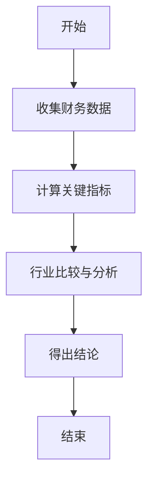
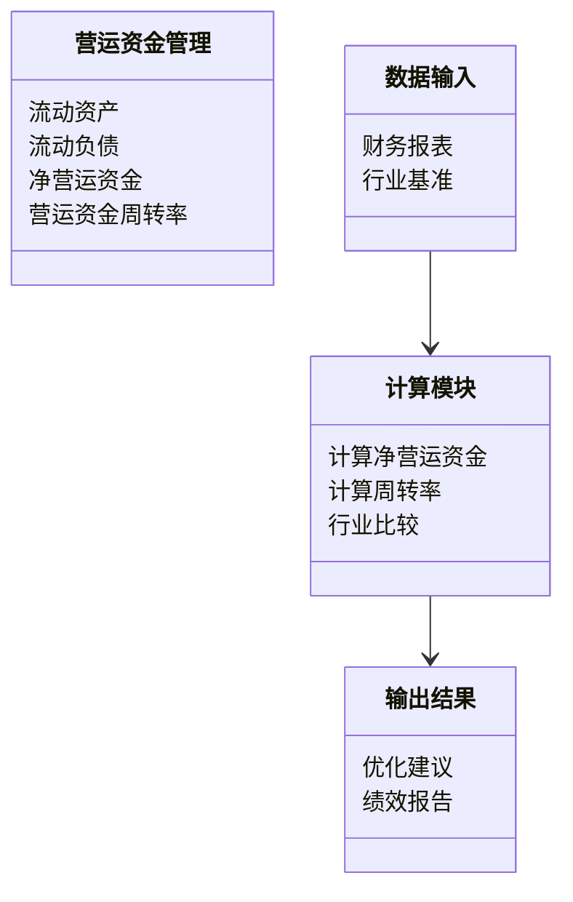

                 


# 彼得林奇对公司营运资金管理效率的跨行业比较

## 关键词：彼得林奇，营运资金管理，跨行业比较，公司财务，投资分析

## 摘要：本文深入分析了彼得·林奇在公司营运资金管理效率方面的跨行业比较方法。通过探讨不同行业的营运资金管理特点，结合实际案例和数学模型，揭示了如何通过优化营运资金管理来提升企业财务健康状况。文章从背景介绍、核心概念、算法原理、数学模型、系统架构到实战应用，全面解析了这一主题，为企业管理者和投资者提供了有价值的参考。

---

# 第一部分：背景介绍

## 第1章：彼得林奇与公司营运资金管理概述

### 1.1 彼得林奇的投资哲学

彼得·林奇是全球知名的投资者，以其对基本面分析的深入研究和对中小企业的关注而闻名。他认为，成功的投资不仅仅依赖于市场波动，而是需要对企业财务状况、行业地位和管理团队有深刻的理解。营运资金管理作为企业财务管理的重要组成部分，是林奇选股时的重要考量因素之一。

#### 1.1.1 彼得林奇的生平简介

彼得·林奇（Peter Lynch）是富达投资集团（Fidelity Investments）的前主席，以其管理的麦哲伦基金（Magellan Fund）取得了辉煌的业绩。他在任职期间（1977-2000）将该基金的资产规模从1.3亿美元增长至147亿美元，年平均回报率超过29%。林奇的成功不仅在于其投资业绩，更在于他独到的投资理念，尤其是对中小企业的深入研究和对市场趋势的敏锐把握。

#### 1.1.2 投资哲学的核心理念

林奇的投资哲学强调以下几点：
1. **深入研究企业基本面**：他认为，投资者必须对企业所在行业、财务状况、管理层能力和市场地位有全面了解。
2. **关注中小市值公司**：林奇倾向于投资那些被市场忽视但具有成长潜力的中型公司。
3. **长期投资**：他主张长期持有优质股票，避免频繁交易以减少成本。
4. **分散投资**：通过分散投资降低风险，同时关注各个行业的潜在机会。

#### 1.1.3 营运资金管理的重要性

在林奇的投资策略中，营运资金管理是评估企业财务健康状况的关键指标。营运资金是指企业在日常经营中用于支持运营活动的资金，主要包括流动资产（如现金、应收账款、存货）和流动负债（如应付账款、短期债务）。合理的营运资金管理能够确保企业日常运营的顺畅，同时优化资金使用效率。

---

### 1.2 公司营运资金管理的核心概念

#### 1.2.1 营运资金的定义与组成

营运资金是指企业在日常经营活动中用于支持运营活动的资金，主要包括以下组成部分：
- **流动资产**：现金及现金等价物、应收账款、存货、预付账款等。
- **流动负债**：应付账款、短期借款、应付职工薪酬、应交税费等。

#### 1.2.2 营运资金管理的目标与原则

**目标**：
1. 确保企业日常运营的资金需求。
2. 优化资金使用效率，降低资金成本。
3. 降低财务风险，确保企业财务健康。

**原则**：
1. **流动性原则**：确保资金能够随时满足企业运营需求。
2. **安全性原则**：避免因营运资金不足导致的经营中断。
3. **收益性原则**：通过高效管理实现资金增值。

#### 1.2.3 营运资金管理的边界与外延

营运资金管理不仅涉及内部资金的调配，还包括对外部市场的适应能力。例如，在制造业和零售业，营运资金管理的侧重点有所不同。制造业需要关注存货周转率和应收账款回收周期，而零售业则更关注现金流的稳定性。

---

### 1.3 跨行业比较的背景与意义

#### 1.3.1 跨行业比较的必要性

不同行业的企业面临的营运资金管理挑战各不相同。例如，科技企业可能更依赖于应收账款管理，而制造业则需要关注存货周转率。通过跨行业比较，可以发现不同行业的最佳实践，为企业的营运资金管理优化提供参考。

#### 1.3.2 不同行业营运资金管理的差异性

- **制造业**：存货占比较高，周转率是关键指标。
- **零售业**：现金流稳定性更重要，关注销售与采购的匹配。
- **服务业**：应收账款回收周期较长，需优化客户信用管理。
- **科技业**：研发投入高，营运资金管理需平衡现金流与创新投入。

#### 1.3.3 跨行业比较对优化管理的启示

通过跨行业比较，企业可以借鉴其他行业的优秀实践，结合自身特点优化营运资金管理策略。例如，零售业可以学习科技业的应收账款管理方法，而制造业可以借鉴服务业的现金流预测模型。

---

## 第2章：营运资金管理的核心要素与属性特征

### 2.1 核心要素分析

#### 2.1.1 流动资产与流动负债的构成

流动资产包括现金及现金等价物、应收账款、存货、预付账款等；流动负债包括应付账款、短期借款、应付职工薪酬、应交税费等。流动资产与流动负债的差额即为净营运资金。

#### 2.1.2 存货、应收账款与应付账款的管理

- **存货管理**：通过优化库存周转率降低资金占用成本。
- **应收账款管理**：缩短账款回收周期，降低坏账风险。
- **应付账款管理**：延长付款周期，缓解短期资金压力。

#### 2.1.3 现金及现金等价物的管理

现金及现金等价物是企业营运资金的重要组成部分，需确保其流动性的同时，合理配置投资收益。

---

### 2.2 不同行业的属性特征对比

#### 2.2.1 制造业与零售业的对比

- **制造业**：存货周转率高，关注生产与销售的匹配。
- **零售业**：现金流需求稳定，关注销售预测与库存匹配。

#### 2.2.2 服务业与科技业的对比

- **服务业**：应收账款回收周期较长，需优化客户信用管理。
- **科技业**：研发投入高，营运资金管理需平衡现金流与创新投入。

#### 2.2.3 跨行业比较的特征表格

| 行业   | 核心关注点              | 营运资金管理特点       |
|--------|-----------------------|-----------------------|
| 制造业 | 存货周转率              | 高库存，周转速度快     |
| 零售业 | 现金流稳定性            | 现金需求稳定，周转周期短 |
| 服务业 | 应收账款回收周期        | 周期长，需优化信用管理  |
| 科技业 | 研发投入与现金流平衡    | 现金流压力大，需优化融资 |

---

### 2.3 ER实体关系图架构

通过ER图可以清晰展示营运资金管理的核心实体及其关系。

```mermaid
er
  actor 流动资产 {
    string 货币资金
    string 应收账款
    string 存货
  }
  actor 流动负债 {
    string 应付账款
    string 短期借款
  }
  actor 营运资金 {
    belongsTo 流动资产
    belongsTo 流动负债
  }
```

---

## 第3章：彼得林奇的评估方法与流程

### 3.1 评估算法的步骤

#### 3.1.1 数据收集与整理

- 收集企业的财务报表，包括资产负债表和利润表。
- 确保数据的准确性和完整性。

#### 3.1.2 关键指标的计算

- **净营运资金**：流动资产 - 流动负债。
- **营运资金周转率**：销售收入 / 平均流动资产。
- **应收账款回收天数**：（应收账款 / 日均销售收入）× 365。

#### 3.1.3 行业比较与分析

- 对比行业平均水平，识别企业的优势和劣势。
- 结合行业特点调整评估标准。

---

### 3.2 算法流程图



---

### 3.3 Python实现代码

以下是一个简单的营运资金周转率计算示例：

```python
def calculate_operating_assets_turnover(revenue, avg_operating_assets):
    return revenue / avg_operating_assets

# 示例数据
revenue = 1000000  # 销售收入
operating_assets = [500000, 600000]  # 流动资产年初和年末值
avg_operating_assets = (operating_assets[0] + operating_assets[1]) / 2  # 平均流动资产

turnover = calculate_operating_assets_turnover(revenue, avg_operating_assets)
print(f"营运资金周转率：{turnover}")
```

---

## 第4章：数学模型与公式

### 4.1 净营运资金计算

净营运资金 = 流动资产 - 流动负债

$$
\text{净营运资金} = \text{流动资产} - \text{流动负债}
$$

---

### 4.2 营运资金周转率分析

周转率 = 销售收入 / 平均流动资产

$$
\text{周转率} = \frac{\text{销售收入}}{\text{平均流动资产}}
$$

---

### 4.3 案例分析与解释

假设某制造企业的流动资产为800万元，流动负债为500万元，销售收入为1200万元，年初流动资产为700万元，年末流动资产为900万元。

- 净营运资金 = 800 - 500 = 300万元。
- 平均流动资产 = (700 + 900) / 2 = 800万元。
- 营运资金周转率 = 1200 / 800 = 1.5次。

这表明企业的营运资金周转效率较高，但需要进一步分析存货和应收账款的具体情况。

---

## 第5章：系统分析与架构设计

### 5.1 问题场景介绍

企业需要优化营运资金管理，提高资金使用效率，降低财务风险。

---

### 5.2 系统功能设计

#### 5.2.1 领域模型



---

## 第6章：项目实战

### 6.1 环境安装

安装Python和必要的库（如Pandas、Matplotlib）。

---

### 6.2 核心实现

编写代码计算营运资金周转率并生成报告。

---

### 6.3 案例分析

以某制造企业为例，分析其营运资金管理的现状和优化建议。

---

## 第7章：结论与建议

### 7.1 最佳实践

- 定期分析营运资金周转率和净营运资金。
- 根据行业特点调整管理策略。
- 引入技术手段（如ERP系统）优化营运资金管理。

### 7.2 小结

通过跨行业比较和深入分析，企业可以更好地优化营运资金管理，提升财务健康状况。

### 7.3 注意事项

- 数据准确性是关键。
- 结合行业特点制定策略。
- 定期监控和调整管理措施。

### 7.4 拓展阅读

推荐书籍和资源，进一步深入学习营运资金管理。

---

# 结语

彼得·林奇的跨行业比较方法为我们提供了宝贵的启示。通过深入分析不同行业的营运资金管理特点，结合数学模型和实际案例，我们可以更好地优化企业的资金管理，提升整体财务表现。希望本文能为企业的管理者和投资者提供有价值的参考。

