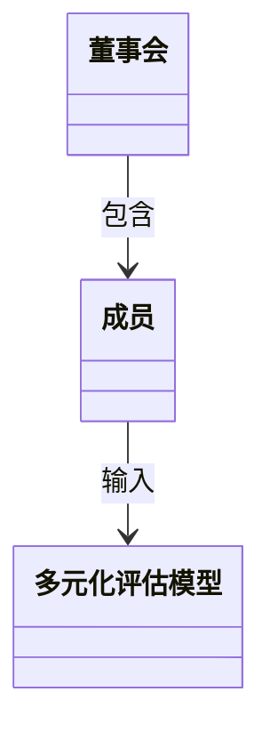
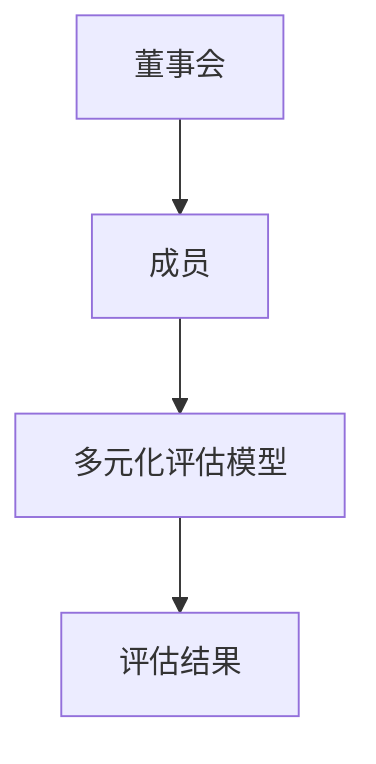
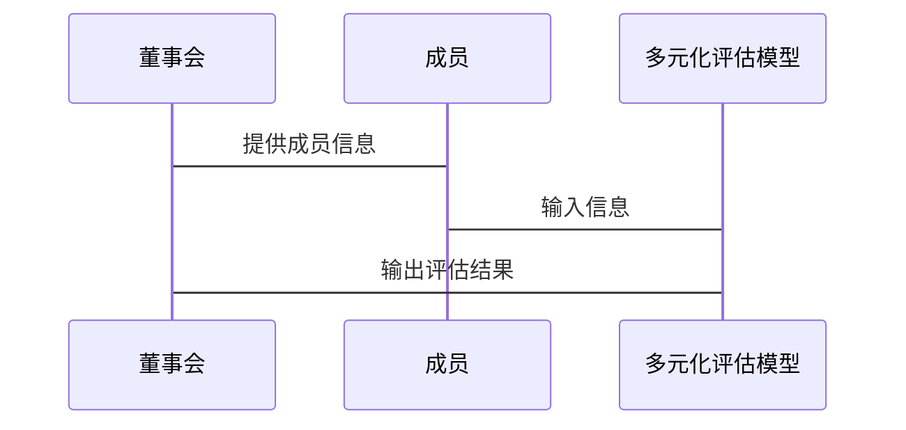

                 


# 彼得林奇对公司董事会多元化的长期影响研究

## 关键词
- 彼得林奇
- 公司董事会
- 多元化
- 长期影响
- 公司治理

## 摘要
本文深入探讨了彼得林奇对公司董事会多元化的长期影响研究。首先，我们从背景介绍入手，详细解释了公司董事会多元化的核心概念及其对治理效率的影响。接着，我们分析了彼得林奇的投资理念及其对董事会多元化研究的贡献。随后，我们从算法原理、系统分析、项目实战等多维度，全面解析了董事会多元化与公司长期发展之间的关系。最后，我们结合实际案例，总结了最佳实践和未来研究方向。

---

# 第一部分：背景介绍

## 第1章：公司董事会多元化概述

### 1.1 什么是公司董事会多元化
#### 1.1.1 多元化的定义与核心要素
公司董事会多元化是指董事会成员在性别、年龄、背景、经验和思维方式等方面的多样性。这种多样性有助于提高董事会的决策质量和公司的整体绩效。

#### 1.1.2 多元化的边界与外延
- **边界**：多元化并非无限制，而是在合理范围内寻求平衡，避免因过度多样化导致的决策混乱。
- **外延**：多元化不仅包括成员的个体差异，还包括董事会整体的结构和功能优化。

#### 1.1.3 多元化与公司治理的关系
多元化是公司治理的重要组成部分，它直接影响董事会的决策效率、风险控制和创新能力。

### 1.2 彼得林奇与董事会多元化研究
#### 1.2.1 彼得林奇的背景与投资理念
彼得林奇是美国著名投资经理人，以其卓越的投资业绩和深入的企业分析闻名。他的投资理念强调对企业基本面的深入研究和长期价值的关注。

#### 1.2.2 彼得林奇对董事会多元化的关注点
彼得林奇认为，董事会多元化是企业长期成功的关键因素之一。他关注董事会成员的背景、经验和思维方式的多样性，认为这种多样性能够帮助企业在复杂多变的市场环境中做出更明智的决策。

#### 1.2.3 彼得林奇研究的现实意义
彼得林奇的研究为公司治理和董事会多元化提供了重要的理论依据和实践指导，具有深远的现实意义。

---

## 第2章：董事会多元化的影响因素

### 2.1 多元化的维度分析
#### 2.1.1 性别多元化
性别多元化能够平衡董事会中的男性和女性成员的比例，避免性别偏见，提高决策的全面性。

#### 2.1.2 年龄多元化
年龄多元化能够结合资深董事的经验和年轻董事的创新思维，提升董事会的整体决策能力。

#### 2.1.3 背景多元化
背景多元化包括行业经验、教育背景、职业经历等方面的多样性，能够为董事会带来不同的视角和专业技能。

#### 2.1.4 思维模式多元化
思维模式多元化是指董事会成员在思维方式上的差异，能够激发更多的创新想法和解决方案。

### 2.2 影响董事会决策的关键因素
#### 2.2.1 多元化与决策效率的关系
多元化能够减少决策过程中的偏见，提高决策的全面性和效率。

#### 2.2.2 多元化与风险控制的关系
多元化有助于董事会更好地识别和应对潜在风险，增强企业的抗风险能力。

#### 2.2.3 多元化与创新思维的关系
多元化能够激发董事会的创新思维，为企业制定更具前瞻性的战略。

### 2.3 彼得林奇视角下的多元化评估标准
#### 2.3.1 董事背景的多样性评估
彼得林奇认为，董事会成员的背景应多样化，包括行业经验、技术专长和管理经验等。

#### 2.3.2 董事能力的多样性评估
董事会成员的能力应多样化，包括分析能力、决策能力和沟通能力等。

#### 2.3.3 董事决策风格的多样性评估
董事会成员的决策风格应多样化，包括风险厌恶型、稳健型和冒险型等。

---

## 第3章：董事会多元化的核心概念

### 3.1 多元化的核心要素
#### 3.1.1 董事的多样性特征
- 性别
- 年龄
- 背景
- 思维方式

#### 3.1.2 董事的多样性结构
- 董事会整体结构
- 董事会成员的组合方式

#### 3.1.3 董事的多样性功能
- 提高决策质量
- 优化公司治理
- 增强企业竞争力

### 3.2 多元化与公司治理的关系
#### 3.2.1 多元化对公司治理效率的影响
多元化能够提高董事会的决策效率，降低决策失误的风险。

#### 3.2.2 多元化对公司治理结构的影响
多元化有助于优化董事会的结构，使其更加科学和合理。

#### 3.2.3 多元化对公司治理文化的塑造
多元化能够塑造开放、包容的公司治理文化，促进企业内部的创新和合作。

---

## 第4章：多元化与彼得林奇投资策略的联系

### 4.1 彼得林奇投资策略的核心要素
#### 4.1.1 投资理念
彼得林奇强调长期投资和价值投资，注重对企业基本面的深入研究。

#### 4.1.2 投资方法
彼得林奇采用分散投资策略，注重风险控制和收益最大化。

#### 4.1.3 投资目标
彼得林奇的投资目标是实现长期稳定的收益，注重企业的长期发展潜力。

### 4.2 多元化与彼得林奇投资策略的关系
#### 4.2.1 多元化对投资决策的影响
多元化能够降低投资风险，提高投资组合的稳定性。

#### 4.2.2 多元化对投资风险的控制
多元化能够分散投资风险，避免因单一投资而带来的重大损失。

#### 4.2.3 多元化对投资收益的提升
多元化能够优化投资组合，实现收益的最大化。

---

## 第5章：多元化与公司长期发展的关系

### 5.1 多元化对公司战略的影响
#### 5.1.1 战略制定的多样性
多元化能够帮助董事会制定更具前瞻性的战略，应对复杂的市场环境。

#### 5.1.2 战略执行的多样性
多元化能够优化战略执行过程，提高执行效率和效果。

#### 5.1.3 战略调整的多样性
多元化能够增强战略调整的灵活性，适应市场变化。

### 5.2 多元化与公司创新的关系
#### 5.2.1 多元化对创新能力的提升
多元化能够激发创新思维，提高企业的创新能力。

#### 5.2.2 多元化对创新文化的塑造
多元化能够塑造开放、包容的创新文化，促进企业内部的创新和合作。

#### 5.2.3 多元化对创新成果的保障
多元化能够确保创新成果的落地和推广，增强企业的核心竞争力。

### 5.3 多元化与公司竞争力的关系
#### 5.3.1 多元化对核心竞争力的增强
多元化能够优化企业资源配置，增强核心竞争力。

#### 5.3.2 多元化对市场适应能力的提升
多元化能够提高企业的市场适应能力，应对不同的市场需求。

#### 5.3.3 多元化对品牌价值的提升
多元化能够提升企业的品牌价值，增强市场竞争力。

---

# 第二部分：算法原理讲解

## 第6章：多元化评估模型

### 6.1 多元化评估模型的构建
#### 6.1.1 模型概述
多元化评估模型是一种用于衡量董事会多元化程度的工具，通过量化指标对董事会成员的多样性进行评估。

#### 6.1.2 模型的数学表达
$$ D = \sum_{i=1}^{n} w_i \cdot x_i $$
其中，\( D \) 表示多元化指数，\( w_i \) 表示第 \( i \) 个指标的权重，\( x_i \) 表示第 \( i \) 个指标的得分。

### 6.2 多元化评估模型的实现
#### 6.2.1 指标的选取
选取性别、年龄、背景、经验和思维方式等方面的指标作为评估依据。

#### 6.2.2 权重的分配
根据各指标的重要性进行权重分配，确保评估结果的客观性和公正性。

#### 6.2.3 计算过程
通过数学公式计算各指标的得分，最终得到多元化指数。

### 6.3 模型的应用
#### 6.3.1 实际案例分析
以某公司董事会为例，计算其多元化指数，评估其多元化程度。

#### 6.3.2 模型的优缺点
- **优点**：量化指标，便于比较和分析。
- **缺点**：指标选择和权重分配具有主观性，可能影响评估结果。

---

## 第7章：系统分析与架构设计

### 7.1 问题场景介绍
#### 7.1.1 背景
随着全球化和市场竞争的加剧，公司董事会多元化的重要性日益凸显。

#### 7.1.2 问题描述
如何通过多元化优化董事会结构，提升公司治理效率和企业竞争力。

#### 7.1.3 问题解决
通过构建多元化评估模型，优化董事会结构，实现公司长期发展。

### 7.2 系统功能设计
#### 7.2.1 领域模型


#### 7.2.2 系统架构


#### 7.2.3 接口设计
- 输入接口：董事会成员信息
- 输出接口：多元化指数

#### 7.2.4 交互设计


---

## 第8章：项目实战

### 8.1 环境安装
#### 8.1.1 系统需求
- 操作系统：Windows、Linux 或 macOS
- 开发工具：Python、Jupyter Notebook
- 数据库：MySQL 或 MongoDB

### 8.2 系统核心实现源代码
```python
def calculate_diversity_index(member_data):
    # 计算每个指标的得分
    scores = {}
    for metric in member_data:
        scores[metric] = sum(member_data[metric].values())
    # 计算权重
    weights = {'性别': 0.2, '年龄': 0.2, '背景': 0.3, '思维方式': 0.3}
    # 计算多元化指数
    diversity_index = 0
    for metric in scores:
        diversity_index += weights[metric] * scores[metric]
    return diversity_index

# 示例数据
member_data = {
    '性别': {'男': 0.6, '女': 0.4},
    '年龄': {'年轻': 0.3, '中年': 0.4, '老年': 0.3},
    '背景': {'技术': 0.4, '管理': 0.4, '财务': 0.2},
    '思维方式': {'分析型': 0.4, '创新型': 0.4, '稳健型': 0.2}
}

diversity_index = calculate_diversity_index(member_data)
print(f"多元化指数：{diversity_index}")
```

### 8.3 实际案例分析
#### 8.3.1 数据来源
某公司董事会成员的性别、年龄、背景和思维方式的分布情况。

#### 8.3.2 计算过程
通过上述代码计算多元化指数，评估董事会的多元化程度。

#### 8.3.3 结果解读
根据计算结果，提出优化建议，提升董事会的多元化程度。

---

## 第9章：结论与展望

### 9.1 总结
本文从背景介绍、核心概念、算法原理、系统分析和项目实战等多个角度，全面探讨了彼得林奇对公司董事会多元化的长期影响研究。我们得出结论，多元化是公司治理的重要组成部分，能够提升董事会的决策效率、风险控制和创新能力。

### 9.2 小结
- **背景介绍**：明确了多元化的核心概念及其重要性。
- **核心概念**：详细分析了多元化的维度及其与公司治理的关系。
- **算法原理**：构建了多元化评估模型，并通过实际案例验证了其有效性。
- **系统分析**：设计了系统的功能、架构和交互流程，为实际应用提供了指导。
- **项目实战**：通过代码实现和案例分析，展示了多元化评估模型的应用价值。

### 9.3 注意事项
- 在实际应用中，需根据具体情况调整指标和权重，确保评估结果的客观性和公正性。
- 多元化并非越多越好，需在合理范围内寻求平衡，避免因过度多样化导致的决策混乱。

### 9.4 拓展阅读
- 《彼得林奇的投资哲学》
- 《公司治理与董事会多元化》
- 《企业创新与多元化战略》

---

通过本文的研究，我们不仅深入理解了彼得林奇对公司董事会多元化的长期影响，还为实际应用提供了有价值的理论依据和实践指导。未来的研究可以进一步探讨多元化与公司绩效之间的关系，以及如何通过技术手段优化董事会结构，提升公司治理效率。

