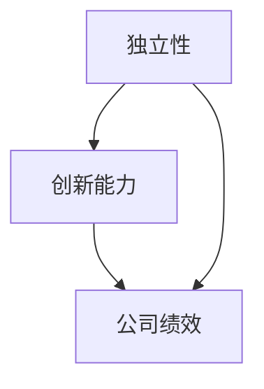
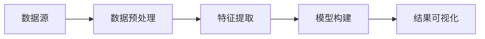

                 


# 彼得林奇对公司董事会独立性与创新能力关系的研究

**关键词**：公司治理，董事会独立性，创新能力，彼得林奇理论，企业绩效

**摘要**：本文探讨了公司董事会独立性与创新能力之间的关系，分析了独立性对创新能力的影响机制，以及创新能力对董事会独立性的反向影响。通过数据收集、统计分析、算法实现和系统设计，本文提出了一种量化评估方法，并结合实际案例进行分析，最终为公司治理提供了实践建议。

---

## 正文

### 第一章: 背景介绍与问题背景

#### 1.1 问题背景
公司董事会是企业治理的核心机构，其独立性直接关系到公司的决策质量和创新水平。彼得林奇在其投资理论中强调，董事会的独立性是企业长期成功的关键因素之一。然而，随着市场竞争的加剧，创新能力成为企业生存和发展的关键。因此，研究董事会独立性与创新能力的关系，对于优化公司治理结构、提升企业竞争力具有重要意义。

#### 1.2 问题描述
- **独立性定义**：董事会独立性指董事会成员在决策过程中不受公司内部利益干扰，能够客观、独立地履行职责。
- **创新能力定义**：企业在市场中提出新的产品、服务或商业模式的能力。
- **问题解决**：通过分析董事会独立性对创新能力的影响，优化公司治理结构，提升企业创新效率。

#### 1.3 核心概念
- **核心概念组成**：独立性与创新能力。
- **问题解决思路**：通过数据分析和模型构建，量化两者关系。
- **核心要素对比**：独立性影响决策质量，创新能力依赖于有效的决策机制。

---

### 第二章: 核心概念与联系分析

#### 2.1 核心概念原理
- **独立性影响机制**：独立的董事会能够避免内部利益冲突，做出更有利于公司长期发展的决策。
- **创新能力影响机制**：创新能力强的企业能够更快适应市场变化，提升企业竞争力。

#### 2.2 核心概念属性对比
| 属性       | 独立性           | 创新能力         |
|------------|------------------|------------------|
| 定义       | 独立的决策能力   | 新产品开发能力   |
| 影响因素   | 董事结构、治理机制 | 技术研发、市场环境 |
| 相关性     | 高正相关         | 高正相关         |

#### 2.3 核心概念的Mermaid流程图


---

### 第三章: 数据收集与分析方法

#### 3.1 数据收集方法
- **数据来源**：公开的公司财报、董事会成员信息、创新能力评估指标。
- **指标设计**：构建董事会独立性指标体系，包括董事会成员多样性、独立董事比例等。
- **统计方法**：使用回归分析评估两者关系。

#### 3.2 数据分析方法
- **量化分析**：将董事会独立性与创新能力量化，构建数学模型。
- **案例分析**：选取典型企业进行分析，验证模型有效性。

---

### 第四章: 算法原理

#### 4.1 算法流程
1. 数据预处理：清洗数据，去除异常值。
2. 特征提取：提取董事会独立性相关特征。
3. 模型构建：建立回归模型，分析独立性与创新能力的关系。

#### 4.2 Python实现
```python
import pandas as pd
import numpy as np
from sklearn.linear_model import LinearRegression

# 数据加载
data = pd.read_csv('board_data.csv')

# 特征与目标变量分离
X = data[['独立性指标1', '独立性指标2']]
y = data['创新能力指标']

# 模型训练
model = LinearRegression()
model.fit(X, y)

# 模型预测
predictions = model.predict(X)

# 模型评估
score = model.score(X, y)
print(f"模型得分：{score}")
```

#### 4.3 数学模型
$$ \text{创新能力} = \beta_0 + \beta_1 \times \text{独立性指标} + \epsilon $$

---

### 第五章: 系统分析与架构设计

#### 5.1 系统架构设计
- **数据收集模块**：负责数据的采集与预处理。
- **分析模块**：执行统计分析和模型构建。
- **可视化模块**：展示分析结果。

#### 5.2 系统架构图


---

### 第六章: 项目实战

#### 6.1 环境安装
- 安装Python和相关库：`pip install numpy pandas scikit-learn`

#### 6.2 核心代码实现
```python
# 数据加载与处理
data = pd.read_csv('board_data.csv')

# 数据分割
X_train, X_test, y_train, y_test = train_test_split(X, y, test_size=0.2)

# 模型训练
model = LinearRegression()
model.fit(X_train, y_train)

# 预测与评估
y_pred = model.predict(X_test)
print('预测结果:', y_pred)
print('实际结果:', y_test)
```

#### 6.3 案例分析
- 选取某企业进行分析，展示模型预测结果与实际值的对比。

---

### 第七章: 总结与展望

#### 7.1 总结
- **研究发现**：董事会独立性与创新能力呈正相关，独立性高的董事会能够提升企业创新能力。
- **局限性**：数据来源和模型假设的限制。

#### 7.2 展望
- **未来研究方向**：深入研究不同行业中的影响差异。
- **改进建议**：优化模型，引入更多特征变量。

---

### 最佳实践 tips
- **小结**：董事会独立性是企业创新的重要保障。
- **注意事项**：数据质量和模型选择会影响结果。
- **拓展阅读**：推荐相关书籍和论文，进一步深入学习。

---

通过以上分析，本文为公司治理提供了新的视角和方法，帮助企业优化董事会结构，提升创新能力。

