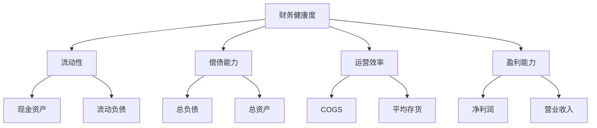
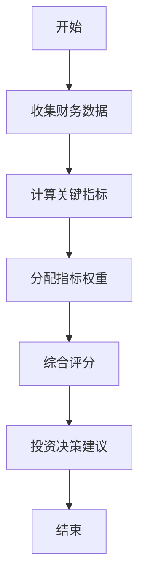
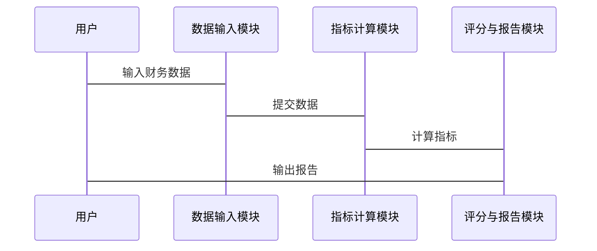

                 


# 彼得林奇对公司财务健康度的分析

> 关键词：彼得·林奇，财务健康度，投资分析，财务指标，企业价值

> 摘要：本文详细探讨了彼得·林奇对公司财务健康度的分析方法，从核心概念、算法原理、系统架构到项目实战，全面解析了如何通过财务健康度评估企业价值，帮助投资者做出明智的投资决策。

---

## 第一部分：背景介绍

### 第1章：财务健康度分析的背景与重要性

#### 1.1 财务健康度分析的定义与核心概念

- **财务健康度的定义**：财务健康度是指企业在一定时期内，通过合理的财务管理和资源配置，维持正常运营和持续发展的能力。它是衡量企业财务状况健康程度的重要指标。
- **财务健康度与企业价值的关系**：企业的财务健康度直接影响其市场价值和投资吸引力。健康的财务状况能够降低企业的经营风险，吸引更多的投资者，从而提升企业价值。
- **财务健康度与投资决策的关系**：投资者通过分析企业的财务健康度，可以评估企业的盈利能力和抗风险能力，从而做出是否投资的决策。

#### 1.2 彼得·林奇的分析方法与投资理念

- **彼得·林奇的投资者背景与成就**：彼得·林奇是美国著名投资经理人，以其在富达投资集团的长期投资业绩而闻名。他通过深入分析企业的财务状况和行业地位，帮助投资者做出明智的投资决策。
- **林奇分析财务健康度的核心理念**：林奇认为，企业的财务健康度是其长期盈利能力的关键因素。他通过分析企业的财务报表，重点关注企业的盈利能力、偿债能力、运营效率和成长性。
- **财务健康度分析在投资决策中的作用**：财务健康度分析是投资决策的重要工具。通过分析企业的财务指标，投资者可以评估企业的经营状况和未来发展前景，从而做出投资决策。

#### 1.3 财务健康度分析的边界与外延

- **财务健康度的适用范围与局限性**：财务健康度分析适用于所有类型的企业，但其结果可能会受到企业所处行业、市场环境和经济周期的影响。此外，财务健康度分析仅能提供定量的评估，不能完全反映企业的定性因素。
- **财务健康度与企业战略的关系**：企业的财务健康度是企业战略的重要组成部分。通过分析财务健康度，企业可以制定合理的财务策略，优化资源配置，提升企业的竞争力。
- **财务健康度与其他财务指标的对比**：财务健康度是综合多个财务指标的结果，与单一财务指标相比，更能全面反映企业的财务状况。

---

## 第二部分：核心概念与联系

### 第2章：财务健康度的核心要素与指标

#### 2.1 财务健康度的核心要素

- **流动性**：流动性是指企业在短时间内偿还债务的能力。主要指标包括现金比率和速动比率。
  - 现金比率 = 现金资产 / 流动负债
  - 速动比率 = （现金资产 + 短期投资 + 应收账款）/ 流动负债
- **偿债能力**：偿债能力是指企业在长期内偿还债务的能力。主要指标包括资产负债率和利息覆盖倍数。
  - 资产负债率 = 总负债 / 总资产
  - 利息覆盖倍数 = 息税前利润 / 利息支出
- **运营效率**：运营效率是指企业在日常经营中使用资产的效率。主要指标包括存货周转率和应收账款周转率。
  - 存货周转率 = COGS / 平均存货
  - 应收账款周转率 = 营业收入 / 平均应收账款
- **盈利能力**：盈利能力是指企业在一定时期内获取利润的能力。主要指标包括净利率和ROE（净资产收益率）。
  - 净利率 = 净利润 / 营业收入
  - ROE = 净利润 / 平均净资产

#### 2.2 核心概念属性对比表格

| 指标类型 | 指标名称 | 计算公式 | 关键作用 |  
|----------|----------|----------|----------|  
| 流动性    | 现金比率 | 现金资产 / 流动负债 | 衡量短期偿债能力 |  
| 偿债能力  | 资产负债率 | 总负债 / 总资产 | 衡量长期财务风险 |  
| 运营效率  | 存货周转率 | COGS / 平均存货 | 衡量运营效率 |  
| 盈利能力  | 净利率   | 净利润 / 营业收入 | 衡量盈利能力 |  

#### 2.3 ER实体关系图（Mermaid）



---

## 第三部分：算法原理讲解

### 第3章：彼得·林奇的财务健康度分析方法

#### 3.1 林奇分析法的算法流程

- **数据收集与初步筛选**：收集企业的财务报表数据，包括资产负债表、利润表和现金流量表。初步筛选出财务数据完整且符合投资标准的企业。
- **关键财务指标计算**：根据企业的财务数据，计算流动性、偿债能力、运营效率和盈利能力等关键财务指标。
- **指标权重分配与综合评分**：根据每个指标的重要性，分配相应的权重，并计算综合评分。评分结果反映了企业的财务健康度。
- **投资决策建议**：根据综合评分，提出投资决策建议。评分较高的企业具有较高的投资价值，评分较低的企业则需要进一步分析或避免投资。

#### 3.2 算法流程图（Mermaid）



#### 3.3 算法实现代码

```python
import pandas as pd

# 假设财务数据存储在DataFrame中
def calculate_financial_health(df):
    # 计算流动性指标
    df['cash_ratio'] = df['现金资产'] / df['流动负债']
    df['quick_ratio'] = (df['现金资产'] + df['短期投资'] + df['应收账款']) / df['流动负债']
    
    # 计算偿债能力指标
    df['debt_ratio'] = df['总负债'] / df['总资产']
    df['interest_coverage'] = df['息税前利润'] / df['利息支出']
    
    # 计算运营效率指标
    df['inventory_turnover'] = df['COGS'] / df['平均存货']
    df['receivables_turnover'] = df['营业收入'] / df['平均应收账款']
    
    # 计算盈利能力指标
    df['net_profit_margin'] = df['净利润'] / df['营业收入']
    df['roe'] = df['净利润'] / df['平均净资产']
    
    # 综合评分
    df['score'] = (df['cash_ratio'] + df['quick_ratio'] + df['inventory_turnover'] + 
                   df['receivables_turnover'] + df['net_profit_margin'] + df['roe']) / 6
    return df

# 示例数据
data = {
    '现金资产': [100, 200, 300],
    '流动负债': [50, 100, 150],
    '短期投资': [20, 30, 40],
    '应收账款': [30, 40, 50],
    'COGS': [150, 200, 250],
    '平均存货': [50, 60, 70],
    '营业收入': [500, 600, 700],
    '净利润': [50, 60, 70],
    '总负债': [100, 150, 200],
    '总资产': [500, 600, 700],
    '息税前利润': [80, 90, 100],
    '利息支出': [20, 30, 40],
    '平均净资产': [200, 250, 300]
}
df = pd.DataFrame(data)
result = calculate_financial_health(df)
print(result)
```

---

## 第四部分：系统分析与架构设计

### 第4章：财务健康度分析系统的架构与实现

#### 4.1 问题场景介绍

- **问题场景**：投资者需要一个高效、准确的工具来分析企业的财务健康度，以做出投资决策。
- **系统目标**：开发一个基于彼得·林奇分析方法的财务健康度分析系统，帮助投资者快速评估企业的财务状况。

#### 4.2 系统功能设计

- **数据输入模块**：用户输入企业的财务数据，包括资产负债表、利润表和现金流量表。
- **指标计算模块**：根据输入的财务数据，计算流动性、偿债能力、运营效率和盈利能力等关键指标。
- **评分与报告模块**：根据计算的指标，生成综合评分和分析报告，提出投资建议。

#### 4.3 系统架构设计（Mermaid）


#### 4.4 接口设计与交互（Mermaid）



---

## 第五部分：项目实战

### 第5章：基于彼得·林奇分析法的财务健康度分析系统实现

#### 5.1 环境安装与配置

- **安装Python与相关库**：
  ```bash
  pip install pandas matplotlib numpy
  ```

#### 5.2 系统核心实现源代码

```python
import pandas as pd
import matplotlib.pyplot as plt

def calculate_financial_health(df):
    # 计算流动性指标
    df['cash_ratio'] = df['现金资产'] / df['流动负债']
    df['quick_ratio'] = (df['现金资产'] + df['短期投资'] + df['应收账款']) / df['流动负债']
    
    # 计算偿债能力指标
    df['debt_ratio'] = df['总负债'] / df['总资产']
    df['interest

