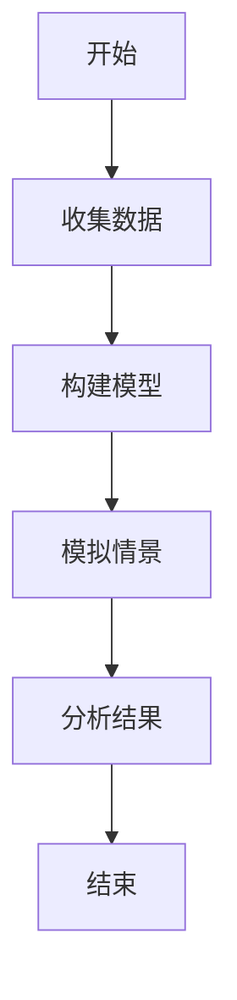
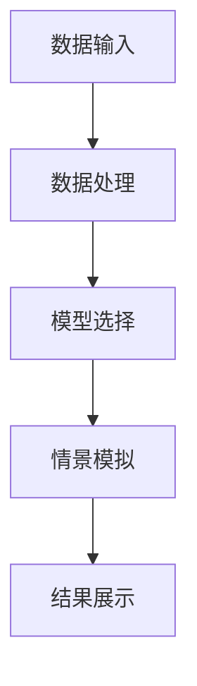
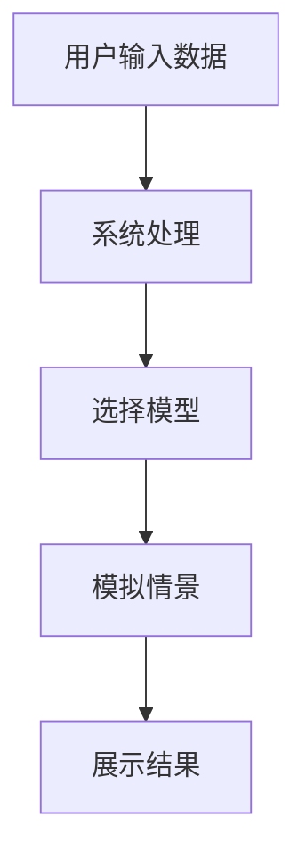

                 


# 彼得林奇对公司财务弹性的压力测试方法

> 关键词：彼得·林奇、财务弹性、压力测试、投资策略、风险管理

> 摘要：本文系统阐述了彼得·林奇在评估公司财务弹性时所采用的压力测试方法。通过分析压力测试的理论基础、算法原理、系统架构设计及项目实战案例，本文深入探讨了如何利用压力测试来评估公司的财务弹性，并结合实际案例为读者提供了详细的操作指南。同时，本文总结了压力测试在投资决策中的重要性，并展望了未来的研究方向。

---

# 目录

1. **引言**  
   1.1 背景介绍  
   1.2 问题描述  
   1.3 问题解决  
   1.4 边界与外延  

2. **理论基础**  
   2.1 财务弹性概念  
   2.2 压力测试方法  
   2.3 彼得·林奇的理论与实践  

3. **核心概念与联系**  
   3.1 压力测试原理  
   3.2 核心概念对比表  
   3.3 ER实体关系图  

4. **算法原理讲解**  
   4.1 压力测试步骤  
   4.2 算法流程图  
   4.3 数学模型与公式  

5. **系统分析与架构设计**  
   5.1 系统功能设计  
   5.2 系统架构图  
   5.3 接口与交互设计  

6. **项目实战**  
   6.1 环境与数据准备  
   6.2 模型实现与代码  
   6.3 实际案例分析  

7. **总结与展望**  
   7.1 内容总结  
   7.2 未来研究方向  
   7.3 实用建议与注意事项  

---

## 第1章: 引言

### 1.1 背景介绍

#### 1.1.1 经济环境的不确定性
在全球经济波动加剧的背景下，企业面临的财务风险日益复杂。经济环境的不确定性要求投资者具备更强的分析能力，以评估公司在极端情况下的生存能力。

#### 1.1.2 财务弹性的重要性
财务弹性是指公司在面对市场波动或其他压力时，能够保持财务健康并继续运营的能力。它是企业风险管理的核心内容之一。

#### 1.1.3 彼得·林奇投资策略的核心理念
彼得·林奇以其独特的投资策略闻名，他注重基本面分析，善于挖掘被低估的股票。他的压力测试方法强调对公司在极端情况下的财务弹性进行评估。

### 1.2 问题描述

#### 1.2.1 压力测试的基本概念
压力测试是一种评估公司在极端市场条件下财务表现的方法，旨在识别潜在风险并制定应对策略。

#### 1.2.2 财务弹性在压力测试中的作用
财务弹性是压力测试的核心指标，它反映了公司在面对负面冲击时的财务韧性。

#### 1.2.3 压力测试的目标与意义
压力测试的目标是评估公司在极端情况下的财务状况，帮助投资者制定更稳健的投资策略。

### 1.3 问题解决

#### 1.3.1 压力测试的方法论
压力测试包括情景分析、敏感性分析和VaR（在险价值）分析等多种方法，帮助投资者全面评估风险。

#### 1.3.2 财务弹性评估的核心步骤
包括数据收集、模型构建、情景模拟和结果分析等步骤，确保评估结果的准确性和可靠性。

#### 1.3.3 彼得·林奇压力测试的独特视角
彼得·林奇结合基本面分析和压力测试，强调对公司财务健康状况的全面评估。

### 1.4 边界与外延

#### 1.4.1 压力测试的适用范围
适用于所有类型的企业，尤其是那些在经济波动中容易受到冲击的行业。

#### 1.4.2 财务弹性评估的局限性
财务弹性评估依赖于假设条件，实际结果可能与假设不符。

#### 1.4.3 压力测试与其他财务分析方法的联系与区别
压力测试与其他方法（如盈利能力分析）既有联系，也有区别，它是专门针对极端情况的财务评估工具。

---

## 第2章: 理论基础

### 2.1 财务弹性概念

#### 2.1.1 财务弹性的定义
财务弹性是指公司在面对销售波动、原材料价格上涨或其他外部冲击时，能够保持财务健康并继续运营的能力。

#### 2.1.2 财务弹性的影响因素
包括公司资本结构、盈利能力、流动性管理、成本控制和市场环境等。

#### 2.1.3 财务弹性评估指标
常用的指标包括EBITDA利润率、流动比率、速动比率和债务-to-equity比率等。

### 2.2 压力测试方法

#### 2.2.1 压力测试的定义
压力测试是一种评估公司在极端市场条件下财务表现的方法，通常包括情景分析、敏感性分析和压力测试模型的构建。

#### 2.2.2 压力测试的类型
包括历史情景测试、假设情景测试和逆向压力测试，每种方法都有其独特的优势和适用场景。

#### 2.2.3 压力测试的步骤
包括数据收集、模型构建、情景模拟和结果分析等步骤，确保评估结果的准确性和可靠性。

### 2.3 彼得·林奇的理论与实践

#### 2.3.1 彼得·林奇的投资策略
彼得·林奇注重基本面分析，善于挖掘被低估的股票，他的投资策略强调对公司财务健康状况的全面评估。

#### 2.3.2 彼得·林奇的压力测试方法
他结合基本面分析和压力测试，强调对公司财务弹性进行评估，以识别潜在风险并制定应对策略。

#### 2.3.3 彼得·林奇方法的独特性
他的方法结合了定量分析和定性分析，注重对公司管理能力和市场地位的评估，以提高压力测试的准确性。

---

## 第3章: 核心概念与联系

### 3.1 压力测试原理

#### 3.1.1 压力测试的基本原理
压力测试通过模拟极端市场条件，评估公司在这些条件下的财务表现，识别潜在风险并制定应对策略。

#### 3.1.2 压力测试的核心要素
包括情景设定、数据输入、模型构建和结果分析等要素，确保评估结果的准确性和可靠性。

#### 3.1.3 压力测试的实施步骤
包括数据收集、模型构建、情景模拟和结果分析等步骤，确保评估结果的准确性和可靠性。

### 3.2 核心概念对比表

| 比较维度 | 压力测试 | 财务弹性评估 |
|----------|----------|--------------|
| 定义     | 模拟极端市场条件，评估公司财务表现 | 公司在面对销售波动、成本上升等外部冲击时的财务韧性 |
| 方法论   | 情景分析、敏感性分析 | 基于财务指标的分析 |
| 目标     | 识别潜在风险 | 评估公司在极端情况下的生存能力 |

### 3.3 ER实体关系图

```mermaid
erDiagram
    company {
        id : integer
        name : string
        industry : string
    }
    financialMetrics {
        id : integer
        revenue : float
        cost : float
        profit : float
    }
    pressureTestScenario {
        id : integer
        scenarioName : string
        assumption : string
    }
    companyFinancialMetrics {
        companyId : integer
        financialMetricId : integer
        value : float
    }
    companyPressureTestScenario {
        companyId : integer
        pressureTestScenarioId : integer
        result : string
    }
```

---

## 第4章: 算法原理讲解

### 4.1 压力测试步骤

#### 4.1.1 数据收集
收集公司历史财务数据、市场数据和行业数据，为压力测试提供基础。

#### 4.1.2 模型构建
选择合适的压力测试模型，包括情景分析、敏感性分析和VaR分析等。

#### 4.1.3 情景模拟
模拟极端市场条件，如经济衰退、油价上涨等，评估公司在这些条件下的财务表现。

#### 4.1.4 结果分析
分析压力测试结果，识别潜在风险并制定应对策略。

### 4.2 算法流程图



### 4.3 数学模型与公式

#### 4.3.1 VaR模型
$$ VaR = \mu + z \cdot \sigma $$
其中，$\mu$是平均值，$z$是标准正态分布的分位数，$\sigma$是标准差。

#### 4.3.2 CVaR模型
$$ CVaR = \frac{1}{\alpha} \int_{-\infty}^{VaR} (x - \mu) f(x) dx $$
其中，$\alpha$是置信水平，$f(x)$是概率密度函数。

#### 4.3.3 情景分析公式
$$ \text{情景收益} = \sum_{i=1}^{n} w_i \cdot r_i $$
其中，$w_i$是情景权重，$r_i$是情景收益。

---

## 第5章: 系统分析与架构设计

### 5.1 系统功能设计

#### 5.1.1 数据输入模块
允许用户输入公司历史财务数据、市场数据和行业数据，为压力测试提供基础。

#### 5.1.2 模型选择模块
提供多种压力测试模型，用户可以根据需求选择合适的方法。

#### 5.1.3 情景模拟模块
模拟极端市场条件，评估公司在这些条件下的财务表现。

#### 5.1.4 结果展示模块
展示压力测试结果，包括财务指标的变化、潜在风险和应对策略。

### 5.2 系统架构图



### 5.3 接口与交互设计

#### 5.3.1 API接口
定义接口，允许外部系统调用压力测试功能。

#### 5.3.2 用户界面
设计直观的用户界面，方便用户输入数据、选择模型和查看结果。

#### 5.3.3 交互流程图



---

## 第6章: 项目实战

### 6.1 环境与数据准备

#### 6.1.1 环境安装
安装必要的软件和工具，如Python、NumPy、Pandas和Matplotlib。

#### 6.1.2 数据准备
收集公司历史财务数据、市场数据和行业数据，为压力测试提供基础。

### 6.2 模型实现与代码

#### 6.2.1 数据处理
```python
import pandas as pd

# 读取数据
data = pd.read_csv('financial_data.csv')
print(data.head())
```

#### 6.2.2 模型实现
```python
import numpy as np
import matplotlib.pyplot as plt

# 计算VaR
mu = data['returns'].mean()
sigma = data['returns'].std()
z = np.percentile(data['returns'], 5)
VaR = mu + z * sigma
print(f'VaR: {VaR}')
```

#### 6.2.3 情景模拟
```python
# 定义情景
scenarios = ['经济衰退', '油价上涨', '销售下滑']
results = []

for scenario in scenarios:
    # 计算情景收益
    scenario_return = np.random.normal(mu, sigma)
    results.append(scenario_return)

print(results)
```

### 6.3 实际案例分析

#### 6.3.1 案例选择
选择一家制造业公司，分析其在经济衰退和销售下滑情景下的财务弹性。

#### 6.3.2 数据分析
通过压力测试模型，评估公司在极端情况下的财务表现。

#### 6.3.3 结果解读
根据测试结果，提出应对策略，如优化资本结构、提高流动性管理等。

---

## 第7章: 总结与展望

### 7.1 内容总结

本文系统阐述了彼得·林奇在评估公司财务弹性时所采用的压力测试方法。通过分析压力测试的理论基础、算法原理、系统架构设计及项目实战案例，本文深入探讨了如何利用压力测试来评估公司的财务弹性。

### 7.2 未来研究方向

未来的研究可以结合人工智能和大数据技术，进一步优化压力测试模型，提高评估的准确性和效率。

### 7.3 实用建议与注意事项

在实际应用中，需要注意数据的准确性和完整性，合理设定情景假设，确保压力测试结果的有效性。

---

通过以上步骤，我们可以全面了解彼得·林奇的压力测试方法，并将其应用到实际投资决策中，帮助投资者更好地应对市场波动和财务风险。

