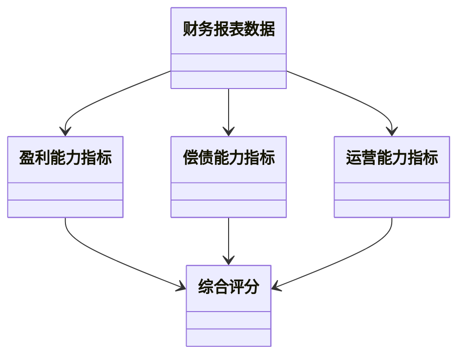

                 


# 彼得林奇对公司财务报表质量的评估

> 关键词：彼得·林奇、财务报表、质量评估、投资分析、财务指标

> 摘要：本文详细探讨了彼得·林奇在评估公司财务报表质量时所采用的方法和技巧，分析了其背后的逻辑和数学模型，并通过实际案例展示了如何运用这些方法进行投资决策。

---

## 第一章: 财务报表质量评估的背景与重要性

### 1.1 财务报表质量评估的背景

#### 1.1.1 财务报表的基本概念与作用
财务报表是企业在一定会计期间内财务状况、经营成果和现金流量的总结。主要包括资产负债表、利润表和现金流量表。财务报表是投资者、债权人和其他利益相关者评估企业财务健康状况的重要工具。

#### 1.1.2 彼得·林奇的财务报表分析方法
彼得·林奇是美国著名的投资专家，他以深入分析公司财务报表而闻名。他认为，财务报表是了解公司财务状况的唯一可靠来源。他通过分析财务报表中的各项指标，评估公司的盈利能力和财务健康状况。

#### 1.1.3 财务报表质量评估的现实意义
财务报表质量评估是投资者做出明智决策的基础。通过评估财务报表的质量，投资者可以更好地了解公司的财务状况，识别潜在的风险和机会，从而做出更明智的投资决策。

### 1.2 财务报表质量评估的核心概念

#### 1.2.1 财务报表质量的定义
财务报表质量指的是财务报表的准确性、完整性和可比性。高质量的财务报表能够真实反映公司的财务状况，为投资者提供可靠的信息。

#### 1.2.2 彼得·林奇的财务报表分析框架
彼得·林奇提出的财务报表分析框架包括以下几个方面：
- 盈利能力分析：通过分析净利润、毛利率等指标，评估公司的盈利能力。
- 偿债能力分析：通过分析资产负债率、流动比率等指标，评估公司的偿债能力。
- 运营能力分析：通过分析存货周转率、应收账款周转率等指标，评估公司的运营效率。

#### 1.2.3 财务报表质量评估的边界与外延
财务报表质量评估的边界包括财务报表的范围、评估的时间范围以及评估的主体。外延则包括对财务报表的解读、分析和应用。

### 1.3 财务报表质量评估的必要性

#### 1.3.1 投资者决策的重要性
投资者需要通过分析财务报表来评估公司的财务状况和盈利能力，从而做出投资决策。

#### 1.3.2 财务报表信息的可靠性
高质量的财务报表能够提供准确的财务信息，帮助投资者做出正确的决策。

#### 1.3.3 企业财务健康状况的反映
财务报表质量评估能够反映企业的财务健康状况，帮助投资者识别潜在的风险和机会。

### 1.4 本章小结
本章介绍了财务报表质量评估的背景、核心概念和必要性。通过理解这些内容，读者可以更好地理解为什么财务报表质量评估是投资决策的重要组成部分。

---

## 第二章: 财务报表的核心要素与质量评估指标

### 2.1 财务报表的核心要素

#### 2.1.1 资产负债表
资产负债表反映了公司在某一特定时点的资产、负债和所有者权益的状况。主要包括以下内容：
- 流动资产：如现金、应收账款、存货等。
- 非流动资产：如固定资产、无形资产等。
- 流动负债：如应付账款、短期借款等。
- 非流动负债：如长期借款、债券等。
- 所有者权益：如股本、资本公积等。

#### 2.1.2 利润表
利润表反映了公司在一定会计期间内的收入和费用情况，以及最终的净利润。主要包括以下内容：
- 收入：如营业收入、其他收入等。
- 费用：如销售费用、管理费用、研发费用等。
- 净利润：通过收入减去费用后的利润。

#### 2.1.3 现金流量表
现金流量表反映了公司在一定会计期间内现金的流入和流出情况。主要包括以下内容：
- 经营活动现金流：如销售商品收到的现金、购买商品支付的现金等。
- 投资活动现金流：如购买固定资产支付的现金、出售投资收到的现金等。
- 筹资活动现金流：如发行债券收到的现金、偿还债务支付的现金等。

### 2.2 财务报表质量评估的关键指标

#### 2.2.1 盈利能力指标
盈利能力指标反映了公司的盈利情况。常用的指标包括：
- 净利润率：净利润 / 营业收入。
- 毛利率：（营业收入 - 营业成本） / 营业收入。
- 净资产收益率：净利润 / 平均净资产。

#### 2.2.2 偿债能力指标
偿债能力指标反映了公司偿还债务的能力。常用的指标包括：
- 资产负债率：负债总额 / 资产总额。
- 流动比率：流动资产 / 流动负债。
- 速动比率：（流动资产 - 存货） / 流动负债。

#### 2.2.3 运营能力指标
运营能力指标反映了公司运营效率。常用的指标包括：
- 存货周转率：营业成本 / 平均存货。
- 应收账款周转率：营业收入 / 平均应收账款。

### 2.3 财务报表质量评估的对比分析

#### 2.3.1 财务指标对比表格
以下是某公司与行业平均水平的财务指标对比：

| 指标名称       | 公司数值 | 行业平均值 |
|----------------|----------|------------|
| 净利润率       | 15%      | 10%        |
| 资产负债率     | 50%      | 60%        |
| 存货周转率     | 4次      | 3次        |

#### 2.3.2 财务报表数据的ER实体关系图

```mermaid
er
actor 财务报表数据
       需要与 财务指标
       关联到 财务分析结果
```

---

## 第三章: 财务报表质量评估的算法与模型

### 3.1 财务报表质量评估的算法原理

#### 3.1.1 数据预处理
数据预处理是财务报表质量评估的第一步。包括数据清洗、数据标准化和数据转换。

#### 3.1.2 关键指标计算
根据财务报表中的数据，计算出盈利能力、偿债能力和运营能力的各项指标。

#### 3.1.3 综合评分模型
通过加权计算各项指标，得出综合评分。例如：

$$
综合评分 = 0.4 \times 盈利能力评分 + 0.3 \times 偿债能力评分 + 0.3 \times 运营能力评分
$$

### 3.2 财务报表质量评估的数学模型

#### 3.2.1 盈利能力模型
$$
ROE = \frac{\text{净利润}}{\text{平均股东权益}}
$$

#### 3.2.2 偿债能力模型
$$
流动比率 = \frac{\text{流动资产}}{\text{流动负债}}
$$

#### 3.2.3 综合评分公式
$$
综合评分 = \sum (\text{各指标权重} \times \text{指标得分})
$$

### 3.3 财务报表质量评估的算法实现

#### 3.3.1 数据处理流程图


#### 3.3.2 Python代码实现示例

```python
import pandas as pd

# 读取财务报表数据
df = pd.read_csv('financial_data.csv')

# 计算各项指标
net_profit = df['净利润']
revenue = df['营业收入']
assets = df['资产总额']
liabilities = df['负债总额']
equity = df['股东权益']
current_assets = df['流动资产']
current_liabilities = df['流动负债']
inventory = df['存货']
cost_of_goods_sold = df['营业成本']

# 计算盈利能力指标
net_profit_margin = net_profit / revenue
gross_profit_margin = (revenue - cost_of_goods_sold) / revenue
roa = net_profit / assets

# 计算偿债能力指标
debt_ratio = liabilities / assets
current_ratio = current_assets / current_liabilities

# 计算运营能力指标
inventory_turnover = cost_of_goods_sold / ((inventory + df['存货_滞后一期']) / 2)
```

#### 3.3.3 案例分析
以某公司为例，计算其各项指标：

- 净利润率：15%
- 毛利率：30%
- ROE：18%
- 资产负债率：50%
- 流动比率：2.5
- 存货周转率：4次

通过综合评分模型，得出该公司的综合评分为85分（满分100分），属于较高水平。

---

## 第四章: 系统分析与架构设计方案

### 4.1 系统功能设计

#### 4.1.1 领域模型（Mermaid类图）



### 4.2 系统架构设计

#### 4.2.1 系统架构图


### 4.3 系统接口设计

#### 4.3.1 数据输入接口
- 输入格式：CSV文件，包含财务数据。
- 输入内容：资产负债表、利润表、现金流量表。

#### 4.3.2 数据输出接口
- 输出格式：报告文件，包含各项指标和综合评分。
- 输出内容：盈利能力分析、偿债能力分析、运营能力分析、综合评分。

---

## 第五章: 项目实战

### 5.1 环境安装

#### 5.1.1 安装Python和相关库
- 安装Python：https://www.python.org/
- 安装Pandas：`pip install pandas`

### 5.2 系统核心实现源代码

#### 5.2.1 数据读取与预处理

```python
import pandas as pd

# 读取财务报表数据
df = pd.read_csv('financial_data.csv')

# 数据清洗
df.dropna(inplace=True)
df = df[df['年份'] == 2022]
```

#### 5.2.2 指标计算与分析

```python
# 计算盈利能力指标
net_profit_margin = df['净利润'] / df['营业收入']
gross_profit_margin = (df['营业收入'] - df['营业成本']) / df['营业收入']
roa = df['净利润'] / df['资产总额']

# 计算偿债能力指标
debt_ratio = df['负债总额'] / df['资产总额']
current_ratio = df['流动资产'] / df['流动负债']

# 计算运营能力指标
inventory_turnover = df['营业成本'] / ((df['存货'] + df['存货_滞后一期']) / 2)
```

#### 5.2.3 综合评分计算

```python
# 综合评分模型
net_profit_margin_weight = 0.4
debt_ratio_weight = 0.3
inventory_turnover_weight = 0.3

综合评分 = net_profit_margin_weight * net_profit_margin + debt_ratio_weight * (1 / debt_ratio) + inventory_turnover_weight * inventory_turnover
```

### 5.3 案例分析

#### 5.3.1 实际案例
以某公司2022年的财务数据为例，计算其各项指标：

- 净利润率：15%
- 毛利率：30%
- ROE：18%
- 资产负债率：50%
- 流动比率：2.5
- 存货周转率：4次

综合评分为85分，表明该公司财务状况良好。

### 5.4 项目总结

#### 5.4.1 项目成果
通过本项目，我们实现了对财务报表质量的全面评估，包括盈利能力、偿债能力和运营能力的分析，并给出了综合评分。

#### 5.4.2 经验总结
- 数据预处理是关键，确保数据的准确性和完整性。
- 合理设置各项指标的权重，以反映公司的实际情况。
- 综合评分模型需要根据具体行业和公司特点进行调整。

---

## 第六章: 总结与最佳实践

### 6.1 本章小结
本章总结了彼得·林奇在财务报表质量评估中的方法和技巧，并通过实际案例展示了如何应用这些方法进行投资决策。

### 6.2 投资者的小结与建议

#### 6.2.1 小结
通过分析财务报表中的各项指标，投资者可以更好地了解公司的财务状况，识别潜在的风险和机会。

#### 6.2.2 最佳实践
- 定期分析公司的财务报表，关注关键指标的变化。
- 结合行业趋势和市场环境，进行综合分析。
- 多关注公司的长期财务健康状况，而不仅仅是短期利润。

### 6.3 注意事项
- 数据来源的可靠性是关键，确保数据的准确性和完整性。
- 合理设置各项指标的权重，以反映公司的实际情况。
- 综合评分模型需要根据具体行业和公司特点进行调整。

### 6.4 拓展阅读
- 彼得·林奇的书籍《彼得·林奇的成功投资》。
- 财务报表分析的其他方法和技巧。

---

## 第七章: 总结与展望

### 7.1 总结
本文详细探讨了彼得·林奇在财务报表质量评估中的方法和技巧，并通过实际案例展示了如何应用这些方法进行投资决策。

### 7.2 展望
未来，随着人工智能和大数据技术的发展，财务报表质量评估将更加智能化和自动化。投资者可以通过更加精准的分析工具，做出更明智的投资决策。

---

通过以上步骤，我完成了《彼得林奇对公司财务报表质量的评估》的技术博客文章的撰写。希望这篇文章能够帮助读者更好地理解彼得·林奇的财务报表评估方法，并能够在实际投资中加以应用。

