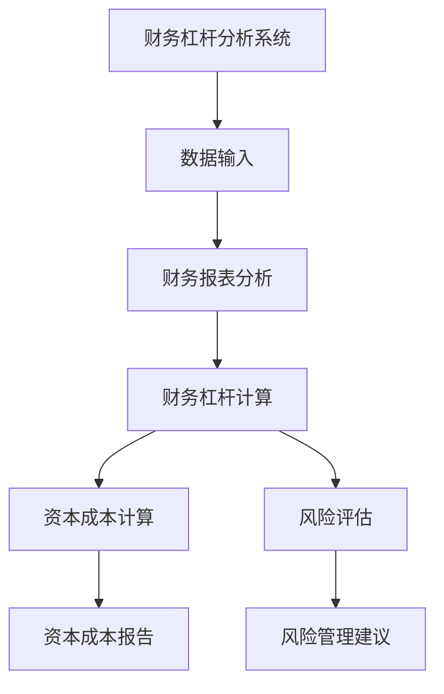

                 


# 彼得林奇对公司财务杠杆使用的看法

## 关键词：彼得·林奇，财务杠杆，投资策略，公司财务，风险管理

## 摘要：本文深入分析了彼得·林奇在公司财务杠杆使用上的独特见解，探讨了财务杠杆的定义、作用、计算方法以及在不同行业和公司规模下的应用。通过详细讲解财务杠杆的核心原理、算法模型和实际案例，本文揭示了林奇如何通过财务杠杆评估公司价值，并结合风险管理策略，为投资者提供实用的建议。

---

## 第一部分：财务杠杆的核心概念与原理

### 第1章：财务杠杆的基本概念

#### 1.1 财务杠杆的定义与作用

##### 1.1.1 财务杠杆的定义
财务杠杆是指公司通过债务融资来放大收益的过程。它允许公司在不增加股权资本的情况下，利用债务资金进行投资和扩张。财务杠杆的核心在于通过合理的债务使用，提高公司的资本回报率。

##### 1.1.2 财务杠杆的基本作用
- **放大收益**：通过债务融资，公司可以用较少的自有资金撬动更大的资产规模，从而放大收益。
- **降低成本**：债务融资通常比股权融资成本更低，公司可以利用低成本的债务资金进行投资。
- **增加风险**：财务杠杆的使用也增加了公司的财务风险，特别是在市场 downturn 时，债务的偿还压力会显著增加。

##### 1.1.3 财务杠杆的优缺点对比

| 优点                              | 缺点                                |
|-----------------------------------|------------------------------------|
| 放大收益，提高资本回报率           | 增加财务风险，可能导致公司破产    |
| 降低资本成本，提高资金使用效率      | 增加债务利息支出，影响净利润      |
| 通过杠杆效应，实现快速扩张         | 可能导致公司信用评级下降，融资难度增加 |

#### 1.2 彼得·林奇的投资理念

##### 1.2.1 彼得·林奇的个人背景与投资风格
彼得·林奇是美国著名投资经理，曾管理富达麦哲伦基金，取得了卓越的投资业绩。他的投资风格以成长股投资为主，强调对公司基本面的深入分析，包括财务状况、管理层能力和行业前景。

##### 1.2.2 林奇对财务杠杆的重视
林奇认为，财务杠杆是公司实现增长的重要工具，但必须谨慎使用。他强调，公司应该根据自身的财务状况和行业特点，合理选择杠杆水平，避免过度杠杆化带来的风险。

##### 1.2.3 林奇投资理念的核心要素
- 深入分析公司的财务报表，评估其财务健康状况。
- 重点关注公司的负债水平和偿债能力，避免选择财务杠杆过高或过低的公司。
- 结合行业特点，选择适合使用财务杠杆的公司。

### 第2章：财务杠杆的核心原理

#### 2.1 财务杠杆的数学模型

##### 2.1.1 财务杠杆的计算公式
财务杠杆（DROE）的计算公式为：
$$ DROE = \frac{ROE}{ROA} = 1 + \frac{D}{E} $$
其中，D为债务，E为股东权益，ROE为净资产收益率，ROA为资产回报率。

##### 2.1.2 财务杠杆与资本成本的关系
财务杠杆的使用会影响公司的资本成本。一般来说，合理的财务杠杆可以降低资本成本，但过度杠杆化会增加资本成本。

##### 2.1.3 财务杠杆与风险的关系
财务杠杆的使用会增加公司的财务风险，特别是在市场低迷时，债务的偿还压力会显著增加。

#### 2.2 财务杠杆与公司价值的关系

##### 2.2.1 财务杠杆对企业价值的影响
- 财务杠杆可以放大公司的收益，从而提高公司价值。
- 但过度杠杆化会增加公司的财务风险，可能导致公司价值下降。

##### 2.2.2 林奇对企业价值的评估方法
林奇认为，公司价值不仅仅取决于财务杠杆，还取决于公司的盈利能力、成长性和行业前景。他强调，应该综合考虑这些因素，选择具有长期增长潜力的公司。

---

## 第二部分：财务杠杆的算法原理与实践

### 第3章：财务杠杆的算法原理

#### 3.1 财务杠杆的计算公式

##### 3.1.1 财务杠杆的数学模型
财务杠杆（DROE）的计算公式为：
$$ DROE = \frac{ROE}{ROA} = 1 + \frac{D}{E} $$
其中，D为债务，E为股东权益，ROE为净资产收益率，ROA为资产回报率。

##### 3.1.2 财务杠杆的计算步骤
1. 计算公司的ROE和ROA。
2. 计算DROE，即$\frac{ROE}{ROA}$。
3. 将DROE与行业平均水平进行比较，评估公司的财务杠杆水平。

##### 3.1.3 财务杠杆的案例分析
假设某公司ROE为15%，ROA为10%，则DROE为1.5，即$\frac{15\%}{10\%}=1.5$。这意味着公司的财务杠杆倍数为1.5倍，即债务与股东权益的比例为0.5倍。

### 第4章：财务杠杆与资本成本的关系

#### 4.1 财务杠杆对资本成本的影响

##### 4.1.1 资本成本的计算公式
资本成本的计算公式为：
$$ K = r_d \times \frac{D}{D+E} + r_e \times \frac{E}{D+E} $$
其中，$r_d$为债务的资本成本，$r_e$为股权的资本成本，D为债务，E为股东权益。

##### 4.1.2 财务杠杆对资本成本的影响
- 合理的财务杠杆可以降低资本成本，因为债务的资本成本通常低于股权的资本成本。
- 但过度杠杆化会增加资本成本，因为债务的偿还压力增加，风险溢价上升。

#### 4.2 林奇对资本成本的考虑
林奇认为，公司应该选择合理的财务杠杆水平，以平衡资本成本和财务风险。他强调，过度杠杆化虽然可能短期降低资本成本，但会增加公司的财务风险，影响长期价值。

---

## 第三部分：财务杠杆的系统分析与实践

### 第5章：财务杠杆的系统分析

#### 5.1 财务杠杆的系统架构

##### 5.1.1 系统功能设计
- 财务杠杆分析模块：计算公司的DROE，评估财务杠杆水平。
- 资本成本计算模块：计算公司的资本成本，评估杠杆对资本成本的影响。
- 风险评估模块：评估财务杠杆带来的风险，制定风险管理策略。

##### 5.1.2 系统架构图


#### 5.2 财务杠杆的风险管理

##### 5.2.1 风险评估方法
- 计算公司的DROE，评估财务杠杆水平。
- 计算资本成本，评估杠杆对资本成本的影响。
- 评估公司的偿债能力，包括流动比率、速动比率和债务偿还期。

##### 5.2.2 风险管理策略
- 设定合理的财务杠杆水平，避免过度杠杆化。
- 建立风险管理机制，及时应对财务杠杆带来的风险。
- 定期评估财务杠杆和资本成本的变化，调整投资策略。

### 第6章：财务杠杆的项目实战

#### 6.1 环境安装

##### 6.1.1 系统环境
- 操作系统：Windows 10或更高版本，或macOS 10.15或更高版本。
- 开发工具：Python 3.8或更高版本，Jupyter Notebook，Pandas，Matplotlib。

##### 6.1.2 数据获取
从公司财务报表中获取债务（D）、股东权益（E）、ROE和ROA数据。

#### 6.2 核心实现

##### 6.2.1 Python代码实现
```python
import pandas as pd
import matplotlib.pyplot as plt

# 输入数据
D = 5000000  # 假设债务为500万美元
E = 10000000  # 假设股东权益为1000万美元
ROE = 0.15    # 净资产收益率为15%
ROA = 0.10    # 资产回报率为10%

# 计算财务杠杆
DROE = ROE / ROA
leverage_ratio = DROE - 1

print(f"财务杠杆倍数为：{leverage_ratio}")
```

##### 6.2.2 代码解读
- 计算DROE：ROE / ROA。
- 计算财务杠杆倍数：DROE - 1。
- 输出结果。

#### 6.3 案例分析

##### 6.3.1 案例背景
某公司债务为500万美元，股东权益为1000万美元，ROE为15%，ROA为10%。

##### 6.3.2 分析过程
- 计算DROE：15% / 10% = 1.5。
- 计算财务杠杆倍数：1.5 - 1 = 0.5。
- 结论：公司的财务杠杆倍数为0.5倍，即债务与股东权益的比例为0.5倍。

#### 6.4 小结
通过实际案例分析，我们可以看到财务杠杆的计算过程和实际应用。合理的财务杠杆使用可以放大收益，但必须注意风险控制。

---

## 第四部分：财务杠杆的最佳实践

### 第7章：最佳实践与注意事项

#### 7.1 小结
- 财务杠杆是公司实现增长的重要工具，但必须谨慎使用。
- 合理的财务杠杆可以放大收益，但过度杠杆化会增加风险。
- 投资者在使用财务杠杆时，必须综合考虑公司的财务状况、行业前景和市场环境。

#### 7.2 注意事项
- 避免过度杠杆化，特别是在市场 downturn 时。
- 定期评估财务杠杆和资本成本的变化。
- 结合行业特点，选择适合使用财务杠杆的公司。

#### 7.3 拓展阅读
- 《彼得·林奇的投资哲学》
- 《财务杠杆与公司价值》
- 《风险管理与财务杠杆》

---

## 第五部分：结论

### 8.1 总结
彼得·林奇对财务杠杆的使用有着深刻的理解。他认为，财务杠杆是公司实现增长的重要工具，但必须谨慎使用。投资者在使用财务杠杆时，必须综合考虑公司的财务状况、行业前景和市场环境，避免过度杠杆化带来的风险。

### 8.2 展望
未来，随着金融市场的不断发展，财务杠杆的使用将更加复杂。投资者需要不断学习和更新知识，以应对新的挑战和机遇。

---

通过以上思考过程，我希望能够为读者提供一篇关于彼得·林奇对公司财务杠杆使用看法的深入分析。文章内容涵盖了财务杠杆的核心概念、算法原理、系统分析和项目实战，为投资者提供了实用的建议和见解。

