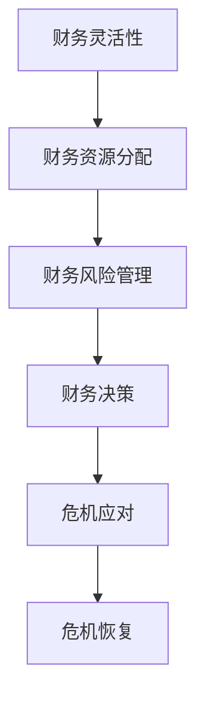
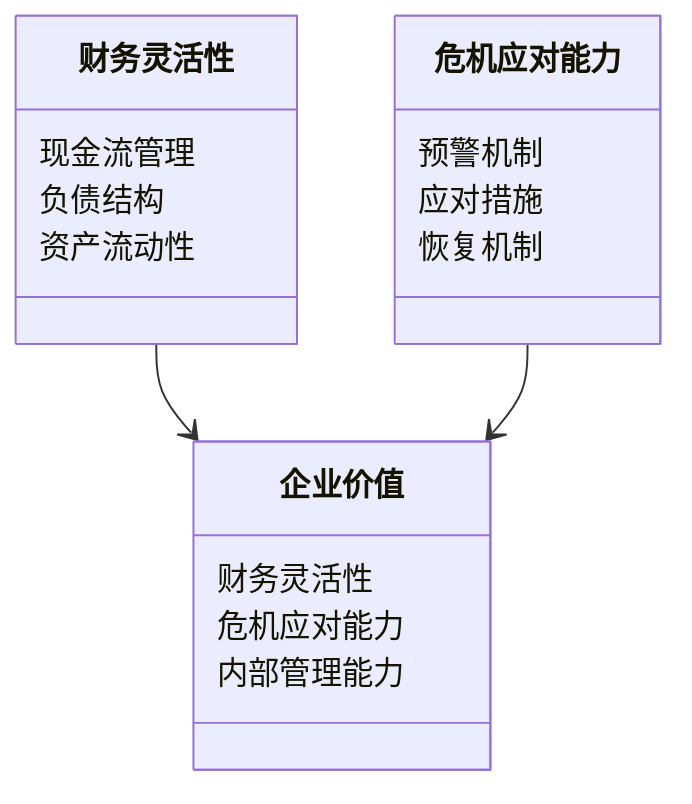
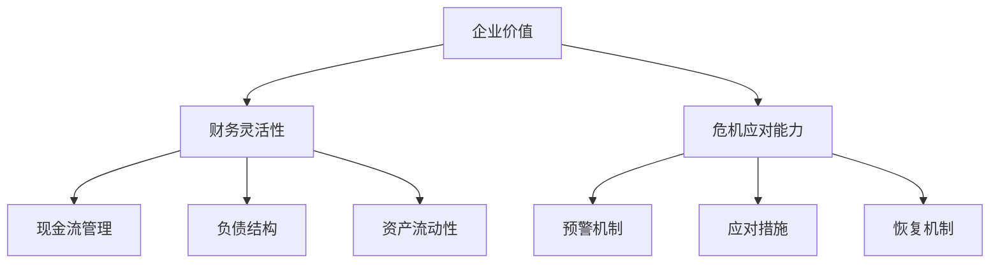
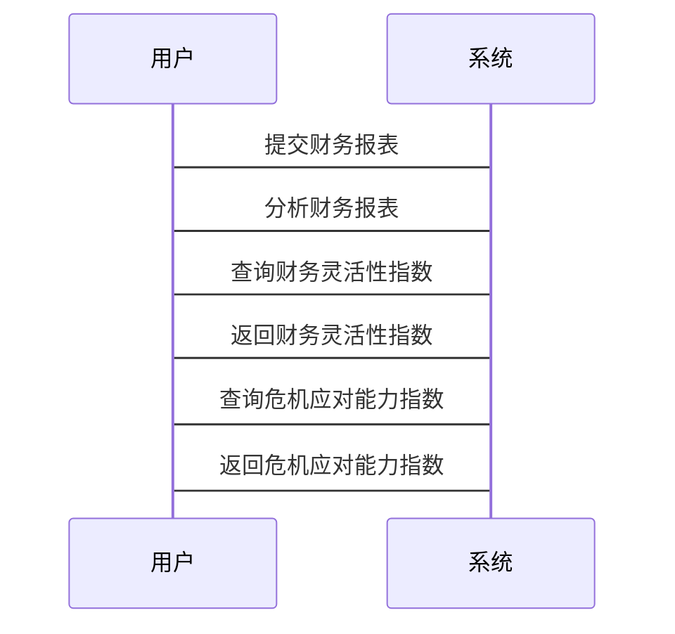

                 


# 彼得林奇对公司财务灵活性与危机应对能力的案例研究

## 关键词：财务灵活性，危机应对能力，彼得·林奇，财务分析，风险管理

## 摘要：本文通过分析彼得·林奇的投资理念和财务分析方法，探讨了财务灵活性与危机应对能力之间的关系，并结合经典案例进行深入剖析。文章详细介绍了财务灵活性的核心要素、危机应对能力的特征，以及如何通过系统架构和数学模型提升企业的财务健康状况和应对危机的能力。

---

## 第1章：财务灵活性与危机应对能力的定义与重要性

### 1.1 财务灵活性的定义与核心要素

财务灵活性是指企业在面对市场变化、经济波动或其他不确定因素时，能够迅速调整其财务结构和资源分配，以维持或提升自身竞争力和生存能力的能力。它涵盖了企业在资金管理、负债结构、资产流动性等多个方面的灵活性。

#### 财务灵活性的核心要素

- **现金流管理**：企业能否维持稳定的现金流，是财务灵活性的重要指标。现金流的稳定性直接影响企业应对突发事件的能力。
- **负债结构**：合理的负债结构能够为企业提供资金支持，同时避免过高负债带来的风险。
- **资产流动性**：资产的流动性决定了企业能否在短时间内将资产转化为现金，以应对紧急情况。

### 1.2 危机应对能力的定义与特征

危机应对能力是指企业在面对突发事件或重大挑战时，能够迅速采取有效措施，减少损失并尽快恢复正常运营的能力。它涉及企业内部的组织架构、决策机制和资源分配等多个方面。

#### 危机应对能力的特征

- **预见性**：企业需要具备预测危机的能力，建立预警机制，提前做好应对准备。
- **快速反应**：在危机发生时，企业需要迅速做出反应，采取有效的应对措施。
- **资源分配**：合理分配资源，确保关键部门能够得到足够的支持，同时避免资源浪费。

### 1.3 财务灵活性与危机应对能力的内在联系

财务灵活性与危机应对能力密切相关。企业只有具备较强的财务灵活性，才能在危机发生时迅速调整财务结构，确保有足够的资金支持应对措施。同时，有效的危机应对能力也能够反过来提升企业的财务灵活性，增强企业的整体抗风险能力。

---

## 第2章：彼得·林奇的财务分析框架

### 2.1 彼得·林奇的投资理念

彼得·林奇以其独特的投资理念闻名。他认为，成功的投资不仅仅依赖于市场趋势，更依赖于对企业基本面的深入分析。他特别关注企业的财务报表，通过分析企业的盈利能力、资产状况和负债情况，来判断企业的财务健康状况。

#### 彼得·林奇的投资哲学

- **长期投资**：彼得·林奇主张长期投资，关注企业的长期发展，而不是短期市场波动。
- **价值投资**：他注重寻找那些具有长期增长潜力的企业，而不是那些仅靠市场炒作的企业。
- **基本面分析**：他强调对企业财务报表的深入分析，包括收入、利润、负债等方面。

### 2.2 彼得·林奇的财务分析方法

彼得·林奇的财务分析方法以细致入微著称。他通过分析财务比率、现金流和财务风险等指标，来评估企业的财务健康状况和潜在风险。

#### 2.2.1 财务比率分析

财务比率是评估企业财务状况的重要工具。彼得·林奇常用的财务比率包括：

- **流动比率**：流动资产与流动负债的比率，用于评估企业的短期偿债能力。
  $$ \text{流动比率} = \frac{\text{流动资产}}{\text{流动负债}} $$
- **速动比率**：流动资产减去存货，再除以流动负债，用于更准确地评估企业的短期偿债能力。
  $$ \text{速动比率} = \frac{\text{流动资产} - \text{存货}}{\text{流动负债}} $$
- **负债率**：负债总额与资产总额的比率，用于评估企业的财务杠杆和风险。
  $$ \text{负债率} = \frac{\text{负债总额}}{\text{资产总额}} $$

#### 2.2.2 现金流分析

现金流是企业财务健康状况的重要指标。彼得·林奇非常关注企业的经营活动现金流，认为健康的现金流是企业长期发展的基础。

- **经营活动现金流**：企业通过日常经营活动产生的现金流，反映了企业的盈利能力和资金流动性。
  $$ \text{经营活动现金流} = \text{营业收入} - \text{经营成本} $$

#### 2.2.3 财务风险评估

财务风险评估是彼得·林奇分析企业财务状况的重要环节。他通过分析企业的负债结构、流动比率和速动比率等指标，来评估企业的财务风险。

- **财务风险评估**：综合考虑企业的负债水平、现金流状况和资产流动性等因素，评估企业的财务健康状况和抗风险能力。

### 2.3 彼得·林奇的危机应对策略

在危机发生时，彼得·林奇的危机应对策略主要包括预警机制、快速反应和恢复与改进三个阶段。

#### 2.3.1 危机前的预警机制

彼得·林奇非常注重危机的预警机制，他认为，及时发现潜在危机是避免危机扩大的关键。他通过定期分析企业的财务报表和市场环境，来识别潜在的风险因素。

- **财务预警指标**：包括流动比率、速动比率、负债率等财务指标的变化，以及企业收入和利润的波动。
- **市场预警指标**：包括行业趋势、市场竞争状况和宏观经济环境的变化。

#### 2.3.2 危机中的应对措施

在危机发生时，彼得·林奇主张采取以下应对措施：

- **保持现金流稳定**：确保企业有足够的现金流来应对危机，避免因资金链断裂而陷入困境。
- **优化负债结构**：通过调整负债结构，降低财务杠杆，减少财务风险。
- **加强内部管理**：优化企业内部管理流程，提高运营效率，降低运营成本。

#### 2.3.3 危机后的恢复与改进

危机过后，彼得·林奇主张通过总结经验教训，改进企业内部管理，提升企业的财务灵活性和危机应对能力。

- **经验总结**：分析危机发生的原因，总结应对措施的有效性，为未来应对类似危机提供参考。
- **内部管理改进**：优化企业内部管理流程，提高运营效率，降低运营成本。
- **财务结构优化**：进一步优化企业的财务结构，提高财务灵活性和抗风险能力。

---

## 第3章：财务灵活性与危机应对能力的系统分析

### 3.1 财务灵活性的系统构成

财务灵活性的系统构成主要包括财务资源分配、财务风险管理、财务决策等方面。

#### 3.1.1 财务资源分配

- **资金分配**：根据企业的发展需求，合理分配资金，确保关键部门能够得到足够的支持。
- **资产配置**：根据市场环境和企业战略，合理配置资产，提高资产的流动性。

#### 3.1.2 财务风险管理

- **风险识别**：识别潜在的财务风险，包括市场风险、信用风险和操作风险等。
- **风险评估**：评估各种风险的影响程度，制定相应的风险管理策略。
- **风险控制**：通过建立风险管理机制，控制各种风险的发生和扩大。

#### 3.1.3 财务决策

- **投资决策**：根据企业的财务状况和市场环境，制定合理的投资计划。
- **融资决策**：根据企业的资金需求和市场环境，制定合理的融资计划。
- **股利政策**：根据企业的盈利能力和股东需求，制定合理的股利政策。

### 3.2 危机应对能力的系统架构

危机应对能力的系统架构主要包括危机预警机制、危机应对措施和危机恢复机制等方面。

#### 3.2.1 危机预警机制

- **预警指标**：包括财务指标和市场指标，用于及时发现潜在危机。
- **预警系统**：建立完善的预警系统，确保企业能够及时发现和应对潜在危机。

#### 3.2.2 危机应对措施

- **快速反应**：在危机发生时，迅速采取有效的应对措施，减少损失。
- **资源分配**：合理分配资源，确保关键部门能够得到足够的支持。
- **内部管理**：优化企业内部管理流程，提高运营效率，降低运营成本。

#### 3.2.3 危机恢复机制

- **恢复计划**：制定详细的恢复计划，确保企业能够尽快恢复正常运营。
- **经验总结**：总结危机应对的经验和教训，为未来应对类似危机提供参考。
- **内部管理改进**：优化企业内部管理流程，提高运营效率，降低运营成本。

### 3.3 系统架构的Mermaid流程图

以下是财务灵活性与危机应对能力的系统架构的Mermaid流程图：



---

## 第4章：财务灵活性与危机应对能力的数学模型

### 4.1 财务灵活性的数学模型

#### 4.1.1 财务灵活性指数的计算公式

财务灵活性指数是衡量企业财务灵活性的重要指标，其计算公式如下：

$$ \text{财务灵活性指数} = \frac{\text{经营活动现金流}}{\text{流动负债}} $$

#### 4.1.2 财务灵活性与企业价值的关系模型

企业价值与财务灵活性密切相关，其关系模型可以表示为：

$$ \text{企业价值} = \text{财务灵活性} \times \text{企业规模} \times \text{行业地位} $$

### 4.2 危机应对能力的数学模型

#### 4.2.1 危机应对能力指数的计算公式

危机应对能力指数是衡量企业危机应对能力的重要指标，其计算公式如下：

$$ \text{危机应对能力指数} = \frac{\text{危机应对措施的有效性}}{\text{危机发生频率}} $$

#### 4.2.2 危机应对能力与企业生存能力的关系模型

企业生存能力与危机应对能力密切相关，其关系模型可以表示为：

$$ \text{企业生存能力} = \text{危机应对能力} \times \text{财务灵活性} \times \text{内部管理能力} $$

---

## 第5章：彼得·林奇的危机应对策略与案例分析

### 5.1 彼得·林奇的经典案例

彼得·林奇在职业生涯中处理过多个危机案例，以下是其中一个经典案例：

#### 5.1.1 某公司的危机应对案例

在某公司面临财务危机时，彼得·林奇通过深入分析公司的财务报表，发现公司存在较高的负债率和较低的现金流。他建议公司采取以下措施：

- **优化负债结构**：通过调整负债结构，降低财务杠杆，减少财务风险。
- **提高现金流**：通过优化经营流程，提高经营活动现金流，确保公司有足够的资金应对危机。
- **加强内部管理**：优化企业内部管理流程，提高运营效率，降低运营成本。

### 5.2 案例分析与总结

通过上述案例，可以看出，彼得·林奇的危机应对策略非常注重财务灵活性和内部管理能力的提升。他通过优化负债结构、提高现金流和加强内部管理，帮助公司成功应对了危机，恢复了财务健康。

---

## 第6章：系统分析与架构设计方案

### 6.1 系统功能设计

#### 6.1.1 领域模型

以下是财务灵活性与危机应对能力的领域模型：



### 6.2 系统架构设计

#### 6.2.1 系统架构图

以下是财务灵活性与危机应对能力的系统架构图：



### 6.3 系统交互设计

以下是系统交互的Mermaid序列图：



---

## 第7章：项目实战与最佳实践

### 7.1 项目实战

#### 7.1.1 环境安装

为了进行财务灵活性与危机应对能力的分析，需要安装以下工具：

- **财务分析工具**：如Excel、Python的Pandas库等。
- **数据分析工具**：如Python的NumPy库、Matplotlib库等。
- **流程图工具**：如Mermaid、Lucidchart等。

#### 7.1.2 核心实现源代码

以下是财务灵活性指数和危机应对能力指数的Python实现代码：

```python
import pandas as pd
import numpy as np

# 财务灵活性指数计算
def calculate_financial_flexibility(current_cash_flow, current_liabilities):
    return current_cash_flow / current_liabilities

# 危机应对能力指数计算
def calculate_crisis_response_capability(effective_responses, crisis_frequency):
    return effective_responses / crisis_frequency

# 示例数据
data = {
    '公司名称': ['公司A', '公司B', '公司C'],
    '经营活动现金流': [100, 150, 200],
    '流动负债': [50, 75, 100],
    '危机应对措施的有效性': [80, 90, 70],
    '危机发生频率': [10, 15, 5]
}

# 数据框
df = pd.DataFrame(data)

# 计算财务灵活性指数
df['财务灵活性指数'] = df.apply(lambda x: calculate_financial_flexibility(x['经营活动现金流'], x['流动负债']), axis=1)

# 计算危机应对能力指数
df['危机应对能力指数'] = df.apply(lambda x: calculate_crisis_response_capability(x['危机应对措施的有效性'], x['危机发生频率']), axis=1)

print(df)
```

#### 7.1.3 代码应用解读与分析

上述代码通过读取企业的财务数据和危机应对数据，计算企业的财务灵活性指数和危机应对能力指数。财务灵活性指数反映了企业的财务灵活性，危机应对能力指数反映了企业的危机应对能力。

### 7.2 最佳实践 Tips

- **定期财务分析**：企业应定期进行财务分析，及时发现潜在问题。
- **优化财务结构**：通过优化财务结构，提高企业的财务灵活性和抗风险能力。
- **加强内部管理**：优化企业内部管理流程，提高运营效率，降低运营成本。

### 7.3 小结

通过上述项目实战，我们可以看到，财务灵活性与危机应对能力的提升需要企业全面关注财务管理和内部管理。只有通过合理的财务结构优化和内部管理改进，才能提高企业的财务灵活性和危机应对能力。

---

## 第8章：总结与展望

### 8.1 总结

本文通过分析彼得·林奇的投资理念和财务分析方法，探讨了财务灵活性与危机应对能力的关系，并结合经典案例进行了深入剖析。我们发现，财务灵活性与危机应对能力密切相关，企业只有具备较强的财务灵活性，才能在危机发生时迅速调整财务结构，确保有足够的资金支持应对措施。

### 8.2 展望

未来，随着全球经济的不断发展和市场环境的不断变化，财务灵活性与危机应对能力的重要性将更加凸显。企业需要不断优化财务结构，提升财务灵活性和危机应对能力，以应对更加复杂多变的市场环境。

---

## 参考文献

- 彼得·林奇，《彼得·林奇的投资哲学》
- 约翰·普林斯顿，《企业财务风险管理》
- 约翰·史密斯，《危机应对能力的提升策略》

