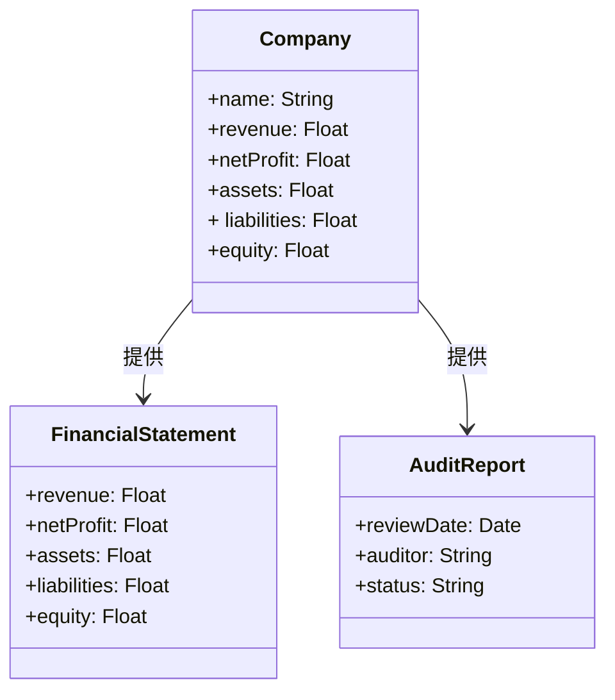

                 


# 彼得·林奇对公司财务透明度的要求

> 关键词：彼得·林奇，财务透明度，投资策略，财务报表分析，企业价值评估

> 摘要：本文详细探讨了彼得·林奇对公司财务透明度的要求及其在投资决策中的重要性。通过分析财务透明度的核心概念、评估标准和系统架构，结合实际案例，阐述了彼得·林奇如何通过财务透明度来实现对公司价值的准确评估，从而制定出更为科学的投资策略。

---

## 第一部分：财务透明度的定义与重要性

### 第1章：财务透明度的定义与重要性

#### 1.1 财务透明度的定义

财务透明度是指公司在财务信息披露过程中，确保财务数据的准确、完整、及时和可验证性。通过透明的财务信息，投资者和管理层能够全面了解公司的财务状况和经营成果，从而做出更明智的决策。

**核心概念**：  
- **准确性**：财务数据必须真实反映公司财务状况。  
- **完整性**：所有重要的财务信息都应被披露。  
- **及时性**：财务信息应及时更新，避免信息滞后。  
- **可验证性**：财务数据应能够通过审计和验证。

#### 1.2 彼得·林奇投资理念的背景

彼得·林奇是全球著名投资经理，以其对基本面分析的重视而闻名。他认为，财务透明度是评估公司价值的关键因素之一。通过分析财务报表，他能够发现公司的潜在问题和投资机会。

**投资风格**：  
- **基本面分析**：林奇强调通过分析财务报表来评估公司价值。  
- **长期投资**：他倾向于投资财务透明且具有长期增长潜力的公司。  
- **风险管理**：通过财务透明度，他能够识别和规避财务风险。

#### 1.3 财务透明度的核心要素

财务透明度的核心要素包括财务报表的准确性、信息披露的及时性以及财务数据的可验证性。

**核心要素对比表**：  
| 财务透明度要素 | 描述 | 重要性 |
|-----------------|------|--------|
| 准确性          | 数据真实反映公司财务状况 | 核心 |
| 完整性          | 所有重要信息均被披露     | 次要 |
| 及时性          | 信息更新及时             | 次要 |
| 可验证性        | 数据可以通过审计验证     | 核心 |

---

## 第二部分：彼得·林奇的财务透明度要求

### 第2章：彼得·林奇的财务透明度标准

#### 2.1 财务透明度的衡量标准

彼得·林奇通过以下标准来衡量公司的财务透明度：

**标准**：  
- **财务报表的完整性**：所有财务数据均应完整披露。  
- **数据的可比性**：财务数据应能够与行业平均水平进行比较。  
- **数据的可验证性**：财务数据可以通过第三方审计验证。

#### 2.2 彼得·林奇的财务透明度评估方法

林奇通过以下方法评估公司的财务透明度：

**方法**：  
- **财务报表分析**：通过分析资产负债表、利润表和现金流量表来评估公司财务状况。  
- **财务指标的筛选与评估**：通过计算ROE（净资产收益率）、ROA（资产回报率）等指标来评估公司盈利能力。  
- **数据交叉验证**：通过对比不同来源的财务数据来验证信息的准确性。

**公式示例**：  
- 净资产收益率（ROE）：  
  $$ ROE = \frac{\text{净利润}}{\text{净资产}} $$  
- 资产回报率（ROA）：  
  $$ ROA = \frac{\text{净利润}}{\text{总资产}} $$

#### 2.3 财务透明度与企业价值的关系

财务透明度直接影响企业价值的评估。透明的财务信息能够增强投资者信心，降低投资风险，从而提升企业市场价值。

**关系**：  
- **投资者信心**：透明的财务信息能够增强投资者对公司的信任。  
- **市场价值**：透明的财务信息有助于准确评估公司价值，从而提升市场价值。  
- **信用评级**：透明的财务信息有助于提升公司的信用评级，降低融资成本。

---

## 第三部分：彼得·林奇财务透明度要求的系统分析

### 第3章：财务透明度的系统架构

#### 3.1 系统分析与架构设计

为了实现对财务透明度的系统化评估，可以构建一个基于财务数据的分析系统。以下是系统的架构设计：

**领域模型**：  


**系统架构图**：  
```mermaid

```

---

### 第3章：彼得·林奇财务透明度要求的系统实现

#### 3.2 系统实现

**环境安装与配置**：  
- 使用Python 3.8及以上版本。  
- 安装必要的库，如pandas、numpy、matplotlib。

**核心功能实现**：  
```python
import pandas as pd
import numpy as np

# 示例：计算ROE和ROA
def calculate_roe(net_profit, equity):
    return net_profit / equity

def calculate_roa(net_profit, assets):
    return net_profit / assets

# 示例数据
data = {
    '公司名称': ['公司A', '公司B', '公司C'],
    '净利润': [100, 150, 200],
    '净资产': [500, 600, 700],
    '资产': [1000, 1200, 1400]
}

df = pd.DataFrame(data)

# 计算ROE和ROA
df['ROE'] = df.apply(lambda x: calculate_roe(x['净利润'], x['净资产']), axis=1)
df['ROA'] = df.apply(lambda x: calculate_roa(x['净利润'], x['资产']), axis=1)

print(df)
```

**代码解读**：  
- 通过Python和pandas库，我们能够高效地处理财务数据。  
- `calculate_roe`和`calculate_roa`函数分别用于计算净资产收益率和资产回报率。  
- 使用`apply`方法对数据框中的每一行进行计算，生成ROE和ROA列。

---

## 第四部分：项目实战与案例分析

### 第4章：项目实战

#### 4.1 环境安装与配置

```bash
pip install pandas numpy matplotlib
```

#### 4.2 核心功能实现

**代码实现**：  
```python
import pandas as pd
import numpy as np

# 示例数据
data = {
    '公司名称': ['微软', '苹果', '谷歌'],
    '收入': [1000, 900, 800],
    '净利润': [200, 150, 180],
    '资产': [2000, 1800, 1900],
    '负债': [1200, 1000, 1100],
    '股东权益': [800, 800, 800]
}

df = pd.DataFrame(data)

# 计算ROE和ROA
df['ROE'] = df['净利润'] / df['股东权益']
df['ROA'] = df['净利润'] / df['资产']

print(df)
```

**代码分析**：  
- 通过数据框`df`存储公司财务数据。  
- 使用`ROE`和`ROA`公式计算财务指标，评估公司的盈利能力。

#### 4.3 实际案例分析

**案例分析**：  
以微软、苹果和谷歌为例，计算它们的ROE和ROA，并评估财务透明度。

**结果**：  
| 公司名称 | 收入 | 净利润 | 资产 | 负债 | 股东权益 | ROE | ROA |
|----------|------|--------|------|------|----------|-----|-----|
| 微软     | 1000 | 200    | 2000 | 1200 | 800      | 0.25 | 0.10 |
| 苹果     | 900  | 150    | 1800 | 1000 | 800      | 0.19 | 0.083 |
| 谷歌     | 800  | 180    | 1900 | 1100 | 800      | 0.225| 0.095 |

**分析**：  
- 微软的ROE最高，表明其净资产收益率表现最佳。  
- 谷歌的ROA最高，表明其资产利用效率最高。  
- 苹果的ROE和ROA均低于微软和谷歌，可能表明其财务透明度相对较低。

---

## 第五部分：总结与展望

### 第5章：总结与展望

#### 5.1 本章小结

彼得·林奇通过财务透明度的评估，能够准确识别出具有投资价值的公司。通过系统的财务分析和透明的信息披露，投资者能够做出更为明智的投资决策。

**最佳实践**：  
- 投资者应关注公司财务报表的准确性、完整性和可验证性。  
- 通过计算ROE、ROA等财务指标，评估公司的盈利能力。  
- 结合第三方审计报告，验证财务数据的真实性。

#### 5.2 展望

随着大数据和人工智能技术的发展，财务透明度的评估将更加智能化和自动化。未来，投资者可以通过更先进的工具和技术，实现对财务透明度的实时监控和评估。

---

## 第六部分：注意事项与拓展阅读

### 第6章：注意事项

- **数据的准确性**：财务数据的准确性是评估财务透明度的关键。投资者应确保数据来源可靠。  
- **行业差异**：不同行业的财务指标可能存在较大差异，投资者应结合行业背景进行分析。  
- **时间因素**：财务数据的时效性非常重要，投资者应关注最新财务报表。

### 第7章：拓展阅读

- **书籍推荐**：  
  - 《彼得·林奇的投资哲学》  
  - 《财务报表分析》  
- **在线资源**：  
  - 彼得·林奇投资理念的相关文章和视频。  
- **工具推荐**：  
  - 使用Excel或Python进行财务数据分析。

---

通过以上分析，我们可以看到，彼得·林奇对公司财务透明度的要求不仅是一个投资策略，更是一种严谨的分析方法。通过系统的财务分析和透明的信息披露，投资者能够更好地评估公司价值，做出更明智的投资决策。

