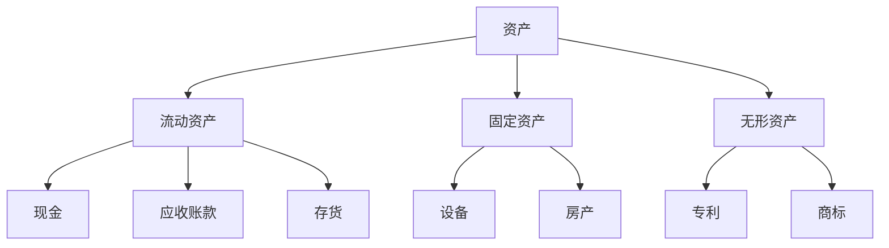
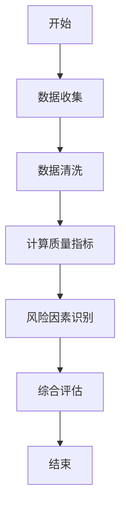
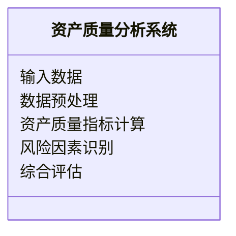
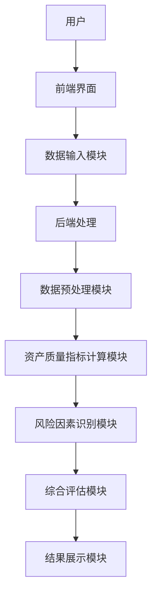
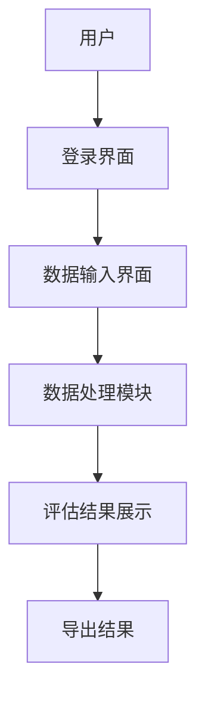

                 


# 彼得·林奇对公司资产质量的深度分析

**关键词**：彼得·林奇、资产质量、投资分析、财务指标、公司估值

**摘要**：本文深入探讨了彼得·林奇对公司资产质量的分析方法，结合理论与实践，分析了资产质量的核心要素、评估指标、算法原理以及系统架构设计。通过具体案例和最佳实践，为投资者提供了实用的分析工具和投资策略。

---

## 第一部分: 资产质量分析的背景与核心概念

### 第1章: 资产质量分析的背景与重要性

#### 1.1 资产质量的基本概念

##### 1.1.1 资产的定义与分类

- **资产的定义**：资产是企业拥有或控制的资源，预期能够为企业带来经济利益。
- **资产的分类**：
  - 流动资产：现金、应收账款、存货等，流动性高。
  - 固定资产：房屋、设备等，流动性低。
  - 无形资产：专利、商标等，无实体形态。

##### 1.1.2 资产质量的核心内涵

- 资产质量是指资产的流动性、收益性、保值性和风险性的综合体现。
- 流动性：资产转化为现金的能力。
- 收益性：资产为企业创造收益的能力。
- 保值性：资产在市场波动中的价值稳定性。
- 风险性：资产面临的市场、行业和公司特定风险。

##### 1.1.3 资产质量与企业价值的关系

- 资产质量直接影响企业的财务健康状况和市场价值。
- 高质量的资产通常意味着更强的偿债能力和盈利能力。
- 通过分析资产质量，投资者可以更好地评估企业的长期发展潜力。

#### 1.2 彼得·林奇的分析方法

##### 1.2.1 彼得·林奇的投资理念

- **长期投资**：林奇主张长期持有优质资产，避免频繁交易。
- **基本面分析**：通过分析企业的财务报表和行业地位，评估其内在价值。
- **安全边际**：买入价格低于内在价值，确保投资的安全性。

##### 1.2.2 资产质量分析在投资中的作用

- 资产质量是企业财务健康的重要指标。
- 通过分析资产质量，投资者可以识别企业的潜在风险和机会。
- 林奇强调，高质量的资产能够为企业提供稳定的现金流和利润。

##### 1.2.3 林奇分析法的核心步骤

1. **分析流动资产**：重点关注应收账款和存货的周转率。
2. **评估固定资产**：检查设备和房产的折旧情况。
3. **评估无形资产**：分析专利和商标的市场价值。
4. **计算关键指标**：如流动比率、速动比率和资产周转率。
5. **结合行业分析**：了解行业趋势和竞争格局。

### 第2章: 资产质量分析的核心要素

#### 2.1 资产质量的核心要素

##### 2.1.1 流动资产的质量分析

- **流动资产的定义**：一年内可以变现的资产，包括现金、应收账款和存货。
- **流动资产的质量指标**：
  - 应收账款周转率：反映企业回收账款的速度。
  - 存货周转率：衡量企业销售和库存管理效率。
  - 现金比率：现金与流动负债的比例，衡量企业的短期偿债能力。

##### 2.1.2 固定资产的质量分析

- **固定资产的定义**：长期使用的资产，如设备、房产。
- **固定资产的质量指标**：
  - 折旧率：资产的损耗速度。
  - 固定资产周转率：资产使用效率。
  - 设备维护情况：影响资产的使用寿命和价值。

##### 2.1.3 无形资产的质量分析

- **无形资产的定义**：无实体形态的资产，如专利、商标。
- **无形资产的质量指标**：
  - 无形资产的账面价值与市场价值的对比。
  - 专利的法律保护期限和市场竞争力。

#### 2.2 资产质量的评估指标

##### 2.2.1 流动比率与速动比率

- **流动比率**：流动资产与流动负债的比值，衡量企业的短期偿债能力。
- **速动比率**：扣除存货后的流动资产与流动负债的比值，更严格地衡量短期偿债能力。

##### 2.2.2 资产周转率

- 资产周转率 = 销售收入 / 平均资产总额。
- 反映企业资产的使用效率。

##### 2.2.3 资产减值准备

- 资产减值准备：企业对可能无法收回的资产价值进行的计提。
- 影响企业的净利润和资产质量评估。

### 第3章: 资产质量分析的核心概念与联系

#### 3.1 资产质量分析的核心概念

##### 3.1.1 资产的流动性与收益性

- 流动性高的资产通常收益性较低，反之亦然。
- 需要权衡流动性与收益性，选择最适合企业战略的资产结构。

##### 3.1.2 资产的保值性与风险性

- 高保值性的资产在市场波动中风险较低。
- 风险性高的资产需要谨慎评估，避免过度暴露风险。

##### 3.1.3 资产的可变现性与周期性

- 可变现性高的资产在经济衰退时更容易出售。
- 资产的周期性与行业周期密切相关，需结合宏观经济分析。

#### 3.2 资产质量核心概念的对比分析

##### 3.2.1 不同资产类别的对比表格

| 资产类别 | 流动性 | 收益性 | 风险性 | 保值性 |
|----------|--------|--------|--------|--------|
| 流动资产 | 高     | 中     | 中     | 中     |
| 固定资产 | 低     | 高     | 低     | 高     |
| 无形资产 | 无     | 中     | 高     | 高     |

##### 3.2.2 资产质量与财务健康状况的ER实体关系图



---

## 第二部分: 资产质量分析的算法原理

### 第4章: 资产质量分析的算法原理

#### 4.1 资产质量分析的流程

##### 4.1.1 数据收集与预处理

- 数据来源：公司财务报表（资产负债表、利润表、现金流量表）。
- 数据清洗：处理缺失值、异常值和重复数据。

##### 4.1.2 资产质量指标的计算

- 计算流动比率、速动比率、资产周转率等指标。
- 评估各资产类别的质量。

##### 4.1.3 风险因素的识别与评估

- 识别行业风险、市场风险和公司特有风险。
- 结合资产质量指标和风险因素，综合评估资产质量。

#### 4.2 资产质量分析的算法流程图



#### 4.3 资产质量分析的Python实现代码

```python
import pandas as pd
import numpy as np

# 数据预处理
data = pd.read_csv('assets.csv')
data.dropna(inplace=True)

# 计算流动比率
data['流动比率'] = data['流动资产'] / data['流动负债']

# 计算速动比率
data['速动比率'] = (data['流动资产'] - data['存货']) / data['流动负债']

# 计算资产周转率
data['资产周转率'] = data['销售收入'] / ((data['总资产'] + data['总资产'].shift(1)) / 2)

# 风险因素评估
data['总风险'] = (data['行业风险'] + data['市场风险'] + data['公司风险']) / 3

# 综合评估资产质量
data['资产质量评分'] = (data['流动比率'] + data['速动比率'] + data['资产周转率']) / 3

print(data[['公司名称', '资产质量评分', '总风险']])
```

#### 4.4 资产质量分析的数学模型和公式

- **流动比率公式**：
  $$ \text{流动比率} = \frac{\text{流动资产}}{\text{流动负债}} $$
- **速动比率公式**：
  $$ \text{速动比率} = \frac{\text{流动资产} - \text{存货}}{\text{流动负债}} $$
- **资产周转率公式**：
  $$ \text{资产周转率} = \frac{\text{销售收入}}{\text{平均总资产}} $$
- **总风险公式**：
  $$ \text{总风险} = \frac{\text{行业风险} + \text{市场风险} + \text{公司风险}}{3} $$

---

## 第三部分: 资产质量分析的系统架构设计

### 第5章: 资产质量分析的系统架构设计

#### 5.1 系统功能设计

##### 5.1.1 领域模型设计



##### 5.1.2 系统架构设计



#### 5.2 系统接口设计

- **输入接口**：接收公司财务数据和市场数据。
- **输出接口**：展示资产质量评分和风险评估结果。
- **数据格式**：支持CSV、Excel和JSON格式。

#### 5.3 系统交互流程图



---

## 第四部分: 资产质量分析的项目实战

### 第6章: 资产质量分析的项目实战

#### 6.1 项目背景

- 分析某制造企业的资产质量，评估其投资价值。

#### 6.2 环境安装

- 安装Python和相关库（pandas、numpy、scikit-learn）。
- 安装Jupyter Notebook用于数据处理和分析。

#### 6.3 核心代码实现

```python
import pandas as pd
import numpy as np

# 数据预处理
data = pd.read_csv('manufacturing_assets.csv')
data.dropna(inplace=True)

# 计算资产质量指标
data['流动比率'] = data['流动资产'] / data['流动负债']
data['速动比率'] = (data['流动资产'] - data['存货']) / data['流动负债']
data['资产周转率'] = data['销售收入'] / ((data['总资产'] + data['总资产'].shift(1)) / 2)

# 风险因素评估
data['总风险'] = (data['行业风险'] + data['市场风险'] + data['公司风险']) / 3

# 综合评估资产质量
data['资产质量评分'] = (data['流动比率'] + data['速动比率'] + data['资产周转率']) / 3

# 可视化分析
import matplotlib.pyplot as plt

plt.figure(figsize=(10, 6))
plt.scatter(data['资产质量评分'], data['总风险'], c='blue', alpha=0.6)
plt.xlabel('资产质量评分')
plt.ylabel('总风险')
plt.title('资产质量评分与总风险的关系')
plt.show()
```

#### 6.4 代码应用解读与分析

- **流动比率分析**：流动比率越高，企业短期偿债能力越强。
- **速动比率分析**：速动比率越高，企业在不依赖存货的情况下偿还短期债务的能力越强。
- **资产周转率分析**：周转率高表明资产使用效率高，企业运营能力强。
- **风险因素分析**：总风险越低，资产质量评分越高，企业投资价值越大。

#### 6.5 项目小结

- 通过实际案例分析，验证了林奇分析法的有效性。
- 资产质量评分与总风险的关系为企业提供了直观的参考。

---

## 第五部分: 资产质量分析的最佳实践与投资策略

### 第7章: 资产质量分析的最佳实践

#### 7.1 投资策略

- **分散投资**：避免将所有资金投入单一资产类别。
- **长期持有**：选择具有持续增长潜力的企业。
- **定期评估**：根据市场变化和企业财务状况，及时调整投资组合。

#### 7.2 注意事项

- **避免低质量资产**：如应收账款周转率低、存货积压的企业。
- **关注行业趋势**：选择符合行业发展趋势的企业。
- **结合技术分析**：利用K线图、均线等技术指标辅助决策。

#### 7.3 拓展阅读

- 推荐书籍：《彼得·林奇的投资哲学》。
- 推荐博客：投资分析领域的专业博客和论坛。

---

## 第六部分: 总结与展望

### 第8章: 总结与展望

#### 8.1 总结

- 彼得·林奇的资产质量分析方法为企业估值提供了重要工具。
- 通过理论与实践结合，投资者可以更准确地评估企业的投资价值。

#### 8.2 展望

- 未来，资产质量分析将更多地结合大数据和人工智能技术。
- 结合实时数据和市场趋势，投资者可以更精准地进行资产配置和风险控制。

---

**结语**：彼得·林奇的资产质量分析方法不仅是一种投资工具，更是一种思维方式。通过深入理解资产质量的核心要素和评估指标，投资者可以更好地识别优质资产，制定科学的投资策略，实现长期稳定的收益。

