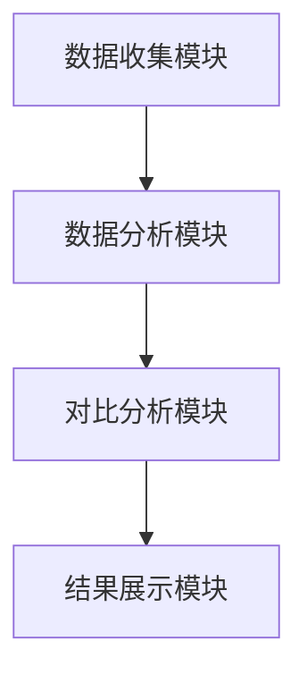

                 


# 彼得林奇对公司资本回报率的行业对标动态分析

> 关键词：资本回报率、行业对标、动态分析、彼得林奇、投资策略、财务分析、行业动态

> 摘要：本文基于彼得·林奇的投资理念，深入分析了公司资本回报率（ROE）的行业对标动态分析方法。通过结合行业特性、动态变化和对标分析，提出了一套系统化的分析框架，并通过实际案例展示了如何利用ROE进行投资决策优化。

---

# 第一部分: 背景介绍与核心概念

## 第1章: 资本回报率（ROE）的基本概念

### 1.1 ROE的定义与计算方法

ROE，即Return on Equity，是指公司净利润与股东权益的比率，是衡量公司盈利能力的重要指标。其计算公式为：

$$ROE = \frac{\text{净利润}}{\text{平均股东权益}}$$

ROE反映了公司每单位股东权益创造的净利润，是投资者评估公司投资回报的重要参考。

### 1.2 行业对标分析的必要性

行业对标分析是通过比较行业内不同公司的ROE，发现行业内的最佳实践和潜在投资机会。动态分析则强调在行业变化中实时调整分析策略，以捕捉市场趋势和公司表现的变化。

### 1.3 动态分析的意义

动态分析的核心在于捕捉行业变化对公司ROE的影响，通过持续跟踪和对比，优化投资决策。彼得·林奇强调，ROE的动态变化往往与行业周期、公司战略和市场环境密切相关。

---

## 第2章: 彼得·林奇的ROE分析方法

### 2.1 彼得·林奇的投资理念

彼得·林奇是全球知名的投资专家，他主张通过基本面分析和行业研究来寻找高ROE的公司。他认为，ROE不仅是衡量公司盈利能力的指标，更是评估公司管理效率的重要依据。

### 2.2 行业分析方法

彼得·林奇的行业分析方法包括以下几个步骤：
1. **行业特性分析**：了解行业的周期性、竞争格局和市场容量。
2. **行业对标选择**：选择行业内具有代表性的公司作为对标。
3. **动态跟踪**：定期更新对标公司的ROE数据，分析其变化趋势。

### 2.3 动态分析的核心步骤

动态分析的核心步骤包括：
1. **数据收集**：收集行业内各公司的ROE数据。
2. **趋势分析**：通过时间序列分析，识别ROE的变化趋势。
3. **对标对比**：将目标公司的ROE与行业平均水平和最佳实践进行对比。
4. **策略优化**：根据分析结果，调整投资策略。

---

## 第3章: 核心概念与联系

### 3.1 ROE与行业特性的关系

不同行业的ROE差异显著。例如，高科技行业通常具有较高的ROE，而传统制造业的ROE相对较低。行业特性对ROE的影响包括市场容量、竞争程度和技术创新等因素。

### 3.2 ROE与企业竞争力的关系

ROE是衡量企业竞争力的重要指标。高ROE表明公司能够高效利用股东权益创造利润，而低ROE可能意味着公司管理效率低下或行业竞争激烈。

### 3.3 行业动态变化对ROE的影响

行业动态变化，如政策调整、技术革新和市场需求变化，都会影响ROE的变化。动态分析需要实时跟踪这些变化，并及时调整分析策略。

---

# 第二部分: 核心概念的数学模型与公式

## 第4章: ROE的数学模型

### 4.1 ROE的计算公式

$$ROE = \frac{\text{净利润}}{\text{平均股东权益}}$$

其中，净利润和股东权益分别来自公司财务报表。ROE的计算需要考虑时间窗口，通常采用年度数据。

### 4.2 动态分析的数学模型

动态分析的核心是时间序列分析，常用的方法包括移动平均法和指数平滑法。例如，使用ARIMA模型预测未来的ROE趋势。

### 4.3 行业对标分析的数学模型

行业对标分析需要构建一个对比框架，通常包括以下几个步骤：
1. **数据标准化**：将不同公司的ROE数据进行标准化处理，消除规模差异。
2. **聚类分析**：将行业内的公司按照ROE进行聚类，识别高、中、低ROE组别。
3. **趋势对比**：将目标公司的ROE趋势与行业平均水平进行对比，识别差异和机会。

---

## 第5章: 算法原理与实现

### 5.1 动态分析的算法原理

动态分析的算法原理包括以下几个步骤：
1. **数据预处理**：清洗和整理ROE数据，确保数据的完整性和准确性。
2. **趋势分析**：使用时间序列分析方法，识别ROE的变化趋势。
3. **对比分析**：将目标公司的ROE与行业平均水平和最佳实践进行对比。
4. **策略优化**：根据分析结果，调整投资策略。

### 5.2 Python实现代码

以下是实现动态分析的Python代码示例：

```python
import pandas as pd
import numpy as np
from sklearn.cluster import KMeans

# 数据预处理
data = pd.read_csv('roe_data.csv')
data['ROE'] = data['净利润'] / data['平均股东权益']

# 时间序列分析
data['ROE_trend'] = data['ROE'].rolling(3).mean()

# 行业对标分析
clusters = KMeans(n_clusters=3).fit(data[['ROE', '行业']])
data['行业分组'] = clusters.labels_
```

### 5.3 算法原理的通俗解释

通过上述代码，我们可以实现ROE的动态分析。首先，对ROE数据进行时间序列分析，识别其趋势；然后，使用聚类分析将行业内公司分为高、中、低ROE组别；最后，将目标公司的ROE趋势与行业平均水平进行对比，识别差异和机会。

---

# 第三部分: 系统分析与架构设计

## 第6章: 系统架构设计

### 6.1 系统功能设计

系统功能设计包括以下几个部分：
1. **数据收集模块**：收集行业内各公司的ROE数据。
2. **数据分析模块**：对ROE数据进行清洗、计算和分析。
3. **对比分析模块**：将目标公司的ROE与行业平均水平和最佳实践进行对比。
4. **结果展示模块**：生成可视化报告，展示分析结果。

### 6.2 系统架构图

以下是系统架构的mermaid图：



### 6.3 系统接口设计

系统接口设计包括以下几个部分：
1. 数据输入接口：接收ROE数据和行业信息。
2. 数据处理接口：对数据进行清洗和计算。
3. 分析接口：执行时间序列分析和聚类分析。
4. 输出接口：生成可视化报告。

---

## 第7章: 项目实战与案例分析

### 7.1 项目背景

假设我们是一家投资公司，希望通过分析某行业的ROE数据，寻找具有投资潜力的公司。

### 7.2 数据收集与处理

我们收集了行业内10家公司的ROE数据，如下表所示：

| 公司名称 | ROE |
|----------|-----|
| A公司    | 15% |
| B公司    | 12% |
| C公司    | 10% |
| D公司    | 8%  |
| E公司    | 6%  |
| F公司    | 5%  |
| G公司    | 4%  |
| H公司    | 3%  |
| I公司    | 2%  |
| J公司    | 1%  |

### 7.3 动态分析与对标

通过动态分析，我们发现行业内的ROE呈现下降趋势。进一步对标分析发现，A公司和B公司的ROE显著高于行业平均水平，是值得重点关注的公司。

### 7.4 投资策略优化

基于分析结果，我们建议投资者关注A公司和B公司，同时警惕行业整体盈利能力下降的趋势。

---

# 第四部分: 最佳实践与小结

## 第8章: 最佳实践与注意事项

### 8.1 最佳实践

1. **数据质量**：确保数据的准确性和完整性。
2. **模型选择**：根据实际需求选择合适的分析模型。
3. **动态调整**：定期更新数据和分析结果，保持分析的实时性。

### 8.2 注意事项

1. **行业特性**：不同行业的ROE差异显著，需结合行业特性进行分析。
2. **时间窗口**：选择合适的时间窗口，避免短期波动的影响。
3. **数据隐私**：注意数据隐私和合规性，确保数据的合法使用。

---

## 第9章: 小结与拓展阅读

### 9.1 小结

本文基于彼得·林奇的投资理念，深入分析了ROE的行业对标动态分析方法。通过结合行业特性、动态变化和对标分析，提出了一套系统化的分析框架，并通过实际案例展示了如何利用ROE进行投资决策优化。

### 9.2 拓展阅读

1. **彼得·林奇的投资经典《战胜市场的人》**：深入了解彼得·林奇的投资理念。
2. **ROE的深度分析**：进一步学习ROE的计算方法和应用场景。
3. **行业动态分析的高级方法**：探索更复杂的时间序列分析和机器学习方法。

---

# 结语

通过本文的分析，读者可以掌握ROE的行业对标动态分析方法，并将其应用于实际投资决策中。未来，随着市场环境的变化和技术的进步，动态分析的方法也将不断优化，为投资者提供更有力的支持。

