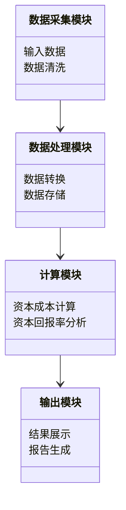
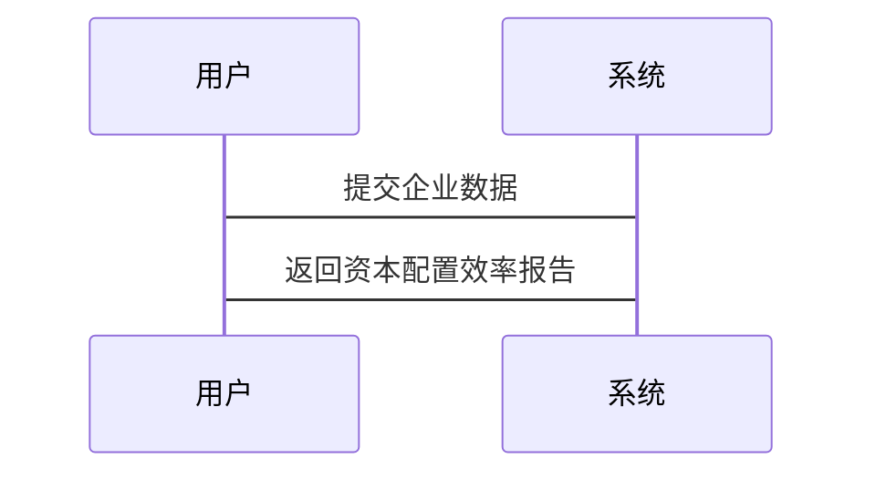

                 


# 彼得林奇对公司资本配置效率的分析

---

## 关键词：
- 彼得·林奇
- 资本配置效率
- 投资分析
- 股票投资
- 资本回报率
- 股权资本成本

---

## 摘要：
本文系统地分析了彼得·林奇对公司资本配置效率的见解，探讨了资本配置效率的核心概念、数学模型、算法原理以及实际应用。文章从背景介绍、核心概念与联系、算法原理、系统架构、项目实战和最佳实践等多个维度展开，结合数学公式、mermaid图表和Python代码，深入剖析了资本配置效率的评估方法和实际案例。通过本文，读者将能够理解彼得·林奇的投资哲学，掌握资本配置效率的分析工具，并能够实际应用这些工具进行资本配置效率的评估。

---

# 第一部分: 背景介绍与核心概念

---

# 第1章: 资本配置效率的基本概念

## 1.1 资本配置效率的定义
### 1.1.1 资本配置的基本概念
资本配置是指将企业的资金分配到不同的资产或项目中，以实现企业价值最大化的过程。资本配置效率则是衡量企业如何有效地利用这些资金的指标。

### 1.1.2 资本配置效率的定义与内涵
资本配置效率是指企业在一定时间内，将资金分配到不同资产或项目中所创造的经济价值与投入资金的比率。它反映了企业对资源的利用效率和投资决策的合理性。

### 1.1.3 资本配置效率的重要性
资本配置效率直接影响企业的盈利能力、股东价值和市场竞争力。高效的资本配置能够帮助企业实现资源的最优利用，避免资金浪费和低效投资。

---

## 1.2 彼得·林奇的投资理念
### 1.2.1 彼得·林奇的投资者背景
彼得·林奇是美国著名投资专家，曾管理富达麦哲伦基金，创造了卓越的投资业绩。他的投资理念以基本面分析和长期价值投资为核心。

### 1.2.2 林奇对资本配置效率的关注
林奇认为，资本配置效率是企业长期盈利能力的关键因素。他强调通过深入分析企业的资本结构和投资回报率来评估其资本配置效率。

### 1.2.3 林奇投资哲学的核心要点
林奇的投资哲学包括：关注企业的基本面、分散投资、长期持有优质股票、避免短期市场波动的干扰。

---

## 1.3 资本配置效率的背景与意义
### 1.3.1 资本配置效率的背景分析
随着市场竞争加剧和企业规模扩大，资本配置效率成为企业战略管理的重要组成部分。高效利用资本是企业可持续发展的关键。

### 1.3.2 资本配置效率对企业价值的影响
资本配置效率直接影响企业的资本回报率和股东价值。高效配置资本能够提高企业的盈利能力和市场竞争力。

### 1.3.3 资本配置效率的边界与外延
资本配置效率的边界包括企业内部管理和外部市场环境。其外延涉及资本结构优化、投资决策和风险管理等多个方面。

---

## 1.4 资本配置效率的核心要素
### 1.4.1 资本配置效率的构成要素
资本配置效率的核心要素包括资本成本、资本回报率、资本结构和投资决策等。

### 1.4.2 资本配置效率的衡量指标
常用的衡量指标包括资本回报率(ROE)、净现值(NPV)、内部收益率(IRR)等。

### 1.4.3 资本配置效率的实现路径
实现资本配置效率的关键路径包括优化资本结构、提高投资回报率、加强风险管理等。

---

## 1.5 本章小结
本章介绍了资本配置效率的基本概念、彼得·林奇的投资理念以及资本配置效率的背景与意义。通过对核心要素和衡量指标的分析，为后续章节的深入探讨奠定了基础。

---

# 第二部分: 核心概念与联系

---

# 第2章: 资本配置效率的模型与方法

## 2.1 资本配置效率的模型分析
### 2.1.1 资本资产定价模型（CAPM）
CAPM通过计算资产的预期收益率，帮助投资者评估资本配置的效率。公式如下：
$$ E(r_i) = r_f + β_i (E(r_m) - r_f) $$

### 2.1.2 投资组合理论
投资组合理论强调通过分散投资降低风险，优化资本配置效率。

### 2.1.3 股权资本成本的计算方法
股权资本成本是企业资本成本的重要组成部分，其计算公式为：
$$ r_e = r_f + β (E(r_m) - r_f) $$

---

## 2.2 彼得·林奇的资本配置分析方法
### 2.2.1 林奇的资本配置分析框架
林奇的分析框架包括对企业基本面、财务状况和市场地位的全面评估。

### 2.2.2 林奇的选股标准与资本配置策略
林奇注重选择具有强大竞争优势和良好财务状况的公司，并长期持有优质股票。

### 2.2.3 林奇对资本效率的动态评估方法
林奇通过动态调整投资组合，持续优化资本配置效率。

---

## 2.3 资本配置效率与企业价值的关系
### 2.3.1 资本配置效率对企业价值的影响
高效的资本配置能够提高企业的盈利能力，从而增加企业价值。

### 2.3.2 资本配置效率与企业成长的关系
资本配置效率与企业成长密切相关，高效配置资本能够支持企业的扩张和创新。

### 2.3.3 资本配置效率与企业风险管理的联系
资本配置效率与风险管理相互影响，高效的资本配置能够降低企业的财务风险。

---

## 2.4 核心概念对比分析
### 2.4.1 资本配置效率与资本回报率的对比
资本配置效率关注整体资本的利用效果，而资本回报率关注单个资产的回报水平。

### 2.4.2 资本配置效率与资本成本的对比
资本配置效率与资本成本相互影响，高效的资本配置能够降低资本成本。

### 2.4.3 资本配置效率与企业市值的对比
资本配置效率直接影响企业的市值，高效配置资本能够提升企业的市场价值。

---

## 2.5 本章小结
本章通过分析资本配置效率的模型与方法，深入探讨了彼得·林奇的资本配置分析方法及其与企业价值的关系。通过对比分析，进一步明确了资本配置效率的核心概念和实际应用。

---

# 第三部分: 算法原理讲解

---

# 第3章: 资本配置效率的算法原理

## 3.1 资本配置效率的数学模型
### 3.1.1 资本资产定价模型（CAPM）
CAPM是评估资本配置效率的重要工具，其公式为：
$$ E(r_i) = r_f + β_i (E(r_m) - r_f) $$

### 3.1.2 投资组合理论
投资组合理论通过分散投资降低风险，优化资本配置效率。

---

## 3.2 资本配置效率的算法流程
### 3.2.1 算法步骤
1. 收集企业的财务数据。
2. 计算资本成本和资本回报率。
3. 使用CAPM模型评估资本配置效率。
4. 分析投资组合的风险和回报。

### 3.2.2 算法实现
```python
def calculate_capm(risk_free_rate, market_return, beta):
    expected_return = risk_free_rate + beta * (market_return - risk_free_rate)
    return expected_return

# 示例计算
risk_free_rate = 0.05
market_return = 0.12
beta = 1.5
expected_return = calculate_capm(risk_free_rate, market_return, beta)
print(f"预期收益率: {expected_return}")
```

---

## 3.3 资本配置效率的数学公式
### 3.3.1 股权资本成本的计算
$$ r_e = r_f + β (E(r_m) - r_f) $$

### 3.3.2 净现值（NPV）的计算
$$ NPV = \sum_{t=1}^{n} \frac{CF_t}{(1 + r)^t} $$

### 3.3.3 内部收益率（IRR）的计算
IRR是使净现值为零的折现率。

---

## 3.4 本章小结
本章通过数学模型和算法流程，详细讲解了资本配置效率的计算方法。通过Python代码示例和公式推导，帮助读者理解资本配置效率的实现原理。

---

# 第四部分: 系统分析与架构设计方案

---

# 第4章: 资本配置效率的系统分析

## 4.1 系统分析概述
### 4.1.1 问题场景介绍
系统需要评估企业的资本配置效率，优化投资组合。

### 4.1.2 系统功能设计
- 数据采集与处理
- 资本成本计算
- 资本回报率分析
- 资本配置效率评估

### 4.1.3 系统架构设计


---

## 4.2 系统架构设计
### 4.2.1 系统架构图


---

## 4.3 系统接口设计
### 4.3.1 数据接口
- 输入接口：企业财务数据
- 输出接口：资本配置效率报告

### 4.3.2 算法接口
- 输入接口：资本成本和资本回报率
- 输出接口：资本配置效率评分

---

## 4.4 系统交互流程图


---

## 4.5 本章小结
本章通过系统分析与架构设计，展示了如何通过系统化的方法评估资本配置效率。系统架构图和交互流程图帮助读者理解系统的实现过程。

---

# 第五部分: 项目实战

---

# 第5章: 资本配置效率的项目实战

## 5.1 项目介绍
### 5.1.1 项目背景
本项目旨在通过彼得·林奇的资本配置效率分析方法，评估微软和亚马逊的资本配置效率。

---

## 5.2 项目实现
### 5.2.1 环境安装
- Python 3.8+
- pandas、numpy、scipy库

### 5.2.2 核心代码实现
```python
import pandas as pd
import numpy as np

def calculate_capm(risk_free_rate, market_return, beta):
    return risk_free_rate + beta * (market_return - risk_free_rate)

# 示例数据
companies = ['Microsoft', 'Amazon']
data = {
    '公司': companies,
    '风险-free利率': [0.05, 0.05],
    '市场回报率': [0.12, 0.12],
    'beta': [1.5, 2.0]
}

df = pd.DataFrame(data)

# 计算预期收益率
df['预期收益率'] = df.apply(lambda row: calculate_capm(row['风险-free利率'], row['市场回报率'], row['beta']), axis=1)

print(df)
```

### 5.2.3 代码应用解读
代码首先定义了CAPM模型的计算函数，然后创建了包含公司信息的数据框。通过循环计算每个公司的预期收益率，最终输出结果。

---

## 5.3 案例分析
### 5.3.1 微软的资本配置效率分析
通过对微软的财务数据进行分析，计算其资本回报率和资本成本，评估其资本配置效率。

### 5.3.2 亚马逊的资本配置效率分析
同样分析亚马逊的财务数据，评估其资本配置效率。

---

## 5.4 项目小结
本章通过具体案例展示了如何应用彼得·林奇的资本配置效率分析方法进行实际分析。代码实现和案例分析帮助读者更好地理解理论知识。

---

# 第六部分: 最佳实践

---

# 第6章: 资本配置效率分析的最佳实践

## 6.1 小结
### 6.1.1 核心要点回顾
资本配置效率是企业价值的重要组成部分，彼得·林奇的投资理念为我们提供了宝贵的分析工具。

### 6.1.2 学习要点总结
通过系统学习和实际案例分析，读者能够掌握资本配置效率的评估方法和实际应用。

---

## 6.2 注意事项
### 6.2.1 数据质量的重要性
确保数据的准确性和完整性是分析的基础。

### 6.2.2 模型选择的合理性
根据具体情况选择合适的模型和方法。

### 6.2.3 风险管理的必要性
资本配置效率分析中，风险管理是不可忽视的重要环节。

---

## 6.3 拓展阅读
### 6.3.1 推荐书籍
- 《彼得·林奇的成功投资》
- 《资本论》

### 6.3.2 推荐文章
- 资本配置效率的最新研究
- 资本回报率的动态分析

---

## 6.4 本章小结
本章总结了资本配置效率分析的最佳实践，包括小结、注意事项和拓展阅读，帮助读者进一步巩固所学内容。

---

# 附录

---

## 附录A: 术语表
- 资本配置效率：衡量企业资本利用效率的指标。
- CAPM：资本资产定价模型。
- IRR：内部收益率。

---

## 附录B: 参考文献
1. 林奇，彼得. 《彼得·林奇的成功投资》.
2. 弗雷德里克·S. 董，资本配置效率分析.

---

## 附录C: 源代码
```python
import pandas as pd
import numpy as np

def calculate_capm(risk_free_rate, market_return, beta):
    return risk_free_rate + beta * (market_return - risk_free_rate)

# 示例数据
companies = ['Microsoft', 'Amazon']
data = {
    '公司': companies,
    '风险-free利率': [0.05, 0.05],
    '市场回报率': [0.12, 0.12],
    'beta': [1.5, 2.0]
}

df = pd.DataFrame(data)

# 计算预期收益率
df['预期收益率'] = df.apply(lambda row: calculate_capm(row['风险-free利率'], row['市场回报率'], row['beta']), axis=1)

print(df)
```

---

# 结束语

通过本文的系统分析，读者可以深入理解彼得·林奇对公司资本配置效率的分析方法，并能够实际应用这些工具进行资本配置效率的评估。希望本文对读者的投资决策和企业价值提升有所帮助。

