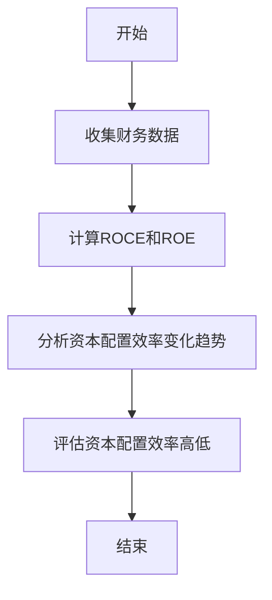
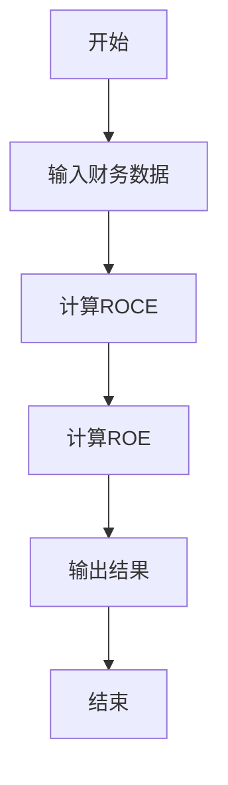
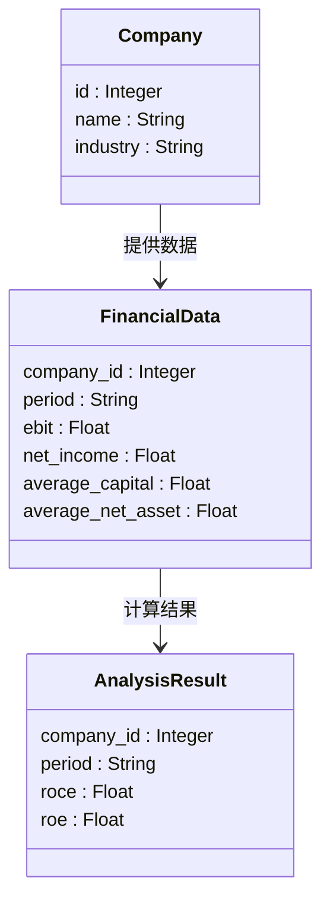
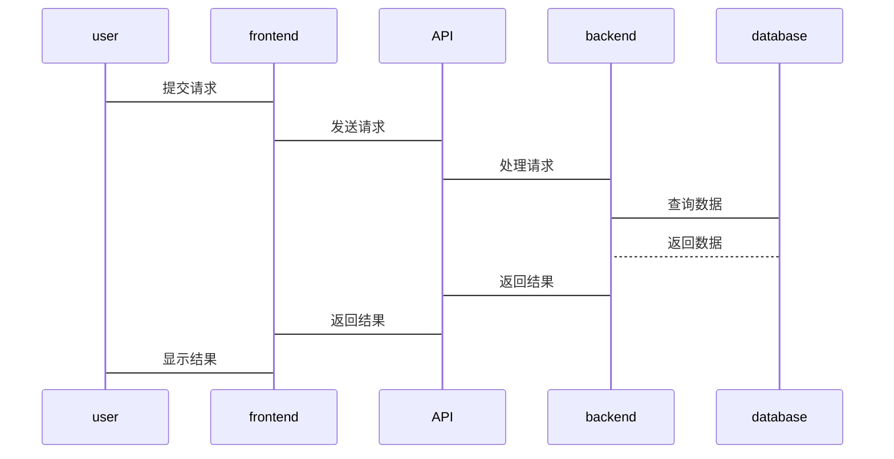

                 


# 彼得林奇对公司资本配置效率的历史分析

## 关键词：彼得林奇、资本配置效率、投资策略、ROCE、ROE、资本回报率

## 摘要：本文通过分析彼得林奇的历史投资策略，深入探讨了资本配置效率的核心概念、计算方法及其对投资决策的影响。文章结合理论与实践，详细讲解了资本配置效率的衡量指标，并通过实际案例展示了如何应用这些指标进行投资分析。此外，文章还总结了资本配置效率在现代投资中的重要性及未来发展的趋势。

---

# 第一部分: 背景介绍

## 第1章: 公司资本配置效率概述

### 1.1 资本配置的基本概念

#### 1.1.1 资本配置的定义
资本配置是指公司将其可用资本分配到不同资产或业务领域的过程，旨在实现最大化的股东价值。资本配置的核心在于如何有效地利用资金，以实现收益的最大化和风险的最小化。

#### 1.1.2 资本配置的目的与重要性
资本配置的目的是为了优化公司资源的使用效率，提升投资回报率，并确保公司长期发展的稳定性。其重要性体现在以下几个方面：
- **提升投资回报率**：通过科学的资本配置，公司可以将资金分配到高回报的项目，从而提高整体的投资回报率。
- **降低风险**：合理的资本配置可以分散风险，避免将过多的资金投入到单一项目或领域，从而降低整体风险。
- **促进公司成长**：资本配置是公司扩张和发展的基础，合理的资本配置可以为公司提供充足的资金支持，推动公司的持续成长。

#### 1.1.3 资本配置的基本原则
资本配置的基本原则包括：
- **风险与收益匹配**：资本配置需要在风险和收益之间找到平衡点，确保公司在追求高回报的同时，不至于承担过高的风险。
- **资本成本最小化**：在资本配置过程中，需要考虑不同资产的资本成本，选择成本最低的配置方式。
- **动态调整**：资本配置不是一成不变的，需要根据市场环境和公司战略的变化进行动态调整。

### 1.2 彼得林奇与资本配置效率

#### 1.2.1 彼得林奇的背景与投资理念
彼得林奇是美国著名的投资经理，曾管理富达麦哲伦基金，并取得了卓越的投资业绩。他的投资理念以基本面分析为核心，注重对公司基本面的深入研究，尤其是对公司资本配置效率的分析。

#### 1.2.2 彼得林奇对资本配置效率的研究方法
彼得林奇在分析资本配置效率时，注重对公司管理层的资本分配能力进行评估。他认为，一个优秀的公司管理层能够将资本分配到高回报的项目中，从而为股东创造更多的价值。

#### 1.2.3 资本配置效率在投资决策中的作用
资本配置效率是彼得林奇投资决策中的重要指标。他认为，资本配置效率高的公司能够更有效地利用资本，从而实现更高的投资回报率。因此，在选择投资标的时，他会优先考虑那些资本配置效率高的公司。

## 第2章: 资本配置效率的历史发展

### 2.1 资本配置效率的历史演变

#### 2.1.1 传统资本配置模式的局限性
传统的资本配置模式通常注重资本的总量，而忽视了资本的使用效率。这种模式在一定程度上导致了资本的浪费和效率低下。

#### 2.1.2 现代资本配置效率的定义与衡量标准
现代资本配置效率的定义更加注重资本的使用效率，衡量标准主要包括资本回报率（ROCE）和净资产收益率（ROE）等指标。

#### 2.1.3 资本配置效率的历史变迁与趋势
资本配置效率的历史变迁反映了人们对资本使用效率的认识逐步深化。从早期的注重资本总量到现代的注重资本使用效率，资本配置效率的概念不断演变，其重要性也逐渐提升。

### 2.2 彼得林奇对公司资本配置效率的历史分析

#### 2.2.1 彼得林奇的历史分析方法
彼得林奇在分析资本配置效率时，注重对公司历史数据的分析，尤其是对公司过去几年的资本回报率进行深入研究。他认为，资本回报率是衡量资本配置效率的重要指标。

#### 2.2.2 历史案例分析：资本配置效率的演变
通过分析历史案例，可以发现资本配置效率的变化趋势。例如，通过分析某公司在过去十年的资本回报率变化，可以判断其资本配置效率的变化情况。

#### 2.2.3 历史经验对现代资本配置效率的启示
历史经验表明，资本配置效率高的公司通常能够实现持续的高回报率。因此，现代投资者在进行资本配置时，应该注重资本效率的提升。

---

# 第二部分: 核心概念与联系

## 第3章: 资本配置效率的核心概念

### 3.1 资本配置效率的定义与属性

#### 3.1.1 资本配置效率的定义
资本配置效率是指公司在一定资本投入下，能够实现的收益与投入资本的比率。它反映了公司对资本的利用效率。

#### 3.1.2 资本配置效率的属性特征对比表
以下是一些资本配置效率相关属性的对比表：

| 属性 | 特征 |
|------|------|
| 定义 | 资本使用效率 |
| 计算方式 | ROCE = 息税前利润 / 平均资本 |
| 影响因素 | 利润率、资本规模、资产结构 |

#### 3.1.3 资本配置效率的实体关系图（ER图）
以下是资本配置效率的实体关系图：

```mermaid
erDiagram
    company {
        key id : Integer
        name : String
        industry : String
    }
    capital_allocation {
        key id : Integer
        company_id : Integer
        allocation_date : Date
        allocation_amount : Float
    }
    performance {
        key id : Integer
        company_id : Integer
        period : String
        roce : Float
       roe : Float
    }
    company --> capital_allocation : 分配资本
    company --> performance : 绩效指标
```

### 3.2 资本配置效率与公司价值的关系

#### 3.2.1 资本配置效率对股东价值的影响
资本配置效率高的公司能够为股东创造更多的价值，从而提高公司的股价和市场价值。

#### 3.2.2 资本配置效率与公司成长性的关系
资本配置效率高的公司通常具有较强的成长性，因为它们能够将资本分配到高回报的项目中，推动公司的持续发展。

#### 3.2.3 资本配置效率与公司风险控制的关联
资本配置效率高的公司通常具有较强的风险控制能力，因为它们能够有效地利用资本，降低风险。

## 第4章: 资本配置效率的衡量与分析

### 4.1 资本配置效率的衡量指标

#### 4.1.1 资本回报率（ROCE）的计算公式
资本回报率（ROCE）的计算公式如下：
$$ROCE = \frac{息税前利润}{平均资本}$$

#### 4.1.2 净资产收益率（ROE）的计算公式
净资产收益率（ROE）的计算公式如下：
$$ROE = \frac{净利润}{平均净资产}$$

#### 4.1.3 资本配置效率的其他衡量指标
除了ROCE和ROE之外，资本配置效率的其他衡量指标还包括：
- 资本周转率
- 资本使用效率比率

### 4.2 资本配置效率的分析框架

#### 4.2.1 资本配置效率的分析步骤
资本配置效率的分析步骤包括：
1. 收集公司过去几年的财务数据
2. 计算资本回报率（ROCE）和净资产收益率（ROE）
3. 对比分析资本配置效率的变化趋势
4. 评估资本配置效率的高低

#### 4.2.2 资本配置效率的分析流程图（Mermaid）
以下是资本配置效率的分析流程图：



#### 4.2.3 资本配置效率的分析案例
以下是一个资本配置效率的分析案例：

假设某公司过去三年的ROCE分别为15%、20%和25%，ROE分别为12%、16%和20%。通过对比分析，可以发现该公司的资本配置效率逐年提高，说明公司管理层的资本分配能力较强。

---

# 第三部分: 算法原理讲解

## 第5章: 资本配置效率的算法原理

### 5.1 资本配置效率的计算方法

#### 5.1.1 资本回报率（ROCE）的计算公式
资本回报率（ROCE）的计算公式如下：
$$ROCE = \frac{息税前利润}{平均资本}$$

#### 5.1.2 净资产收益率（ROE）的计算公式
净资产收益率（ROE）的计算公式如下：
$$ROE = \frac{净利润}{平均净资产}$$

#### 5.1.3 资本配置效率的其他计算方法
除了ROCE和ROE之外，资本配置效率的其他计算方法还包括：
- 资本周转率的计算公式：
$$资本周转率 = \frac{销售收入}{平均资本}$$
- 资本使用效率比率的计算公式：
$$资本使用效率比率 = \frac{资产总额}{资本总额}$$

### 5.2 资本配置效率的算法实现

#### 5.2.1 Python代码实现
以下是一个计算资本回报率（ROCE）和净资产收益率（ROE）的Python代码示例：

```python
# 计算资本回报率（ROCE）
def calculate_roce(ebit, average_capital):
    return ebit / average_capital

# 计算净资产收益率（ROE）
def calculate_roe(net_income, average_net_asset):
    return net_income / average_net_asset

# 示例数据
ebit = 1000000
average_capital = 5000000
net_income = 500000
average_net_asset = 2500000

# 计算ROCE和ROE
roce = calculate_roce(ebit, average_capital)
roe = calculate_roe(net_income, average_net_asset)

# 输出结果
print(f"ROCE: {roce:.2f}%")
print(f"ROE: {roe:.2f}%")
```

#### 5.2.2 算法流程图（Mermaid）
以下是资本配置效率的算法流程图：



### 5.3 资本配置效率的数学模型

#### 5.3.1 资本回报率（ROCE）的数学模型
资本回报率（ROCE）的数学模型如下：
$$ROCE = \frac{EBIT}{平均资本}$$
其中，EBIT表示息税前利润，平均资本表示公司资本的平均值。

#### 5.3.2 净资产收益率（ROE）的数学模型
净资产收益率（ROE）的数学模型如下：
$$ROE = \frac{净利润}{平均净资产}$$
其中，净利润表示公司的净利润，平均净资产表示公司净资产的平均值。

#### 5.3.3 资本配置效率的数学模型
资本配置效率的数学模型可以表示为：
$$资本配置效率 = \frac{ROCE + ROE}{2}$$
其中，ROCE表示资本回报率，ROE表示净资产收益率。

---

# 第四部分: 系统分析与架构设计方案

## 第6章: 系统分析与架构设计方案

### 6.1 问题场景介绍

#### 6.1.1 问题背景
在现代投资分析中，资本配置效率是一个重要的指标，它反映了公司对资本的利用效率。为了更好地分析资本配置效率，需要构建一个系统的分析框架。

#### 6.1.2 问题描述
本文将从系统架构设计的角度，构建一个资本配置效率分析系统，包括数据收集、分析模块和结果展示。

### 6.2 项目介绍

#### 6.2.1 项目目标
本项目的目标是构建一个资本配置效率分析系统，帮助投资者更好地分析和评估公司的资本配置效率。

#### 6.2.2 项目范围
本项目的研究范围包括：
- 数据收集与处理
- 分析模块设计
- 结果展示

### 6.3 系统功能设计

#### 6.3.1 领域模型（Mermaid类图）
以下是资本配置效率分析系统的领域模型：



#### 6.3.2 系统架构设计（Mermaid架构图）
以下是资本配置效率分析系统的架构设计：


#### 6.3.3 系统接口设计
系统接口设计包括：
- 数据接口：从数据库中获取公司财务数据
- 分析接口：计算资本回报率（ROCE）和净资产收益率（ROE）
- 展示接口：将分析结果展示给用户

#### 6.3.4 系统交互（Mermaid序列图）
以下是资本配置效率分析系统的交互序列图：



---

# 第五部分: 项目实战

## 第7章: 项目实战

### 7.1 环境安装

#### 7.1.1 安装Python
需要安装Python 3.6或更高版本。

#### 7.1.2 安装必要的库
需要安装以下Python库：
- pandas
- numpy
- matplotlib

#### 7.1.3 安装步骤
1. 下载并安装Python：[https://www.python.org/downloads/](https://www.python.org/downloads/)
2. 安装pip：运行命令 `python -m ensurepath pip`
3. 安装必要的库：运行命令 `pip install pandas numpy matplotlib`

### 7.2 系统核心实现源代码

#### 7.2.1 数据收集与处理
以下是一个数据收集与处理的Python代码示例：

```python
import pandas as pd

# 读取数据
data = pd.read_csv('financial_data.csv')

# 数据预处理
data['日期'] = pd.to_datetime(data['日期'])
data.set_index('日期', inplace=True)

# 显示数据
print(data.head())
```

#### 7.2.2 分析模块实现
以下是一个分析模块实现的Python代码示例：

```python
import pandas as pd
import numpy as np

# 计算ROCE
def calculate_roce(ebit, average_capital):
    return ebit / average_capital

# 计算ROE
def calculate_roe(net_income, average_net_asset):
    return net_income / average_net_asset

# 示例数据
data = {
    '公司': ['A', 'B', 'C'],
    'EBIT': [1000000, 1500000, 2000000],
    '平均资本': [5000000, 7000000, 6000000],
    '净利润': [500000, 800000, 1000000],
    '平均净资产': [2500000, 3500000, 3000000]
}

df = pd.DataFrame(data)

# 计算ROCE和ROE
roce = []
roe = []
for i in range(len(df)):
    roce.append(calculate_roce(df.iloc[i]['EBIT'], df.iloc[i]['平均资本']))
    roe.append(calculate_roe(df.iloc[i]['净利润'], df.iloc[i]['平均净资产']))

# 添加结果列
df['ROCE'] = roce
df['ROE'] = roe

# 显示结果
print(df)
```

#### 7.2.3 结果展示
以下是一个结果展示的Python代码示例：

```python
import matplotlib.pyplot as plt

# 示例数据
data = {
    '公司': ['A', 'B', 'C'],
    'ROCE': [15, 20, 25],
    'ROE': [12, 16, 20]
}

df = pd.DataFrame(data)

# 绘制柱状图
plt.figure(figsize=(10, 6))
plt.bar(df['公司'], df['ROCE'], label='ROCE')
plt.bar(df['公司'], df['ROE'], label='ROE')
plt.title('资本配置效率分析')
plt.xlabel('公司')
plt.ylabel('比率 (%)')
plt.legend()
plt.show()
```

### 7.3 代码应用解读与分析

#### 7.3.1 数据收集与处理
数据收集与处理的代码用于从CSV文件中读取财务数据，并进行数据清洗和预处理，为后续的分析提供干净的数据集。

#### 7.3.2 分析模块实现
分析模块的代码用于计算资本回报率（ROCE）和净资产收益率（ROE），并将其结果显示在数据框中。

#### 7.3.3 结果展示
结果展示的代码用于将计算结果以柱状图的形式展示出来，便于投资者直观地了解各公司的资本配置效率。

### 7.4 实际案例分析

#### 7.4.1 案例背景
以某公司过去三年的财务数据为例，分析其资本配置效率的变化趋势。

#### 7.4.2 数据分析
通过计算ROCE和ROE，可以发现该公司的资本配置效率逐年提高，说明公司管理层的资本分配能力较强。

#### 7.4.3 结果展示
通过柱状图可以直观地看到各公司的资本配置效率情况，帮助投资者做出更明智的投资决策。

### 7.5 项目小结

#### 7.5.1 项目总结
本项目构建了一个资本配置效率分析系统，通过数据收集、分析和结果展示，帮助投资者更好地评估公司的资本配置效率。

#### 7.5.2 项目经验
在项目实施过程中，需要注意数据的准确性和完整性，确保分析结果的可靠性。

#### 7.5.3 项目改进建议
未来可以进一步优化系统的功能，例如增加更多的分析指标和更丰富的数据可视化方式。

---

# 第六部分: 总结

## 第8章: 总结

### 8.1 最佳实践 Tips

#### 8.1.1 投资者
- 选择资本配置效率高的公司进行投资
- 定期跟踪公司的资本配置效率变化
- 结合其他因素进行综合分析

#### 8.1.2 公司管理层
- 提高资本配置效率，实现资本的最优利用
- 定期评估资本配置效率，优化资本分配策略

### 8.2 小结
本文通过分析彼得林奇的历史投资策略，深入探讨了资本配置效率的核心概念、计算方法及其对投资决策的影响。文章结合理论与实践，详细讲解了资本配置效率的衡量指标，并通过实际案例展示了如何应用这些指标进行投资分析。

### 8.3 注意事项
- 资本配置效率是投资分析中的一个重要指标，但并不是唯一的指标
- 在实际投资中，需要结合其他因素进行综合分析
- 定期跟踪公司的资本配置效率变化，及时调整投资策略

### 8.4 拓展阅读
- 《彼得林奇的投资策略》
- 《资本配置效率的深度分析》
- 《投资学基础》

---

通过本文的分析，读者可以更好地理解彼得林奇的资本配置效率分析方法，并将其应用于实际投资分析中。资本配置效率是一个重要的投资指标，它的高低直接关系到公司的成长性和投资回报率。因此，投资者在进行投资决策时，应该注重资本配置效率的分析，选择那些资本配置效率高的公司进行投资。

