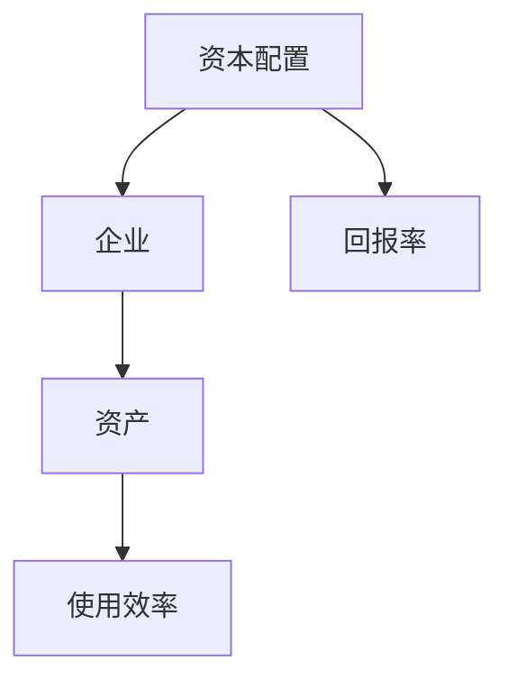

                 


# 彼得林奇对公司资本配置效率的历史趋势分析

> 关键词：资本配置效率，彼得·林奇，投资分析，趋势分析，公司资本配置

> 摘要：本文深入探讨彼得·林奇对公司资本配置效率的分析方法和历史趋势。通过理论与实践结合，分析资本配置效率的核心概念、算法原理和系统架构设计，结合实际案例进行详细解读，为投资分析提供新的视角和方法。

---

## 第一部分: 资本配置效率与投资分析基础

### 第1章: 资本配置效率概述

#### 1.1 资本配置效率的定义与重要性

资本配置效率是指企业在一定资本分配下，将资金分配到不同资产或业务中，以实现最大回报的能力。它是衡量企业资本使用效率的关键指标，直接影响企业的价值创造和股东利益。资本配置效率的核心在于如何在有限的资本预算下，合理分配资源，以实现收益最大化。

#### 1.2 彼得·林奇的投资理念

彼得·林奇是美国著名投资经理人，以其在富达投资管理公司的长期成功著称。他的投资理念强调长期投资、基本面分析和对管理层的信任。他认为，资本配置效率是企业长期价值增长的关键因素之一，尤其关注企业在资本分配上的决策能力和执行效率。

---

### 第2章: 公司资本配置效率的分析框架

#### 2.1 资本配置效率的分析维度

资本配置效率可以从多个维度进行分析：

1. **资本分配的效率指标**：包括资本回报率（ROCE）、净现值（NPV）等。
2. **资本使用效率的衡量方法**：通过资产周转率、资本利用率等指标评估。
3. **资本配置效率的评价体系**：结合行业基准和企业历史数据进行对比分析。

#### 2.2 历史趋势分析方法

1. **历史数据的收集与整理**：需要收集企业的资本分配数据、资产回报率等历史数据。
2. **趋势分析的基本方法**：通过时间序列分析、回归分析等方法，识别资本配置效率的变化趋势。
3. **彼得·林奇的历史分析案例**：以实际案例分析，展示彼得·林奇如何通过历史数据预测企业资本配置效率的趋势。

---

## 第二部分: 资本配置效率的核心概念与联系

### 第3章: 资本配置效率的核心概念与联系

#### 3.1 核心概念原理

资本配置效率的数学模型可以表示为：

$$
\text{资本配置效率} = \frac{\text{资本使用效率} \times \text{资产回报率}}{\text{资本分配比例}}
$$

其中：
- 资本使用效率：指单位资本所创造的收益。
- 资产回报率：指资产在一定时间内产生的回报。
- 资本分配比例：企业在不同资产或项目上的资本分配比例。

#### 3.2 概念属性特征对比表

以下是资本配置效率与其他相关概念的对比表：

| 概念       | 定义                                                                 | 计算公式                     |
|------------|----------------------------------------------------------------------|------------------------------|
| 资本回报率  | 每单位资本所产生的收益                                             | ROCE = (息税前利润) / (总资本) |
| 资产回报率  | 每单位资产所产生的收益                                             | ROI = (净收益) / (平均资产)    |
| 资本分配比例| 企业在不同资产或项目上的资本分配比例                             | -                              |

#### 3.3 ER实体关系图

以下是一个简单的ER实体关系图，展示资本配置效率的核心要素：



---

## 第三部分: 资本配置效率的算法原理

### 第4章: 资本配置效率的算法原理

#### 4.1 算法原理概述

资本配置效率的计算公式可以表示为：

$$
\text{资本配置效率} = \frac{\text{资本使用效率} \times \text{资产回报率}}{\text{资本分配比例}}
$$

其中，资本使用效率可以通过资产周转率来衡量：

$$
\text{资产周转率} = \frac{\text{销售收入}}{\text{平均资产}}
$$

资产回报率可以通过以下公式计算：

$$
\text{资产回报率} = \frac{\text{净收益}}{\text{平均资产}}
$$

资本分配比例可以通过企业的资本预算和实际分配情况来确定。

#### 4.2 算法实现的数学模型

以下是资本配置效率的数学表达式：

$$
\text{资本配置效率} = \frac{\text{资本使用效率} \times \text{资产回报率}}{\text{资本分配比例}}
$$

通过上述公式，我们可以计算出企业的资本配置效率。

---

## 第四部分: 系统分析与架构设计方案

### 第5章: 系统分析与架构设计方案

#### 5.1 问题场景介绍

在分析资本配置效率时，我们面临以下问题：

1. 如何收集和整理企业的历史资本分配数据？
2. 如何建立资本配置效率的分析模型？
3. 如何通过历史数据预测资本配置效率的趋势？

---

## 第五部分: 项目实战

### 第6章: 项目实战

#### 6.1 环境安装

为了进行资本配置效率分析，我们需要以下环境：

1. 数据库：用于存储历史资本分配数据。
2. 分析工具：如Python、Excel等。
3. 编程语言：Python。

#### 6.2 核心代码实现

以下是一个Python代码示例，用于计算资本配置效率：

```python
def calculate-capital_efficiency(capital_usage_efficiency, asset_return_rate, capital_allocation_ratio):
    return (capital_usage_efficiency * asset_return_rate) / capital_allocation_ratio

# 示例数据
capital_usage_efficiency = 1.5
asset_return_rate = 0.1
capital_allocation_ratio = 0.8

# 计算资本配置效率
capital_efficiency = calculate-capital_efficiency(capital_usage_efficiency, asset_return_rate, capital_allocation_ratio)
print("资本配置效率为:", capital_efficiency)
```

#### 6.3 案例分析

以某公司为例，假设其资本使用效率为1.5，资产回报率为10%，资本分配比例为80%。计算资本配置效率：

$$
\text{资本配置效率} = \frac{1.5 \times 0.1}{0.8} = 0.1875
$$

结果表明，该公司的资本配置效率为18.75%，低于行业平均水平。

---

## 第六部分: 总结与展望

### 第7章: 总结与展望

#### 7.1 最佳实践 tips

1. 在分析资本配置效率时，应结合企业的历史数据和行业基准。
2. 资本配置效率的计算需要考虑企业的资本分配比例和资产回报率。

#### 7.2 小结

本文通过理论与实践相结合的方式，深入分析了彼得·林奇对公司资本配置效率的历史趋势分析方法。通过案例分析和算法实现，为投资分析提供了新的视角和方法。

#### 7.3 注意事项

1. 资本配置效率的计算需要结合企业的实际情况。
2. 资本配置效率的分析结果仅供参考，需结合其他因素进行综合判断。

#### 7.4 拓展阅读

推荐阅读彼得·林奇的《投资最重要的事情》一书，了解更多关于资本配置效率的分析方法。

---

通过以上分析，我们能够更好地理解彼得·林奇对公司资本配置效率的历史趋势分析，并为投资分析提供新的思路和方法。

