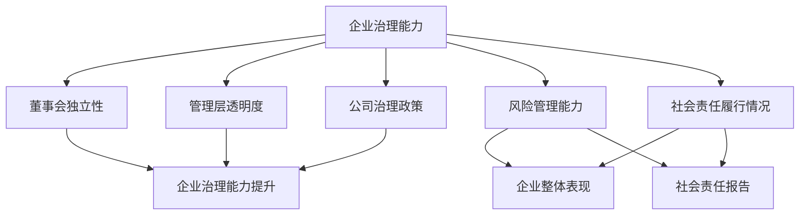
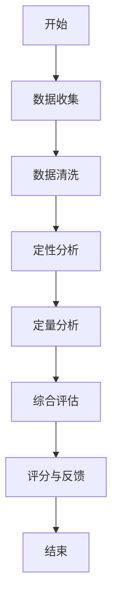
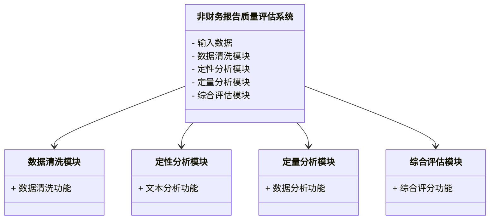
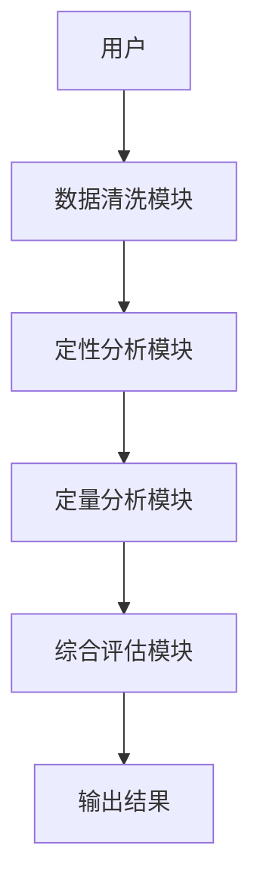
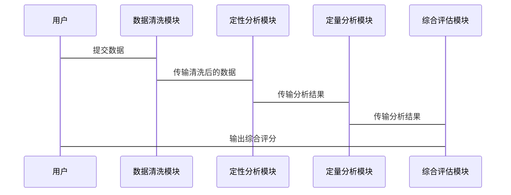

                 


# 彼得林奇对公司非财务报告质量的评估方法

## 关键词：
非财务报告，彼得林奇，质量评估，企业治理，风险管理，ESG报告，可持续发展

## 摘要：
本文深入探讨了彼得·林奇在评估公司非财务报告质量方面的方法和技巧。非财务报告通常包括企业治理、社会责任、风险管理等方面的内容，其质量评估对于企业决策和投资者评估至关重要。本文从核心概念、评估方法、系统架构等多方面进行详细分析，结合实际案例，帮助读者理解和应用彼得林奇的评估方法。

---

# {{此处是文章标题}}

> 关键词：{{此处列出文章的5-7个核心关键词}}

> 摘要：{{此处给出文章的核心内容和主题思想}}

                 

# 第1章: 非财务报告质量评估的背景与重要性

## 1.1 非财务报告的基本概念

### 1.1.1 非财务报告的定义与特点

非财务报告是指公司提供的不直接涉及财务数据的报告，通常包括企业治理、社会责任、风险管理、可持续发展等方面的内容。这些报告为企业利益相关者提供了除财务信息之外的其他重要信息。

### 1.1.2 非财务报告在企业中的作用

非财务报告在企业中的作用主要体现在以下几个方面：

1. **企业治理**：通过报告展示公司治理结构和内部管理情况。
2. **风险管理**：揭示企业在经营过程中面临的风险及其应对措施。
3. **社会责任**：展示企业对环境、社会和治理（ESG）方面的责任履行情况。
4. **品牌形象**：通过高质量的非财务报告提升企业的社会形象和信誉。

### 1.1.3 非财务报告与财务报告的区别与联系

非财务报告与财务报告的主要区别在于内容和目的。财务报告侧重于企业的财务状况、经营成果和现金流量，而非财务报告则关注企业的治理、社会责任和风险管理等方面。两者相辅相成，共同为企业决策者和利益相关者提供全面的信息。

## 1.2 非财务报告质量评估的必要性

### 1.2.1 企业治理与风险管理的需求

企业在经营过程中面临各种风险，非财务报告的质量直接影响企业治理和风险管理的效果。高质量的非财务报告能够帮助企业管理层更好地识别和应对潜在风险。

### 1.2.2 投资者与利益相关者的关注

投资者和利益相关者越来越关注企业的社会责任和可持续发展能力。高质量的非财务报告能够增强投资者的信心，提升企业的吸引力。

### 1.2.3 法律法规与行业标准的要求

许多国家和地区都有相关法律法规要求企业披露非财务信息，如环境、社会和治理（ESG）方面的信息。高质量的非财务报告能够帮助企业满足这些法规要求，避免法律风险。

## 1.3 彼得林奇方法的核心观点

### 1.3.1 彼得林奇方法的基本理念

彼得·林奇在其投资实践中强调，非财务报告的质量评估需要从多个维度进行分析，包括企业治理、社会责任和风险管理等方面。他主张通过定性和定量分析相结合的方法，全面评估企业的非财务信息。

### 1.3.2 彼得林奇方法的独特性

彼得林奇方法的独特性在于其注重非财务信息的实际应用价值，而非仅仅关注数据的表面性。他强调通过深入分析非财务报告，识别企业的潜在风险和机会，从而做出更明智的投资决策。

### 1.3.3 彼得林奇方法的适用范围

彼得林奇方法适用于所有类型的企业，尤其是那些在社会责任和可持续发展方面表现突出的企业。该方法不仅适用于投资决策，还可用于企业内部管理和社会责任评估。

---

# 第2章: 非财务报告质量评估的核心概念与联系

## 2.1 非财务报告的主要类型

### 2.1.1 环境报告

环境报告是企业对其环境表现的详细说明，包括能源消耗、碳排放、废物处理等方面。彼得林奇认为，高质量的环境报告能够反映企业的环境管理能力和社会责任履行情况。

### 2.1.2 社会责任报告

社会责任报告是企业对其在社会责任方面的表现的总结，包括员工权益、社区参与、慈善捐赠等方面。彼得林奇强调，社会责任报告的质量能够反映企业的社会影响力和道德标准。

### 2.1.3 治理报告

治理报告是企业对其治理结构和内部管理的详细说明，包括董事会构成、管理层职责、公司治理政策等方面。彼得林奇认为，高质量的治理报告能够反映企业的治理能力和透明度。

## 2.2 非财务报告质量评估的核心要素

### 2.2.1 企业治理能力

企业治理能力是衡量非财务报告质量的重要指标之一。它包括董事会的独立性、管理层的透明度、公司治理政策的完善性等方面。

### 2.2.2 社会责任履行情况

社会责任履行情况是衡量企业社会责任的重要指标。它包括企业在环境保护、员工权益、社区参与等方面的表现。

### 2.2.3 风险管理能力

风险管理能力是衡量企业非财务报告质量的重要指标。它包括企业在识别、评估和应对风险方面的表现。

## 2.3 非财务报告质量评估的关联性分析

### 2.3.1 环境报告与社会责任报告的联系

环境报告和社会责任报告都关注企业的社会责任，但侧重点不同。环境报告侧重于企业的环境表现，而社会责任报告则更广泛地涵盖企业的社会责任履行情况。

### 2.3.2 治理报告与风险管理能力的联系

治理报告是企业治理能力的体现，而风险管理能力则是企业治理的重要组成部分。两者相互关联，共同影响企业的整体表现。

### 2.3.3 非财务报告与财务报告的联系

非财务报告和财务报告在内容和目的上有所不同，但它们共同为企业决策者和利益相关者提供了全面的信息。高质量的非财务报告能够提升财务报告的可信度，反之亦然。

---

## 图表：非财务报告质量评估的核心要素与关联性分析



---

# 第3章: 彼得林奇非财务报告质量评估方法的具体实施

## 3.1 数据收集与整理

### 3.1.1 数据来源

彼得林奇方法的数据来源主要包括企业的非财务报告、行业报告、法律法规文件等。他强调数据的多样性和可靠性，认为高质量的数据是评估的基础。

### 3.1.2 数据清洗

数据清洗是确保数据质量的重要步骤。彼得林奇建议在数据清洗过程中剔除冗余数据、处理缺失值和异常值，确保数据的准确性和完整性。

## 3.2 数据分析与评估

### 3.2.1 定性分析

定性分析是彼得林奇方法的重要组成部分，主要用于评估企业的治理能力、社会责任履行情况和风险管理能力。他建议通过分析非财务报告中的文本内容，识别企业的潜在风险和机会。

### 3.2.2 定量分析

定量分析是通过量化指标对企业的非财务表现进行评估。彼得林奇推荐使用关键绩效指标（KPIs），如环境影响指数、社会责任投入比率等，对企业的非财务表现进行量化评估。

## 3.3 综合评估与评分

### 3.3.1 评分标准

彼得林奇建议根据企业的非财务表现，制定一套评分标准。评分标准应包括企业治理、社会责任和风险管理等多个维度，每个维度设有不同的权重。

### 3.3.2 总分计算

总分计算是通过加权平均的方法，综合考虑各维度的评分，得出企业的综合得分。彼得林奇认为，综合得分能够全面反映企业的非财务表现。

---

## 图表：彼得林奇非财务报告质量评估方法的流程图



---

# 第4章: 系统架构与实现

## 4.1 系统功能设计

### 4.1.1 领域模型



### 4.1.2 系统架构



### 4.1.3 系统接口设计

系统接口设计包括数据输入接口、数据清洗接口、文本分析接口、数据分析接口和结果输出接口。

### 4.1.4 系统交互流程



---

## 第5章: 项目实战

## 5.1 环境数据清洗与分析

### 5.1.1 环境数据清洗

```python
import pandas as pd

# 读取数据
data = pd.read_csv('environment_report.csv')

# 删除缺失值
data.dropna(inplace=True)

# 处理异常值
data = data[~(data['排放量'].isnull())]
```

### 5.1.2 环境数据分析

```python
import numpy as np

# 计算平均排放量
average_emissions = np.mean(data['排放量'])

# 找出排放量最高的企业
max_emitter = data.loc[data['排放量'].idxmax()]
```

## 5.2 社会责任报告分析

### 5.2.1 社会责任数据清洗

```python
# 读取数据
data = pd.read_csv('social Responsibility.csv')

# 处理缺失值
data.fillna(0, inplace=True)

# 转换数据类型
data['捐赠金额'] = data['捐赠金额'].astype('float')
```

### 5.2.2 社会责任评分

```python
# 计算社会责任评分
social_score = data['捐赠金额'].sum() / len(data)
```

---

## 第6章: 总结与展望

### 6.1 小结

彼得林奇非财务报告质量评估方法通过定性分析和定量分析相结合的方式，全面评估企业的非财务表现。该方法不仅适用于投资决策，还可用于企业内部管理和社会责任评估。

### 6.2 注意事项

在实际应用中，需要注意数据的多样性和可靠性，确保评估结果的准确性和客观性。此外，还需要结合企业的实际情况，灵活调整评估方法和指标。

### 6.3 拓展阅读

建议进一步阅读相关书籍和文献，深入了解非财务报告质量评估的理论和实践。

---

# 结语

彼得林奇非财务报告质量评估方法为企业决策者和投资者提供了重要的参考依据。通过全面分析企业的治理能力、社会责任履行情况和风险管理能力，该方法能够帮助利益相关者更好地评估企业的整体表现。未来，随着企业社会责任和可持续发展的重要性日益凸显，彼得林奇方法的应用前景将更加广阔。

--- 

希望这篇文章能够为您提供有价值的信息和启示！

