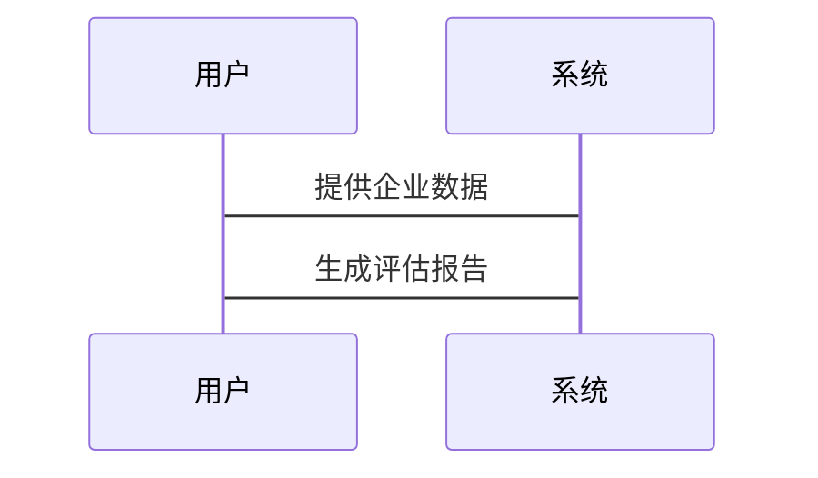

                 


# 彼得林奇对公司非财务指标的重要性评估

> 关键词：彼得·林奇，非财务指标，企业价值评估，投资分析，管理质量

> 摘要：本文深入探讨了彼得·林奇在投资分析中对非财务指标的重视。通过定义非财务指标、分析其在企业价值评估中的作用，结合实际案例，展示如何将这些指标应用于投资决策。文章还提供了系统架构设计和项目实战指南，帮助投资者更好地理解和应用这些方法。

---

## 第一部分：引言

### 第1章：彼得·林奇的投资理念概述

#### 1.1 彼得·林奇的背景与投资风格
彼得·林奇是美国著名的投资经理人，以其在富达投资管理公司的卓越表现而闻名。他强调基本面分析，尤其是非财务指标的重要性。林奇认为，企业的管理团队和市场地位是决定长期投资价值的关键因素。

#### 1.2 非财务指标在投资中的重要性
非财务指标如管理质量、市场地位和竞争优势，能够揭示企业的潜在价值，而不仅仅是财务报表上的数字。这些指标帮助投资者识别财务数据之外的风险和机会。

#### 1.3 本书的目的与结构安排
本文旨在详细分析非财务指标的评估方法，并通过实际案例展示其应用。结构包括理论分析、评估方法、系统设计和项目实战。

---

## 第二部分：非财务指标的理论基础

### 第2章：非财务指标的定义与分类

#### 2.1 非财务指标的定义
非财务指标是指无法通过财务报表直接反映，但影响企业价值的关键因素，包括管理质量、市场地位等。

#### 2.2 非财务指标的分类与特点
- 管理相关指标：管理团队稳定性、领导力。
- 市场相关指标：市场份额、品牌影响力。
- 运营相关指标：生产效率、供应链能力。

#### 2.3 非财务指标与财务指标的对比分析
非财务指标侧重长期战略，而财务指标反映短期业绩。两者结合，全面评估企业价值。

---

## 第三部分：非财务指标的评估方法

### 第3章：管理质量评估

#### 3.1 管理团队的稳定性与能力
评估管理团队的历史表现、稳定性，判断其领导企业长期发展的能力。

#### 3.2 公司治理结构的优化
分析董事会结构、股权分布，确保公司治理透明、有效。

#### 3.3 企业文化与员工激励机制
考察企业文化是否积极，激励机制是否有效，影响员工创造力和企业凝聚力。

### 第4章：市场地位与竞争优势分析

#### 4.1 行业地位与市场份额
评估企业在行业中的排名和市场份额，判断其市场影响力。

#### 4.2 核心竞争力的构建
识别企业的核心竞争力，如专利技术、独特商业模式等。

#### 4.3 品牌影响力与客户忠诚度
分析品牌知名度和客户忠诚度，评估企业的市场防御能力。

---

## 第四部分：非财务指标在企业价值评估中的应用

### 第5章：企业价值评估框架

#### 5.1 企业价值评估的理论基础
企业价值等于未来现金流的现值，公式表示为：
$$ EV = \sum_{t=1}^{n} \frac{CF_t}{(1 + WACC)^t} $$

#### 5.2 非财务指标在企业估值中的作用
非财务指标影响未来现金流，因此在估值模型中占据重要地位。

#### 5.3 彼得·林奇的企业估值方法
林奇通过分析非财务指标，结合财务数据，预测企业未来的盈利能力和市场地位。

### 第6章：案例分析：彼得·林奇的经典投资案例

#### 6.1 苹果公司的管理与市场地位分析
苹果的创新能力和强大的品牌影响力是其长期成功的关键因素。

#### 6.2 微软公司的竞争优势与品牌价值
微软的软件技术优势和品牌忠诚度使其在竞争中占据优势。

#### 6.3 亚马逊的创新能力和客户满意度
亚马逊通过持续创新和客户为中心的服务，巩固了其市场领导地位。

---

## 第五部分：系统分析与架构设计

### 第7章：非财务指标评估的系统架构

#### 7.1 系统功能模块设计
- 数据收集模块：收集企业非财务指标数据。
- 评估模块：应用评估模型进行分析。
- 报告生成模块：输出评估结果。

#### 7.2 系统架构图（使用Mermaid）


#### 7.3 系统接口设计与交互流程图


---

## 第六部分：项目实战与工具应用

### 第8章：非财务指标评估的实战步骤

#### 8.1 数据收集与处理
收集企业的管理团队信息、市场地位数据等非财务指标。

#### 8.2 评估模型的构建与应用
使用林奇的评估框架，构建非财务指标评估模型。

#### 8.3 工具推荐与使用指南
推荐使用Excel或Python进行数据处理和分析，提供具体步骤和代码示例。

### 第9章：项目实战——构建非财务指标评估系统

#### 9.1 环境安装
安装Python和相关库（如Pandas、Scikit-learn）。

#### 9.2 核心实现代码
```python
def assess_management_quality(management_team_stability, leadership_capability):
    score = (management_team_stability * 0.4) + (leadership_capability * 0.6)
    return score

# 示例数据
management_team_stability = 90
leadership_capability = 85
print(assess_management_quality(management_team_stability, leadership_capability))
```

---

## 第七部分：总结与展望

### 第9章：总结与投资启示

#### 9.1 本书的核心观点回顾
非财务指标是评估企业价值的重要因素，结合财务指标，能更全面地分析企业。

#### 9.2 对投资者的建议与启示
投资者应重视非财务指标，深入分析企业的管理、市场地位和竞争优势。

#### 9.3 未来研究方向与展望
未来研究可结合大数据和人工智能，进一步优化非财务指标的评估方法。

---

## 附录：工具与模板

### 附录A：非财务指标评估工具清单
- 数据收集工具：问卷星、调研软件。
- 数据分析工具：Excel、Python、R。

### 附录B：指标评估模板与案例分析表
提供详细的评估模板和具体案例分析表，供读者参考。

---

通过以上详细的目录结构，本文系统地介绍了彼得·林奇对非财务指标的重视，并提供了理论分析、评估方法、系统设计和项目实战，帮助投资者更好地理解和应用这些方法。

