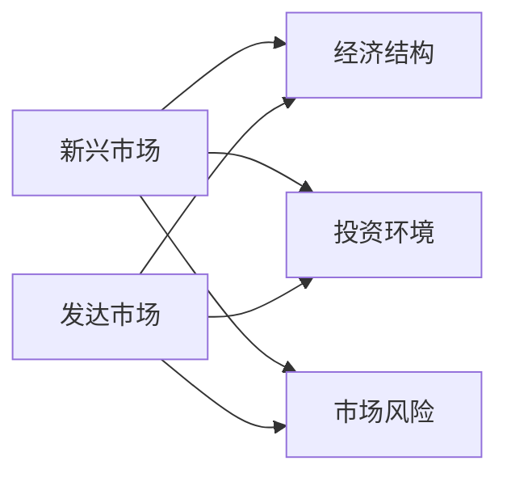
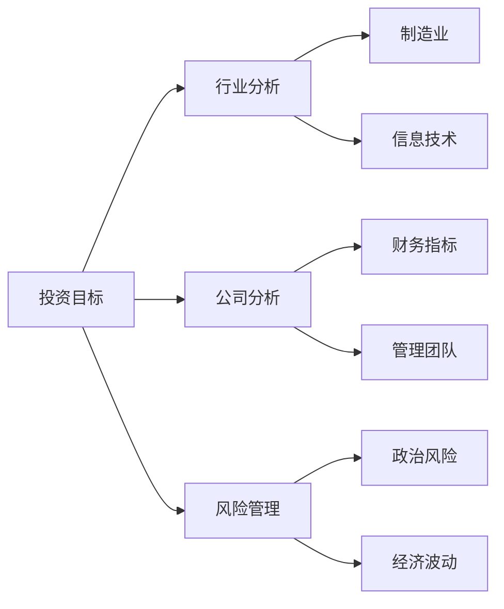

                 


# 彼得·林奇对新兴市场投资的看法

## 关键词：
- 彼得·林奇、新兴市场、投资策略、风险管理、价值投资

## 摘要：
彼得·林奇作为全球著名投资专家，他的投资理念和策略对新兴市场有着独特的见解。本文将详细分析他的投资哲学、新兴市场的特点、行业分析、公司评估以及风险管理策略，结合实际案例和数学模型，深入探讨他在新兴市场的投资策略。

---

# 目录大纲

## 第一部分：新兴市场的定义与特点

### 第1章：新兴市场的定义

#### 1.1 新兴市场的概念
- 新兴市场的定义
- 新兴市场的特点
- 新兴市场的全球分布

#### 1.2 新兴市场与发达市场的对比
- 经济结构差异
- 投资环境差异
- 市场风险差异

#### 1.3 新兴市场的投资机会
- 经济增长潜力
- 人口红利影响
- 创新驱动机遇

## 第二部分：彼得·林奇的投资理念概述

### 第2章：彼得·林奇的生平简介

#### 2.1 早年经历
- 出生背景
- 教育经历
- 初期职业生涯

#### 2.2 投资生涯
- 投资理念的形成
- 主要投资成就
- 影响投资界的著作

#### 2.3 主要成就
- 投资回报率
- 行业影响力
- 投资哲学贡献

### 第3章：彼得·林奇的投资哲学

#### 3.1 长期投资的理念
- 长期投资的核心观点
- 投资者心态管理
- 长期投资的风险控制

#### 3.2 价值投资的实践
- 价值投资的定义
- 彼得·林奇的价值评估方法
- 投资组合的构建原则

#### 3.3 风险控制的策略
- 风险评估的重要性
- 分散投资的风险管理
- 风险与收益的平衡

## 第三部分：彼得·林奇对新兴市场的投资策略

### 第4章：新兴市场的行业分析

#### 4.1 制造业的潜力
- 制造业的发展现状
- 行业增长驱动因素
- 投资机会分析

#### 4.2 信息技术的发展
- 数字经济的影响
- 信息技术行业的增长点
- 投资策略建议

#### 4.3 金融服务业的扩张
- 金融服务行业的现状
- 市场潜力分析
- 投资风险与机会

### 第5章：新兴市场的公司分析

#### 5.1 财务指标的评估
- 常用财务指标解析
- 财务健康状况评估
- 财务风险分析

#### 5.2 管理团队的考察
- 管理团队的能力评估
- 团队稳定性分析
- 领导层的战略规划

#### 5.3 行业地位的判断
- 市场占有率分析
- 行业竞争格局
- 发展潜力评估

### 第6章：新兴市场的风险与挑战

#### 6.1 政治风险的评估
- 政治环境的稳定性
- 政府政策的影响
- 政治风险的应对策略

#### 6.2 经济波动的影响
- 经济周期分析
- 货币政策的影响
- 经济波动的应对措施

#### 6.3 市场流动性的问题
- 市场流动性评估
- 交易成本分析
- 流动性风险的管理

## 第四部分：彼得·林奇的投资组合管理

### 第7章：投资组合的构建

#### 7.1 投资组合构建的原则
- 资产配置策略
- 风险收益平衡
- 投资期限的考虑

#### 7.2 投资组合的风险管理
- 风险分散策略
- 仓位管理方法
- 定期评估与调整

#### 7.3 投资组合的动态调整
- 市场变化的应对
- 资产配置的优化
- 投资目标的实现

### 第8章：投资组合的实战案例

#### 8.1 案例背景介绍
- 案例选择标准
- 案例分析目标
- 案例的时间跨度

#### 8.2 投资组合的构建过程
- 股票选择标准
- 行业配置策略
- 资产分配方案

#### 8.3 投资组合的表现分析
- 投资回报率分析
- 风险控制效果
- 经验总结与反思

## 第五部分：总结与最佳实践

### 第9章：总结与经验分享

#### 9.1 投资理念的总结
- 彼得·林奇的核心观点
- 新兴市场的投资策略
- 投资者的心理调节

#### 9.2 投资策略的优化
- 持续学习的重要性
- 投资工具的运用
- 信息获取与分析

### 第10章：最佳实践与注意事项

#### 10.1 投资心态管理
- 避免情绪化决策
- 长期视角的重要性
- 投资耐心的培养

#### 10.2 风险控制技巧
- 分散投资的重要性
- 定期评估与调整
- 专业顾问的咨询

#### 10.3 拓展阅读与学习
- 推荐书籍与资源
- 投资论坛与社区
- 专业培训与课程

---

### **附录**

#### 附录A：相关术语解释
- 新兴市场的定义
- 价值投资的定义
- 投资组合的定义

#### 附录B：常用财务指标公式
- 市盈率（P/E）的计算公式
- 市净率（P/B）的计算公式
- 净资产收益率（ROE）的计算公式

#### 附录C：投资工具与资源
- 股票分析工具
- 数据分析平台
- 投资书籍推荐

---

### **图表与代码示例**

#### 图表1：新兴市场与发达市场的对比分析（Mermaid流程图）



#### 图表2：彼得·林奇投资框架（Mermaid架构图）



#### 代码示例：计算市盈率

```python
import pandas as pd

# 假设有一个包含股票数据的 DataFrame
data = {'公司': ['公司A', '公司B', '公司C'],
        '股价': [50, 60, 70],
        '每股收益': [5, 6, 7]
       }
df = pd.DataFrame(data)

# 计算市盈率
df['市盈率'] = df['股价'] / df['每股收益']

print(df)
```

---

### **公式与数学模型**

#### 公式1：市盈率计算

$$ \text{市盈率} = \frac{\text{股价}}{\text{每股收益}} $$

#### 公式2：净资产收益率（ROE）

$$ \text{ROE} = \frac{\text{净利润}}{\text{净资产}} $$

---

### **项目实战**

#### 项目1：模拟投资组合

##### 1.1 环境安装
- 安装Python和必要的库（pandas, numpy, matplotlib）

##### 1.2 代码实现

```python
import pandas as pd
import numpy as np

# 创建一个模拟的新兴市场公司数据集
data = {
    '公司': ['公司A', '公司B', '公司C', '公司D'],
    '股价': [40, 50, 60, 70],
    '每股收益': [4, 5, 6, 7],
    '市盈率': [10, 10, 10, 10],
    '行业': ['制造业', '信息技术', '金融服务业', '制造业']
}

df = pd.DataFrame(data)

# 根据彼得·林奇的策略筛选投资标的
# 选择市盈率低于行业平均水平的公司
industry_avg = df.groupby('行业')['市盈率'].mean().reset_index()
selected = df[df['市盈率'] < industry_avg['市盈率']]

print(selected)
```

##### 1.3 案例分析与解读
- 分析代码输出，选择符合彼得·林奇投资策略的公司
- 评估这些公司在新兴市场的投资潜力
- 总结筛选过程中的关键点和注意事项

---

### **总结**

彼得·林奇的新兴市场投资策略以价值投资和长期持有为核心，结合行业分析和公司基本面评估，强调风险管理。本文通过详细分析他的投资理念、策略和实战案例，为读者提供了全面的指导。结合实际的代码示例和数学模型，帮助读者更好地理解和应用这些投资策略。

