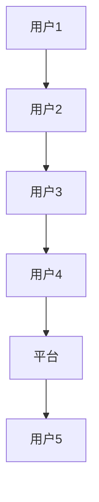
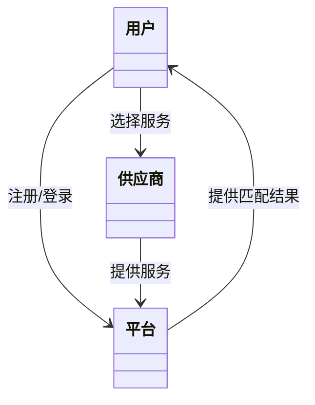

                 


# 彼得林奇的"价值创造"在平台经济中的新衡量标准

## 关键词
- 平台经济
- 价值创造
- 彼得·林奇
- 衡量标准
- 算法
- 系统架构
- 案例分析

## 摘要
本文探讨彼得·林奇的价值创造理论在平台经济中的应用，提出新的衡量标准，结合算法和系统架构，通过案例分析展示其实际应用。文章结构清晰，内容涵盖背景、理论、算法、系统设计、项目实战和总结，帮助读者全面理解平台经济中的价值创造。

---

## 第一部分：平台经济与价值创造的背景

### 第1章：平台经济概述

#### 1.1 平台经济的基本概念
- **1.1.1 平台经济的定义**
  平台经济是一种通过数字平台连接供需双方，提供撮合服务的商业模式。其核心在于创造网络效应，通过双边市场实现价值。

- **1.1.2 平台经济的特点**
  | 特性 | 描述 |
  |------|------|
  | 网络效应 | 用户数量增加，平台价值提升 |
  | 多边性 | 同时服务买家和卖家 |
  | 数据驱动 | 利用数据优化匹配效率 |

- **1.1.3 平台经济的参与者分析**
  - 用户：最终消费者或服务提供者
  - 供应商：商品或服务提供方
  - 平台：撮合交易的中介方

#### 1.2 价值创造的定义与重要性
- **1.2.1 价值创造的定义**
  价值创造是指通过提供独特的产品或服务，满足用户需求，从而提升整体经济价值的过程。

- **1.2.2 价值创造在经济中的作用**
  - 促进经济增长
  - 提高企业竞争力
  - 增加用户满意度

- **1.2.3 价值创造的衡量标准**
  - 用户满意度
  - 市场占有率
  - 企业利润

---

## 第二部分：彼得·林奇的价值创造理论

### 第2章：彼得·林奇的价值创造理论

#### 2.1 彼得·林奇的生平与投资理念
- **2.1.1 彼得·林奇的生平简介**
  彼得·林奇是美国著名投资经理，以其独特的选股方法闻名，强调基本面分析和价值投资。

- **2.1.2 彼得·林奇的主要投资理念**
  - 价值投资：寻找被市场低估的企业
  - 长期持有：耐心等待企业成长
  - 数据驱动：通过财务数据评估企业价值

- **2.1.3 成功案例分析**
  - 麦当劳：通过门店扩展和创新提升价值
  - 亨氏联合：通过收购和整合提升市场地位

#### 2.2 价值创造的核心要素
- **2.2.1 核心概念：企业价值的驱动因素**
  - 财务状况
  - 市场定位
  - 管理团队

- **2.2.2 价值创造的三要素：资源、能力和机会**
  - 资源：企业拥有的资产
  - 能力：企业的核心竞争力
  - 机会：市场中的潜在机会

- **2.2.3 彼得·林奇的选股标准**
  - 低市盈率
  - 强大的财务状况
  - 高ROE（股东权益回报率）

---

## 第三部分：平台经济中的价值衡量

### 第3章：平台经济中的价值衡量标准

#### 3.1 传统价值衡量标准的局限性
- **3.1.1 传统财务指标的不足**
  - 市盈率无法反映平台经济的网络效应
  - 净利润不反映用户增长的潜力

- **3.1.2 平台经济中的特殊挑战**
  - 用户增长与收入转化的关系
  - 网络效应的量化

#### 3.2 新的价值衡量标准
- **3.2.1 用户价值的量化**
  - 用户生命周期价值（CLV）
  - 用户参与度

- **3.2.2 平台网络效应的评估**
  - 网络外部性：用户数量增加带来的价值提升
  - 网络密度：用户之间的连接程度

- **3.2.3 可持续发展与长期价值**
  - 用户留存率
  - 市场渗透率

### 第4章：彼得·林奇理论在平台经济中的应用

#### 4.1 平台企业的价值创造模式
- **4.1.1 平台如何创造价值**
  - 提供高效的匹配服务
  - 利用数据优化用户体验
  - 建立信任机制

- **4.1.2 平台经济中的双边市场**
  - 供需双方的价值创造
  - 平台在双边市场中的角色

#### 4.2 价值创造与用户参与度
- **4.2.1 用户参与度的衡量**
  - 活跃用户数
  - 用户互动频率

- **4.2.2 用户生命周期价值（CLV）**
  - CLV = (收入贡献 × 用户留存率) / 用户获取成本

#### 4.3 数据驱动的价值创造
- **4.3.1 数据分析在价值创造中的作用**
  - 通过数据分析优化匹配算法
  - 通过用户行为分析提升用户体验

- **4.3.2 技术创新与价值提升**
  - AI技术在个性化推荐中的应用
  - 大数据分析在市场预测中的应用

---

## 第四部分：算法与系统设计

### 第5章：平台经济中的网络价值评估算法

#### 5.1 网络价值评估模型
- **5.1.1 模型的构建**
  网络价值评估模型基于用户之间的连接和互动，计算平台的整体价值。

- **5.1.2 算法流程图**



- **5.1.3 算法实现**
  ```python
  def calculate_network_value(users, interactions):
      total_value = 0
      for user in users:
          user_value = sum(interactions[user])
          total_value += user_value
      return total_value
  ```

- **5.1.4 数学模型和公式**
  $$ 网络价值 = \sum_{i=1}^{n} \text{用户价值}_i $$
  其中，用户价值由其参与度和互动频率决定。

### 第6章：系统架构设计

#### 6.1 系统功能设计
- **6.1.1 领域模型类图**



- **6.1.2 系统架构设计**

```mermaid
docker
    service 平台服务
    service 用户服务
    service 供应商服务
    platform Nginx反向代理
    configatron 容器配置
    volumes 数据存储
```

---

## 第五部分：项目实战

### 第7章：项目实战

#### 7.1 环境安装
- 安装Python和相关库（如numpy、pandas）
- 安装平台架构所需的工具（如Docker、Nginx）

#### 7.2 系统核心实现源代码
```python
def main():
    import numpy as np
    import pandas as pd

    # 示例数据：用户与供应商的交互
    data = {'用户': ['U1', 'U2', 'U3'], '供应商': ['S1', 'S2', 'S3']}
    df = pd.DataFrame(data)
    print(df)

if __name__ == "__main__":
    main()
```

#### 7.3 案例分析与详细解读
- **案例：在线教育平台**
  - 通过算法优化课程推荐，提高用户参与度和平台价值。

---

## 第六部分：总结

### 第8章：总结

#### 8.1 最佳实践 tips
- 价值创造是平台经济的核心
- 数据分析是衡量价值的关键工具
- 持续创新是保持竞争优势的关键

#### 8.2 小结
本文详细探讨了彼得·林奇的价值创造理论在平台经济中的应用，提出了新的衡量标准，并通过算法和系统设计展示了其实际应用。

#### 8.3 注意事项
- 数据隐私和安全问题需重视
- 用户体验是平台成功的关键

#### 8.4 拓展阅读
- 推荐书籍：《彼得·林奇的投资哲学》
- 相关论文：《平台经济中的网络效应研究》

---

通过以上结构和内容，文章系统地阐述了彼得·林奇的价值创造理论在平台经济中的新衡量标准，结合理论分析和实际案例，为读者提供了全面的理解和实践指导。

