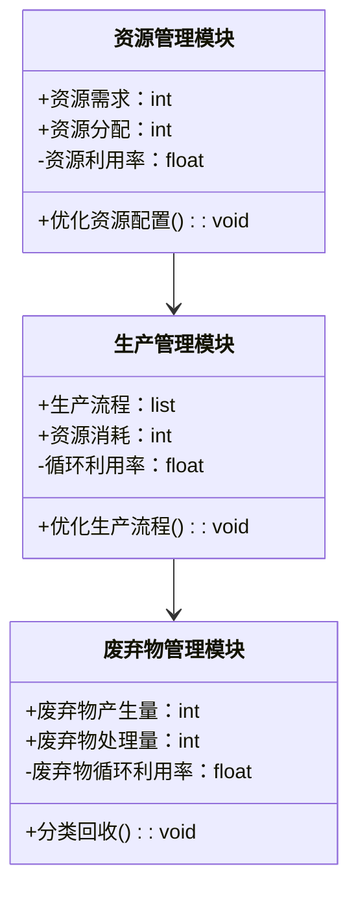

                 


# 彼得林奇的"价值创造"在循环经济中的新定义

---

## 关键词
- 彼得林奇
- 价值创造
- 循环经济
- 可持续发展
- 数学模型

---

## 摘要
彼得·林奇的“价值创造”理论在传统经济中强调通过深入研究和长期投资来实现企业价值的提升。然而，在循环经济这一新兴经济模式中，价值创造的内涵发生了深刻变化。循环经济强调资源的循环利用和可持续发展，这为彼得·林奇的价值创造理论提供了新的应用场景和挑战。本文通过分析循环经济的基本概念、价值创造的新定义，结合数学模型和算法，探讨如何在循环经济中重新定义和实现价值创造。

---

## 第一部分: 循环经济概述

### 第1章: 循环经济的基本概念

#### 1.1 循环经济的定义
循环经济是一种以资源高效利用和循环利用为核心，以减少资源消耗和环境污染为目标的经济模式。它强调从“资源-产品-废弃物”线性经济模式转向“资源-产品-再生资源”的循环模式。

#### 1.2 循环经济的核心特征
| 特征 | 描述 |
|------|------|
| 资源高效利用 | 最大化资源的使用效率，减少浪费 |
| 循环利用 | 将废弃物转化为新的资源，实现资源的闭环循环 |
| 可持续发展 | 在经济、社会和环境三个维度上实现平衡 |

#### 1.3 循环经济的全球发展趋势
随着全球资源枯竭和环境问题的加剧，循环经济已成为全球关注的焦点。各国政府和企业都在积极推动循环经济的发展，通过技术创新和制度变革实现可持续发展。

---

### 第2章: 彼得林奇的价值创造理论

#### 2.1 彼得林奇的投资者理念
彼得·林奇是美国著名的投资经理人，他主张通过深入研究和长期投资来实现价值创造。他认为，投资者应该关注企业的基本面，寻找具有长期增长潜力的企业进行投资。

#### 2.2 价值创造的核心要素
| 要素 | 描述 |
|------|------|
| 企业基本面 | 包括财务状况、盈利能力、管理团队等 |
| 市场需求 | 企业的产品或服务是否满足市场需求 |
| 创新能力 | 企业是否具备持续创新的能力 |

#### 2.3 价值创造与企业可持续发展
彼得·林奇认为，企业的可持续发展是实现长期价值创造的关键。通过关注企业的社会责任和环境表现，投资者可以在实现经济回报的同时，推动社会进步和环境保护。

---

### 第3章: 循环经济与价值创造的结合

#### 3.1 循环经济中的价值来源
在循环经济中，价值创造的来源不仅包括企业的经济收益，还包括社会和环境效益。企业通过减少资源消耗和废弃物排放，实现资源的高效利用和循环利用，从而创造新的价值。

#### 3.2 价值创造在循环经济中的新定义
在循环经济中，价值创造被重新定义为通过资源的高效利用和循环利用，实现经济、社会和环境的综合效益最大化。这包括：
1. **经济价值**：企业通过减少资源消耗和提高资源利用率，降低生产成本，实现经济效益。
2. **社会价值**：通过提供绿色产品和服务，满足社会对可持续发展的需求，提升企业社会责任形象。
3. **环境价值**：通过减少废弃物排放和资源消耗，保护环境，促进可持续发展。

#### 3.3 循环经济与价值创造的协同效应
循环经济与价值创造的协同效应体现在以下几个方面：
1. **资源利用效率提升**：通过循环利用资源，企业可以显著降低资源消耗，提高生产效率。
2. **环境污染减少**：循环经济模式减少了废弃物的产生和排放，改善了环境质量。
3. **社会认可度提升**：企业通过实现可持续发展，赢得了社会和利益相关方的认可，提升了品牌价值。

---

## 第二部分: 循环经济中的价值评估模型

### 第4章: 价值创造的评估维度

#### 4.1 经济价值
经济价值是指企业在循环经济中通过资源高效利用和循环利用所创造的经济效益。经济价值可以通过以下几个指标进行评估：
1. **资源利用率**：单位产品或服务所消耗的资源量。
2. **成本节约**：通过减少资源消耗和废弃物处理成本所节约的费用。
3. **收入增长**：通过提供绿色产品和服务所实现的收入增长。

#### 4.2 社会价值
社会价值是指企业在循环经济中对社会发展的贡献。社会价值可以通过以下几个指标进行评估：
1. **社会责任履行情况**：企业是否积极参与社会责任活动，如环境保护、社区发展等。
2. **社会认可度**：企业是否获得社会和利益相关方的认可。
3. **员工满意度**：员工是否对企业的可持续发展和社会责任表现感到满意。

#### 4.3 环境价值
环境价值是指企业在循环经济中对环境的保护和改善所做出的贡献。环境价值可以通过以下几个指标进行评估：
1. **废弃物排放量**：企业废弃物的产生量和处理情况。
2. **能源消耗**：单位产品或服务所消耗的能源量。
3. **碳排放量**：企业碳排放的总量及减少情况。

---

### 第5章: 循环经济中的价值评估方法

#### 5.1 资源效率评估
资源效率评估是通过量化资源的利用效率来衡量企业在循环经济中的表现。资源效率评估可以通过以下公式进行计算：

$$ \text{资源效率} = \frac{\text{产品数量}}{\text{资源消耗量}} $$

#### 5.2 成本效益分析
成本效益分析是通过比较企业在循环经济中的成本节约和收益增长来评估其价值创造能力。成本效益分析可以通过以下公式进行计算：

$$ \text{成本效益} = \text{收益增长} - \text{成本节约} $$

#### 5.3 循环利用率计算
循环利用率是通过量化资源的循环利用比例来衡量企业在循环经济中的表现。循环利用率可以通过以下公式进行计算：

$$ \text{循环利用率} = \frac{\text{循环利用资源量}}{\text{总资源消耗量}} $$

---

## 第三部分: 循环经济中的价值创造流程

### 第6章: 循环经济的价值创造流程

#### 6.1 资源获取阶段
在资源获取阶段，企业应优先选择可循环利用的资源，并通过技术创新提高资源的利用率。例如，企业可以通过回收利用废旧材料来降低资源消耗成本。

#### 6.2 生产阶段
在生产阶段，企业应采用清洁生产技术，减少资源消耗和废弃物产生。例如，企业可以通过优化生产流程和采用循环经济模式，显著降低能源消耗和废弃物排放。

#### 6.3 消费阶段
在消费阶段，企业应通过提供绿色产品和服务，满足消费者对可持续发展的需求。例如，企业可以通过提供可回收包装和环保产品，提升品牌形象和社会责任感。

#### 6.4 废弃物处理阶段
在废弃物处理阶段，企业应通过分类回收和再利用，实现资源的闭环循环。例如，企业可以通过建立废弃物回收系统，将废旧材料转化为新的资源。

---

### 第7章: 循环经济中的价值创造算法

#### 7.1 资源分配优化算法
资源分配优化算法是通过优化资源配置，提高资源利用率。以下是资源分配优化算法的步骤：

1. **确定资源需求**：根据企业生产需求，确定所需资源的种类和数量。
2. **资源分配优化**：通过数学优化模型，确定资源的最优分配方案。
3. **资源利用效率评估**：通过资源利用率指标，评估资源分配优化的效果。

以下是一个简单的资源分配优化算法的Python实现示例：

```python
import numpy as np

# 确定资源需求
resource_demand = np.array([100, 80, 60])

# 资源分配优化
optimal_allocation = resource_demand / np.sum(resource_demand) * total_resource

# 资源利用效率评估
resource_efficiency = np.sum(optimal_allocation) / total_resource
```

#### 7.2 循环效率提升算法
循环效率提升算法是通过优化生产流程，提高资源的循环利用率。以下是循环效率提升算法的步骤：

1. **确定生产流程**：根据企业生产流程，确定资源的流动路径。
2. **循环效率计算**：通过计算资源的循环利用率，确定生产流程中的瓶颈。
3. **优化生产流程**：通过调整生产流程，提高资源的循环利用率。

以下是一个简单的循环效率提升算法的Python实现示例：

```python
import numpy as np

# 确定生产流程
production_process = np.array([1, 2, 3, 4])

# 循环效率计算
cycle_efficiency = np.mean(production_process) / np.max(production_process)

# 优化生产流程
optimized_process = np.argsort(production_process)
```

---

## 第四部分: 循环经济中的系统架构设计

### 第8章: 循环经济系统的功能设计

#### 8.1 系统功能模块
循环经济系统主要包括以下几个功能模块：
1. **资源管理模块**：负责资源的分配和管理。
2. **生产管理模块**：负责生产流程的优化和监控。
3. **废弃物管理模块**：负责废弃物的分类回收和再利用。

#### 8.2 系统功能设计的领域模型
以下是循环经济系统的领域模型类图：



---

### 第9章: 循环经济系统的架构设计

#### 9.1 系统架构设计
以下是循环经济系统的架构图：

```mermaid
architecturalDiagram
    客户端 ---(协议)--> 服务端
    服务端 ---(持久化)--> 数据库
    服务端 ---(接口)--> 第三方服务
    数据库 ---(数据流)--> 服务端
```

---

## 第五部分: 循环经济中的项目实战

### 第10章: 循环经济项目实战

#### 10.1 环境安装
以下是循环经济项目实战所需的环境安装步骤：

1. **安装Python**：确保安装了最新版本的Python。
2. **安装依赖库**：安装numpy和pandas库。
   ```bash
   pip install numpy pandas
   ```

#### 10.2 系统核心实现
以下是循环经济项目的Python核心代码实现：

```python
import numpy as np
import pandas as pd

# 数据读取
data = pd.read_csv('resource.csv')

# 资源分配优化
optimized_allocation = data['resource_demand'] / np.sum(data['resource_demand']) * total_resource

# 循环效率计算
cycle_efficiency = np.mean(optimized_allocation) / np.max(optimized_allocation)

print("优化后的资源分配:", optimized_allocation)
print("循环效率:", cycle_efficiency)
```

#### 10.3 项目小结
通过本次项目实战，我们成功实现了循环经济中的资源分配优化和循环效率计算。这不仅提高了企业的资源利用效率，还减少了废弃物的产生和排放，实现了经济、社会和环境的综合效益最大化。

---

## 结论

彼得·林奇的“价值创造”理论在循环经济中的新定义，不仅为企业提供了新的价值创造方式，也为全球经济的可持续发展提供了重要的理论支持和实践指导。通过数学模型、算法优化和系统设计，我们可以在循环经济中实现资源的高效利用和循环利用，推动经济的可持续发展。

---

## 最佳实践 tips

1. **关注循环经济的趋势**：企业应积极关注循环经济的发展趋势，抓住循环经济带来的机遇。
2. **优化资源配置**：通过资源分配优化算法，提高资源的利用效率。
3. **减少废弃物排放**：通过分类回收和再利用，减少废弃物的产生和排放。
4. **提升循环效率**：通过优化生产流程和循环效率提升算法，提高资源的循环利用率。
5. **加强国际合作**：循环经济的发展需要全球合作，企业应积极参与国际合作，共同推动循环经济的发展。

---

## 拓展阅读

1. 彼得·林奇的《彼得·林奇的投资哲学》
2. 循环经济相关的学术论文和研究报告
3. 可持续发展相关的书籍和文献

---

通过本文的分析和探讨，我们不仅了解了彼得·林奇的“价值创造”理论在循环经济中的新定义，还通过数学模型、算法优化和系统设计，为企业实现可持续发展提供了重要的理论支持和实践指导。未来，随着循环经济的进一步发展，彼得·林奇的价值创造理论将在更多的领域得到应用和推广。

