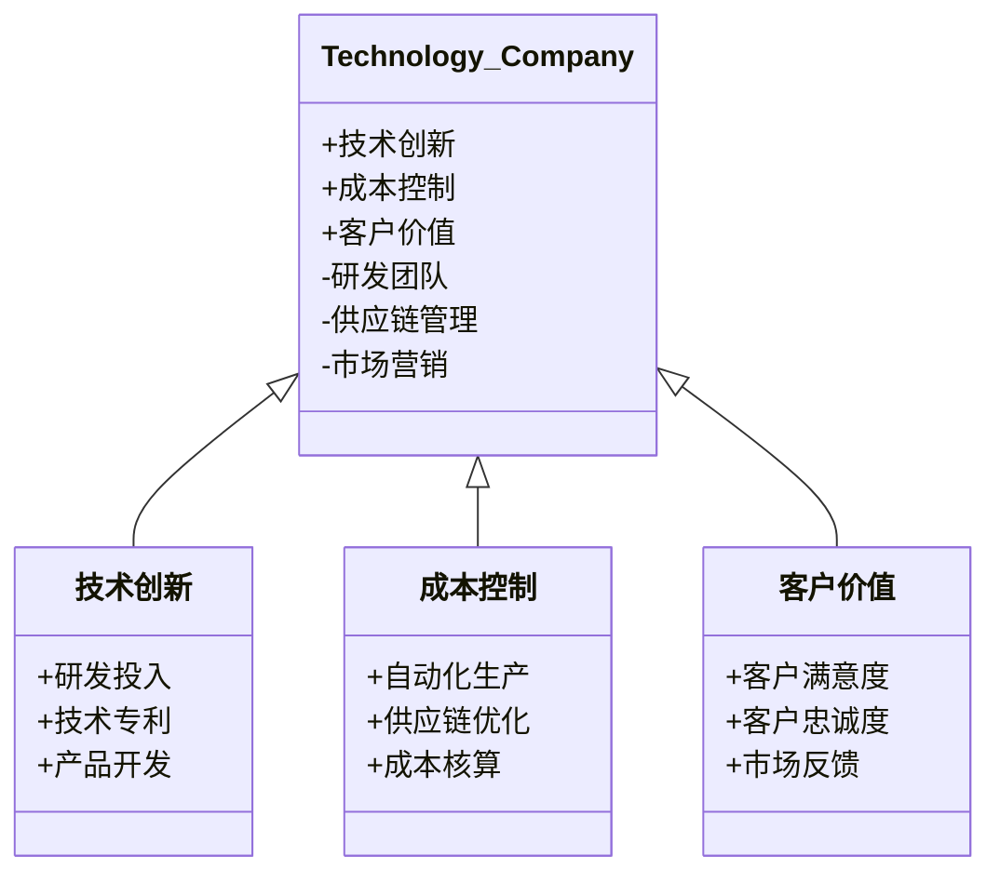
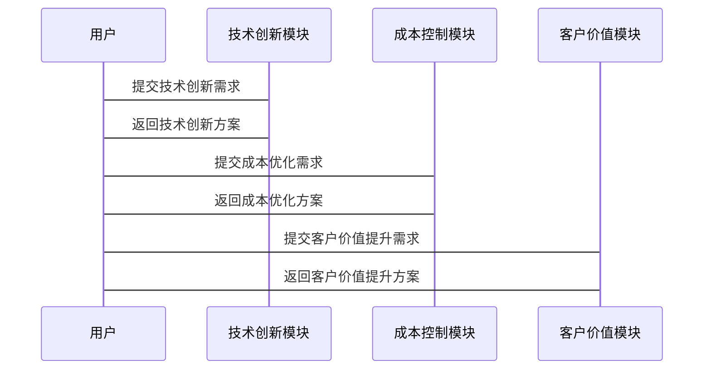

                 


## 文章标题：彼得林奇的"价值创造"在科技公司中的应用

### 关键词：
- 价值创造
- 彼得林奇
- 科技公司
- 投资理论
- 企业成长
- 创新能力
- 成本控制

### 摘要：
彼得·林奇是全球著名的价值投资专家，他提出的“价值创造”理论在企业管理和投资领域具有深远影响。本文将探讨如何将彼得林奇的价值创造理念应用于科技公司中，分析其在技术创新、成本控制和客户价值等方面的具体实践。通过结合理论与实际案例，本文旨在为科技公司提供可行的策略和方法，以实现持续的价值增长和企业成功。

---

# 彼得林奇的"价值创造"在科技公司中的应用

## 第一部分：引言

## 第1章：引言：价值创造与科技公司的结合

### 1.1 价值创造的核心概念

#### 1.1.1 价值创造的定义
价值创造是指通过优化企业内外部资源配置，提升产品或服务的附加价值，从而实现企业利润和客户满意度的双重提升。彼得林奇认为，价值创造的核心在于发现那些能够以低于其内在价值的价格购买的公司，并通过长期持有实现收益。

#### 1.1.2 科技公司中的价值创造
科技公司作为创新的核心驱动力，其价值创造主要体现在技术创新、成本优化和客户价值提升三个方面。科技公司的快速迭代和高成长性使其成为价值创造的理想实践场景。

#### 1.1.3 本书的目的与结构
本文旨在将彼得林奇的价值创造理论与科技公司的实际运营相结合，通过分析科技公司的创新模式和价值驱动因素，为企业管理者提供实用的策略和方法。文章结构分为背景介绍、理论分析、系统设计和项目实战四个部分。

---

## 第二部分：价值创造的背景与理论基础

## 第2章：彼得林奇的价值创造理论

### 2.1 彼得林奇投资理念概述

#### 2.1.1 彼得林奇的投资者哲学
彼得林奇强调长期投资和价值发现，他认为市场波动是投资机会的来源，而非风险。他主张通过深入研究企业的基本面，寻找那些具有竞争优势且估值合理的公司。

#### 2.1.2 价值创造的核心要素
- **创新能力**：技术创新是科技公司的核心竞争力。
- **成本控制**：通过优化流程降低成本，提升利润空间。
- **客户价值**：满足客户需求，提升客户满意度和忠诚度。

#### 2.1.3 价值创造与企业成长的关系
价值创造是企业成长的内在动力。通过持续创造价值，企业能够吸引更多的客户和投资者，进而实现规模扩张和利润增长。

### 2.2 价值创造在科技公司中的特殊性

#### 2.2.1 科技公司的创新属性
科技公司依赖技术创新驱动增长，其价值创造能力直接决定了企业的市场地位和竞争力。

#### 2.2.2 科技公司的价值驱动因素
- 技术创新
- 市场定位
- 产品生命周期
- 成本结构

#### 2.2.3 科技公司与传统公司的价值创造差异
科技公司的价值创造更依赖于技术创新和快速迭代，而传统公司则更注重成本控制和运营效率。

---

## 第三部分：价值创造的关键要素与数学模型

## 第3章：价值创造的关键要素分析

### 3.1 创新能力

#### 3.1.1 技术创新的核心作用
技术创新是科技公司的生命线。通过持续的技术创新，企业能够推出更具竞争力的产品和服务，从而在市场中占据优势地位。

#### 3.1.2 创新能力的量化指标
- 研发投入占比
- 新产品推出频率
- 技术专利数量

### 3.2 成本控制

#### 3.2.1 成本控制与价值创造的关系
成本控制是价值创造的重要组成部分。通过优化生产流程和管理方式，企业可以降低单位产品成本，提升整体利润水平。

#### 3.2.2 科技公司成本优化的策略
- 采用自动化技术降低人工成本
- 通过规模经济效应降低成本
- 优化供应链管理

### 3.3 客户价值

#### 3.3.1 客户价值的定义与衡量
客户价值是指客户从企业提供的产品或服务中所获得的感知价值。衡量客户价值的关键指标包括客户满意度、客户忠诚度和客户生命周期价值。

#### 3.3.2 客户价值与企业利润的关系
客户价值的提升能够直接带动企业收入的增长。通过满足客户需求，企业可以增加市场份额和客户粘性，从而实现长期利润增长。

---

## 第四部分：系统分析与架构设计方案

## 第4章：科技公司价值创造的系统分析

### 4.1 问题场景介绍

#### 4.1.1 科技公司价值创造的挑战
科技公司面临市场竞争激烈、技术更新快、客户需求多样化等挑战。如何在这些复杂环境中实现持续的价值创造是企业需要解决的核心问题。

#### 4.1.2 系统目标与范围
本系统的目标是通过优化科技公司的创新、成本控制和客户价值三个方面，实现企业的可持续价值增长。系统范围包括技术研发、生产管理、市场营销和客户关系管理四个模块。

### 4.2 系统功能设计

#### 4.2.1 领域模型设计（Mermaid类图）



### 4.3 系统架构设计

#### 4.3.1 系统架构设计（Mermaid架构图）

```mermaid
container 整体架构 {
    Technology_Company
    技术创新模块
    成本控制模块
    客户价值模块
}

Technology_Company --> 技术创新模块
Technology_Company --> 成本控制模块
Technology_Company --> 客户价值模块
```

### 4.4 系统接口设计

#### 4.4.1 系统接口设计（Mermaid序列图）



---

## 第五部分：项目实战

## 第5章：科技公司价值创造的项目实战

### 5.1 环境安装

#### 5.1.1 环境说明
- 操作系统：Linux
- 开发工具：Python、Jupyter Notebook
- 数据库：MySQL
- 开发团队：5人，包括项目经理、开发人员、测试人员和数据分析师

### 5.2 系统核心实现源代码

#### 5.2.1 系统核心代码（Python实现）

```python
# 价值创造模型的数学公式

def value_create_model(innovation, cost_control, customer_value):
    return innovation * cost_control * customer_value

# 创新能力计算

def calculate_innovation(r_d_investment, technology_patents):
    return (r_d_investment + technology_patents) / 2

# 成本控制计算

def calculate_cost_control(automation_level, supply_chain_efficiency):
    return (automation_level + supply_chain_efficiency) / 2

# 客户价值计算

def calculate_customer_value(satisfaction_score, loyalty_score):
    return (satisfaction_score + loyalty_score) / 2

# 价值创造评分

def value_create_score(innovation, cost_control, customer_value):
    return innovation * cost_control * customer_value
```

### 5.3 代码应用解读与分析

#### 5.3.1 代码解读
上述代码定义了价值创造模型的数学公式和各部分的计算方法。通过输入技术创新、成本控制和客户价值的参数，可以计算出企业的总体价值创造评分。

#### 5.3.2 应用分析
通过实际数据的输入，企业可以量化其在技术创新、成本控制和客户价值方面的表现，并通过模型计算出总体价值创造能力。这为企业优化各部分表现提供了数据支持。

### 5.4 实际案例分析和详细讲解剖析

#### 5.4.1 案例介绍
假设某科技公司是一家专注于人工智能技术的企业。公司希望通过优化技术创新、成本控制和客户价值三个方面，提升整体价值创造能力。

#### 5.4.2 案例分析
- **技术创新**：公司计划增加研发投入，目标是将技术创新能力提升20%。
- **成本控制**：通过引入自动化生产设备，降低生产成本15%。
- **客户价值**：通过改进客户服务，提升客户满意度和忠诚度。

#### 5.4.3 模型应用
通过模型计算，公司发现技术创新和客户价值提升对整体价值创造的贡献最大，因此决定优先投入这两个方面。

### 5.5 项目小结
通过项目实战，科技公司能够量化其在价值创造各方面的表现，并通过数据驱动的方式优化企业运营。这种量化方法使企业能够更科学地制定战略决策。

---

## 第六部分：结论

## 第6章：结论：价值创造在科技公司中的应用总结

### 6.1 本书总结
彼得林奇的价值创造理论为科技公司提供了重要的指导。通过技术创新、成本控制和客户价值提升，科技公司可以在竞争激烈的市场中实现可持续增长。

### 6.2 最佳实践 tips
- **持续创新**：企业应将技术创新作为核心战略。
- **优化成本**：通过自动化和供应链优化降低成本。
- **提升客户价值**：深入了解客户需求，提供高质量的产品和服务。

### 6.3 小结
价值创造是科技公司成功的关键。通过彼得林奇的理论指导和系统的实施方法，科技公司能够实现长期的利润增长和市场领先地位。

---

## 第七部分：参考文献和附录

## 第7章：参考文献和附录

### 7.1 参考文献
1. 彼得·林奇. 《彼得·林奇的成功投资策略》
2. 约翰·鲍格尔. 《投资的智慧》
3. 约翰·坦皮尼奥. 《价值投资入门》

### 7.2 附录
- 附录A：价值创造模型的详细公式
- 附录B：系统架构设计的详细说明
- 附录C：项目实战中的数据表格和分析报告

---

通过以上目录和内容的规划，您可以逐步撰写完整的博客文章，确保每部分内容详实、逻辑清晰，符合技术博客的专业性和可读性要求。如果需要进一步扩展或调整，请随时告知！

