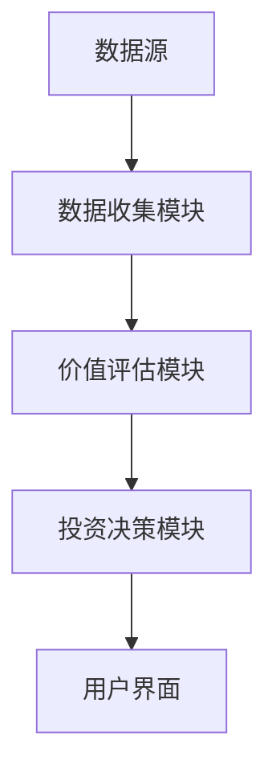

                 


# 彼得林奇的"价值创造"投资理念

> 关键词：价值投资，彼得·林奇，价值创造，投资理念，投资策略，数学模型，系统架构，项目实战，投资决策

> 摘要：本文深入探讨彼得·林奇的"价值创造"投资理念，从其核心概念、数学模型、系统架构到实际案例分析，全面解析如何通过价值创造实现长期投资回报。文章结合理论与实践，为投资者提供从入门到进阶的完整指南。

---

# 第一部分: 引言

## # 1. 价值投资的背景与发展

### 1.1 价值投资的定义与核心理念

价值投资是一种基于对公司内在价值的深入分析的投资策略，其核心理念是购买价格低于公司实际价值的股票。这种方法强调长期投资，注重公司基本面分析，而非短期市场波动。

### 1.2 彼得·林奇的生平与成就

彼得·林奇是价值投资领域的传奇人物，曾任富达投资集团的董事长。他以独特的选股方法闻名，强调深入研究公司基本面，寻找那些具有持续竞争优势和良好管理团队的公司。

### 1.3 价值创造的核心理念

价值创造是指通过投资于那些能够持续创造价值的公司，实现资产增值。彼得·林奇的价值创造理念强调企业内在价值的增长，而非短期市场波动。

---

## 2. 彼得·林奇投资理念的核心要素

### 2.1 企业基本面分析

彼得·林奇认为，投资成功的关键在于对企业基本面的深入分析，包括收入、利润、资产负债表等财务指标。

### 2.2 价值评估的数学模型

彼得·林奇的价值评估模型可以通过以下公式表示：

$$
\text{内在价值} = \frac{\text{净利润}}{\text{资本成本}}
$$

---

# 第二部分: 价值创造的核心理念

## 3. 价值创造的多维度分析

### 3.1 企业价值的构成要素

企业价值由以下几个关键要素构成：
- 收入能力
- 利润能力
- 资产负债状况
- 管理团队能力
- 行业地位

### 3.2 价值创造与企业生命周期的关系

企业生命周期可以分为初创期、成长期、成熟期和衰退期。在每个阶段，价值创造的侧重点不同。

---

# 第三部分: 投资模型与算法原理

## 4. 彼得·林奇投资模型的数学分析

### 4.1 投资模型的数学框架

彼得·林奇的投资模型可以通过以下步骤进行分析：

1. **数据收集**：收集目标公司的财务数据。
2. **价值评估**：使用数学模型计算公司的内在价值。
3. **投资决策**：比较市场价格与内在价值，决定是否投资。

### 4.2 投资模型的算法实现

以下是Python代码示例：

```python
def calculate_intrinsic_value(eps, growth_rate, required_return):
    """
    计算公司的内在价值
    eps: 每股收益
    growth_rate: 净利润增长率
    required_return: 必要收益率
    """
    # 使用 Gordon 模型计算内在价值
    intrinsic_value = eps * (1 + growth_rate) / (required_return - growth_rate)
    return intrinsic_value

# 示例数据
eps = 5
growth_rate = 0.1
required_return = 0.12

intrinsic_value = calculate_intrinsic_value(eps, growth_rate, required_return)
print(f"计算出的内在价值为：{intrinsic_value}")
```

---

# 第四部分: 系统分析与架构设计

## 5. 投资决策系统的架构设计

### 5.1 系统功能设计

- 数据收集模块：收集公司财务数据和市场数据。
- 价值评估模块：使用数学模型计算内在价值。
- 投资决策模块：根据模型结果生成投资建议。

### 5.2 系统架构图



---

# 第五部分: 项目实战

## 6. 价值创造投资策略的实际应用

### 6.1 案例分析

以苹果公司为例，使用彼得·林奇的价值评估模型进行分析：

1. **数据收集**：收集苹果公司的每股收益（EPS）和净利润增长率。
2. **价值评估**：计算苹果公司的内在价值。
3. **投资决策**：比较市场价格与内在价值，决定是否投资。

---

# 第六部分: 最佳实践与总结

## 7. 投资策略的注意事项

### 7.1 小结

彼得·林奇的价值创造理念强调对企业基本面的深入分析和长期投资。投资者应注重企业的内在价值，而非短期市场波动。

### 7.2 注意事项

- 投资者应保持对市场的持续学习和研究。
- 避免过度依赖单一模型，结合多种因素进行分析。
- 定期回顾和调整投资组合。

### 7.3 拓展阅读

推荐阅读彼得·林奇的书籍《彼得·林奇的成功投资》和《选股的艺术》。

---

# 结语

通过本文的分析，我们深入了解了彼得·林奇的"价值创造"投资理念，并通过数学模型和实际案例展示了其在投资决策中的应用。希望本文能为投资者提供有价值的参考，帮助他们在复杂多变的市场中实现长期稳定的收益。

